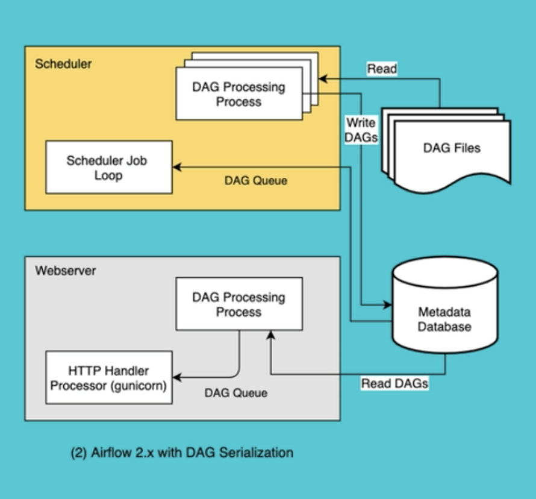

### Airflow
A platform that lets you build and run workflows. A workflow is represented as a DAG, and contains individual pieces of work called Tasks, arranged with dependencies and data flows taken into account.

### DAG Run
An object representing an instantiation of the DAG in time.  相当于 DAG 是类 DAG Run是实例

### Task
Basic unit of execution in Airflow. 

### Operators
An Operator is conceptually a template for a  predefined Task, that you can just defind declaratively inside your DAG.

* BashOperator - executes a bash command
*  PythonOperator - calls an arbitrary Python  function
* EmailOperator - sends an email
* Use the @task decorator to execute an arbitrary Python function. It doesn’t support rendering jinja templates passed as arguments.

If the operator you need isn’t installed with Airflow by default, you can probably find it as part of our huge set of community provider packages. Some popular operators from here include:

* SimpleHttpOperator
* MySqlOperator
* PostgresOperator
* MsSqlOperator
* OracleOperator
* JdbcOperator
* DockerOperator
* HiveOperator
* S3FileTransformOperator
* PrestoToMySqlOperator
* SlackAPIOperator
But there are many, many more - you can see the full list of all community-managed operators, hooks, sensors and transfers in our providers packages documentation

### Startup
```bash
airflow db init
airflow webserver --port portnumber
airflow scheduler
```

### Scheduler
The Airflow scheduler monitors all tasks and DAGs, then triggers the task instances once their dependencies are complete. Behind the scenes, the scheduler spins up a subprocess, which monitors and stays in sync with all DAGs in the specified DAG directory. Once per minute, by default, the scheduler collects DAG parsing results and checks whether any active tasks can be triggered.

### WebServer
用的Gunicorn

### Metadata Database
The metadata database is a core component of Airflow. It stores crucial information such as the configuration of your Airflow environment's roles and permissions, as well as all metadata for past and present DAG and task runs.

### Worker
In Apache Airflow, a worker is a process or machine that performs the actual execution of tasks. The worker retrieves tasks from the queue, executes them, and reports the results back to the executor or scheduler.

### Executor
- local executors
    - Testing DAGs with dag.test()
    - Debugging Airflow DAGs on the command line
    - Debug Executor (deprecated)
    - Local Executor
    - Sequential Executor
- remote executors
    - Celery Executor
    - CeleryKubernetes Executor
    - Dask Executor
    - Kubernetes Executor
    - LocalKubernetes Executor

Airflow scheduler - - -> Celery executor ---> Messaging Queue ---> Celery worker




airflow folder下找或者创建dags文件夹 直接创建python文件 airflow会自动run起来

可以直接从example 找一个 点code 然后自己改一下跑起来

NegSignal error on mac: export OBJC_DISABLE_INITIALIZE_FORK_SAFETY=YES

web server可以配置Variable: Admin->Variable\
* stock_list APPL MEFT
* stock_list_json ["APPL","MEFT"]

web server has 2 options
1. trigger DAG
2. trigger DAG with config 
    - {"stocks":["FB","APPL"]}
```python
...

def download_prices(**context):
    # stock_list_str=Variable.get("stock_list")
    stock_list =Variable.get("stock_list_json",deserialize_json=true)
    stocks = context["dag_run"].conf.get("stocks")
    if stocks:
        stock_list=stocks
    #ticker = "MSFT"
    
with DAG(
    dag_id="Download_Stock_Price",
    default_args=default_args,
    description="Download stock price and save to local csv file",
    schedule_interval=timedelta(days=1),
    start_date=days_ago(2),
    tags=["yourtag"],
) as dag:
    dag.doc_md="""
    Ths is DAG download stock price
    """
    download_task=PythonOperator(
        task_id="download_prices",
        python_callable=download_price, # function
        provide_context=true
    )
```
### Airflow Connection
Admin->Connection
```python
from airflow.hooks.base_hook import Basehook
conn = BaseHook.get_connection("connection_id")

mydb = mysql.connector.connect(
    host=conn.host,
    user=conn.login,
    password=conn.password,
    database=conn.schema,
    port=conn.port
)

def save_to_mysql_stage(*args, **context):
    # ti = task instance
    tickers=context['ti'].xcom_pull(task_ids='download_prices')
    
with DAG(
    dag_id="Download_Stock_Price",
    default_args=default_args,
    description="Download stock price and save to local csv file",
    schedule_interval=timedelta(days=1),
    start_date=days_ago(2),
    tags=["yourtag"],
    max_active_runs=1, # multiple DAG run try to access DB would result in dead lock
    catchup=False
) as dag:
    dag.doc_md="""
    Ths is DAG download stock price
    """
    download_task=PythonOperator(
        task_id="download_prices",
        python_callable=download_price, # function
        provide_context=True
    )
    save_to_mysql_task=PythonOperator(
        task_id='save_to_database',
        python_callable=save_to_mysql_stage,
        provide_context=True
    )
    mysql_task=MySqlOperator(
        task_id='merge_stock_price',
        mysql_conn_id='connection_id',
        sql='merge_stock_price.sql',
        dag=dag,
    )
    send_email=EmailOperator(
        task_id='send_email',
        to='email@email.com',
        subject='Stock Price is downloaded - {{ds}}', # Marco template, if you want to check if the filed supports Marco, go to official doc to see if it marked as templated.
        html_content="""<h3>Email Test</h3>"""
        dag=dag
    )
```

### xcom
xcom push/pull

### Email alert
Need config smtp correctly

### execution date
注意理解，反正我没理解

### Provider
multiple provider like AWS, Azure etc

### Sensor
similar to epoll until it succeed

### DAG Dependencies
* triggering - TriggerDagRunOperator: trigger or call it push
* waiting - ExternalTaskSensor: epoll or pull, can have multiple watcher

```python
from airflow.hooks.base_hook import Basehook


with DAG(
    dag_id="Download_Stock_Price",
    default_args=default_args,
    description="Download stock price and save to local csv file",
    schedule_interval="5 5 * * *",
    start_date=days_ago(2),
    tags=["yourtag"],
    max_active_runs=1, # multiple DAG run try to access DB would result in dead lock
    catchup=False
) as dag:
    s3_sensor = S3KeySensor(
        task_id="new_s3_file",
        bucket_key="airflow/stockprices/{{ds_nodash}}/*.csv",
        wildcard_match=True,
        bucket_name="bucket_name",
        aws_conn_id="aws_s3",
        timeout=60,
        poke_interval=30,
        dag=dag
    )
    list_s3_file = S3ListOperator(
        task_id="list_s3_files",
        bucket="bucket_name",
        prefix="airflow/stockprices/20210901/",
        delimiter="/",
        aws_conn_id="aws_s3"
    )
    trigger_next_dag=TriggerDagRunOperator(
        trigger_dag_id="Download_Stock_Price", # another DAG id
        task_id="download_prices",
        execution_data="{{ds}}",
        wait_for_completion=False # do not wait for execution success from downstream 
    )
    # can see the dependencies in admin panel
```

### Dynamic DAG
extract above in a function then run 
```python
inv_types=['Equity','ETF']
for _type in inv_types:
    globals()["Dynamic_DAG"+_type] = extracted_dag(_type)
```

### Airflow.cfg
[logging]

### Resource management
1. 连接信息放在 connection里
2. 建议不要滥用 variable 他是存在metadata 每次跑DAG还要 读DB 占用数据库连接
3. 不要在DAG中使用昂贵的资源 作者举的例子是不停login然后api被rate limit了