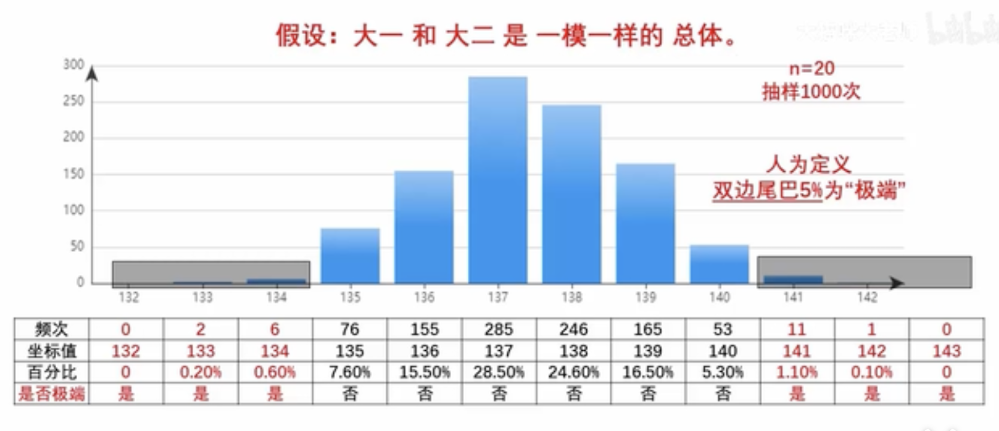

### 外篇 1
正态分布: 重复100组实验 每组抛硬币10次记录正面次数 横轴 出现正面的次数 纵轴 这个次数多少组出现

伽尔顿板: 每个钉子落下左右的概率是随机的 分布还是一个正态分布

非严格数学意义的 Central Limit Theorem: 一个结果由 大量的 不相关的 随机因素叠加(每个原因的作用范围非常有限) 导致的, 那么这个结果一定表现为 正态分布. 而正态分布的中心, 其对称轴, 必然等于总体均值. (考试成绩就是一个例子, 每个学生的成绩都是 大量 不相关 随机因素导致的)

### 正篇 00
5000份考试数据 每次抽样20得到一个平均分 一个抽样1000次 横坐标平均分数 纵坐标 抽到分数的次数 其分布是一个正态分布的轮廓 被称为 抽样分布(sampling distribution)

中心极限定理(version 2): 对一个总体进行大量重复的抽样, 将每次抽样的均值在 横坐标 从小到大排开, 并用柱状图表示 频次, 最终 柱状图 的轮廓是一个 正态分布, 且对称轴所标示的值, 便是总体的实际平均值, 把这个总体均值记作 μ 抽样的样本容量 n 越大, 显现出正态分布轮廓所需要的 抽样次数越少

假设检验: $H_0$大四平均分和大一的平均分是一样的 (原假设 Null Hypothesis) \
大四抽样一次 均值 141.3 处于 大一分布的尾端    \
在大一 μ = 137.41 的情况下 x̄ = 141.3 出现抽样均值 141 或者更高分的概率仅为 p = 0.012 这是非常极端的小概率事件 极端到可以怀疑并拒绝原假设 所以选择 对立/备选假设(Alternative Hypothesis) \
在 90% 与 10% 这种 "大概率" 与 "小概率" 的 人为 划分水平下 "大四的英语水平 平均分和  大一 平均分显著不同"(significance level 显著水平 α = 0.1)

吃包子例子: 统计 A B 校区 每人每月吃包子的数量是否显著不同 食堂提供了 1000 个数据的 excel 表 n=5, 抽样 1000 次, 得到 μ = 40 假设 双边尾巴 0.025 则 α = 0.05\
假设 $H_0$ A B 校区 平均每人每月吃包子数量一样 在 B 进行 一次 n=5 的抽样, 得到 x̄ = 33, 落在 A 校区 左边尾巴的 2.5% 的阴影面积中. 因此 拒绝原假设 B A 校区平均每人每月吃包子数量 存在 显著差异

一个统计学工作者 是否每个研究案例, 都要做一个抽样分布 NO! 

$\frac{\sum_{i=1}^n x_i - μ}{标准差s} $ -> $t = \frac{x̄ - μ}{s/\sqrt{n}}$

根据 t值 公式 包子和分数 n=20进行抽样 最后得到的 分布几乎一样 这个分布叫做 t分布 和 normal distribution 相似\
单样本就是每次抽取一个样本做 t检验(单样本不是说样本容量为1), 根据 t值在 t分布的位置是否极端  来判断 此样本 和 均值为 μ 的总体是否显著不同

### 正篇 01 正态分布
正态分布 伽尔顿板 n=10 层钉子 和 n=20 层钉子 钉子越多豆子落下的岔路越多 地下的槽子越多 豆子越分散 正态分布曲线越 扁 方差越大 曲线越尖 方差越小 \
正态分布概率密度函数 来看 方差决定了 曲线的 扁平 度

如果让板子的 每行钉子左右掉落概率不同(同一行的钉子左右概率一样), 对称轴的位置可以根据钉子的概率计算出来, 对称轴的值就是 概率密度函数中的 μ

### 正篇 02 没啥东西 讲了故事

### 正篇 03 正态分布的 方差 标准差 68-95-99
μ 对称轴 即 真实均值\
σ 标准差\
μ + σ 和 μ - σ 的区间阴影面积占了 总体的 68%\
μ + 2σ 和 μ - 2σ 的区间阴影面积占了 总体的 95%\
μ + 3σ 和 μ - 3σ 的区间阴影面积占了 总体的 99%\

应用 厂家 做衣服 按正态分布做 size 

### 正篇 04 均值抽样分布 
抽样 是指 从一个总体中 随机抽取一些个体 抽取的个体数量 n 叫做样本容量. 我们可以计算这个样本的平均值 来估算总体的平均值 \
均值抽样分布 版本的 中心极限定理 见 正篇 00 中心极限定理 V2 \
n 越大 正态分布 越集中 方差越小

### 正篇 05 假设检验 & significance level α & rejection region

$H_0 $ Null Hypothesis: 大一新生 和 大儿老生 的高考英语成绩 没有 显著差别\
抽样一次 134 就落在了尾巴区间 极端事件就发生了 则有理由拒绝原假设 接受 $H_1$ alternative hypothesis\
抽样一次 136 落在正常范围 即 可以接受 null hypothesis

尾巴的 5% 是两边各 2.5% 的阈值, 这个值是人为规定的. 显著性水平 significance level 就是他. 记作 α . α 也可以是 2%, 1% 甚至 0.1%, 具体情况具体分析.

尾部 的阴影区域 叫做 rejection region, 临界值 叫 critical value

### 正篇 06 从 均值抽样分布 到 t分布
高考英语 和 包子
1. 案例不一样 一个分数 一个包子
2. 对称轴不一样 137 和 40
3. 数量单位不一样 一个分 一个只
看到这想到啥了 标准化  normalization

$t = \frac{x̄ - μ}{s/\sqrt{n}}$ \
$s/\sqrt{n}$ 是 样本均值标准差 不是总体均值标准差 \
现在 用这个 公式 去做 t值抽样 的虚拟仿真实验, 设定样本容量 n=20, 每抽一次, 计算一次 t 值, 并作出柱状图, 1000次重复抽样后, 便得到一个 t值抽样分布, 即 t分布.

t分布可以适用所有假设检验(并且有 t 值表 可以用来判断 假设) 比如 稻田A 亩产量 μ = 1330 斤 稻田B 抽样 平均 产量 x̄=1364 $t = \frac{x̄ - μ}{s/\sqrt{n}}$ = 1.66 此时看1.66是否落入 t 分布的rejection region

这个假设检验就是 t检验. 具体说 是一个 单样本 双边(two tailed) t 检验. 

### 正篇 07 单双边 t 检验
双边 "=": $H_0$ 为 "成绩=500分" rejection region 在最不能 代表 等于 的 two tails \
单边 either ">" or "<"\
1. ">": $H_0$ 为 "成绩>500" rejection region 在最不能代表 "$μ>μ_0$" 的左边认为这个样本来自 "$H_1: μ<μ_0$"
2. "<": $H_0$ 为 "成绩<500" rejection region 在最不能代表 "$μ<μ_0$" 的右边 认为这个样本来自 "$H_1: μ>μ_0$"

之前说 $H_0: μ_B=μ_A$ 现在变成 $H_1: μ_B>μ_A$ 原因就是原假设变了 所以 rejection region也变了. 双尾 变成 单尾 显著水平 还是 0.05 rejection region 从两边尾部面积 挪到了一边的尾部面积. 单尾 更粗 rejection region 更大, 更容易拒绝 $H_0$. 这也是为什么实际统计工作中, 很多人都不用 0.05 这个显著水平而使用 0.01 或者 0.001 等更小的显著水平. 

### 正篇 08 自由度
餐馆点餐 \
红烧肉 $7 宫保鸡丁 6 油焖茄子5 鱼香肉丝4 番茄鸡蛋3 土豆丝2 炒白菜1 \
有 20 块钱 想全部花完\
这种情况, 为了满足总价等于20这个限制条件, 我只能自由的选择3个菜, 因为第四个菜的价钱是被前三个菜决定了的, 第四个菜不能自由选择. 换句话说 点4个菜的自由度其实 4-1=3.\
非严格意义的数学上定义

df越大 t分布越尖 df趋于无穷 t分布趋于标准正态分布

### 正篇 09 t 临界值 T Distribution Critical Values Table

### 正篇 10 p值 p-value
$H_0$: 大一和大二英语成绩平均分没有显著差别\
抽样得到141分, 因为双边检验 左边还要有一个133分 \
右边累计概率 1.1%+0.1%=1.2%\
左边累计概率 0.2%\
抽样一次 得均分 141 的双边 p-value 加起来为 p=0.014\
此时 比较 p和α
1. p<α, 拒绝 $H_0$ 
2. p>α, 不拒绝 $H_0$

p-value计算公式很复杂 所以计算机普及前, 都是用 t临界值表判断\
有了 计算机 可以直接用 p-value 和 α 比较 \
p具体的表示 在 t 分布画一条线 然后线的一侧 t 曲线下面的阴影面积

### 正篇 11 Type I error Type II error 
1. Type I error: Rejecting $H_0$ when it's actually TRUE
2. Type II error: Accepting $H_0$ when it's actually FALSE

### 正篇 12 置信区间 Confidence Interval
5k 学生总体的真实平均分为 μ, 抽样一次n=20, 得到 x̄ = 137.65 分, 这个均分 137.65被称为 对总体均分 μ 的一个点估计 point estimate

不知道总体 μ 而且只能抽样一次的情况, 得要一个样本均值 137.65, 假如想估计一个区间, 说真实总体均值 μ kennel在这个样本均值左右浮动, 那么浮动范围是多少分呢?

$x̄_{临界值} = μ_{假想总体} + t_{临界值} * s/\sqrt{n}$\
浮动范围就是 $t_{临界值} * s/\sqrt{n}$\
$SE = s/\sqrt{n}$ 样本均值的 标准误差 Standard Error of Mean 注意 Standard Error不是研究总体的标准差 而是所有 抽样 均值 的标准差

置信区间的 what/how/why
1. 对一个未知总体的均值 μ 的区间估计
2. $ μ \in [ x̄ - t_{临界值} * s/\sqrt{n} , x̄ + t_{临界值} * s/\sqrt{n}] $  为 点估计 + 浮动范围
3. 很多时候只能对一个未知总体进行一次抽样 抽样均值 加上一个上下浮动的范围 形成一个区间估计

### 正篇 13 置信水平 Confidence Level
置信水平 不是某个置信区间 包含真实总体均值 μ 的概率\
我们可以说 【这个置信区间可能包含了总体均值 μ】但是不能说 【这个置信区间有95%的概率包含了总体均值 μ】

总体 永远 是未知的 总体均值 μ 是一个未知 但 存在的 常数. 所以 μ 要么在这个区间内, 要么不在这个区间内 概率是1或者0 不存在其他概率\
所以 (说法1)置信水平 是 95%的信心说 这个置信区间 包含了 总体均值 μ\
(说法2) 假如可以对这个未知总体进行无限次重复抽样, 每次抽样都构造出一个置信区间, 那么构造出来的所有置信区间中, 肯定有95%的置信区间, 包含了真是的总体均值 μ. 

### 正篇 14 单样本t检验 One Sample t-Test
怎么用R计算

### 正篇 15 样本正态性
1. 什么叫样本的 正态性: 样本来自一个服从正态分布的总体
2. 为什么检验样本的正态性: 研究的总体不是正态分布, 则样本容量小的或者小样本的反复抽样得不到 bell shape的抽样分布 则得不到 t分布 则不能使用t检验. (小样本的t检验很有用, 但是使用前提就是保证样本有正态性. 假设一个总体是个V字分布,抽样100k次 n=1,2,3,4,5,6都没有bell shape, 直到 n=7 开始有了 bell shape. 假如总体不符合正态分布, 则小样本的 t值抽样分布 不是 t分布. 所以多大的样本算大, 多小的样本算小? 一般取n=30)

中心极限定理: 对于任意分布的总体(从一个总体中以独立同分布(IID)的方式抽取样本), 只要样本容量足够大, 均值抽样分布就接近于正态分布\
当 n ≥ 30, t分布已不在要求样本的正态性, 可以直接进行 t 检验. 叫做 大样本容量时 t 检验对于 非正态性 总体的 robustness. 样本大小都要检验正态性(严谨).

3. 正态性检验: Kolmogorov-Smirnov Test, Shspiro-Wilk Test, Anderson-Darling Test

### 正篇 16 双样本t检验 two-sample t test = independent samples t test
Use case:
比较两个总体是否有显著差别, 但是没条件计算出真实的 $μ_1, μ_2$, 只能分别从两个总体抽取一个样本 $X_1, X_2$ 然后计算两个样本的均值的差值. 这时假设 $H_0: μ_1=μ_2$, 或者说 假设双样本 $X_1, X_2$来自同一个总体, 抽样得到 2分差值的概率多大, 极不极端. 通过差值抽样分布 算出差值的 p 然后比较 p 和 α 就知道是否拒绝原假设  

双样本 t 分布 计算公式\
$S_p^2=\frac{(n_1-1)S_1^2+(n_2-1)S_2^2}{n_1+n_2-2}$\
$t=\frac{x̄_1-x̄_2}{\sqrt{\frac{S_p^2}{n_1}+\frac{S_p^2}{n_2}}}$\
当 $n_1=n_2$, $t=\frac{x̄_1-x̄_2}{\sqrt{s_1^2+s_2^2}/\sqrt{n}}$\
这个t分布的自由度 $(n_1-1)+(n_2-1)=n_1+n_2-2$

双样本和单样本的t分布是同一个t分布

单样本 t 检验\
检验: 单样本 是否来自 已知的总体

双样本 t 检验\
检验: 两个样本是否 来自 一个总体(可以理解为 两个 μ 是否显著差别)\
双样本也需要检验 样本的正态性

paired t test 不是 2 samples test

双样本 t 检验前置条件 样本正态性 方差齐性 和 样本独立性 后面再讲

### 正篇 17 Independent Samples
Independent Samples: There is no relationship between the subjects in each sample.
具体 三个方面:
1. Subjects in the first sample cannot also be in the second sample(avoid overlapping subject, record subjects' info that can distinguish the target from others)
2. No subjects in either sample can influence subjects in the other sample(国内海外考试 海外枪手考完发答案给国内 然后国内subject受影响)
3. No sample can influence the other sample(一个老师担任俩学校的授课职责同样的教材同样的内容, 两边的学生群体则不独立)

Paired t Test: Pre-Test, Post-Test(前测后测成绩来自同一个subjects)

### 正篇 18 方差齐性(Homogeneity of Variances)检验的基本原理 F检验初步
双样本 t检验 样本要求:
1. 两个样本符合正态性
2. 两个样本相互独立性
3. 两个样本方差齐性

Equal Variances 方差相等: 样本所代表的总体的方差相等, 不是完全相等\
方差齐性检验:
反复抽样 得到一个 F分布: $F=\frac{S_1^2}{S_2^2}$ 然后把本次的样本带入公式 看看在F分布中是否极端 进而拒绝或者接受原假设 方差齐性 $\sigma_1^2 = \sigma_2^2$

F检验具体方法: 假如两个样本从同一个总体抽出来, 毫无疑问, 这两个样本所代表的总体的方差是完全一样的. 完美情况下, 两个样本的方差, 整齐到完全相等, 那么 F 值, 等于1. 

$F=\frac{S_1^2}{S_2^2}$ $X_1$样本容量$n_1=20$ 分子自由度 Df=19 $X_2$样本容量$n_2=20$ 分母自由度 Df=19 记作 F(19,19)\
从这个F分布的双边尾巴上, 各划出 2.5% 的阴影面积, 就是双边 $\alpha = 0.05$ 的 rejection region (F 分布也有相应的临界值表)

### 正篇 19 Paired t Test
某班英语老师 20个同学 学期开始一次摸底考试 pre-test, 上了一学期的课 再摸底 post-test

