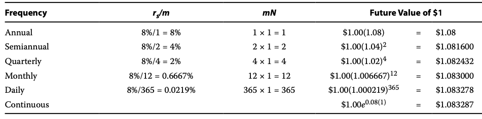
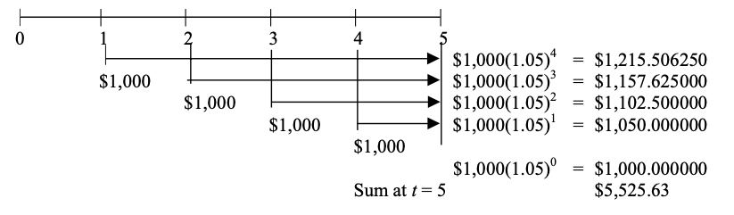
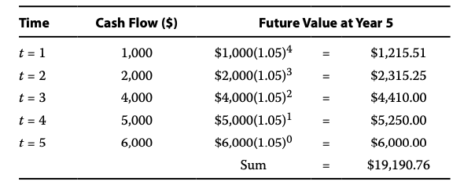
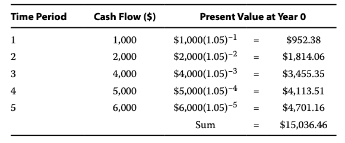
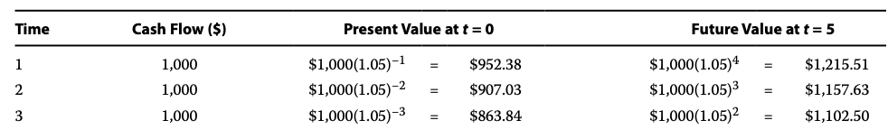
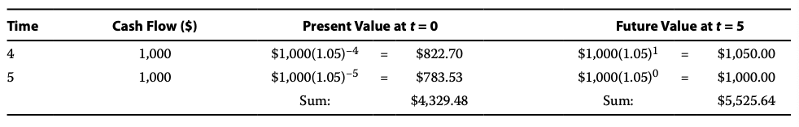
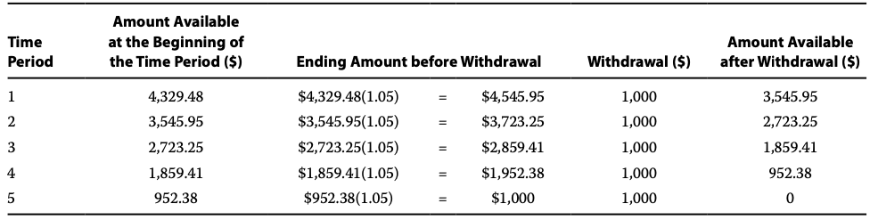

# The time value of money
## Section 2 INTEREST RATES
Money的时间价值. An `interest rate` is a rate of return that reflects the relationship between differently dated cash flows.\
9500 today and 10,000 in one year are equivalent in value, then 10,000 - 9,500 = 500 is the required compensation for receiving 10,000 in one year rather than now. interest rate - the required compensation stated as a rate of return - is 500/9,500 = 5.26%\
利率是反映不同日期现金流之间关系的回报率。例如，今天的9500美元和一年后的10000美元在价值上是等价的，因此10000美元减去9500美元等于500美元，即接收一年后的10000美元所需的补偿。利率是以回报率的形式表示的所需补偿，即500/9500 = 5.26%.\
Interest rates can be thought of in three ways:
1. required rates of return: the minimum rate of return an investor must receive in order to accept the investment
2. interest rates can be considered discount rates. 5.26 percent is that rate at which we discounted the 10,000 future amount to find its value today. Thus we use the terms "interest rate" and "discount rate" almost interchangeably.
3. an opportunity cost is the value that investors forgo by choosing a particular course of action. In the example, if the party who supplied $9,500 had instead decided to spend it today, he would have forgone earning 5.26 percent on the money. So we can view 5.26 percent as the opportunity cost of current consumption

利率可以从以下三个方面来理解:
1. 需要的回报率：投资者必须获得的最低回报率才能接受投资。
2. 利率可以被视为贴现率。5.26%是我们对10000未来金额进行贴现以找到其现值的利率。因此，我们几乎可以互换地使用"利率"和"贴现率"这两个术语。
3. 机会成本是投资者通过选择特定行动而放弃的价值。在这个例子中，如果提供9500美元的一方决定今天花掉这笔钱，他将失去以5.26%的利率获利的机会。因此，我们可以将5.26%视为当前消费的机会成本。


利率:
* 投资者愿意进行投资的最低回报率
* 钱在未来某一天折现到现在的rate
* money持有人没有投资而花掉的机会成本

Taking the perspective of investors in analyzing market-determined interest rates, we can view an interest rate r as being composed of \
从投资者的角度来分析市场决定的利率时，我们可以将利率r视为由以下因素组成
```bash
r = Real risk-free interest rate + Inflation premium + Default risk premium + Liquidity premium + Maturity premium
```
Real risk-free interest rate: single-period interest rate for a completely risk-free security if no inflation were expected. It reflects the time preferences of individuals for current versus future real consumption.\
实际无风险利率：如果没有通货膨胀预期，完全无风险证券的单期利率。它反映了个人对当前实际消费与未来实际消费的时间偏好。
1. Inflation premium: compensates investors for expected inflation and reflects the average inflation rate expected over the maturity of the debt. 投资者补偿预期通货膨胀，并反映了债务到期期限内预期的平均通胀率. (maturity of the debt: 债务到期日). The sume of the real risk-free interest rate + the inflation premium is the nominal risk-free interest rate(名义无风险利率)(Many countries have governmental short-term debt whose interest rate can be considered to represent the nominal risk-free interest rate in that country. The interest rate on a 90-day US Treasury bill (T-bill), for example, represents the nominal risk-free interest rate over that time horizon.US T-bills can be bought and sold in large quantities with minimal transaction costs and are backed by the full faith and credit of the US government.) 实际无风险利率与通货膨胀溢价之和是名义无风险利率。许多国家都有政府短期债务，其利率可以被视为该国的名义无风险利率。例如，90天期美国国债券（T-bill）的利率代表了该时间段内的名义无风险利率。美国国债券可以以较低的交易成本大量买卖，并由美国政府全面担保。
2. Default risk premium: compensates investors for the possibility that the borrower will fail to make a promised payment at the contracted time and in the contracted amount. 违约风险溢价：为投资者因借款人可能在约定时间和金额上未能按时偿付而进行补偿。
3. Liquidity premium: compensates investors for the risk of loss relative to an investment's fair value if the investment needs to be converted to cash quickly. 流动性溢价：当投资者持有较不流动或不易变现的资产时，如果他们需要迅速将其转换为现金，可能会面临一定的风险。这种风险包括以低于公允价值的价格出售资产或无法及时变现资产的可能性。为了补偿这种风险，投资者要求获得流动性溢价。流动性溢价反映了投资者愿意为持有较不流动资产支付的额外回报。这个额外回报可以补偿投资者在转换资产时可能遭受的损失，并反映了市场对于较不流动资产的需求和供给之间的差异。例如，美国国债券（T-bills）不会承担流动性溢价，因为可以大量购买和出售而不会影响其市场价格。相比之下，许多小型发行人的债券在发行后交易频率较低；这些债券的利率包括反映出售持仓的相对高成本（包括对价格的影响）的流动性溢价。
4. Maturity premium(到期溢价): compensates investors for the increased sensitivity of the market value of debt to a change in market interest rates as maturity is extended(补偿投资者随着债务到期期限延长,债务市场对市场利率变化的敏感性增加的风险)The difference between the interest rate on longer-maturity, liquid Treasury debt and that on short-term Treasury debt reflects a `positive maturity premium` for the longer-term debt and possibly different inflation premiums as well.(长期流动性国债利率与短期国债利率之间的差异反映了长期债务的`正向到期溢价`,可能还包括不同的通胀溢价)

## SECTION 3 FUTURE VALUE OF A SIGNAL CASH FLOW

$PV$ = present value of the investment\
$FV_N$ = future value of the investment N periods from today\
$r$ = rate of interest per period

For N=1, the expression for the FV of amount PV is:\
$FV_1=PV(1+r)$\
$FV_2=FV_1(1+r)$\
$5 interest that you earned each period on the original investment $100 is known as `simple interest`(the interest rate times the principal). Principal(本金) is the amount of funds originally invested. \
The interest earned on interest provides the first glimpse of the phenomenon known as `compounding`.\
在原始投资额为100美元的情况下，每期所获得的5美元利息被称为简单利息（利率乘以本金）。本金是最初投资的金额。\
而利息再投资所获得的利息，揭示了所谓的复利现象
$FV_N=PV(1+r)^N$

## SECTION 4 NON-ANNUAL COMPOUNDING (FUTURE VALUE)
For instance, many banks offer a monthly interest rate that compounds 12 times a year. In such an arrangement, they pay interest on interest every month. Rather than quote the periodic monthly interest rate, financial institutions often quote an annual interest rate that we refer to as the `stated annual interest rate`(陈述年利率) or `quoted interest rate`(标明利率).\
例如，许多银行提供每年复利12次的月利率。在这种安排下，他们每个月都会支付利息的利息。金融机构通常不引用周期性的月利率，而是引用我们称之为"陈述年利率"或"引用利率"的年利率。\
stated annual interest rate = $r_s$\
For instance, your bank might state that a particular CD pays 8 percent compounded monthly. The stated annual interest rate equals the monthly interest rate multiplied by 12. In this example, the monthly interest rate is 0.08/12 = 0.0067 or 0.67 percent. \
例如，你的银行可能会表示一项特定的存单每月复利8%。陈述年利率等于月利率乘以12。在这个例子中，月利率是0.08/12 = 0.0067 或者0.67%\
This rate is strictly a quoting convention because $(1+0.0067)^{12} = 1.083$, not 1.08; the term $(1+r_s)$ is not meant to be future value factor when compounding is more frequent than annual.\
这个利率严格来说是一种引用惯例，因为$(1+0.0067)^{12} = 1.083$，而不是1.08；当复利频率高于年度时，术语(1 + rs)并不意味着未来价值因子.\
With more than one compounding period per year, the future value formula can be expressed as $FV_N = PV(1+r_s/m)^{mN}$ where $r_s$ is the stated annual interest rate, $m$ is the number of compounding periods per year, and $N$ now stands for the number of years. \
当每年有多个复利期时，未来价值公式可以表示为$FV_N = PV(1+r_s/m)^{mN}$其中$r_s$是陈述年利率，$m$是每年的复利期数，$N$表示年数。

## SECTION 5 CONTINUOUS COMPOUNDING
The preceding discussion on compounding periods illustrates discrete compounding, which credits interest after a discrete amount of time has elapsed. 前面关于复利期的讨论说明了离散复利，它在经过一段离散的时间后计算利息. If the number of compounding periods per year becomes infinite, then interest is said to compound continuously. 如果每年的复利期数趋近于无穷大，那么称为连续复利. \
The expression for the future value of a sum in N years with continuous compounding is\
使用连续复利的情况下，N年后一笔金额的未来价值的表达式是\
$FV_N = PVe^{{r_s}N}$ ($e$ is the math $e$≈2.7182818)
```
Example: Suppose a $10,000 investment will earn 8 percent compounded continuously for two years. We can compute the future value with Equation 4 as follows\
```
$PV = \$10,000$ \
$rs = 8% = 0.08$ \
$N=2$ \
$FV_N = PVe^{{r_s}N}$

The ending dollar amount with continuous compounding is the maximum amount that can be earned with a stated annual rate of 8 percent.\
$1 investment earning 8.16 percent compounded annually grows to the same future value at the end of one year as a $1 investment earning 8 percent compounded semiannually.This result leads us to a distinction between the stated annual interest rate and the `effective annual rate`(EAR). For an 8 percent stated annual interest rate with semiannual compounding, the EAR is 8.16 percent\
以年复利率8.16%进行投资的1美元，在一年结束时的未来价值与以半年复利率8%进行投资的1美元相同。这个结果让我们区分了陈述年利率和有效年利率（EAR）。对于以半年复利率8%的陈述年利率，有效年利率为8.16%。

### Stated and Effective Rates
With an annual interest rate of 8 percent compounded semiannually, we receive a periodic rate of 4 percent.\
在年利率为8％、半年复利的情况下，我们获得的周期利率为4％。\
$EAR = 1(1.04)^2 = 1.0816$\
The periodic interest rate is the stated annual interest rate divided by m, where m is the number of compounding periods in one year.\
$EAR = (1 + Periodic\ interest\ rate)^m -1$\
With continuous compounding, we can solve for the effective annual rate as: $EAR = e^{r_s}-1$\
通过连续复利，我们可以计算出有效年利率的公式为：$EAR = e^{r_s} - 1$

## SECTION 6 A SERIES OF CASH FLOWS
1. Annuity: a finite set of level sequential cash flows(年金是一组有限的、连续的、等额现金流的集合)
2. An ordinary annuity has a first cash flow that occurs one period from now (indexed at t = 1) 普通年金指的是首次现金流在未来第一个期间发生（以t = 1为索引）
3. An annuity due has a first cash flow that occurs immediately (indexed at t = 0). 年初年金指的是首次现金流立即发生（以t = 0为索引）
4. A perpetuity is a perpetual annuity, or a set of level never-ending sequential cash flows, with the first cash flow occurring one period from now. 永续年金指的是一系列永无止境的等额连续现金流，其中首次现金流在未来一个期间内发生

`普通年金`指的是在每个支付期末支付现金流，而`年金到期`指的是在每个支付期初支付现金流
### Equal Cash Flows - Ordinary Annuity
Consider an ordinary annuity paying 5 percent annually. Suppose we have five separate deposits of $1,000 occurring at equally spaced intervals of one year, with the first payment occurring at t = 1. Our goal is to find the future value of this ordinary annuity after the last deposit at t = 5. \
假设我们有一个每年支付5%的普通年金。假设我们有五笔分别为1,000美元的存款，每笔存款间隔一年，并且第一笔存款发生在t = 1。我们的目标是找到在最后一笔存款（t = 5）后的普通年金的未来价值\

这种计算方式是基于每笔现金得出的结果, 每笔现金流计算自己的复利然后相加.\
还有一种情况是新存入的1000元会与已有的本金和利息相加，并作为新的本金进行复利计算\
以上两种情况得出的结果是一样的.\
$FV_N = A[(1+r)^{N-1} + (1+r)^{N-2} + ... + (1+r)^1 + (1+r)^0]$\
$FV_N = A[\frac {(1+r)^N-1}{r}]$\
A is annuity amount. A是年金金额. number of time periods as N
### Unequal Cash Flows


## SECTION 7 PRESENT VALUE OF A SINGLE CASH FLOW
Just as the future value factor links today's present value with tomorrow's future value, the present value factor allows us to discount future value to present value.\
正如未来价值因子将今天的现值与明天的未来价值联系在一起，现值因子允许我们将未来价值折现到现值。\
$FV_N = PV(1+r)^N$\
$PV = FV_N(1/(1+r)^N)$\
$PV = FV_N(1+r)^{-N}$
```
Example: An insurance company has issued a Guaranteed Investment Contract (GIC) that promises to pay $100,000 in six years with an 8 percent return rate. What amount of money must the insurer invest today at 8 percent for six years to make the promised payment
一家保险公司发行了一份保本投资合同（GIC），承诺在六年后以8%的回报率支付100,000美元。为了履行承诺支付，保险公司必须以8%的利率在六年期内投资多少金额
```
## SECTION 8 NON-ANNUAL COMPOUNDING (PRESENT VALUE)
$PV = FV_N(1 + r_s/m)^{-mN}$ \
where\
$m$ = number of compounding periods per year\
$r_s$ = quoted annual interest rate\
$N$ = number of years

## SECTION 9 PRESENT VALUE OF A SERIES OF EQUAL AND UNEQUAL CASH FLOWS
### The present value of a series of equal cash flows
$PV = \frac{A}{(1+r)} + \frac{A}{(1+r)^2} + \frac{A}{(1+r)^3} + ... + \frac{A}{(1+r)^{N-1}} + \frac {A}{(1+r)^N}$\
where \
$A$ = annuity amount\
$r$ = the interest rate per period corresponding to the frequency of annuity payments(annual, quarterly, monthly)\
$N$ = the number of annuity payments\
$PV = A[\frac{1-\frac{1}{(1+r)^N}}{r}]$\
这里的年金PV计算和FV与PV的转换其实有点差异  下面的例子很好的诠释了这一点
```
Example 13
A German pension fund manager anticipates that benefits of €1 million per year must be paid to retirees. Retirements will not occur until 10 years from now at time t = 10. Once benefits begin to be paid, they will extend until
t = 39 for a total of 30 payments. What is the present value of the pension liability if the appropriate annual discount rate for plan liabilities is 5 percent compounded annually?
一个德国的养老金基金经理预计每年必须支付给退休人员100万欧元的养老金。退休将在10年后的t = 10时开始。一旦开始支付养老金，将持续到t = 39，共计30期支付。如果计划责任的适当年度贴现率为5%，那么养老金负债的现值是多少
```
$A = 1,000,000$\
$r=5\%=0.05$\
$N=30$\
$PV=A[\frac{1-\frac{1}{(1+r)^N}}{r}]$\
$PV=15,372,451.03$

$FV_N = 15,372,451.03$ (the present value at t=9)\
$N=9$\
$r=5\%=0.05$\
$ PV=FV_N(1+r)^{-9}$\
$PV=15,372,451.03*(0.644609)$

### The present value of a series of unequal cash flows


## SECTION 10 PRESENT VALUE OF A PERPETUITY
$PV = A\sum_{t=1}^∞ [\frac{1}{(1+r)^t}]$\
As long as interest rates are positive, the sum of present value factors converges\
$PV = \frac{A}{r}$
### Present value of a Projected Perpetuity
```
Consider a level perpetuity of £100 per year with its first payment beginning at t = 5. What is its present value today (at t = 0), given a 5 percent discount rate?
考虑一个每年支付£100的定额永续年金，其首次支付从t = 5开始。在给定5%的贴现率下，它在今天（t = 0）的现值是多少？
```

## SECTION 11 SOLVING FOR INTEREST RATES, GROWTH RATES, AND NUMBER OF PERIODS

### Solving for interest rates and growth rates
```
Suppose a bank deposit of €100 is known to generate a payoff of €111 in one year.
```
$1 + r = FV/PV$\
$1+r=1.11$\
$r=0.11$\
An interest rate can also be considered a growth rate.\
$g=(FV_N/PV)^{1/N}-1$

### Solving for the number of periods
```
You are interested in determining how long it will take an investment of €10,000,000 to double in value. The current interest rate is 7 percent compounded annually. How many years will it take €10,000,000 to double to €20,000,000
您希望确定一笔1000万欧元的投资翻倍所需的时间。当前的年利率为7%，按年复利计算。需要多少年，1000万欧元才能翻倍到2000万欧元？
```
$(1+r)^N = FV_N/PV = 2$\
$N*ln(1+r) = ln(2)$\
$ N = ln(2)/ln(1+r)$

## SECTION 12 Solving for size of annuity payments
```
You are planning to purchase a $120,000 house by making a down payment of $20,000 and borrowing the remainder with a 30-year fixed-rate mortgage with monthly payments. The first payment is due at t = 1. Current mortgage interest rates are quoted at 8 percent with monthly compounding. What will your monthly mortgage payments be?
您计划通过支付2万美元的首付款，并以30年期固定利率抵押贷款的形式借取剩余金额，购买一座12万美元的房屋。首次付款将于t = 1时到期。当前的抵押贷款利率为8%，按月复利计算。您的每月抵押贷款还款金额将是多少？
```
$PV=A[\frac{1-\frac{1}{(1+r)^N}}{r}]$\
$PV=100,000$\
$r_s=8\%=0.08$\
$m=12$\
$r_s/m=0.08/12=0.006667$\
$N=30$\
$mN=12x30=360$\
$A=733.76$

Cash Flow Additivity Principle\
$PV_{total} = PV_1 + PV_2 + PV_3 + ... + PV_n$

```
Jill Grant is 22 years old (at t = 0) and is planning for her retirement at age 63 (at t = 41). She plans to save $2,000 per year for the next 15 years (t = 1 to t = 15). She wants to have retirement income of $100,000 per year for 20 years, with the first retirement payment starting at t = 41. How much must Grant save each year from t = 16 to t = 40 in order to achieve her retirement goal? Assume she plans to invest in a diversified stock-and-bond mutual fund that will earn 8 percent per year on average.
Grant 22岁t=0, 计划63退休t=41,前15年每年存2k(t=1 to t=15),想从t=41开始每年收到100k退休金收20年. 他从t=16到t=40每年存多少能达到他的目标? 假设利率是8.
```
Step 1:\
$A=2,000$\
$r=0.08$\
$N=15$\
$FV = 2,000(27.152114)$\
$FV=54,304.23$\
Step 2:\
$A=100,000$\
$r=0.08$\
$N=20$\
$PV=100,000*(9.818147)=981,814.74$\
Step 3:\
$FV_N=981,814.74$\
$N=40-15$\
$r=0.08$\
$PV=981,814.74*(1.08)_{-25}$\
$PV=981,814.74*(0.146018)=143,362.53$\
$143,362.53-54,304.23=89058.30$\
Step 4:\
$PV=89,058.30$\
$r=0.08$\
$N=25$\
$A=PV/{Present\ Value\ Annuity\ Factor}$\
$A=89,058.3/10.674776 = 8,342.87$

## SECTION 13 PRESENT AND FUTURE VALUE EQUIVALENCE AND THE ADDITIVITY PRINCIPLE
### The Equivalence of Present and Future Values


### How an Initial Present Value Funds an Annuity
To interpret Exhibit 14, start with an initial present value of $4,329.48 at t = 0. From t = 0 to t = 1, the initial investment earns 5 percent interest, generating a future value of $4,329.48(1.05) = $4,545.95. We then withdraw $1,000 from our account, leaving $4,545.95 − $1,000 = $3,545.95 (the figure reported in the last column for time period 1). In the next period, we earn one year's worth of interest and then make a $1,000 withdrawal. After the fourth withdrawal, we have $952.38, which earns 5 per- cent. This amount then grows to $1,000 during the year, just enough for us to make the last withdrawal. Thus the initial present value, when invested at 5 percent for five years, generates the $1,000 five-year ordinary annuity. The present value of the initial investment is exactly equivalent to the annuity.
