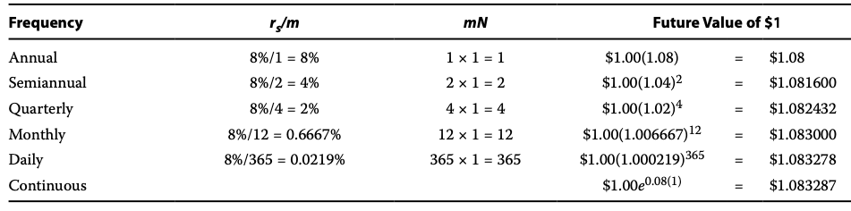
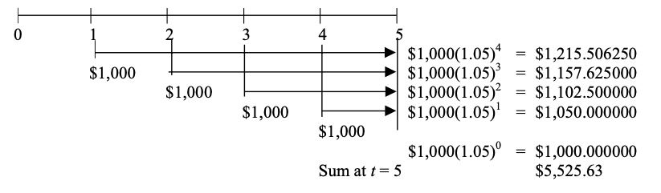
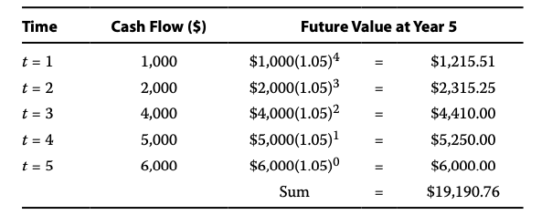

# The time value of money
## Section 2 INTEREST RATES
Money的时间价值. An `interest rate` is a rate of return that reflects the relationship between differently dated cash flows.\
9500 today and 10,000 in one year are equivalent in value, then 10,000 - 9,500 = 500 is the required compensation for receiving 10,000 in one year rather than now. interest rate - the required compensation stated as a rate of return - is 500/9,500 = 5.26%
Interest rates can be thought of in three ways:
1. required rates of return: the minimum rate of return an investor must receive in order to accept the investment
2. interest rates can be considered discount rates. 5.26 percent is that rate at which we discounted the 10,000 future amount to find its value today. Thus we use the terms "interest rate" and "discount rate" almost interchangeably.
3. an opportunity cost is the value that investors forgo by choosing a particular course of action. In the example, if the party who supplied $9,500 had instead decided to spend it today, he would have forgone earning 5.26 percent on the money. So we can view 5.26 percent as the opportunity cost of current consumption

利率:
* 投资者愿意进行投资的最低回报率
* 钱在未来某一天折现到现在的rate
* money持有人没有投资而花掉的机会成本

Taking the perspective of investors in analyzing market-determined interest rates, we can view an interest rate r as being composed of 
```bash
r = Real risk-free interest rate + Inflation premium + Default risk premium + Liquidity premium + Maturity premium
```
Real risk-free interest rate: single-period interest rate for a com- pletely risk-free security if no inflation were expected. It reflects the time preferences of individuals for current versus future real consumption.\
Inflation premium: compensates investors for expected inflation and reflects the average inflation rate expected over the maturity of the debt. 投资者补偿预期通货膨胀，并反映了债务到期期限内预期的平均通胀率. (maturity of the debt: 债务到期日). The sume of the real risk-free interest rate + the inflation premium is the nominal risk-free interest rate(名义无风险利率)(Many countries have governmental short-term debt whose interest rate can be considered to represent the nominal risk-free interest rate in that country. The interest rate on a 90-day US Treasury bill (T-bill), for example, represents the nominal risk-free interest rate over that time horizon.US T-bills can be bought and sold in large quantities with minimal transaction costs and are backed by the full faith and credit of the US government.)\
Default risk premium: compensates investors for the possibility that the borrower will fail to make a promised payment at the contracted time and in the contracted amount\
Liquidity premium: compensates investors for the risk of loss relative to an investment's fair value if the investment needs to be converted to cash quickly. 当投资者持有较不流动或不易变现的资产时，如果他们需要迅速将其转换为现金，可能会面临一定的风险。这种风险包括以低于公允价值的价格出售资产或无法及时变现资产的可能性。\
为了补偿这种风险，投资者要求获得流动性溢价。流动性溢价反映了投资者愿意为持有较不流动资产支付的额外回报。这个额外回报可以补偿投资者在转换资产时可能遭受的损失，并反映了市场对于较不流动资产的需求和供给之间的差异。例如，美国国债券（T-bills）不会承担流动性溢价，因为可以大量购买和出售而不会影响其市场价格。相比之下，许多小型发行人的债券在发行后交易频率较低；这些债券的利率包括反映出售持仓的相对高成本（包括对价格的影响）的流动性溢价。
Maturity premium(到期溢价): compensates investors for the increased sensitivity of the market value of debt to a change in market interest rates as maturity is extended(补偿投资者随着债务到期期限延长,债务市场对市场利率变化的敏感性增加的风险)The difference between the interest rate on longer-maturity, liquid Treasury debt and that on short-term Treasury debt reflects a `positive maturity premium` for the longer-term debt and possibly different inflation premiums as well.(长期流动性国债利率与短期国债利率之间的差异反映了长期债务的`正向到期溢价`,可能还包括不同的通胀溢价)

## SECTION 3 FUTURE VALUE OF A SIGNAL CASH FLOW

$PV$ = present value of the investment\
$FV_N$ = future value of the investment N periods from today\
$r$ = rate of interest per period

For N=1, the expression for the FV of amount PV is:\
$FV_1=PV(1+r)$\
$FV_2=FV_1(1+r)$\
$5 interest that you earned each period on the original investment $100 is known as `simple interest`(the interest rate times the principal). Principal(本金) is the amount of funds originally invested. \
The interest earned on interest provides the first glimpse of the phenomenon known as `compounding`.
$FV_N=PV(1+r)^N$

## SECTION 4 NON-ANNUAL COMPOUNDING (FUTURE VALUE)
For instance, many banks offer a monthly interest rate that compounds 12 times a year. In such an arrangement, they pay interest on interest every month. Rather than quote the periodic monthly interest rate, financial institutions often quote an annual interest rate that we refer to as the `stated annual interest rate`(陈述年利率) or `quoted interest rate`(标明利率).\
stated annual interest rate = $r_{s^*}$\
For instance, your bank might state that a particular CD pays 8 percent compounded monthly. The stated annual interest rate equals the monthly interest rate multiplied by 12. In this example, the monthly interest rate is 0.08/12 = 0.0067 or 0.67 percent. This rate is strictly a quoting convention because $(1+0.0067)^{12} = 1.083$, not 1.08; the term $(1+r_s)$ is not meant to be future value factor when compounding is more frequent than annual.当复利频率高于年度时，术语(1 + rs)并不意味着未来价值因子.\
With more than one compounding period per year, the future value formula can be expressed as $FV_N = PV(1+r_s/m)^{mN}$ where $r_s$ is the stated annual interest rate, $m$ is the number of compounding periods per year, and $N$ now stands for the number of years. 

## SECTION 5 CONTINUOUS COMPOUNDING
The preceding discussion on compounding periods illustrates discrete compounding, which credits interest after a discrete amount of time has elapsed. 之前的复利期是离散的. If the number of compounding periods per year becomes infinite, then interest is said to compound continuously. \
$FV_N = PVe^{{r_s}N}$ ($e$ is the math $e$≈2.7182818)
```
Example: Suppose a $10,000 investment will earn 8 percent compounded continuously for two years. We can compute the future value with Equation 4 as follows\
```
$PV = \$10,000$ \
$rs = 8% = 0.08$ \
$N=2$ \
$FV_N = PVe^{{r_s}N}$

The ending dollar amount with continuous compounding is the maximum amount that can be earned with a stated annual rate of 8 percent.\
Above figure also shows that a $1 investment earning 8.16 percent compounded annually grows to the same future value at the end of one year as a $1 investment earning 8 percent compounded semiannually.This result leads us to a distinction between the stated annual interest rate and the `effective annual rate`(EAR). For an 8 percent stated annual interest rate with semiannual compounding, the EAR is 8.16 percent

### Stated and Effective Rates
With an annual interest rate of 8 percent compounded semiannually, we receive a periodic rate of 4 percent.
$EAR = 1(1.04)^2 = 1.0816$\
$EAR = (1 + Periodic interest rate)^m -1$\
With continuous compounding, we can solve for the effective annual rate as: $EAR = e^{r_s}-1$

## SECTION 6 A SERIES OF CASH FLOWS
1. Annuity: a finite set of level sequential cash flows(年金是一组有限的、连续的、等额现金流的集合)
2. An ordinary annuity has a first cash flow that occurs one period from now (indexed at t = 1)
3. An annuity due has a first cash flow that occurs immediately (indexed at t = 0).
4. A perpetuity is a perpetual annuity, or a set of level never-ending sequential cash flows, with the first cash flow occurring one period from now\
普通年金指的是在每个支付期末支付现金流，而年金到期指的是在每个支付期初支付现金流
### Equal Cash Flows - Ordinary Annuity
Consider an ordinary annuity paying 5 percent annually. Suppose we have five separate deposits of $1,000 occurring at equally spaced intervals of one year, with the first payment occurring at t = 1. Our goal is to find the future value of this ordinary annuity after the last deposit at t = 5. 

这种计算方式是基于每笔现金得出的结果, 每笔现金流计算自己的复利然后相加.\
还有一种情况是新存入的1000元会与已有的本金和利息相加，并作为新的本金进行复利计算\
以上两种情况得出的结果是一样的.\
$FV_N = A[(1+r)^{N-1} + (1+r)^{N-2} + ... + (1+r)^1 + (1+r)^0]$\
$FV_N = A[\frac {(1+r)^N-1}{r}]$\
A is annuity amount.
### Unequal Cash Flows


## SECTION 7 PRESENT VALUE OF A SINGLE CASH FLOW
Just as the future value factor links today's present value with tomorrow's future value, the present value factor allows us to discount future value to present value.\
$FV_N = PV(1+r)^N$\
$PV = FV_N(1/(1+r)^N)$\
$PV = FV_N(1+r)^{-N}$
```
Example: An insurance company has issued a Guaranteed Investment Contract (GIC) that promises to pay $100,000 in six years with an 8 percent return rate. What amount of money must the insurer invest today at 8 percent for six years to make the promised payment
```
## SECTION 8 NON-ANNUAL COMPOUNDING (PRESENT VALUE)
$PV = FV_N(1 + r_s/m)^{-mN}$ \
where\
$m = number of compounding periods per year$\
$r_s = quoted annual interest rate$\
$N = number of years$

## SECTION 9 PRESENT VALUE OF A SERIES OF EQUAL AND UNEQUAL CASH FLOWS
### The present value of a series of equal cash flows
