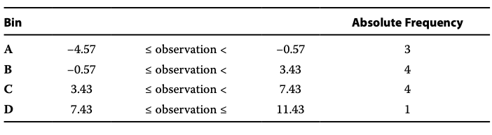
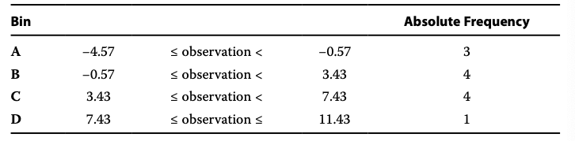
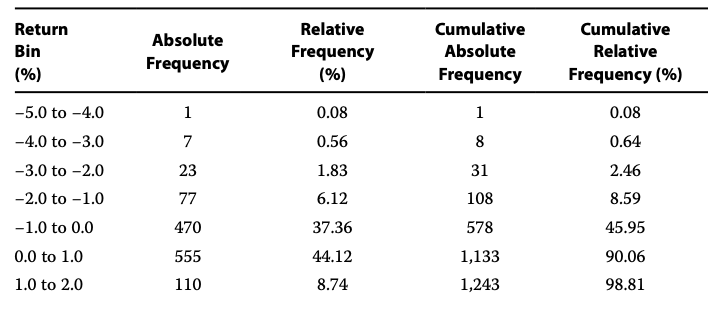
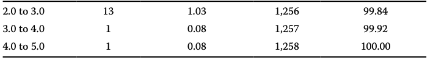
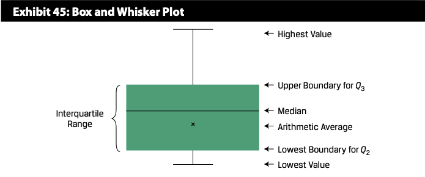
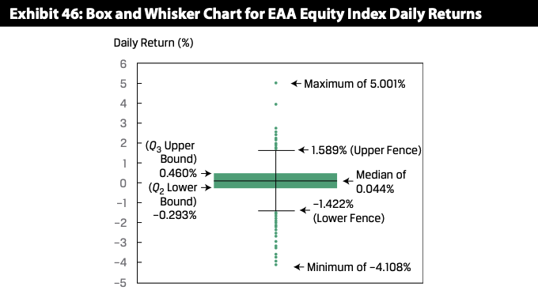
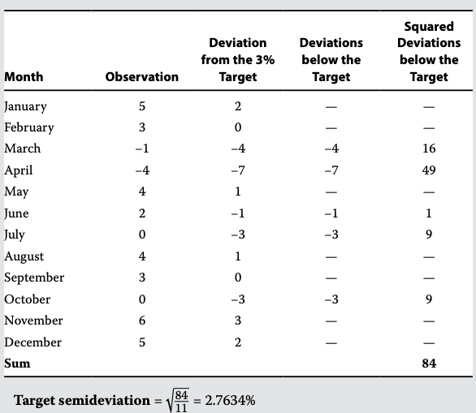
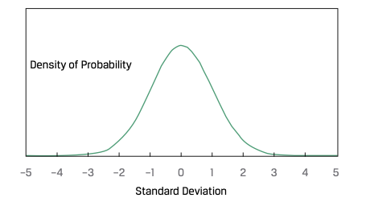
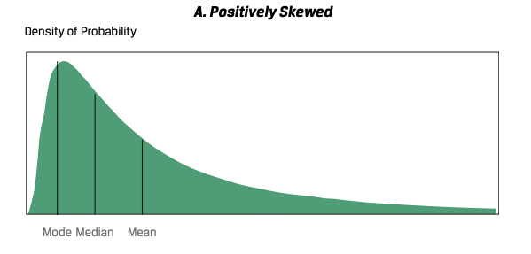

# Organizing, Visualizing, and Describing Data
## SECTION 2 DATA TYPES
### Numerical versus Categorical Data
From a statistical perspective, data can be classified into two basic groups: numerical data(数值数据) and categorical data(分类数据).\
从统计学角度来看，数据可以分为两个基本的类别：数值数据和分类数据。
1. Numerical Data: are values that represent measured or counted quantities as a number and are also called quantitative data. It can be split into continuous data and discrete data. 数值数据：代表以数字形式表示的测量或计数数量的值，也被称为定量数据。它可以分为连续数据和离散数据。
2. Categorical Data: (also called qualitative data) are values that describe a quality or characteristic of a group of observations and therefore can be used as labels to divide a dataset into groups to summarize and visualize. 分类数据（也称为定性数据）是描述一组观察结果的质量或特征的值，因此可以用作标签将数据集分组以进行总结和可视化。
    * Nominal data: are not amenable to being organized in a logical order. no inherent order or ranking. Like gender, color, martial status etc. Often, financial models, such as regression models, require input data to be numerical; so, nominal data in the input dataset must be coded numerically before applying an algorithm (that is, a process for problem solving) for performing the analysis. 名义数据（Nominal data）无法按照逻辑顺序进行组织。它们没有固有的顺序或排名。例如，性别、颜色、婚姻状况等。通常，金融模型（如回归模型）要求输入数据为数值类型；因此，在应用算法（即问题解决过程）进行分析之前，输入数据集中的名义数据必须进行数值编码。
    * Ordinal data: are categorical values that can be logically ordered or ranked. 有序数据（Ordinal data）是可以按照逻辑排序或排名的分类值。教育程度：高中毕业、大学本科、硕士研究生、博士研究生。这些教育程度可以按照学位的高低进行排序。客户满意度：非常不满意、不满意、一般、满意、非常满意。这些满意度可以按照满意程度的高低进行排列。
### Cross-Sectional versus Time-Series versus Panel Data
Another data classification standard is based on how data are collected. 
* Variable: a characteristic or quantity that can be measured, counted, or categorized and is subject to change. A variable can also be called a field, an attribute, or a feature. 变量：可测量、计数或分类的特征或数量，而且可随时间或情况的改变而变化。变量也可以称为字段、属性或特征。
* Observation: is the value of a specific variable collected at a point in time or over a specific period of time. 观测值：在某一时间点或特定时间段内收集的特定变量的值。
1. Cross-sectional data: a list of the observations of a specific variable from multiple observational units at a given point in time.  交叉断面数据（Cross-Sectional Data）是在给定时间点上收集的数据，用于描述不同个体或单位的特征。例如，在特定年份对不同家庭的收入水平进行调查
2. Time-series data: are a sequence of observations for a single observational unit of a specific variable collected over time and at discrete and typically equally spaced intervals of time, such as daily, weekly, monthly, annually, or quarterly. 时间序列数据（Time-Series Data）是按照时间顺序收集的数据，用于观察变量随时间的变化。例如，每个月记录的股票价格或每年的国内生产总值数据。
3. Panel data: are a mix of time-series and cross-sectional data that are frequently used in financial analysis and modeling. 面板数据（Panel Data）是同时包含交叉断面和时间序列的数据，即对多个个体或单位在一段时间内进行观察。它结合了交叉断面数据和时间序列数据的特征，可用于分析个体间的差异和随时间的变化。例如，对不同地区的失业率进行每月跟踪观察

### Structured versus Unstructured Data
1. Structured data: are highly organized in a pre-defined manner, usually with repeating patterns.Typical examples of structured company financial data are: 结构化数据：以预定义的方式高度组织化的数据，通常具有重复的模式。结构化公司财务数据的典型示例包括: 
    * Market data: data issued by stock exchanges, such as intra-day and daily closing stock prices and trading volumes. 市场数据：由股票交易所发布的数据，例如股票的日内和每日收盘价格以及交易量
    * Fundamental data: data contained in financial statements, such as earnings per share, price to earnings ratio, dividend yield, and return on equity. 基本数据：包含在财务报表中的数据，例如每股收益、市盈率、股息收益率和股权回报率
    * Analytical data: data derived from analytics, such as cash flow projections or forecasted earnings growth. 分析数据：由分析工具得出的数据，例如现金流预测或预测的盈利增长。

2. Unstructured data: are data that do not follow any conventionally organized forms. Some common types of unstructured data are text—such as financial news, posts in social media, and company filings with regulators—and also audio/ video, such as managements' earnings calls and presentations to analysts. 非结构化数据：指不符合传统组织形式的数据。一些常见的非结构化数据类型包括文本数据（例如金融新闻、社交媒体帖子和向监管机构提交的公司文件），以及音频/视频数据（例如管理层的盈利电话会议和分析师演示）

Unstructured data are a relatively new classification driven by the rise of alternative data (i.e., data generated from unconventional sources, like electronic devices, social media, sensor networks, and satellites, but also by companies in the normal course of business) and its growing adoption in the financial industry.By indicating the source from which the data are generated, such data can be classified into three groups: 非结构化数据是一个相对较新的分类，它受到替代数据的兴起的推动。替代数据指的是从非传统来源生成的数据，如电子设备、社交媒体、传感器网络和卫星，以及公司在日常业务中生成的数据。这些数据来源提供了有价值的见解，并在金融行业中越来越受到采用。根据数据生成的来源，非结构化数据可以分为三类：
* Produced by individuals (i.e., via social media posts, web searches, etc.); 由个人产生（例如社交媒体帖子、网络搜索等）
* Generated by business processes (i.e., via credit card transactions, corporate regulatory filings, etc.); 由业务流程产生（例如信用卡交易、公司监管文件等）
* Generated by sensors (i.e., via satellite imagery, foot traffic by mobile devices, etc.) 由传感器产生（例如卫星图像、移动设备的人流量等）。
Unstructured data may offer new market insights not normally contained in data from traditional sources and may provide potential sources of returns for investment processes. Typically, financial models are able to take only structured data as inputs; therefore, unstructured data must first be transformed into structured data that models can process. 非结构化数据可能提供传统数据来源中通常不包含的新市场见解，并为投资过程提供潜在的回报来源。通常情况下，金融模型只能接受结构化数据作为输入，因此非结构化数据必须首先转化为模型可以处理的结构化数据。

The SEC has utilized eXtensible Business Reporting Language (XBRL) to structure data.The data extracted from the XBRL submission can be organized into five tab-delimited TXT format files that contain information about the submission, including taxonomy `tags` (i.e., financial statement items), `dates`, units of measure (`uom`), `values` (i.e., for the tag items), and more—making it readable by computer. SEC已经利用可扩展商业报告语言（XBRL）来对数据进行结构化。从XBRL提交中提取的数据可以组织成五个以制表符分隔的TXT格式文件，其中包含关于提交的信息，包括分类法标签（例如财务报表项目）、日期、度量单位（uom）、数值（例如标签项目）等等，使其可以被计算机读取。

## SECTION 3 ORGANIZING DATA FOR QUANTITATIVE ANALYSIS
Raw data can be organized into two typical formats for quantitative analysis: one-dimensional arrays and two-dimensional rectangular arrays. 原始数据可以按照以下两种典型格式进行定量分析的组织：一维数组和二维矩形数组
1. one-dimensional array
2. two-dimensional rectangular array: also called a data table

## SECTION 4 SUMMARIZING DATA USING FREQUENCY DISTRIBUTIONS

* absolute frequency: or simply the raw frequency, is the actual number of observations counted for each unique value of the variable 绝对频数（也称为原始频数）是变量每个唯一值的实际观测次数。
* relative frequency (in the third column), which is calculated as the absolute frequency of each unique value of the variable divided by the total number of observations. 相对频数是通过将变量的每个唯一值的绝对频数除以总观测次数来计算的。

Procedure for constructing a frequency distribution for numerical data
1. assume we have `−4.57, −4.04, −1.64, 0.28, 1.34, 2.35, 2.38, 4.28, 4.42, 4.68, 7.16, and 11.43` Sort the data in ascending order.
2. 11.43-(-4.57)=16
3. let's set k=4, then bin width is 16/4=4
4. 
5. bins are [-4.57 to -0.57), [-0.57, 3.43)...
6. 

When build frequency distribution with bin, we can start with a relatively small bin width, we can see whether or not the bins are mostly empty and whether or not the value of k associated with that bin width is too large. If the bins are mostly empty, implying that k is too large, we can consider increasingly larger bins (i.e., smaller values of k) until we have a frequency distribution that effectively summarizes the distribution.\
当使用区间构建频率分布时，我们可以从相对较小的区间宽度开始，观察区间是否大部分为空，以及与该区间宽度关联的k值是否过大。如果区间大部分为空，意味着k值过大，我们可以考虑增加区间的大小（即减小k值），直到我们得到一个有效地总结分布的频率分布。

We turn to these issues in discussing the construction of frequency distributions for daily returns of the fictitious Euro-Asia-Africa (EAA) Equity Index. The dataset of daily returns of the EAA Equity Index spans a five-year period and consists of 1,258 observations with a minimum value of −4.1% and a maximum value of 5.0%. Thus, the range of the data is 5% − (−4.1%) = 9.1%, approximately.\
我们在讨论构建虚构的Euro-Asia-Africa（EAA）股票指数的日收益频率分布时，将会涉及到这些问题。EAA股票指数的日收益数据集跨越了五年的时间段，包含了1,258个观察值，最小值为-4.1%，最大值为5.0%。因此，数据的范围为5% - (-4.1%) = 9.1%，近似值。\
Suppose that for ease of interpretation we want to use a bin width stated in whole rather than fractional percentages. In the case of the daily EAA Equity Index returns, a 1% bin width would be associated with 9.1/1 = 9.1 bins, which can be rounded up to k = 10 bins.\
假设为了便于解释，我们希望使用以整数百分比表示的分组宽度。对于每日的EAA股票指数收益数据而言，1%的分组宽度将对应于9.1/1 = 9.1个分组，可以将其向上取整为k = 10个分组。\

## SECTION 5 SUMMARIZING DATA USING A CONTINGENCY TABLE
We have shown that the frequency distribution table is a powerful tool to summarize data for one variable. Contingency table is used to summarize data for two variables simultaneously. \
我们已经展示了频数分布表是用于总结单个变量数据的强大工具。而列联表则是用于同时总结两个变量数据的工具。\
`Contingency Table based on total count`:\
\
There are 275 small-cap health care stocks, making it the portfolio's largest subgroup in terms of frequency. These data are also called `joint frequencies` because you are joining one variable from the row (i.e., sector) and the other variable from the column (i.e., market cap) to count observations. The joint frequencies are then added across rows and across columns, and these corresponding sums are called `marginal frequencies`. For example, the marginal frequency of health care stocks in the portfolio is the sum of the joint frequencies across all three levels of market cap, so 435 (= 275 + 105 + 55)\
根据总计数，有275个小市值医疗保健股票，这使其成为投资组合中频率最高的子组。这些数据也被称为联合频率，因为您将一行中的一个变量（即行业）与一列中的另一个变量（即市值）结合起来进行观察计数。然后，将联合频率在行和列上相加，这些相应的总和被称为边际频率。例如，投资组合中医疗保健股票的边际频率是在所有三个市值级别上联合频率的总和，即435（= 275 + 105 + 55）\
`Contingency Table relative frequencies based on total count`\

`Contingency Table relative frequencies based on marginal frequencies of market cap`\

Contingency tables can be used in different applications. One application is for evaluating the performance of a classification model (in this case, the contingency table is called a confusion matrix). Suppose we have a model for classifying companies into two groups: those that default on their bond payments and those that do not default. The confusion matrix for displaying the model's results will be a 2 × 2 table showing the frequency of actual defaults versus the model's predicted frequency of defaults. 列联表可以用于不同的应用。其中一个应用是评估分类模型的性能（在这种情况下，列联表被称为混淆矩阵）。假设我们有一个将公司分类为两个组的模型：那些违约债券支付的公司和那些没有违约的公司。用于显示模型结果的混淆矩阵将是一个2×2的表格，显示实际违约频率与模型预测的违约频率之间的频率。\

Another application of contingency tables is to investigate potential association between two categorical variables. One way to test for a potential association between categorical variables is to perform a chi-square test of independence. Essentially, the procedure involves using the marginal frequencies in the contingency table to construct a table with expected values of the observations. The actual values and expected values are used to derive the chi-square test statistic. This test statistic is then compared to a value from the chi-square distribution for a given level of significance. If the test statistic is greater than the chi-square distribution value, then there is evidence to reject the claim of independence, implying a significant association exists between the categorical variables.\
列联表的另一个应用是研究两个分类变量之间的潜在关联。测试分类变量之间潜在关联的一种方法是进行卡方独立性检验。基本上，该过程利用列联表中的边际频率构建一个带有观察值的期望值表。实际值和期望值被用于计算卡方检验统计量。然后，将该检验统计量与给定显著性水平下的卡方分布值进行比较。如果检验统计量大于卡方分布值，则存在拒绝独立性假设的证据，表明两个分类变量之间存在显著关联。

Suppose we randomly pick 315 investment funds and classify them two ways: by fund style, either a growth fund or a value fund; and by risk level, either low risk or high risk\
Growth funds primarily invest in stocks whose earnings are expected to grow at a faster rate than earnings for the broad stock market. Value funds primarily invest in stocks that appear to be undervalued relative to their fundamental values. Risk here refers to volatility in the return of a given investment fund, so low (high) volatility implies low (high) risk. \
\
Describe how the contingency table is used to set up a test for independence between fund style and risk level.\
首先假设独立然后根据P(AB)=P(A)*P(B)得到期望频数. \
Step1:\
Add the marginal frequencies and overall total to the contingency table. We have also included the relative frequency table for observed values.\
\
Step2:\
Use the marginal frequencies in the contingency table to construct a table with expected values of the observations. \
$P(Low\ Risk)=256/315$\
$P(High\ Risk)=59/315$\
$P(Value)=216/315$\
$P(Growth)=99/315$

Expected value for Growth/Low Risk is: (99 * 256) / 315 = 80.46\
Expected value for Value/Low Risk is: (216* 256) / 315 = 175.54\
Expected value for Growth/High Risk is: (99 * 59) / 315 = 18.54\
Expected value for Value/High Risk is: (216 * 59) / 315 = 40.46\
\

Step 3\
chi-square value = $\sum{(A-E)^2}$ 也即是检验统计量\
接下来，确定自由度（degrees of freedom）。在这个例子中，自由度为 (行数 - 1) * (列数 - 1)，即 (2 - 1) * (2 - 1) = 1。\
然后，查找卡方分布表（chi-square distribution table）以确定给定显著性水平和自由度的临界值（critical value）。比较检验统计量和临界值，如果检验统计量大于临界值，则拒绝原假设，并得出结论：there is evi- dence of a significant association between the categorical variables.\
Use the actual values and the expected values of observation counts to derive the chi-square test statistic, which is then compared to a value from the chi-square distribution for a given level of significance. If the test statistic is greater than the chi-square distribution value, then there is evidence of a significant association between the categorical variables.

## SECTION 6 DATA VISUALIZATION
### Histogram, Polygon, Bar
 

histogram \
 

polygon \
 

bar \
  

grouped bar chart \
  

stacked bar chart

### Tree map
Tree-maps become difficult to read if the hierarchy involves more than three levels.
### Word Cloud
A word cloud (also known as tag cloud) is a visual device for representing textual data. A word cloud consists of words extracted from a source of textual data, with the size of each distinct word being proportional to the frequency with which it appears in the given text.
 
### Line chart
A line chart is used to display the change of data series over time.

This comparison can help us understand whether ABC's stock price movement over the period is due to potential mispricing of its share issuance or instead due to industry-specific factors that also affect its competitors' stock prices. The comparison shows that over the period, the sector index moved in a nearly opposite trend versus ABC's stock price movement. This indicates that the steep decline in ABC's stock price is less likely attributable to sector-specific factors and more likely due to potential over-pricing of its IPO or to other company-specific factors.\
通过比较可以帮助我们理解ABC公司股价在这段时间内的波动是由于股票发行的潜在定价错误，还是由于行业特定因素同时影响了竞争对手的股价。比较结果显示，在这段时间内，行业指数的趋势与ABC公司股价的波动几乎呈相反的趋势。这表明，ABC公司股价的大幅下跌不太可能归因于行业特定因素，而更可能是由于其首次公开发行(IPO)的过高定价或其他公司特定因素

How can we add an additional dimension to a two-dimensional line chart? We can replace the data points with varying-sized bubbles to represent a third dimension of the data. Moreover, these bubbles may even be color-coded to present additional information. This version of a line chart is called a bubble line chart.\
如何为二维折线图添加一个额外的维度？我们可以用不同大小的气泡取代数据点，以表示数据的第三个维度。此外，这些气泡甚至可以使用颜色编码来提供额外的信息。这种折线图的版本被称为气泡线图（Bubble Line Chart）

### Scatter Plot
It is a useful tool for displaying and understanding potential relationships between the variables.

The scatter plot matrix contains each combination of bivariate scatter plot (i.e., S&P 500 vs. each sector, IT vs. utilities, IT vs. financials, and financials vs. utilities) as well as univariate frequency distribution histograms for each variable plotted along the diagonal. In this way, the scatter plot matrix provides a concise visual summary of each variable and of potential relationships among them. It is worth pointing out that the upper triangle of the matrix is the mirror image of the lower triangle, so the compact form of the scatter plot matrix that uses only the lower triangle is also appropriate\
散点图矩阵（Scatter Plot Matrix）包含了每个双变量散点图的组合，例如S&P 500指数与每个行业部门的关系、信息技术与公用事业的关系、信息技术与金融部门的关系，以及金融部门与公用事业的关系。同时，矩阵的对角线上还包含了每个变量的单变量频率分布直方图。通过散点图矩阵，可以简洁地可视化每个变量以及它们之间的潜在关系。需要指出的是，矩阵的上三角部分是下三角部分的镜像，因此只使用下三角部分来展示散点图矩阵是合适的，可以更节省空间。
### Guide to Selecting among Visualization Types

## SECTION 7 MEASURES OF CENTRAL TENDENCY
A statistic is a summary measure of a set of observations, and descriptive statistics(描述性统计是一组用于总结和描述数据集主要特征的统计指标。这些指标提供有关数据的集中趋势、变异性和分布的有价值的见解。一些常见的描述性统计包括均值、中位数、众数、范围、方差、标准差和百分位数等指标。描述性统计有助于理解数据的基本属性，识别模式，并根据数据的特征做出明智的决策。) summarize the central tendency and spread variation in the distribution of data. If the statistic summarizes the set of all possible observations of a population, we refer to the statistic as a parameter. If the statistic summarizes a set of observations that is a subset of the population, we refer to the statistic as a sample statistic, often leaving off the word "sample" and simply referring to it as a statistic\
统计量是对一组观察结果的总结性度量，而描述统计量则总结了数据分布中的集中趋势和变异程度。如果统计量总结了整个总体的所有可能观察结果，我们将统计量称为参数。这是因为参数是用于描述总体特征的量，它代表了总体的固有属性。参数是对整个总体的性质进行推断或描述的指标，它通常是通过对总体的全部观察或调查获得的。因此，参数可以提供关于总体的全面信息，并用于进行推断和预测。如果统计量总结的是总体的一个子集的观察结果，我们将统计量称为样本统计量，通常省略"样本"一词，简称为统计量。

### The Arithmetic Mean

It is the sum of the values of the observations divided by the number of observations. We can calculate the distance between the mean and each outcome, which is the deviation. Deviations from the arithmetic mean are important information because they indicate risk. The concept of deviations around the mean forms the foundation for the more complex concepts of variance, skewness, and kurtosis.\
平均值是观察结果值的总和除以观察结果的数量。我们可以计算平均值与每个结果之间的距离，这就是偏差。偏离算术平均值的偏差是重要的信息，因为它们表示风险。围绕平均值的偏差的概念构成了方差、偏斜度和峰度等更复杂概念的基础。\
A property and potential drawback of the arithmetic mean is its sensitivity to extreme values, or outliers. Because all observations are used to compute the mean and are given equal weight (i.e., importance), the arithmetic mean can be pulled sharply upward or downward by extremely large or small observations, respectively.\
算术平均数的一个特点和潜在的缺点是对极端值或异常值的敏感性。由于所有观察值都用于计算平均值，并且被赋予相等的权重（即重要性），因此极大或极小的观察值可以分别大幅拉高或拉低算术平均数。
\
For winsorized mean: a 95% winsorized mean sets the bottom 2.5% of values equal to the value at or below which 2.5% of all the values lie (as will be seen shortly, this is called the "2.5th percentile" value) and the top 2.5% of values equal to the value at or below which 97.5% of all the values lie (the "97.5th percentile" value)\
对于修剪平均数（winsorized mean）：95%修剪平均数将最低的2.5%的值设置为等于位于或低于其中2.5%的所有值的值（即"2.5百分位数"值），并且将最高的2.5%的值设置为等于位于或低于其中97.5%的所有值的值（即"97.5百分位数"值
### The Median
The median is the value of the middle item of a set of items that has been sorted into ascending or descending order.
* Odd: V[(n+1)/2] (人话: 中间的数)
* Even: V(n/2) + V(n/2+1) (人话: 中间俩数的平均值)
A potential advantage of the median is that, unlike the mean, extreme values do not affect it.\
缺点要排序

### The Mode
The mode is the most frequently occurring value in a distribution.

### The Weighted Mean
To illustrate the weighted mean concept, an investment manager with $100 million to invest might allocate $70 million to equities and $30 million to bonds. The portfolio, therefore, has a weight of 0.70 on stocks and 0.30 on bonds.\
$Weighted\ Mean=0.7*stocks+0.3*bonds$

### Geometric Mean
$Geometric\ Mean=\sqrt[n]{X_1*X_2*...*X_N}$\
Risky assets can have negative returns up to −100% (if their price falls to zero), so
we must take some care in defining the relevant variables to average in computing a geometric mean. We must recast the returns to make them positive. We do this by adding 1.0 to the returns expressed as decimals, where Rt represents the return in period t. The term (1 + $R_t$) represents the year-ending value relative to an initial unit of investment at the beginning of the year. As long as we use (1 + $R_t$), the observations will never be negative because the biggest negative return is −100%. The result is the geometric mean of 1 + $R_t$; by then subtracting 1.0 from this result, we obtain the geometric mean of the individual returns $R_t$.\
$1+R_G=\sqrt[T]{(1+R_1)*(1+R_2)*...*(1+R_T)}$\
Geometric Mean Return Formula. Given a time series of holding period returns Rt, t = 1, 2, ..., T, the geometric mean return over the time period spanned by the returns R1 through RT is:\
$1+R_G=[\prod_{t=1}^T(1+R_t)]^\frac{1}{T}$

<b>Geometric and Arithmetic Mean Returns</b>

\
The number may confuse you, but do not forget the measure unit is different.

The geometric mean is always less than or equal to the arithmetic mean. The only time that the two means will be equal is when there is no variability in the observations—that is, when all the observations in the series are the same.\
几何平均数总是小于或等于算术平均数。只有当观察值没有变异性时，两个平均数才会相等，即当系列中的所有观察值相同时。

The more disperse the observations, the greater the difference between the arithmetic and geometric means.\
观察值越分散，算术平均数和几何平均数之间的差异就越大。

The geometric mean return represents the growth rate or compound rate of return on an investment. With its focus on the profitability of an investment over a `multi-period` horizon, the geometric mean is of key interest to investors. The arithmetic mean return, focusing on average `single-period` performance, is also of interest.\
几何平均回报率表示投资的增长率或复合回报率。凭借对投资在多个时期内的盈利能力的关注，几何平均数对投资者非常重要。算术平均回报率则关注单个时期的平均表现，也具有一定的重要性。

Suppose we purchased a stock for €100 and two years later it was worth €100, with an intervening year at €200. 
1. The geometric mean of 0% is clearly the compound rate of growth during the two years, which we can confirm by compounding the returns: ${[(1 + 1.00)(1 − 0.50)]}^{1/2}$ − 1 = 0%.
2. The arithmetic mean, which is [100% + −50%]/2 = 25%, can distort our assessment of historical performance.

If we want to estimate the average return over a one-period horizon, we should use the arithmetic mean because the arithmetic mean is the average of one-period returns. If we want to estimate the average returns over more than one period, however, we should use the geometric mean of returns because the geometric mean captures how the total returns are linked over time. In a forward-looking context, a financial analyst calculating expected risk premiums may find that the weighted mean is appropriate, with the probabilities of the possible outcomes used as the weights.

### The Harmonic Mean
$\overline{X}_H = \frac{n}{\sum_{i=1}^n(1/X_i)}$ With $X_i>0$ for i=1,2,...,n \
The harmonic mean is appropriate in cases in which the variable is a rate or a ratio.

The harmonic mean is the value obtained by summing the reciprocals of the observations—terms of the form 1/Xi—then averaging that sum by dividing it by the number of observations n, and, finally, taking the reciprocal of the average.(有点绕 读完 能懂)\
调和平均数是通过对观察值的倒数进行求和（即形式为1/Xi的项），然后将该总和除以观察值的数量n进行平均，并最后取平均数的倒数所得到的值。

The harmonic mean may be viewed as a special type of weighted mean in which an observation's weight is inversely proportional to its magnitude. For example, if there is a sample of observations of 1, 2, 3, 4, 5, 6, and 1,000, the harmonic mean is 2.8560. Compared to the arithmetic mean of 145.8571, we see the influence of the outlier (the 1,000) to be much less than in the case of the arithmetic mean. So, the harmonic mean is quite useful as a measure of central tendency in the presence of outliers.\
调和平均数可以被视为一种特殊类型的加权平均，其中观察值的权重与其大小成反比。例如，如果有一组观察值为1、2、3、4、5、6和1,000，那么调和平均数为2.8560。与算术平均数145.8571相比，我们可以看到异常值（1,000）对调和平均数的影响要小得多。因此，在存在异常值的情况下，调和平均数作为集中趋势的度量是非常有用的。

The harmonic mean is used most often when the data consist of rates and ratios, such as P/Es. Suppose three peer companies have P/Es of 45, 15, and 15. The arithmetic mean is 25, but the harmonic mean, which gives less weight to the P/E of 45, is 19.3.\
调和平均数在数据由比率和比例（如市盈率）组成时最常用。假设有三家同行公司的市盈率分别为45、15和15。算术平均数为25，但调和平均数则对市盈率为45的公司给予较小的权重，结果为19.3。

The harmonic mean is a relatively specialized concept of the mean that is appropriate for averaging ratios ("amount per unit") when the ratios are repeatedly applied to a fixed quantity to yield a variable number of units.\
调和平均数是一个相对特殊的均值概念，适用于对比率（"每单位的量"）进行平均的情况，其中这些比率被反复应用于固定数量以产生不同数量的单位。

Averaging ratios? Take a look at this example:\
Suppose you are driving from point A to point B at two different speeds: 40 km/h and 60 km/h. The distance between A and B is 120 kilometers.\
So what is the average speed?\
It is (120+120)/(120/40+120/60)=48\
Divide 120 on upper and lower side, it will become:\
2/(1/40+1/60)=48\
You will find out it is equivalent to harmonic mean. Now you have better understanding about why it is appropriate for averaging ratios. In essence, it value is sum_distance/sum_time.

Arithmetic mean × Harmonic mean = Geometric mean\
we will not go into the proof of this relationship, the basic result follows. However, the key question is: Which mean to use in what circumstances?

## SECTION 8 QUANTILES
### Quartiles, Quintiles, Deciles, and Percentiles
四分位数, 五分位数, 十分位数, 百分位数
We know that the median divides a distribution of data in half. We can define other dividing lines that split the distribution into smaller sizes. Quartiles divide the dis- tribution into quarters, quintiles into fifths, deciles into tenths, and percentiles into hundredths. Given a set of observations, the yth percentile is the value at or below which y% of observations lie. \
我们知道中位数将数据分布分为两半。我们可以定义其他划分线将分布分成更小的部分。四分位数将分布分为四分之一，五分位数将分布分为五分之一，十分位数将分布分为十分之一，百分位数将分布分为百分之一。给定一组观测值，第y个百分位数是小于或等于其值的观测值的百分之y。\
First quartile (Q1) is also the 25th percentile.\
The interquartile range (IQR) is the difference between the third quartile and the first quartile, or IQR = Q3 − Q1.

Let $P_y$ be the value at or below which y% of the distribution lies, or the yth percentile. The formula for the position (or location) of a percentile in an array with n entries sorted in ascending order is:\
$L_y = (n+1)\frac{y}{100}$\
where $y$ is the percentage point at which we are dividing the distribution, and $L_y$ is the location(L) of the percentile($P_y$) in the array sorted in ascending order. In general, as the sample size increases, the percentile location calculation becomes more accurate; in small samples it may be quite approximate.
1. $L_y$ is a whole number, good
2. $L_y$ is not a integer, $L_y$ lies between the two closest integer numbers (one above and one below), and we use linear interpolation between those two places to determine Py. Interpolation means estimating an unknown value on the basis of two known values that surround it (i.e., lie above and below it); the term "linear" refers to a straight-line estimate.\
Assume {2,5,8,12,15}, find $L_{25}$. \
(25/100)*(n+1)=0.25*(5+1)=1.5\
Now linear interpolation comes to play:\
Two closet integers of 1.5 are 1 and 2.\
$P_y=(1.5-1)*biggerNumber+(2-1.5)*smallerNumber$\
$P_y=(1.5-1)*5+(2-1.5)*2=3.5$\
Notice: This is an estimated value.

The "box" represents the lower bound of the second quartile and the upper bound of the third quartile, with the median or arithmetic average noted as a measure of central tendency of the entire distribution.\
The whiskers are the lines that run from the box and are bounded by the "fences", which represent the lowest and highest values of the distribution.\
盒须图中的"box"表示第二四分位数的下界和第三四分位数的上界，其中中位数或算术平均数被标注为整个分布的中心趋势的度量。"Whiskers"是从盒子延伸出的线段，被"围栏"所限制，这些围栏表示分布的最低值和最高值。

Visually, the interquartile range is the height of the box and the fences are set at extremes. But another form of box and whisker plot typically uses 1.5 times the interquartile range for the fences. Thus, the upper fence is 1.5 times the interquartile range added to the upper bound of Q3, and the lower fence is 1.5 times the interquartile range subtracted from the lower bound of Q2. As noted, any observation above (below) the upper (lower) fence is deemed to be an outlier.\
在可视化上，四分位距（interquartile range）对应着盒子的高度，而围栏则设定在极端值上。然而，另一种形式的盒须图通常使用四分位距的1.5倍作为围栏的边界。因此，上方围栏是将1.5倍的四分位距加到Q3的上界，下方围栏是将1.5倍的四分位距从Q2的下界减去。如前所述，任何超过（低于）上方（下方）围栏的观测值被视为异常值（outlier）。

## SECTION 9 MEASURES OF DISPERSION 离散度的测量
The mean return tells us where returns, and investment results, are centered. We also need to know how returns are dispersed around the mean. If mean return addresses reward, then dispersion addresses risk.\
Range, mean absolute deviation, variance, and standard deviation. These are all measures of absolute dispersion and used throughout investment practice. Absolute dispersion is the amount of variability present without comparison to any reference point or benchmark.\
范围、平均绝对偏差、方差和标准差。这些都是绝对离散度量。绝对离散度量是指在没有与任何参考点或基准进行比较的情况下存在的变异量

## SECTION 10 DOWNSIDE DEVIATION AND COEFFICIENT OF VARIATION 下行偏差和变异系数
An asset's variance or standard deviation of returns is often interpreted as a measure of the asset's risk. \
In practice, we may be concerned with values of return (or another variable) below some level other than the mean. For example, if our return objective is 6.0% annually (our minimum acceptable return), then we may be concerned particularly with returns below 6.0% a year. The 6.0% is the target. The target downside deviation, also referred to as the target semideviation, is a measure of dispersion of the observations (here, returns) below the target. \
在实际应用中，我们可能关注的是低于均值的某个水平的回报（或其他变量）。例如，如果我们的回报目标是每年6.0%（我们的最低可接受回报），那么我们可能特别关注低于6.0%的回报。这里的6.0%是目标。目标下行偏差，也称为目标半差异，是观察值（在这里是回报）低于目标的离散度度量。

Calculate the target downside deviation when the target return is 3%.

The standard deviation is based on the deviation from the mean, which is 2.25%. The standard deviation includes all deviations from the mean, not just those below it. This results in a sample standard deviation of 2.958%.
Considering just the four observations below the 2% target, the target semideviation is 2.195%. It is less than the sample standard deviation since target semideviation captures only the downside risk (i.e., deviations below the target). Considering target semideviation with a 3% target, there are now five observations below 3%, so the target semideviation is higher, at 2.763%.
## SECTION 11 THE SHAPE OF THE DISTRIBUTIONS
Mean and variance may not adequately describe an investment's distribution of returns. In calculations of variance, for example, the deviations around the mean are squared, so we do not know whether large deviations are likely to be positive or negative. We need to go beyond measures of central tendency and dispersion to reveal other important characteristics of the distribution. One important characteristic of interest to analysts is the degree of symmetry in return distributions.

One of the most important distributions is the normal distribution. This symmetrical, bell-shaped distribution plays a central role in the mean-variance model of portfolio selection; it is also used extensively in financial risk management. 这种对称的钟形分布在投资组合选择的均值-方差模型中起着核心作用；它也广泛应用于金融风险管理。It has following characteristics:
1. its mean, median, and mode are equal
2. it is completely described by two parameters - its mean and variance (or standard deviation)

 

$\displaystyle f(x)={\frac {1}{\sigma {\sqrt {2\pi }}}}\;e^{-{\frac {\left(x-\mu \right)^{2}}{2\sigma ^{2}}}}\!$ (f(x)得到的是 变量x在不同取值上得到的概率密度, 曲线下面的面积代表了一定范围内随机变量落在该范围内的概率)\
X~N($\mu$,$\sigma^2$) \
$\mu$ is mean, $\sigma$ is standard deviation
$\sigma$ determines width of the shape, bigger $\sigma$, shape wider

横轴通常表示观察值或随机变量的取值，纵轴表示该取值对应的概率密度或频率。概率密度函数表示随机变量取特定值的概率

But with any distribution other than a normal distribution, more information than the mean and variance is needed to characterize its shape.

A distribution that is not symmetrical is skewed. A return distribution with positive skew(正偏态, 分布不对称为偏态。 分布高峰偏左，长尾向右延伸的偏态分布称为正偏态，亦称右偏态。 此时均数大于众数) has frequent small losses and a few extreme gains. A return distribution with negative skew has frequent small gains and a few extreme losses.
\
图形的右侧会有一个相对较长的尾部，表示存在一些极端正向的盈利值。这意味着在一些情况下，收益可能会远超过平均水平。正偏态的收益分布图表明，虽然大多数情况(即 PDF密度面积)下可能会有一些小额的损失，但在少数情况下可能会出现非常大的盈利。这使得整体的收益分布呈现正偏斜的形状。这也说明了为什么正偏态的分布中，预期收益（mean return）通常高于中位数（median），因为极端的正向盈利值对平均值的影响较大