# Organizing, Visualizing, and Describing Data
## SECTION 2 DATA TYPES
### Numerical versus Categorical Data
From a statistical perspective, data can be classified into two basic groups: numerical data(数值数据) and categorical data(分类数据).
1. Numerical Data: are values that represent measured or counted quantities as a number and are also called quantitative data. It can be split into continuous data and discrete data.
2. Categorical Data: (also called qualitative data) are values that describe a quality or characteristic of a group of observations and therefore can be used as labels to divide a dataset into groups to summarize and visualize.
    * Nominal data: are not amenable to being organized in a logical order. no inherent order or ranking. Like gender, color, martial status etc. Often, financial models, such as regression models, require input data to be numerical; so, nominal data in the input dataset must be coded numerically before applying an algorithm (that is, a process for problem solving) for performing the analysis. 
    * Ordinal data: are categorical values that can be logically ordered or ranked.
### Cross-Sectional versus Time-Series versus Panel Data
Another data classification standard is based on how data are collected. 
* Variable: a characteristic or quantity that can be measured, counted, or categorized and is subject to change. A variable can also be called a field, an attribute, or a feature. 
* Observation: is the value of a specific variable collected at a point in time or over a specific period of time.
1. Cross-sectional data: a list of the observations of a specific variable from multiple observational units at a given point in time. 
2. Time-series data: are a sequence of observations for a single observational unit of a specific variable collected over time and at discrete and typically equally spaced intervals of time, such as daily, weekly, monthly, annually, or quarterly. 
3. Panel data: are a mix of time-series and cross-sectional data that are frequently used in financial analysis and modeling

### Structured versus Unstructured Data
1. Structured data: are highly organized in a pre-defined manner, usually with repeating patterns.Typical examples of structured com- pany financial data are:
    * Market data: data issued by stock exchanges, such as intra-day and daily closing stock prices and trading volumes.
    * Fundamental data: data contained in financial statements, such as earnings per share, price to earnings ratio, dividend yield, and return on equity.
    * Analytical data: data derived from analytics, such as cash flow projections or forecasted earnings growth.

2. Unstructured data: are data that do not follow any conventionally organized forms. Some common types of unstructured data are text—such as financial news, posts in social media, and company filings with regulators—and also audio/ video, such as managements' earnings calls and presentations to analysts.

Unstructured data are a relatively new classification driven by the rise of alternative data (i.e., data generated from unconventional sources, like electronic devices, social media, sensor networks, and satellites, but also by companies in the normal course of business) and its growing adoption in the financial industry.By indicating the source from which the data are generated, such data can be classified into three groups:
* Produced by individuals (i.e., via social media posts, web searches, etc.);
* Generated by business processes (i.e., via credit card transactions, corporate
regulatory filings, etc.); and
* Generated by sensors (i.e., via satellite imagery, foot traffic by mobile devices, etc.).\
Unstructured data may offer new market insights not normally contained in data from traditional sources and may provide potential sources of returns for investment processes. Typically, financial models are able to take only structured data as inputs; therefore, unstructured data must first be transformed into structured data that models can process.

The SEC has utilized eXtensible Business Reporting Language (XBRL) to structure data.The data extracted from the XBRL submission can be organized into five tab-delimited TXT format files that contain information about the submission, including taxonomy `tags` (i.e., financial statement items), `dates`, units of measure (`uom`), `values` (i.e., for the tag items), and more—making it readable by computer.
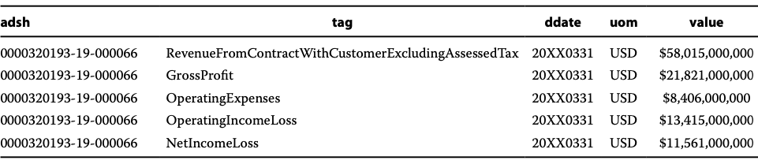

### Data Summarization
Raw data can be organized into two typ- ical formats for quantitative analysis: one-dimensional arrays and two-dimensional rectangular arrays.
1. one-dimensional array
2. two-dimensional rectangular array: also called a data table

## SECTION 4 SUMMARIZING DATA USING FREQUENCY DISTRIBUTIONS
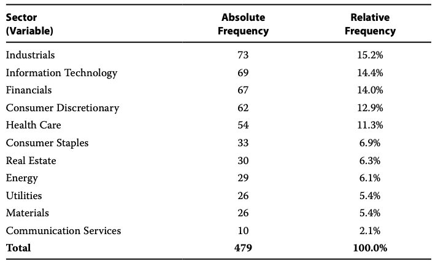
* absolute frequency: or simply the raw frequency, is the actual number of obser- vations counted for each unique value of the variable
* relative frequency (in the third column), which is calculated as the absolute frequency of each unique value of the variable divided by the total number of observations.

1. assume we have `−4.57, −4.04, −1.64, 0.28, 1.34, 2.35, 2.38, 4.28, 4.42, 4.68, 7.16, and 11.43` ascend
2. 11.43-(-4.57)=16
3. let's set k=4, then bin width is 16/4=4
4. 
5. bins are [-4.57 to -0.57), [-0.57, 3.43)...
6. 
When build frequency distribution with bin, we can start with a relatively small bin width, we can see whether or not the bins are mostly empty and whether or not the value of k associated with that bin width is too large. If the bins are mostly empty, implying that k is too large, we can consider increasingly larger bins (i.e., smaller values of k) until we have a frequency distribution that effectively summarizes the distribution.

We turn to these issues in discussing the construction of frequency distributions for daily returns of the fictitious Euro-Asia-Africa (EAA) Equity Index. The dataset of daily returns of the EAA Equity Index spans a five-year period and consists of 1,258 observations with a minimum value of −4.1% and a maximum value of 5.0%. Thus, the range of the data is 5% − (−4.1%) = 9.1%, approximately.\
Suppose that for ease of interpretation we want to use a bin width stated in whole rather than fractional percentages. In the case of the daily EAA Equity Index returns, a 1% bin width would be associated with 9.1/1 = 9.1 bins, which can be rounded up to k = 10 bins.

## SECTION 5 SUMMARIZING DATA USING A CONTINGENCY TABLE
We have shown that the frequency distribution table is a powerful tool to summarize data for one variable. Contingency table is used to summarize data for two variables simultaneously.\
`Contingency Table based on total count`:\
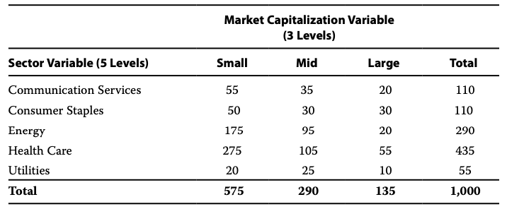\
There are 275 small-cap health care stocks, making it the portfolio's largest subgroup in terms of frequency. These data are also called `joint frequencies` because you are joining one variable from the row (i.e., sector) and the other variable from the column (i.e., market cap) to count observations. The joint frequencies are then added across rows and across columns, and these corresponding sums are called `marginal frequencies`. For example, the marginal frequency of health care stocks in the portfolio is the sum of the joint frequencies across all three levels of market cap, so 435 (= 275 + 105 + 55)\
`Contingency Table relative frequencies based on total count`\
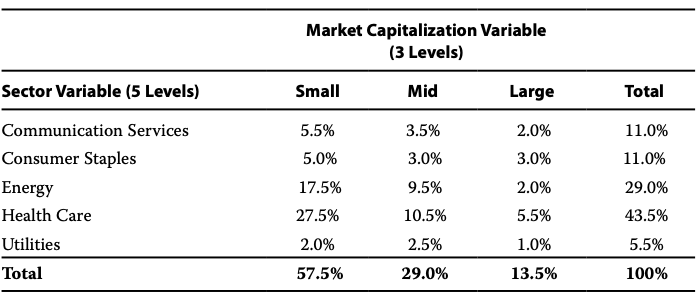\

`Contingency Table relative frequencies based on marginal frequencies of market cap`\
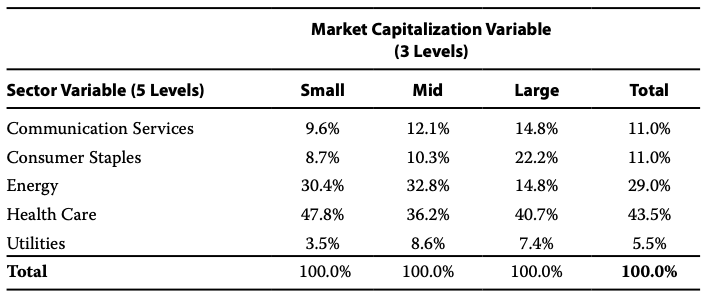\

Contingency tables can be used in different applications. One application is for evaluating the performance of a classification model (in this case, the contingency table is called a confusion matrix). Suppose we have a model for classifying companies into two groups: those that default on their bond payments and those that do not default. The confusion matrix for displaying the model's results will be a 2 × 2 table showing the frequency of actual defaults versus the model's predicted frequency of defaults. 
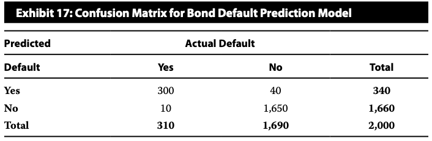

Another application of contingency tables is to investigate potential association between two categorical variables. One way to test for a potential association between categorical variables is to perform a chi-square test of independence. Essentially, the procedure involves using the marginal frequencies in the contingency table to construct a table with expected values of the observations. The actual values and expected values are used to derive the chi-square test statistic. This test statistic is then compared to a value from the chi-square distribution for a given level of significance. If the test statistic is greater than the chi-square distribution value, then there is evidence to reject the claim of independence, implying a significant association exists between the categorical variables.\
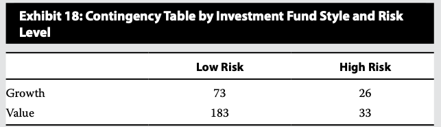\
Describe how the contingency table is used to set up a test for independence between fund style and risk level.\
首先假设独立然后根据P(AB)=P(A)*P(B)得到期望频数. \
Step1:\
Add the marginal frequencies and overall total to the contingency table. We have also included the relative frequency table for observed values.\
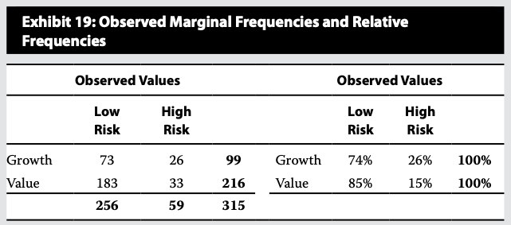\
Step2:\
Use the marginal frequencies in the contingency table to construct a table with expected values of the observations. \
$P(Low\ Risk)=256/315$\
$P(High\ Risk)=59/315$\
$P(Value)=216/315$\
$P(Growth)=99/315$

Expected value for Growth/Low Risk is: (99 * 256) / 315 = 80.46\
Expected value for Value/High Risk is: (216 * 59) / 315 = 40.46
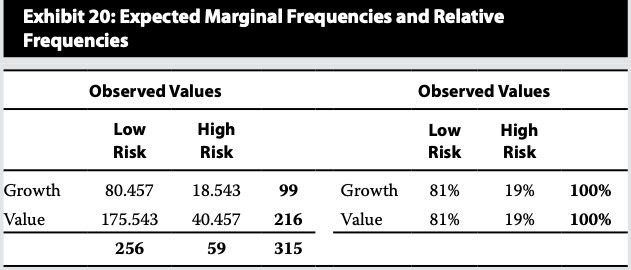

Step 3\
Use the actual values and the expected values of observation counts to derive the chi-square test statistic, which is then compared to a value from the chi-square distribution for a given level of significance. If the test statistic is greater than the chi-square distribution value, then there is evidence of a significant association between the categorical variables.

## SECTION 6 DATA VISUALIZATION
### Histogram, Polygon, Bar
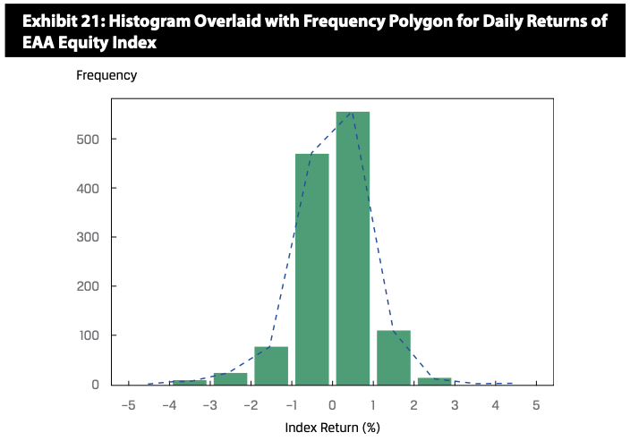histogram 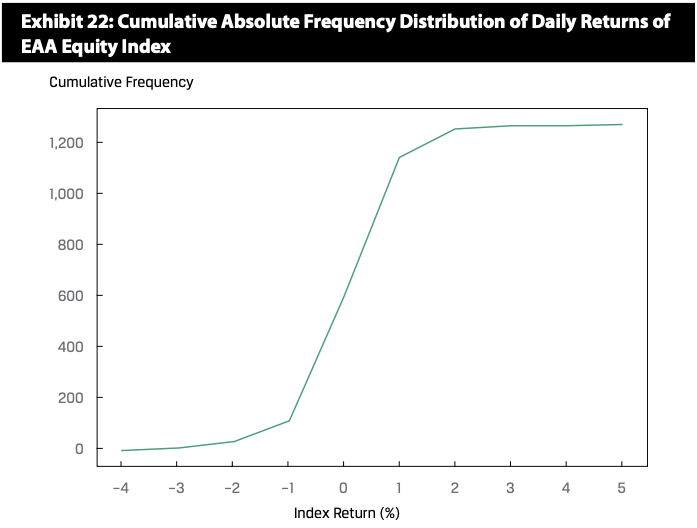polygon 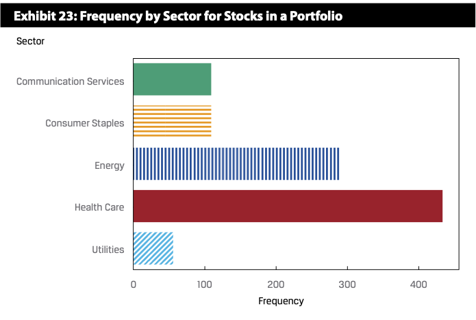bar 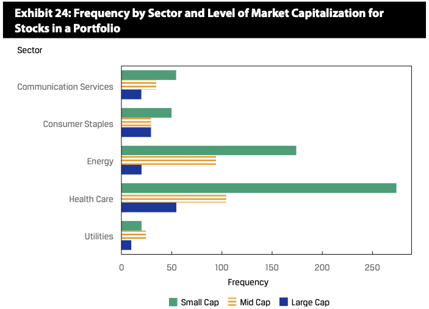grouped bar chart 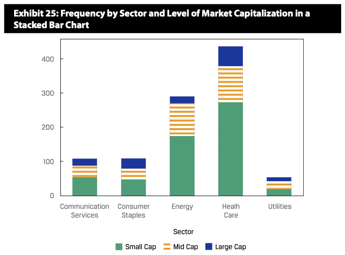stacked bar chart
### Tree map
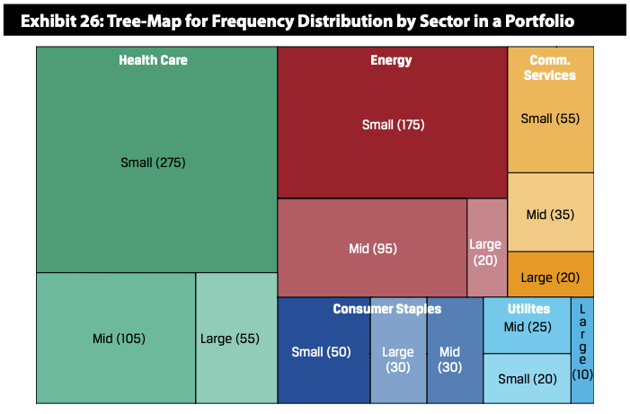Tree-maps become difficult to read if the hierarchy involves more than three levels.
### Word Cloud
A word cloud (also known as tag cloud) is a visual device for representing textual data. A word cloud consists of words extracted from a source of textual data, with the size of each distinct word being proportional to the frequency with which it appears in the given text.
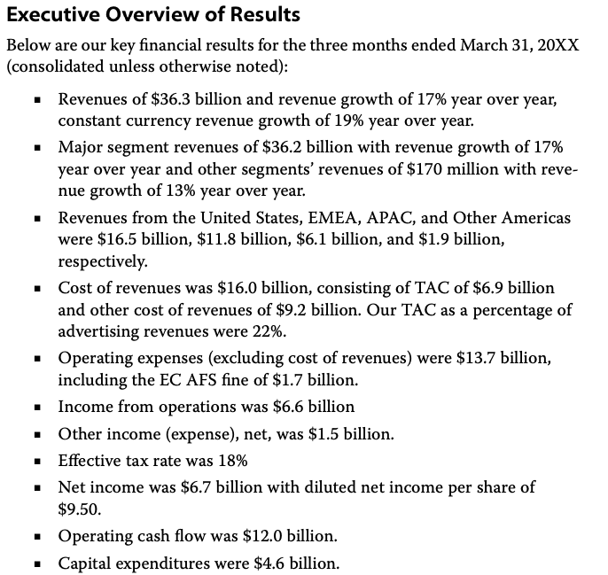 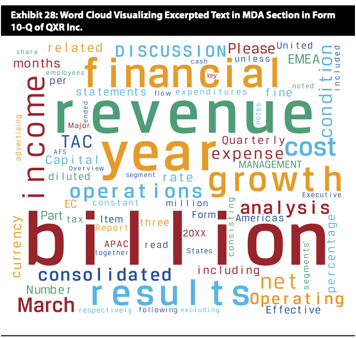
### Line chart
A line chart is used to display the change of data series over time.
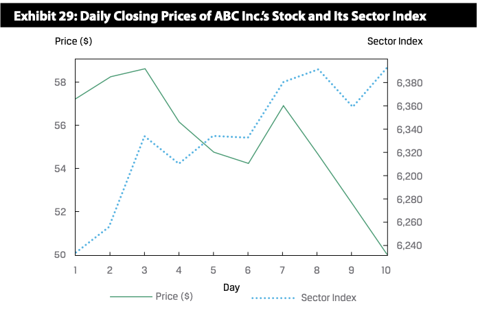
This comparison can help us understand whether ABC's stock price movement over the period is due to potential mispricing of its share issuance or instead due to industry-specific factors that also affect its competitors' stock prices. The comparison shows that over the period, the sector index moved in a nearly opposite trend versus ABC's stock price movement. This indicates that the steep decline in ABC's stock price is less likely attributable to sector-specific factors and more likely due to potential over-pricing of its IPO or to other company-specific factors.

How can we add an additional dimension to a two-dimensional line chart? We can replace the data points with varying-sized bubbles to represent a third dimension of the data. Moreover, these bubbles may even be color-coded to present additional information. This version of a line chart is called a bubble line chart.
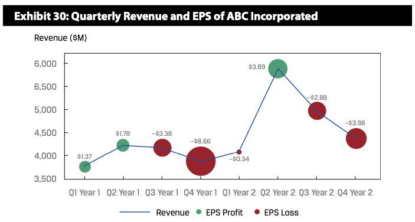
### Scatter Plot
It is a useful tool for displaying and understanding potential relationships between the variables.
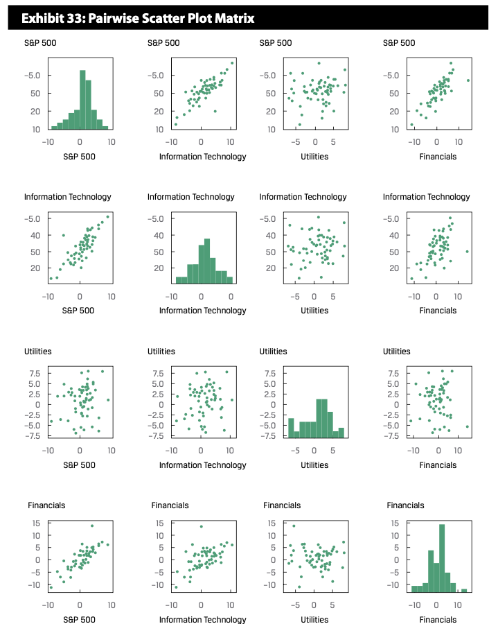
The scatter plot matrix contains each combination of bivariate scatter plot (i.e., S&P 500 vs. each sector, IT vs. utilities, IT vs. financials, and financials vs. utilities) as well as univariate frequency distribution histograms for each variable plotted along the diagonal. In this way, the scatter plot matrix provides a concise visual summary of each variable and of potential relationships among them. It is worth pointing out that the upper triangle of the matrix is the mirror image of the lower triangle, so the compact form of the scatter plot matrix that uses only the lower triangle is also appropriate.
### Guide to Selecting among Visualization Types
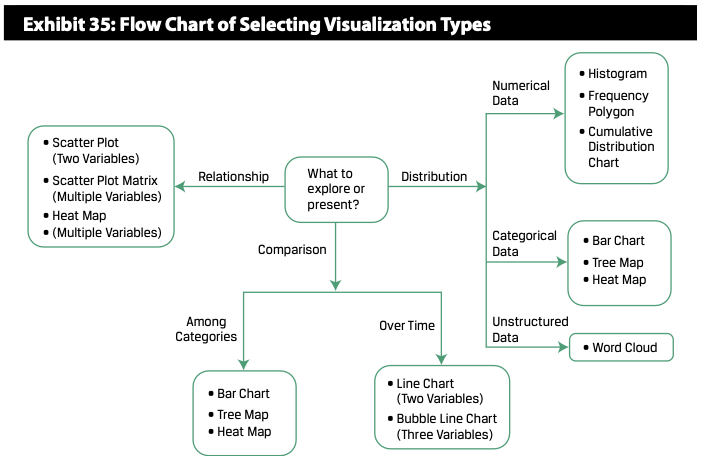

## SECTION 7 MEASURES OF CENTRAL TENDENCY
A statistic is a summary measure of a set of observations, and descriptive statis- tics summarize the central tendency and spread variation in the distribution of data. If the statistic summarizes the set of all possible observations of a population, we refer to the statistic as a parameter. If the statistic summarizes a set of observations that is a subset of the population, we refer to the statistic as a sample statistic, often leaving off the word "sample" and simply referring to it as a statistic.

### The Arithmetic Mean
It is the sum of the values of the observations divided by the number of observations. We can calculate the distance between the mean and each outcome, which is the deviation. Deviations from the arithmetic mean are important information because they indicate risk. The concept of deviations around the mean forms the foundation for the more complex concepts of variance, skewness, and kurtosis.

A property and potential drawback of the arithmetic mean is its sensitivity to extreme values, or outliers. Because all observations are used to compute the mean and are given equal weight (i.e., importance), the arithmetic mean can be pulled sharply upward or downward by extremely large or small observations, respectively.
\
For winsorized mean: a 95% winsorized mean sets the bottom 2.5% of values equal to the value at or below which 2.5% of all the values lie (as will be seen shortly, this is called the "2.5th percentile" value) and the top 2.5% of values equal to the value at or below which 97.5% of all the values lie (the "97.5th percentile" value)

### The Median
The median is the value of the middle item of a set of items that has been sorted into ascending or descending order.
* Odd: V[(n+1)/2] (人话: 中间的数)
* Even: V(n/2) + V(n/2+1) (人话: 中间俩数的平均值)
A potential advantage of the median is that, unlike the mean, extreme values do not affect it.\
缺点要排序

### The Mode
The mode is the most frequently occurring value in a distribution.

### The Weighted Mean
To illustrate the weighted mean concept, an investment manager with $100 million to invest might allocate $70 million to equities and $30 million to bonds. The portfolio, therefore, has a weight of 0.70 on stocks and 0.30 on bonds.\
$Weighted\ Mean=0.7*stocks+0.3*bonds$

### Geometric Mean
$Geometric\ Mean=\sqrt[n]{X_1*X_2*...*X_N}$\
Risky assets can have negative returns up to −100% (if their price falls to zero), so
we must take some care in defining the relevant variables to average in computing a geometric mean. We must recast the returns to make them positive. We do this by adding 1.0 to the returns expressed as decimals, where Rt represents the return in period t. The term (1 + $R_t$) represents the year-ending value relative to an initial unit of investment at the begin- ning of the year. As long as we use (1 + $R_t$), the observations will never be negative because the biggest negative return is −100%. The result is the geometric mean of 1 + $R_t$; by then subtracting 1.0 from this result, we obtain the geometric mean of the individual returns $R_t$.\
$1+R_G=\sqrt[T]{(1+R_1)*(1+R_2)*...*(1+R_T)}$\
Geometric Mean Return Formula. Given a time series of holding period returns Rt, t = 1, 2, ..., T, the geometric mean return over the time period spanned by the returns R1 through RT is:\
$1+R_G=[\prod_{t=1}^T(1+R_t)]^\frac{1}{T}$

<b>Geometric and Arithmetic Mean Returns</b>
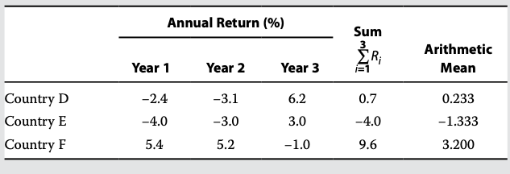
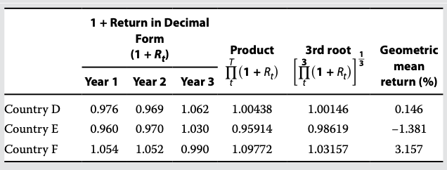\
The number may confuse you, but do not forget the measure unit is different.

The geometric mean is always less than or equal to the arithmetic mean. The only time that the two means will be equal is when there is no variability in the observations—that is, when all the observations in the series are the same.

The more disperse the observations, the greater the difference between the arithmetic and geometric means.

The geometric mean return represents the growth rate or compound rate of return on an investment. With its focus on the profitability of an investment over a `multi-period` horizon, the geometric mean is of key interest to investors. The arithmetic mean return, focusing on average `single-period` performance, is also of interest.

Suppose we purchased a stock for €100 and two years later it was worth €100, with an intervening year at €200. 
1. The geometric mean of 0% is clearly the compound rate of growth during the two years, which we can confirm by compounding the returns: ${[(1 + 1.00)(1 − 0.50)]}^{1/2}$ − 1 = 0%.
2. The arithmetic mean, which is [100% + −50%]/2 = 25%, can distort our assessment of historical performance.

If we want to estimate the average return over a one-period horizon, we should use the arithmetic mean because the arithmetic mean is the average of one-period returns. If we want to estimate the average returns over more than one period, however, we should use the geometric mean of returns because the geometric mean captures how the total returns are linked over time. In a forward-looking context, a financial analyst calculating expected risk premiums may find that the weighted mean is appropriate, with the probabilities of the possible outcomes used as the weights.

### The Harmonic Mean
$\overline{X}_H = \frac{n}{\sum_{i=1}^n(1/X_i)}$ With $X_i>0$ for i=1,2,...,n \
The harmonic mean is appropriate in cases in which the variable is a rate or a ratio.

The harmonic mean is the value obtained by summing the reciprocals of the observations—terms of the form 1/Xi—then averaging that sum by dividing it by the number of observations n, and, finally, taking the reciprocal of the average.(有点绕 读完 能懂)

The harmonic mean may be viewed as a special type of weighted mean in which an observation's weight is inversely proportional to its magnitude. For example, if there is a sample of observations of 1, 2, 3, 4, 5, 6, and 1,000, the harmonic mean is 2.8560. Compared to the arithmetic mean of 145.8571, we see the influence of the outlier (the 1,000) to be much less than in the case of the arithmetic mean. So, the harmonic mean is quite useful as a measure of central tendency in the presence of outliers.

The harmonic mean is used most often when the data consist of rates and ratios, such as P/Es. Suppose three peer companies have P/Es of 45, 15, and 15. The arithmetic mean is 25, but the harmonic mean, which gives less weight to the P/E of 45, is 19.3.

The harmonic mean is a relatively specialized concept of the mean that is appropriate for averaging ratios ("amount per unit") when the ratios are repeatedly applied to a fixed quantity to yield a variable number of units.

Averaging ratios? Take a look at this example:\
Suppose you are driving from point A to point B at two different speeds: 40 km/h and 60 km/h. The distance between A and B is 120 kilometers.\
So what is the average speed?\
It is (120+120)/(120/40+120/60)=48\
Divide 120 on upper and lower side, it will become:\
2/(1/40+1/60)=48\
You will find out it is equivalent to harmonic mean. Now you have better understanding about why it is appropriate for averaging ratios. In essence, it value is sum_distance/sum_time.

Arithmetic mean × Harmonic mean = Geometric mean\
we will not go into the proof of this relationship, the basic result follows. However, the key question is: Which mean to use in what circumstances?
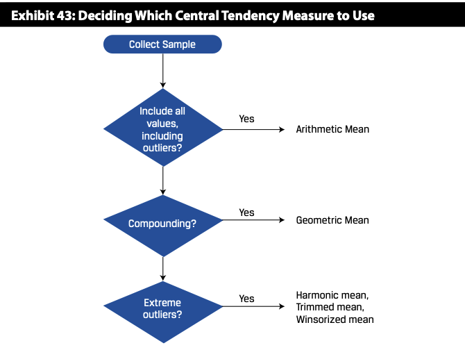

## SECTION 8 QUANTILES
### Quartiles, Quintiles, Deciles, and Percentiles
We know that the median divides a distribution of data in half. We can define other dividing lines that split the distribution into smaller sizes. Quartiles divide the dis- tribution into quarters, quintiles into fifths, deciles into tenths, and percentiles into hundredths. Given a set of observations, the yth percentile is the value at or below which y% of observations lie. \
First quartile (Q1) is also the 25th percentile.\
The interquartile range (IQR) is the difference between the third quartile and the first quartile, or IQR = Q3 − Q1.

Let $P_y$ be the value at or below which y% of the distribution lies, or the yth percentile. The formula for the position (or location) of a percentile in an array with n entries sorted in ascending order is:\
$L_y = (n+1)\frac{y}{100}$\
where $y$ is the percentage point at which we are dividing the distribution, and $L_y$ is the location(L) of the percentile($P_y$) in the array sorted in ascending order. In general, as the sample size increases, the percentile location calculation becomes more accurate; in small samples it may be quite approximate.
1. $L_y$ is a whole number, good
2. $L_y$ is not a integer,