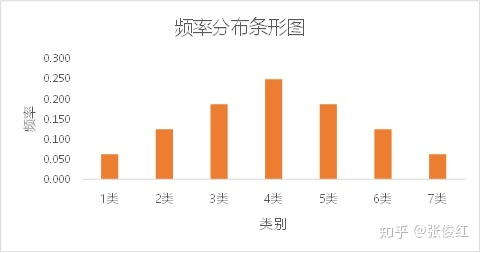
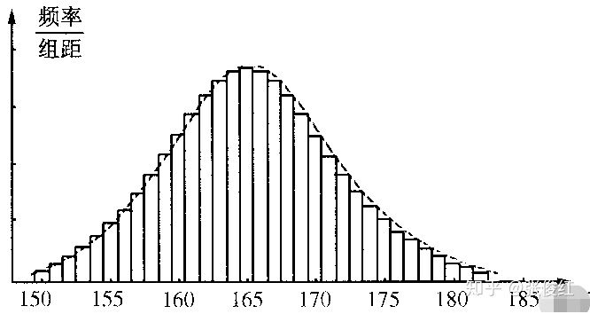
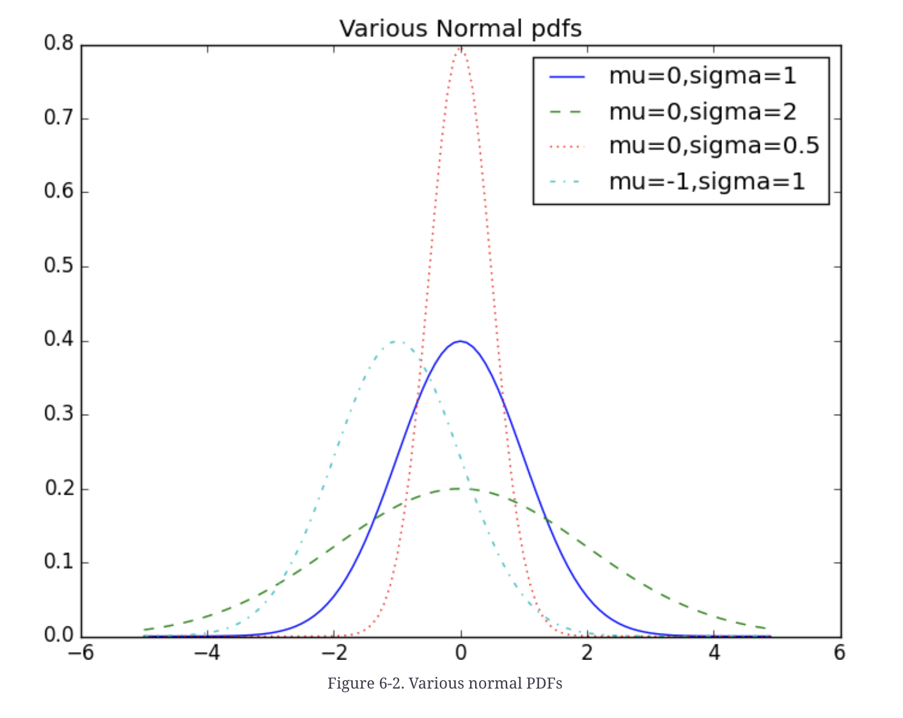

# PMF, PDF and CDF
PMF: probability mass function 
PDF: probability density function 
CDF: cumulative distribution function 

 
当试验次数足够多时，我们可以用频率来代替概率，也就是可以把频率分布条形图中的纵轴当作每个类别出现的概率值。此时的频率分布条形图就可以当作是 `PMF` 图。

 
在频率分布直方图中横轴表示众多个连续变量离散化以后的区间，这个区间的大小称为组距，纵轴表示频率/组距 
上图中每个长方形的面积就是该区间的频率，即概率。

当长方形的宽度无限小，即组距无限小的时候，频率分布直方图就无限接近于下方这样的光滑曲线，我们把这条曲线叫做概率密度曲线，即 `PDF`

累计分布函数 `CDF` 就是从上图中的概率密度曲线的最左边开始，然后逐渐往右求取曲线下方的面积，即概率

# Normal Distribution

f(x|$\alpha$,$\sigma$) = $\frac{1}{\sqrt{2\pi}\sigma} \exp(-\frac{(x-\mu)^2}{2\sigma^2})$

$\mu$ determines center point, $\sigma$ determines height

# Central Limit Theorem
中心极限定理指的是给定一个任意分布的总体。我每次从这些总体中随机抽取 n 个抽样，一共抽 m 次。 然后把这 m 组抽样分别求出平均值。 这些平均值的分布接近正态分布

现在我们要统计全国的人的体重，看看我国平均体重是多少。当然，我们把全国所有人的体重都调查一遍是不现实的。所以我们打算一共调查1000组，每组50个人。 然后，我们求出第一组的体重平均值、第二组的体重平均值，一直到最后一组的体重平均值。中心极限定理说：这些平均值是呈现正态分布的。并且，随着组数的增加，效果会越好。 最后，当我们再把1000组算出来的平均值加起来取个平均值，这个平均值会接近全国平均体重

# Statistical Hypothesis Testing
假设检验重要的依据是人们的一条普遍经验，即小概率事件在一次实验中很难发生，如果一旦发生，就认为原来的假设不成立，从而拒绝H0。

检测科学实验中的实验组与对照组之间是否存在差异以及差异是否显著的办法

一般而言，把要检验的假设称之为原假设，记为H0，把与H0相对应的假设称之为备择假设，记为H1

如果原假设为真，而检验的结论却劝你放弃原假设，此时，我们把这种错误称之为第一类错误。通常把第一类错误出现的概率记为$\alpha$

如果原假设不为真，而检验的结论却劝你接受原假设。此时，我们把这种错误称之为第二类错误，通常第二类错误出现的概率记为$\beta$。

通常只限定犯第一类错误的最大概率α， 不考虑犯第二类错误的概率β。我们把这样的假设检验称为显著性检验，概率α称为显著性水平。显著性水平是数学界约定俗成的，一般有α =0.05,0.025.0.01这三种情况。代表着显著性检验的结论错误率必须低于5%或2.5%或1%（统计学中，通常把在现实世界中发生几率小于5%的事件称之为“不可能事件”）

当我们认为H0是对的, 在样本当中计算之后得到, P如果P小于$\alpha$, 则有理由拒绝H0. 

置信区间 confidence interval = 1-$\alpha$
