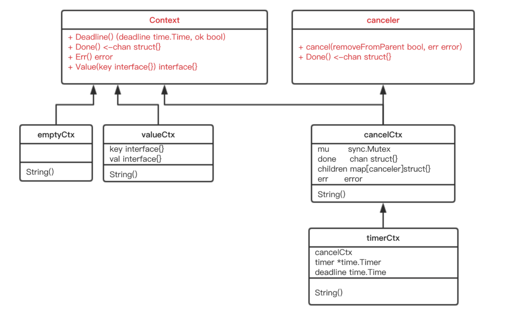
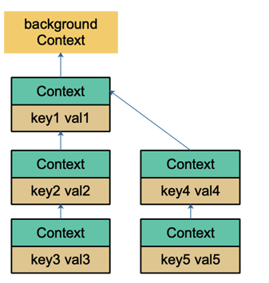

用简练一些的话来说，在Go 里，我们不能直接杀死协程，协程的关闭一般会用 channel+select 方式来控制。但是在某些场景下，例如处理一个请求衍生了很多协程，这些协程之间是相互关联的：需要共享一些全局变量、有共同的 deadline 等，而且可以同时被关闭。再用 channel+select 就会比较麻烦，这时就可以通过 context 来实现。


一句话：context 用来解决 goroutine 之间退出通知、元数据传递的功能。


## Interface
```go
type Context interface{
    // 返回 context 是否会被取消以及自动取消时间（即 deadline）
    Deadline()(deadline time.Time, ok bool)
    // 当 context 被取消或者到了 deadline，返回一个被关闭的 channel
    Done() <-chan struct{}
    // 在 channel Done 关闭后，返回 context 取消原因
    Err() error
    // 获取 key 对应的 value
    Value(key any) any
} 
```
Done() 返回一个 channel，可以表示 context 被取消的信号：当这个 channel 被关闭时，说明 context 被取消了。注意，这是一个只读的channel。 我们又知道，读一个关闭的 channel 会读出相应类型的零值。并且源码里没有地方会向这个 channel 里面塞入值。换句话说，这是一个 receive-only 的 channel。因此在子协程里读这个 channel，除非被关闭，否则读不出来任何东西。也正是利用了这一点，子协程从 channel 里读出了值（零值）后，就可以做一些收尾工作，尽快退出。

Deadline() 返回 context 的截止时间，通过此时间，函数就可以决定是否进行接下来的操作，如果时间太短，就可以不往下做了，否则浪费系统资源。当然，也可以用这个 deadline 来设置一个 I/O 操作的超时时间

```go
type canceler interface{
    cancel(removeFromParent bool,err error)
    Done() <-chan struct{}
}
```
实现了上面定义的两个方法的 Context，就表明该 Context 是可取消的。源码中有两个类型实现了 canceler 接口：*cancelCtx 和 *timerCtx。注意是加了 * 号的，是这两个结构体的指针实现了 canceler 接口。

## Struct
### emtpyCtx
```go
type emptyCtx int
//直接使用return关键字。函数会将已声明的返回值进行默认初始化，并直接返回这些默认值。
func (*emptyCtx) Deadline() (deadline time.Time, ok bool) {
	return
}
//In Go, a bare return statement inside a function with a return type is only valid if the function has named return values, which is not the case here.
func (*emptyCtx) Done() <-chan struct{} {
	return nil
}

func (*emptyCtx) Err() error {
	return nil
}

func (*emptyCtx) Value(key interface{}) interface{} {
	return nil
}
```
这实际上是一个空的context如同字面意思 永远不会被cancel 没有存储值 也没有deadline

make: slices, maps, and channels
```go
make(T, size)
slice := make([]int, 5)          // Creates a slice of type []int with length 5
m := make(map[string]int)       // Creates an empty map of type map[string]int
ch := make(chan string, 10)     // Creates a buffered channel of type chan string with capacity 10
```
new: allocate memory for a value of a specified type and returns a pointer to that memory
```go
new(T)
ptr := new(int)                 // Allocates memory for an int and returns a pointer to it
```

这个空的context被包装成如下样式:
```go
var (
    background = new(emptyCtx)
    todo       = new(emptyCtx)
)
func Background() Context {
    return background
}
func TODO() Context{
    return todo
}
```
background 通常用在 main 函数中，作为所有 context 的根节点。

todo 通常用在并不知道传递什么 context的情形。例如，调用一个需要传递 context 参数的函数，你手头并没有其他 context 可以传递，这时就可以传递 todo。这常常发生在重构进行中，给一些函数添加了一个 Context 参数，但不知道要传什么就用 todo 占个位子

### cancelCtx
```go
type cancelCtx struct{
    Context
    mu sync.Mutex
    done chan struct{}
    children map[canceler]struct{}
    err error
}

func (c *cancelCtx) Done() <-chan struct{}{
    c.mu.Lock()
    if c.done == nil{
        c.done = make(chan struct{})
    }
    d := c.done
    c.mu.Unlock()
    return d
}
```
c.done 是"懒汉式"创建，只有调用了 Done() 方法的时候才会被创建。再次说明，函数返回的是一个只读的 channel，而且没有地方向这个 channel 里面写数据。所以，直接调用读这个 channel，协程会被 block 住。一般通过搭配 select 来使用。一旦关闭，就会立即读出零值。
```go
func (c *cancelCtx) cancel(removeFromParent bool, err, cause error){
    if err == nil{
        panic("context: internal error: missing cancel error")
    }
    if cause == nil{
        cause = err
    }
    c.mu.Lock()
    // already canceled by other goroutine
    if c.err !=nil{
        c.mu.Unlock()
        return
    }
    c.err = err
	c.cause = cause
	d, _ := c.done.Load().(chan struct{})
	// close channel, notify other goroutines
    if d == nil {
		c.done.Store(closedchan)
	} else {
		close(d)
	}
    // iterate all the children nodes
	for child := range c.children {
		// NOTE: acquiring the child's lock while holding parent's lock.
		child.cancel(false, err, cause)
	}
    // null its direct child
	c.children = nil
	c.mu.Unlock()

	if removeFromParent {
        // remove itself from its parent
		removeChild(c.Context, c)
	}
}
```
总体来看, `cancel()`方法的功能就是关闭 channel: c.done; 递归的取消他的所有子节点; 从父节点删除自己. 达到的效果就是通过关闭channel, 将取消信号传递给所有子节点. goroutine 接收到取消信号的方式就是select语句中的 `c.done` 被选中\

看一下创建一个可取消的Context方法
```go
// type CancelFunc func()
func WithCancel(parent Context) (ctx Context, cancel CancelFunc){
    c := newCancelCtx(parent)
    propagateCancel(parent, &c)
    return &c, func(){ c.cancel(true, Canceled, nil)}
}
func newCancelCtx(parent Context) cancelCtx{
    return cancelCtx{Context: parent}
}
```
这是一个暴露给用户的方法, 传入一个 parent Context(通常是一个 background), 返回新建的  context, 新context的 done channel 是新建的\
当WithCancel函数返回的CancelFunc 被调用 或者父节点的 done channel 被关闭(父节点的 CancelFunc 被调用), 此 context的 done channel 也会被关闭\
注意 WithCancel内部返回的函数参数, 前者 true, 表示取消的时候需要将自己从父节点里删除,第二个参数则是一个固定的取消错误类型:
```go
var Canceled = errors.New("context canceled")
```
注意一点, 调用子节点cancel方法的时候, 传入的第一个参数 removeFromParent 是false\
```go
for child := range c.children {
		// NOTE: acquiring the child's lock while holding parent's lock.
		child.cancel(false, err, cause)
	}
```
当removeFromParent为true, 
```go
if removeFromParent {
        // remove itself from its parent
		removeChild(c.Context, c)
	}

func removeChild(parent Context, child canceler){
    p, ok := parentCancelCtx(parent)
    if !ok {
        return
    }
    p.mu.Lock()
    if p.children != nil{
        delete(p.children, child)
    }
    p.mu.Unlock()
}
```
调用 WithCancel()的时候, 也就是创建一个新的可取消的context节点时, 返回的cancelFunc()会传入true. 结果就是当调用返回的cancelFunc时, 会将自己从父节点除名.\
在 cancel函数内部, 所有的子节点都会因为 c.children=nil 被消灭(垃圾回收). 另外就是 child.cancel 传入 true 的话就会造成 一边遍历一边删除一个map的情况 会出问题
```go
// propagateCancel arranges for child to be canceled when parent is.
func propagateCancel(parent Context, child canceler) {
	done := parent.Done()
    // parent is empty node
	if done == nil {
		return // parent is never canceled
	}

	select {
	case <-done:
		// parent is already canceled
		child.cancel(false, parent.Err(), Cause(parent))
		return
	default:
	}
    // find calcelable parent
    // parentCancelCtx returns the underlying *cancelCtx for parent
	if p, ok := parentCancelCtx(parent); ok {
		p.mu.Lock()
		if p.err != nil {
			// if parent is already canceled, 本节点(or 子节点)
			child.cancel(false, p.err, p.cause)
		} else {
            // 父节点还在
			if p.children == nil {
				p.children = make(map[canceler]struct{})
			}
            // 挂到父节点
			p.children[child] = struct{}{}
		}
		p.mu.Unlock()
	} else {
        // 如果没有找到可取消的 父 context 新启动一个协程 监控父节点和子节点取消信号
		goroutines.Add(1)
		go func() {
			select {
			case <-parent.Done():
				child.cancel(false, parent.Err(), Cause(parent))
			case <-child.Done():
			}
		}()
	}
}
```
这个方法的作用就是向上寻找可以"挂靠"的"可取消"的 context，并且"挂靠"上去。这样，调用上层 cancel 方法的时候，就可以层层传递，将那些挂靠的子 context 同时"取消"。\
这里着重解释下为什么会有 else 描述的情况发生。else 是指当前节点 context 没有向上找到可以取消的父节点，那么就要再启动一个协程监控父节点或者子节点的取消动作。

这里就有疑问了，既然没找到可以取消的父节点，那 case <-parent.Done() 这个 case 就永远不会发生，所以可以忽略这个 case；而 case <-child.Done() 这个 case 又啥事不干。那这个 else 不就多余了吗？(文章给的解释和没解释一样)

### timerCtx
timerCtx基于cancelCtx, 多了一个timer.Timer 和 deadline. Timer会在deadline到来时, 自动取消context
```go
type timerCtx struct{
    cancelCtx
    timer *time.Timer // under cancelCtx.mu
    deadline time.Time
}
```
timerCtx 首先是一个cancelCtx,所以他能取消
```go
func (c *timerCtx) cancel(removeFromParent bool, err error){
    // 直接调用 cancelCtx方法
    c.cancelCtx.cancel(false, err, cause)
    if removeFromParent{
        // 从父节点中删除子节点
        removeChild(c.cancelCtx.Context, c)
    }
    c.mu.Lock()
    if c.timer !=nil{
        c.timer.Stop()
        c.timer = nil
    }
    c.mu.Unlock()
}
```
创建 timerCtx的方法
```go
func WithTimeout(parent Context, timeout time.Duration) (Context, CancelFunc) {
    return WithDeadline(parent, time.Now().Add(timeout))
}
```
WithTimeout直接调用了WithDeadline, WithDeadline需要用的是绝对时间
```go
func WithDeadline(parent Context, d time.Time) (Context, CancelFunc) {
    if parent == nil{
        panic("cannot create context from nil parent")
    }
    if cur, ok := parent.Deadline(); ok && cur.Before(d){
        // 如果父节点 context 的 deadline 早于指定时间 直接构建一个
        // 可取消的 context 原因是一旦父节点超时, 自动调用cancel函数
        // 子节点也会随之消失 所以不用在另行单独处理子节点的计时器到时之后的操作
        return WithCancel(parent)
    }
    // 构建 timerCtx
    c := &timerCtx{
        cancelCtx: newCancelCtx(parent),
        deadline: d,
    }
    // 挂靠到父节点
    propagateCancel(parent, c)
    // 计算当前 离 deadline 还有多久
    dur := time.Until(d)
    if dur <= 0{
        // 直接取消
        c.cancel(true, DeadlineExceeded, nil)
        return c, func(){ c.cancel(false, Canceled, nil) }
    }
    c.mu.Lock()
    defer c.mu.Unlock()
    if c.err == nil {
        // d 时间后, timer会自动调用 cancel 函数 自动取消
        c.timer = time.AfterFunc(dur, func(){
            c.cancel(true, DeadlineExceeded, nil)
        })
    }
    return c, func() { c.cancel(true, Canceled, nil) }
}
```
仍然要把子节点挂到父节点, 一旦父节点没了, 会把取消信号向下传递到子节点, 然后子节点随之取消.\
这个函数的核心是 
```go
c.timer = time.AfterFunc(dur, func(){
    c.cancel(true, DeadlineExceeded, nil)
})
```
c.timer会在 d 时间间隔后, 自动调用cancel函数 并且传入 DeadlineExceeded
```go
var DeadlineExceeded error = deadlineExceededError{}
type deadlineExceededError struct{}
func (deadlineExceededError) Error() string { return "context deadline exceeded" }
```

### valueCtx
```go
type valueCtx struct{
    Context
    key, val interface{}
}

func (c *valueCtx) String() string{
    // contextName(c.Context) 返回的确实是父节点 信息
    return contextName(c.Context) + ".WithValue(type "+
    reflectlite.TypeOf(c.key).String()+", val " + stringify(c.val)+")"
}

func (c *valueCtx) Value(key interface{}) interface{} {
    if c.key == key{
        c.val
    }
    return c.Context.Value(key)
}
```
由于它直接将 Context作为匿名字段, 因此 尽管它只实现了2个方法, 其他方法继承自 父 context. 所以他仍然是一个Context 我们说 valueCtx satisfy interface Context. 注意 这里一定要是匿名字段 When a struct has an anonymous field, the methods of that field are promoted to the outer struct, allowing the outer struct to satisfy any interfaces implemented by the anonymous field. This means that you can directly invoke the methods of the anonymous field on the outer struct, and the outer struct can be used wherever the interfaces implemented by the anonymous field are expected.

``` go 
func WithValue(parent Context, key ,val interface{}) Context{
    if key == nil{
        panic("nil key")
    }
    if !reflect.TypeOf(key).Comparable(){
        panic("key is not comparable")
    }
    return &valueCtx{parent, key, val}
}
```
这里要求的是 key 是可比较的, python中字典的key要求hashable, hashable必须满足两个条件
1. 对象的哈希值在对象的生命周期中保持不变
2. 如果两个对象相等(根据 __eq__()判断) 他们的哈希值必须相等
所以都需要可比较

和链表有点像，只是它的方向相反：Context 指向它的父节点，链表则指向下一个节点。通过 WithValue 函数，可以创建层层的 valueCtx，存储 goroutine 间可以共享的变量。

取值的过程，实际上是一个递归查找的过程. 它会顺着链路一直往上找，比较当前节点的 key
是否是要找的 key，如果是，则直接返回 value。否则，一直顺着 context 往前，最终找到根节点（一般是 emptyCtx），直接返回一个 nil。所以用 Value 方法的时候要判断结果是否为 nil。

因为查找方向是往上走的，所以，父节点没法获取子节点存储的值，子节点却可以获取父节点的值

WithValue 创建 context 节点的过程实际上就是创建链表节点的过程。两个节点的 key 值是可以相等的，但它们是两个不同的 context 节点。查找的时候，会向上查找到最后一个挂载的 context 节点，也就是离得比较近的一个父节点 context。所以，整体上而言，用 WithValue 构造的其实是一个低效率的链表。

如果你接手过项目，肯定经历过这样的窘境：在一个处理过程中，有若干子函数、子协程。各种不同的地方会向 context 里塞入各种不同的 k-v 对，最后在某个地方使用。

你根本就不知道什么时候什么地方传了什么值？这些值会不会被覆盖（底层是两个不同的 context 节点，查找的时候，只会返回一个结果）？你肯定会崩溃的。

而这也是 context.Value 最受争议的地方。很多人建议尽量不要通过 context 传值。

## How to use context
```go
var (
	background = new(emptyCtx)
	todo       = new(emptyCtx)
)
func Background() Context {
	return background
}
func WithCancel(parent Context) (ctx Context, cancel CancelFunc)
func WithDeadline(parent Context, deadline time.Time) (Context, CancelFunc)
func WithTimeout(parent Context, timeout time.Duration) (Context, CancelFunc)
func WithValue(parent Context, key, val interface{}) Context
```
context 的使用非常方便, 但是也容易滥用,官方博客对于使用context提出了一些建议:
1. Do not store Contexts inside a struct type, instead pass a Context explicitly to each function needs it. The Context should be the first parameter, typically named ctx.
2. Do not pass a nil Context, even if a function permits it. Pass context.TODO if you are unsure about which Context to use.
3. Use context Values only for request-scoped (session, cookie etc)data that transits processes and APIs, not for passing optional parameters to functions.
4. The same Context may be passed to functions running in different goroutine; Context are safe for simultaneous use by multiple goroutines.
## 传递共享数据
对于Web端开发, 往往希望将一个请求处理的整个过程串起来, 这就非常依赖于 context

context 包到底解决了什么问题呢？答案是：cancelation