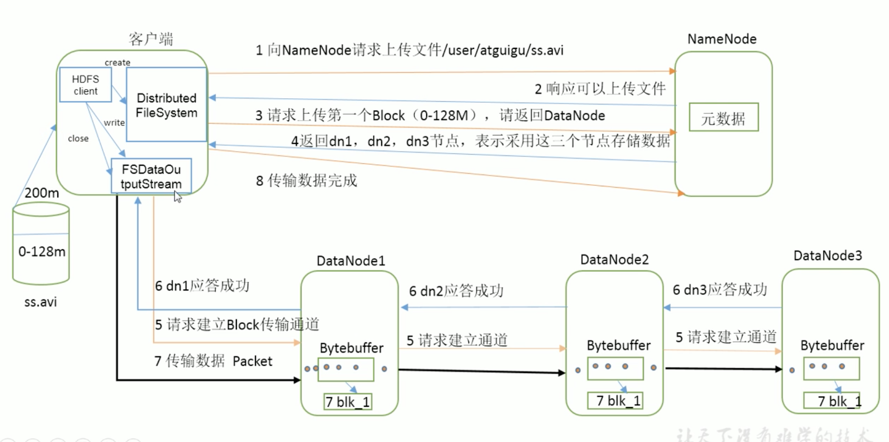
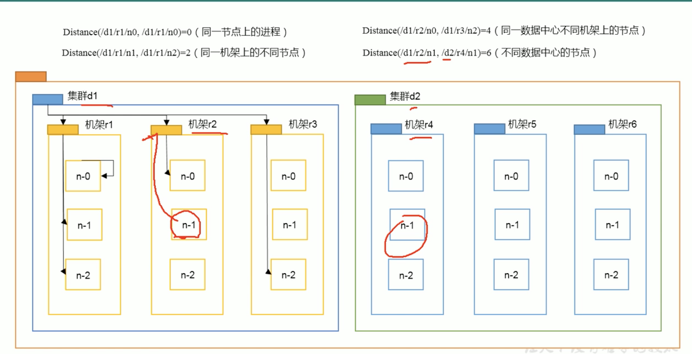
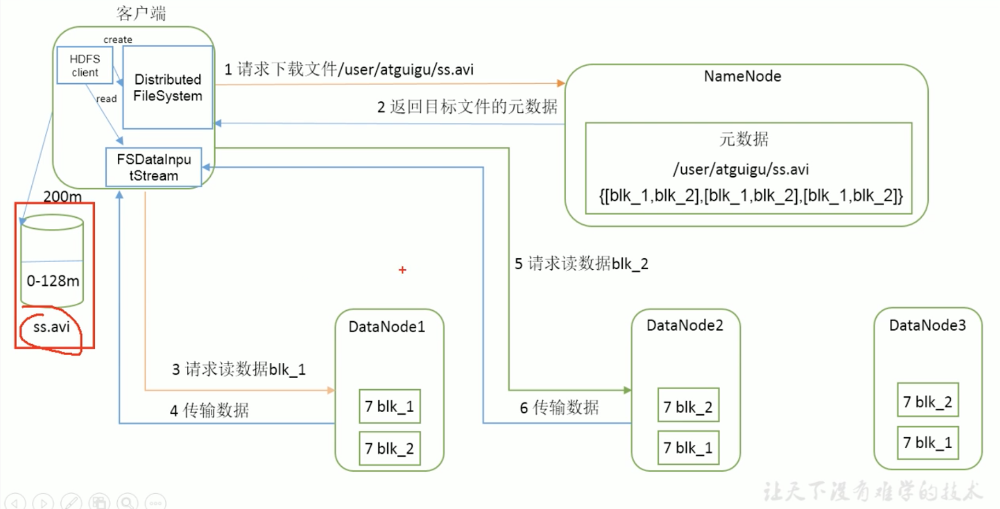

# 写数据流程

如果第一步 namenode 发现文件已存在会报错
第四步的 dn1 dn2 dn3 是根据节点距离和负载均衡得到的

机架 = rack
副本如何放？ 默认3个副本则
第一个副本放在 client 所处的节点上 如果客户端在 cluster 外 随机选一个
第二个和第一个位于相同 rack 随机 node
第三个位于不同 rack 随机 node

# 读数据流程

从哪个 node 读也是根据 距离决定 如果 block1 和 block2 都在一个 node 上 则一次性读完
假设这时候 node1 上的 block2 坏了 去 node2读，那么 读完 block1 时候会把 input stream 关闭 再到 node2 上读取
