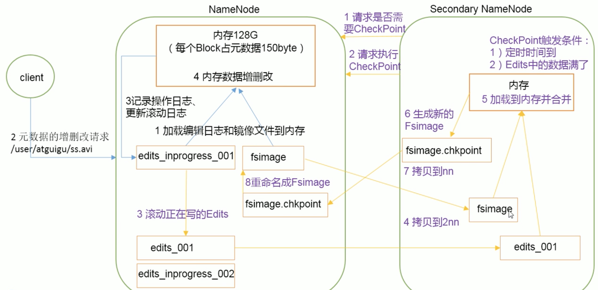

Namenode 中的元数据 保存在磁盘中的 FsImage 上。当内存元数据发生变化 对 Edits 文件进行追加操作(Edits文件只进行追加操作，效率高)。 所以 Namenode 上的元数据 等于 FsImage 和 Edits 的合并。\
长时间添加数据到 Edits 中会导致文件数据过大效率降低。 一旦断电恢复元数据需要时间过长。此时引入 SecondaryNamenode 专门用于 FsImage 和 Edits 的合并。



黑色 第三第四步有一点要注意的是 先更新日志后写入内存 这样即使断电危害不大

紫色第三步 edits_001 是被停止的需要和 fsimage 合并的文件，此时新写入的元数据在 edits_inprogress_002中

oiv apply the offline fsimage viewer to an fsimage
oev apply the offline edits viewer to an edits file
```bash
hdfs oiv -p XML -i fsimage_000000000015 -o fsiamge.xml
hdfs oev -p XML -i edits_0000000015 -o edits.xml
```

dataNode 是 cluster 启动后动态上报信息给 namenode

namenode 是根据 seen_txid 来确定用哪个 edits

# namenode故障
两种方法
## SecondaryNameNode 中数据拷贝到Namenode存储数据的目录：
1. kill -9 NameNode 进程
2. 删除 NameNode 存储的数据 (/opt/module/hadoop-2.7.2/data/tmp/dfs/name)
    rm -rf /opt/module/hadoop-2.7.2/data/tmp/dfs/name/*
3. 拷贝 SecondaryNameNode 中的数据到 原 NameNode 存储数据目录
    scp -r hostname:/opt/module/hadoop-2.7.2/data/tmp/dfs/namesecondary/* ./name/
4. 重启 NameNode
    sbin/hadoop-daemon.sh start namenode

## 使用 -importCheckpoint 选项 启动 NameNode 守护进程，从而将SecondaryNamenode 中数据拷贝到 NameNode目录中
1. 修改 hdfs-site.xml 中的
    ```xml
    <property>
        <name>dfs.namenode.checkpoint.period</name>
        <value>120</value> # 原来是3600 改成120是为了练习 不然时间太久了
    </property>
    <property>
        <name>dfs.namenode.name.dir</name>
        <value>/opt/module/hadoop-2.7.2/data/tmp/dfs/name</value>
    </property>
    ```

2. kill -9 NameNode 进程
3. 删除 NameNode 存储的数据 (/opt/module/hadoop-2.7.2/data/tmp/dfs/name)
    rm -rf /opt/module/hadoop-2.7.2/data/tmp/dfs/name/*
4. 如果 SecondaryNameNode 不和 NameNode 在一个主机节点 则需要将 SecondaryNameNode存储到数据的目录拷贝到 NameNode 存储数据的评级目录 并删除 in_use.lock 文件
    ```bash
    scp -r hostname:/opt/module/hadoop-2.7.2/data/tmp/dfs/namesecondary ./
    rm -rf in_use.lock # in_use.lock 在 SecondaryNameNode下
    ```
5. 导入 checkpoint
    ```bash
    bin/hdfs namenode -importCheckpoint
    ```
6. 启动NameNode
    ```bash
    sbin/hadoop-daemon.sh start namenode
    ```