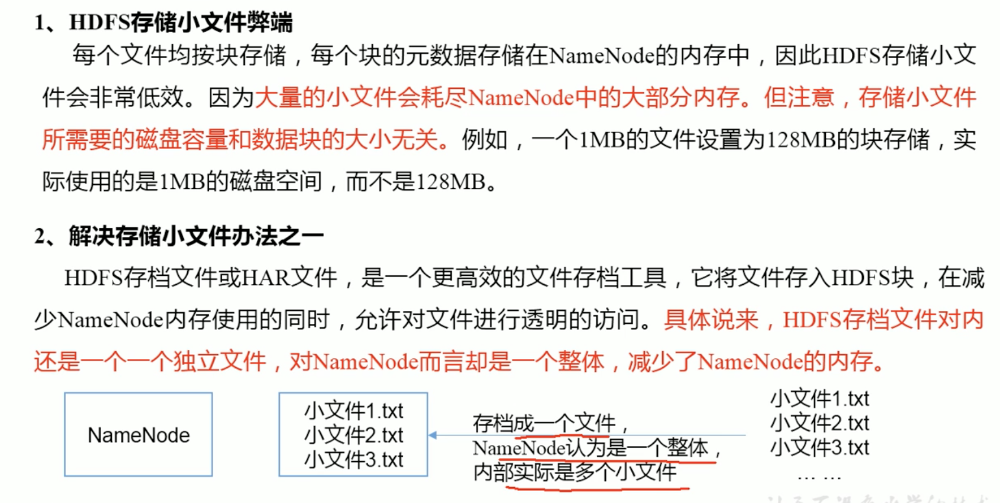
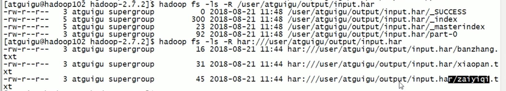

1. distcp 集群间拷贝
2. 小文件归档

    1. 启动 YARN
        start-yarn.sh
    2. 归档文件
        bin/hadoop archive -archivename input.har -p /user/username/input /user/username/output
    3. 查看归档
        hadoop fs -ls -R har:///user/username/output/input.har

3. 快照管理
4. 回收站