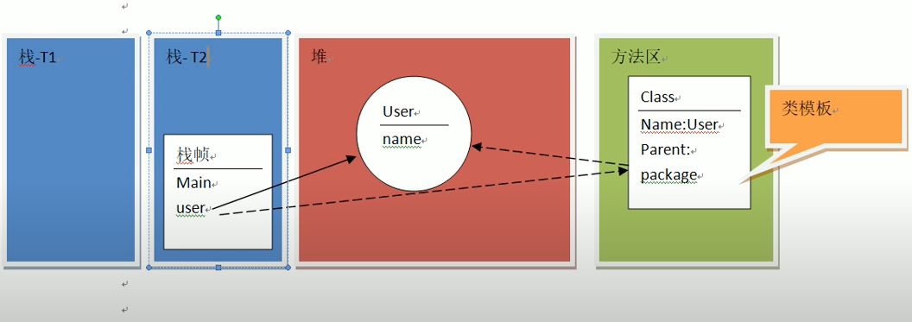
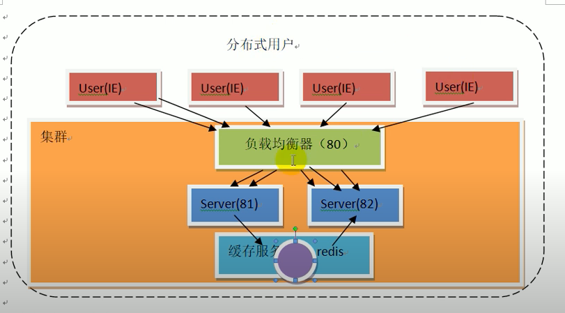
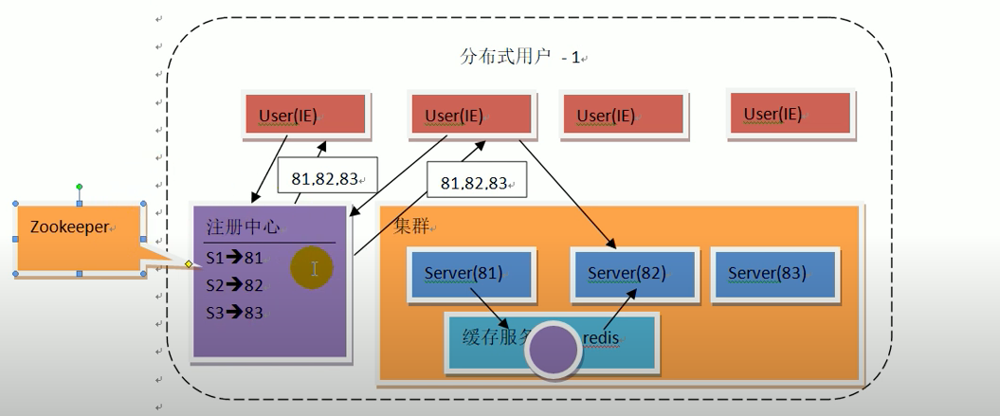

JVM运行时数据区分类
1. JVM栈 (Java Virtual Machine Stacks)
2. 堆内存 (Heap Memory)
3. 方法区 (Method Area)
4. 本地方法栈 (Native Method Stacks)
5. 程序计数器 (Program Counter (PC) Register)

RMI: RPC (framework) --> EJB --> Srping
服务端负载均衡

客服端负载均衡
注册中心不在有任何逻辑处理 也不用管返回数据
