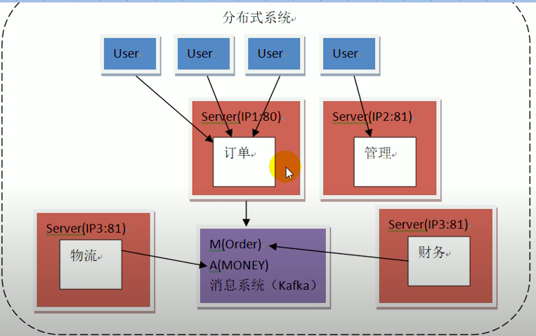
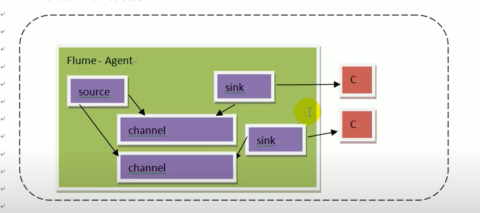
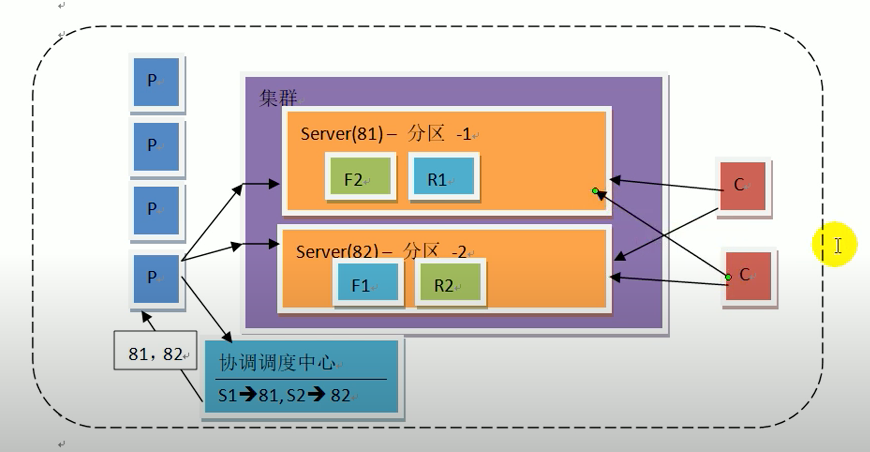

解耦合\
一台机器不同端口 (port:81, port:82)\
不同机器(ip1, ip2)\
不同网络

订单 财务 物流定期 从消息系统 写入 和 读取

扩容为什么是 2 的 n 次方
    11101101
&
    00001111
----------------

2n - 1才能保证 0～2n-1 都能被取到

比如 容量为5

    11101101
&
    00000101
---------------
永远取不到 2 和 3

这个是 Java hashmap 实现 (java 里面最高位是 符号位 11111111 是-1 负数的值是 取反加一 加 负号。 redis 默认 16*1024=16384 个slot)

## Flume
cons:
1. 数据保存在内存中 容易丢失
2. 增加消费者不容易
3. 数据无法长时间保存

改善:
1. 存文件
2. 消费者拉取
PS: 分区此处可认为是一个机器一个分区
P producer, C consumer, cluster 用在存数据
