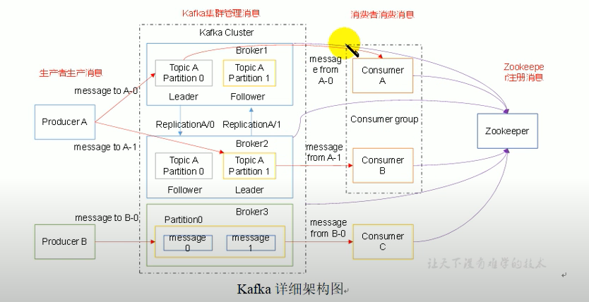
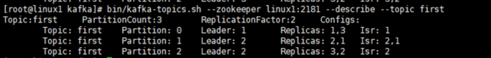

kafka 数据的有序性只能保证在分区内 如果一个业务需要保证顺序， 那么只能把这整个业务放入一个分区内部



一个broker为一个机器 \
如果要提高消费能力 则需要加 partition\ 
kafka 没有单个的消费者概念 它用的是 consumer group, cg 里面多个 consumers 同时消费消费多个分区 保证效率 


context 3台机器
```bash
bin/kafka-topics.sh --zookeeper ip1:2181 --create --topic first --partitions 3 --replication-factor 2
```
运行命令以后看 logs 文件夹 (kafka 的 logs 不止放log 还存数据)， 一台机器first-0，first-1， 一台机器 first-1，first-2， 一台机器 first-0，first-2。 可以发现 每台机器两个 partition。一共 3 个分区 每个分区 两个 副本 (包括自己)


Partition0  的 leader 副本在 1 号机器上 (1 是从哪里来的？ 在 server.properties 里面 自己配置 broker.id。 此处是作者使用 broker.id=1)
Replication 1,3 说明副本在 1 号机器和 3 号机器上。
Isr = InSyncReplication 

如果把 3 号机器的 kafka kill 掉

3 挂掉之后 partition2 的 leader 就变成 2 号机器了

把 3 号机器在加回来之后，kafka会自动 重新分配 leader 所在机器，也可以手动执行此操作
```bash
kafka-preferred-replica-election.sh --zookeeper ip:2181
```

在 logs/firstX/0000000000.log 里面 用
```bash
strings 00000000000.log
//strings命令在对象文件或二进制文件中查找可打印的字符串
```
可以读数据

## Zookeeper
Kafka将元数据信息保存在Zookeeper中\
ZooKeeper 的作用有：broker 注册、topic 注册、producer 和 consumer 负载均衡、维护 partition 与 consumer 的关系、记录消息消费的进度以及 consumer 注册等。\
0.9以后 offset 就不放在 zookeeper 里面了 
```
bin/kafka-console-consuer.sh --bootstrap-server ip:9092 --topic first
```
此时的 offset 存到了 集群上，再去 logs 看发现里面多了文件夹\
_consemer_offsets-1\
_consemer_offsets-4\
etc