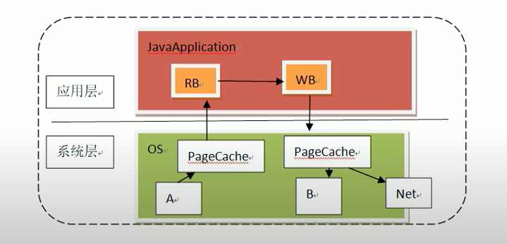
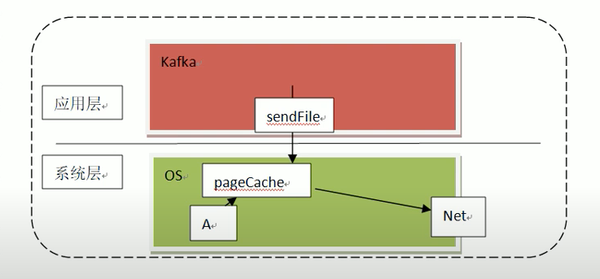
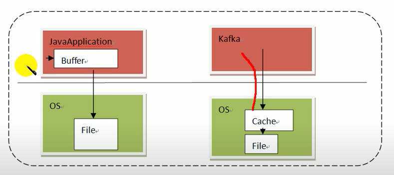
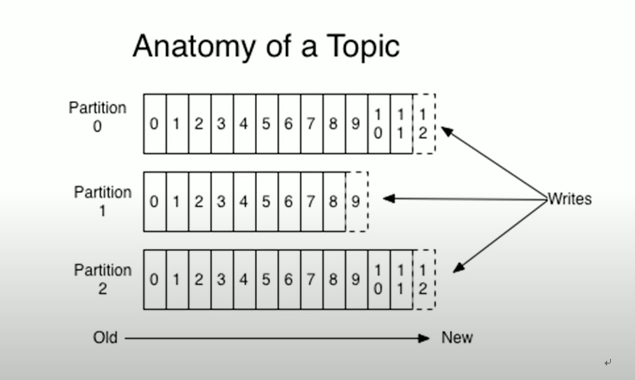
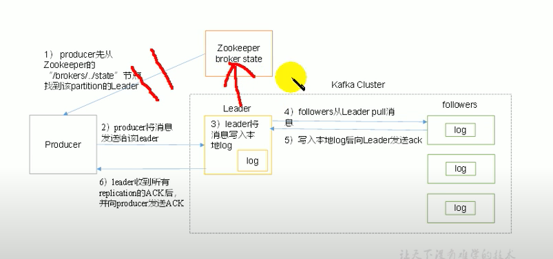
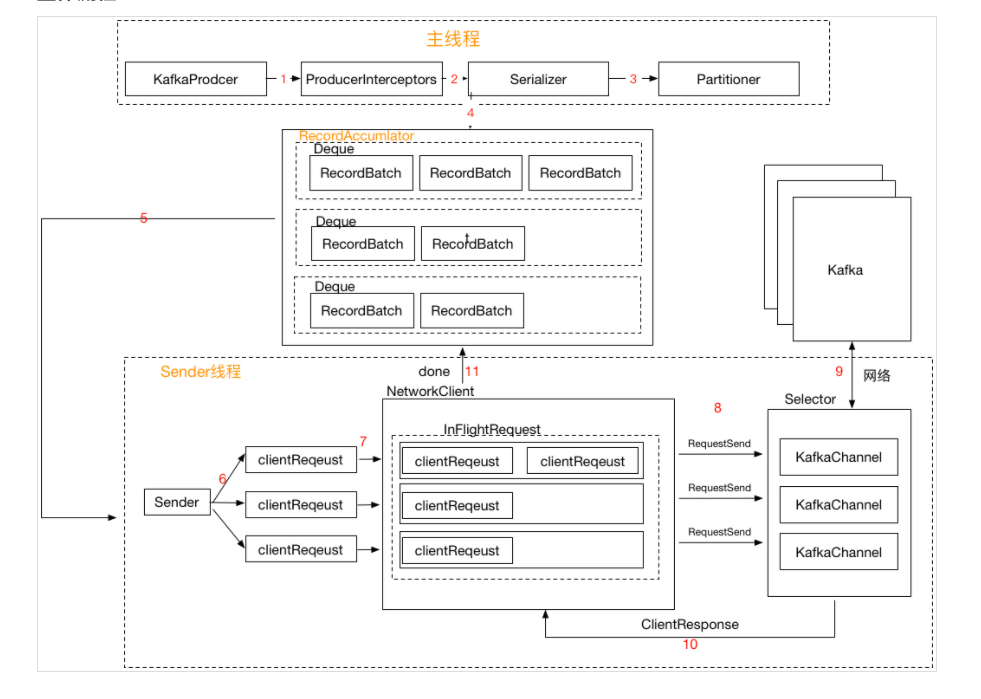

# 生产过程分析

## 写入方式
### 1. producer
采用 push 模式将消息发送到 broker，每条消息都被 append 到 partition中，属于顺序写磁盘 (顺序写磁盘效率比随机写内存要高，保证 kafka 吞吐率)

\
用 Java 做文件拷贝
A -> PageCache -> Java RB -> Java WB  

Kafka 文件拷贝
sendFile 是一个 OS 级 指令. 告诉 OS 我不需要读这个文件， 你直接把文件给网卡。\
做到了 零拷贝

kafka 分段日志 segment
假设 0000000000.log 存了 10 条数据>1G
则新建 0000000010.log 第二个文件的名字是第一个文件结束时候的 offset
第三个就是 000000020.log 以此类推
当需要读 offset 18 的时候直接到第二个文件读取即可

kafka 预读 (read ahead) 后写 (wirte behind)\
预读：读数据的时候不是只缓存 selected，而是缓存 selected 附近(相关)的数据一起缓存
后写： 写数据的时 kafka 直接把东西给 OS 的 cache 让 OS 自己决定什么时候把缓存中的 data 变成文件\

零复制，顺写，预读，后写，分段日志 保证高吞吐率

### 2. 分区 
原因：
1. 方便集群中扩展，每个 partition 可以通过调整以适应他所在的机器，而一个 topic 又可以有多个 partition 组成，因此整个集群的可以适应任意大小数据
2. 提高并发， 以 partition 为单位进行读写

消息发送时都被发送到一个topic，topic 其本质就是一个目录。由一些 partition log 组成，结构组织如下\
Kafka 分区文件夹 命令规则： Topic + "_" + 分区号

logs 文件夹下的 00000000x0.index 存的是 offset 在 0000000x0.log 中数据的具体位置，就是一个索引作用\
分区原则
1）指定 partition\
2）未指定 partition 但指定 key，通过对 key 的 value 进行 hash 得出一个 partition\
3）partition 和 key 都未指定， 使用轮询选出一个 partition

### 3. 副本
Kafka 的 Replication 分 leader 和 follwer， producer 和 consumer 只和 leader 进行读写交互，follower 只做数据拷贝。 拷贝方式是主动从 leader 处拉取数据

### 4. 写入流程

The producer sends a meta request with a list of topics to one of the brokers you supplied when configuring the producer.
producer 和 zookeeper 其实并无互动和联系，producer 写入数据到 集群，是集群和zookeeper互动获取 分区的 leader 所在 broker 并写入。和 producer 无关。 图中箭头都错了
1. producer 发消息给集群
2. 集群获取 leader 信息 
3. leader 将消息 写入本地 log
4. follwer 从 leader 拉取消息
5. 写入本地 log 后向 leader 发送 ack
ack 可配置， 当 ack = 0，producer 不管发送成不成功 接着发 (效率高，丢失数据可能性大)
ack = 1，leader 写入 log 后返回 ack
ack = -1， 所有 follower 都写入 log 后 再返回 ack 给 producer

### 5. producer

1. ProducerInterceptors 对消息进行拦截
2. Serializer 对消息的 key 和 value 进行序列化
3. Partitioner 为消息选择合适的 Partition
4. RecordAccumulator 收集消息，实现批量发送
5. Sender 从 RecordAccumulator 获取消息 (会查看消息的 size 和 时间 两个条件来 pull)
6. 构造 ClientRequest
7. 将 ClientRequest 交给 NetworkClient，准备发送
8. NetworkClient 将请求放入 KafkaChannel 的缓存
9. 执行网络 I/O，发送请求
10. 收到响应，调用 ClientRequest 的回调函数
11. 调用 RecordBatch 的回调函数，最终调用每个消息上注册的回调函数

消息发送的过程中，涉及两个线程协同工作。主线程首先将业务数据封装或 ProducerRecord 对象，之后调用 send() 方法将消息放入 RecordAccummulator (消息收集器，也可以理解为主线程与 Sender 线程之间的缓冲区)中暂存。Sender 线程负责将消息信息构成请求，并最终执行网络 I/O 的线程，它从 RecordAccumulator 中取出消息并批量发送出去。需要注意的是，KafkaProducer 是线程安全的，多个线程间可以共享使用同一个 KafkaProucer 对象。

如何得知 leader 所在 broker？
The producer sends a meta request with a list of topics to one of the brokers you supplied when configuring the producer.

The response from the broker contains a list of partitions in those topics and the leader for each partition. The producer caches this information and therefore, it knows where to redirect the messages.

## 数据保存

HW high watermark
LEO log end offset

## 消费数据
offset 可以保存在 zookeeper， kafka cluster 甚至 redis 中
消费者组统一管理 offset 当不指定 consumer 配置时候 每次新建一个消费者默认为 一个新的消费者组