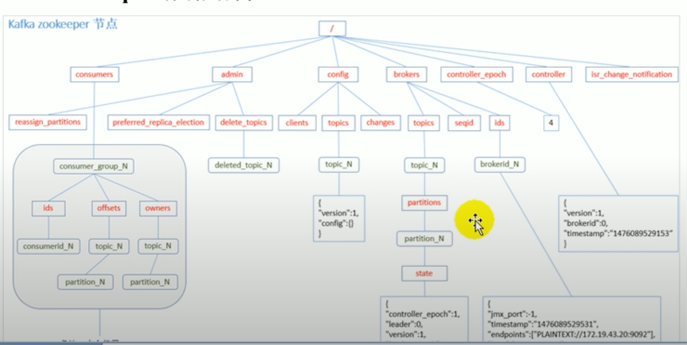

```bash
# 启动 zookeeper shell
zookeeper/bin/zkCli.sh

ls /
# 都是 kfaka 放进来的东西 
# cluster 就是 cluster 
# controller 是 broker 中的一个 选出来做 controller 主要负责 再平衡 分区处理等 就像 redis 的 master
# controller_epch 记录 controller 被选举了几次 
>>>[cluster, controller, controller_epoch, brokers, zookeeper, admin, isr_change_notification, consumers, latest_producer_id_block, config]
ls /cluster
>>>[id]
ls /cluster/id
>>>[]
get /cluster/id
# id 号就是集群的 id
>>>{"version":"1","id":"woijsf329jnafs"}
get /controller
>>>{"version":"1","brokerid":2,"timestamp":"126940023"}
get /controller_epoch
>>>1
ls /brokers
>>>[ids,topics, seqid]
get /brokers/ids/2
# 一些broker的信息
>>> {"host":"hostname","port":9092, etc}
ls /brokers/topics
>>>[first, __consumer_offsets]
ls /broker/topics/__consumer_offsets
>>>[partitions]
ls /broker/topics/__consumer_offsets/partitions
>>>[44,45,46,47,48,49,10,11...]
ls /broker/topics/first/partitions
>>>[0,1,2,3]
ls /consumers
# 输出为消费者组
>>>[console-consumer-12345]
ls /consumers/console-consumer-12345
>>>[ids, owners]
ls /consumers/console-consumer-12345/ids
# 真正的消费者 如果 multiple 就会多个消费者出现再这里
>>>[console-consumer-12345_hostname-39127398as-839823]
```

