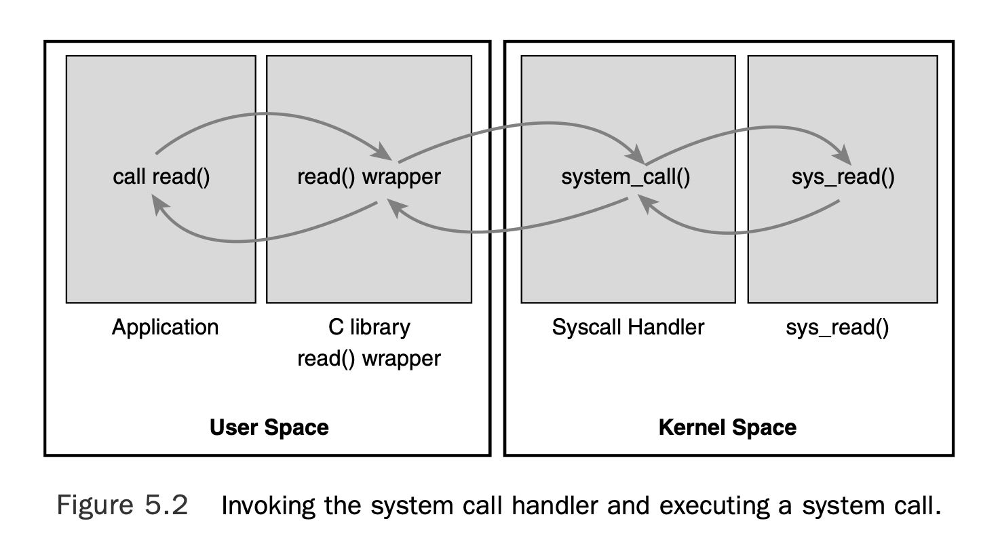
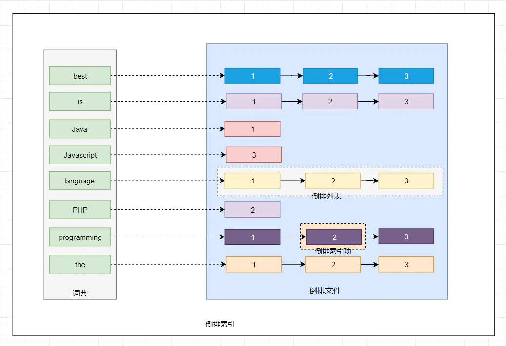
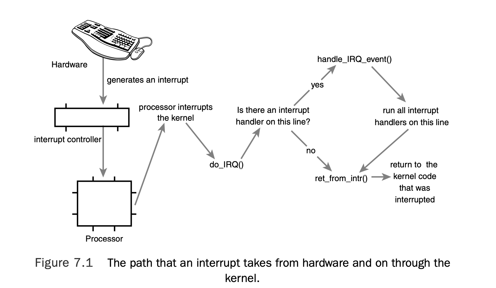

1.  Berkeley Software Distribution = BSD, Darwin, FreeBSD, NetBSD, OpenBSD都是在BSD4.4 基础上发展出来的

2.  通常一个内核由
    *   响应中断的中断服务程序
    *   管理多个进程从而分享处理器时间的调度程序
    *   管理进程地址空间的内存管理程序
    *   网络，进程间通信等服务程序 共同组成

3.  对于提供保护机制的现代系统来说，Kernel 独立于普通应用程序，他一般处于系统状态，拥有受保护的内存空间和访问硬件设备的所有权限。这种系统态和被保护起来的内存空间，统称为 内核空间。

4.  应用程序通常调用库函数，再由库函数通过系统调用界面，让内核代其完成各种不同任务。

5.  We can generalize that each processor is doing exactly one of three things at any given moment
    * In user-space, executing user code in a process
    * In kernel-space, in process context, executing on behalf of a specific 
    * In kernel-space, in interrupt context, not associated with a process, handling an
interrupt

This list is inclusive. Even corner cases fit into one of these three activities: For example, when idle, it turns out that the kernel is executing an idle process in process context in
the kernel.

6. SMP = symmetrical multiprocessor。 。在这种架构中，一台电脑不再由单个CPU组成，而同时由多个处理器运行操作系统的单一复本，并共享内存和一台计算机的其他资源。虽然同时使用多个CPU，但是从管理的角度来看，它们的表现就像一台单机一样。系统将任务队列对称地分布于多个CPU之上，从而极大地提高了整个系统的数据处理能力。所有的处理器都可以平等地访问内存、I/O和外部中断。在对称多处理系统中，系统资源被系统中所有CPU共享，工作负载能够均匀地分配到所有可用处理器之上。
我们平时所说的双CPU系统，实际上是对称多处理系统中最常见的一种。

7. 内核抢占（可抢占式内核）：
即当进程位于内核空间时，有一个更高优先级的任务出现时，如果当前内核允许抢占，则可以将当前任务挂起，执行优先级更高的进程。

8. Linux takes an interesting approach to thread support: It does not differentiate
between threads and normal processes.To the kernel, all processes are the same—
some just happen to share resources.

9. 代码变成可执行文件，叫做编译（compile）；先编译这个，还是先编译那个（即编译的安排），叫做构建（build）。
```
假设文件 a.txt 依赖于 b.txt 和 c.txt ，是后面两个文件连接（cat命令）的产物。那么，make 需要知道下面的规则。

a.txt: b.txt c.txt
    cat b.txt c.txt > a.txt
也就是说，make a.txt 这条命令的背后，实际上分成两步：第一步，确认 b.txt 和 c.txt 必须已经存在，第二步使用 cat 命令 将这个两个文件合并，输出为新文件。
像这样的规则，都写在一个叫做Makefile的文件中，Make命令依赖这个文件进行构建。
```

10. GCC GNU Compiler Collection

11. endian - 字节顺序，又称端序或尾序（英语：Endianness），在计算机科学领域中，指存储器中或在数字通信链路中，组成多字节的字的字节的排列顺序。
```
例如假设上述变量x类型为int，位于地址0x100处，它的值为0x01234567，地址范围为0x100~0x103字节，其内部排列顺序依赖于机器的类型。大端法从首位开始将是：0x100: 01, 0x101: 23,..。而小端法将是：0x100: 67, 0x101: 45,..。
```

12. Processes are, however, more than just the executing program code (often called the text
section in Unix).They also include a set of resources such as open files and pending signals,
internal kernel data, processor state, a memory address space with one or more memory
mappings, one or more threads of execution, and a data section containing global variables.
Processes, in effect, are the living result of running program code

13. Linux has a unique implementation of threads: It does not differentiate between
threads and processes. To Linux, a thread is just a special kind of process.

14.  A process is an active program and related resources.
Indeed, two or more processes can exist that are executing the same program

15. The kernel stores the list of processes in a circular doubly linked list called the task list. Each element in the task list is a process descriptor of the type struct <span style="color: red">task_struct</span>, which
is defined in <linux/sched.h>. The process descriptor contains the data that describes the executing program—open files, the process’s address space, pending signals, the process’s state, and much more.

16. When a program executes a system call (see
Chapter 5,“System Calls”) or triggers an exception, it enters kernel-space. A
process can begin executing in kernel-space only through one of these interfaces—all
access to the kernel is through these interfaces

17. All processes are descendants of the init process, whose PID is one.The kernel starts
init in the last step of the boot process.The init process, in turn, reads the system
initscripts and executes more programs, eventually completing the boot proces

18. The init task’s process descriptor is statically allocated as init_task.A good example
of the relationship between all processes is the fact that this code will always succeed:
```C
struct task_struct *task;
for (task = current; task != &init_task; task = task->parent)
;
/* task now points to init */
```

19.  In Linux, fork() is implemented through the use of copy-on-write pages. Copy-on-write (or COW) is a technique
to delay or altogether prevent copying of the data. Rather than duplicate the process
address space, the parent and the child can share a single copy

20. The bulk of the work in forking is handled by do_fork(), which is defined in
kernel/fork.c.This function calls copy_process() and then starts the process running.
The interesting work is done by copy_process():
    1. It calls dup_task_struct(), which creates a new kernel stack, thread_info structure, and task_struct for the new process.The new values are identical to those of
the current task. At this point, the child and parent process descriptors are identical
    2. It then checks that the new child will not exceed the resource limits on the number of processes for the current user.
    3. The child needs to differentiate itself from its parent.Various members of the
    process descriptor are cleared or set to initial values. Members of the process
    descriptor not inherited are primarily statistically information.The bulk of the values in task_struct remain unchanged.
    4. The child’s state is set to TASK_UNINTERRUPTIBLE to ensure that it does not yet run.
    5. copy_process() calls copy_flags() to update the flags member of the
    task_struct.The PF_SUPERPRIV flag, which denotes whether a task used superuser privileges, is cleared.The PF_FORKNOEXEC flag, which denotes a process that has
    not called exec(), is set.
    6. It calls alloc_pid() to assign an available PID to the new task.
    7. Depending on the flags passed to clone(), copy_process() either duplicates or
    shares open files, filesystem information, signal handlers, process address space, and
    namespace.These resources are typically shared between threads in a given process;
    otherwise they are unique and thus copied here.
    8. Finally, copy_process() cleans up and returns to the caller a pointer to the new
    child.

21. To the Linux kernel, there is no concept of a thread. Linux implements all threads as standard processes. Each thread has a unique task_struct and appears to the kernel as a normal process—
threads just happen to share resources, such as an address space, with other processes

22. On systems with explicit thread support, one process descriptor might exist that,
in turn, points to the four different threads.The process descriptor describes the shared
resources, such as an address space or open files.The threads then describe the resources
they alone possess. Conversely, in Linux, there are simply four processes and thus four
normal task_struct structures.The four processes are set up to share certain resources.
The result is quite elegant.

23. Processes can be classified as either I/O-bound or processor-bound. I/O-bound is characterized as a process that spends much of its time submitting and waiting on I/O requests. Conversely, processor-bound processes spend much of their time executing code.They tend to run until they are preempted because they do not block on I/O requests very often. A scheduler policy for processor-bound processes, therefore, tends to run such processes less frequently but for longer durations

24. The Linux kernel implements two separate priority ranges:
    1. The first is the nice value, a
number from –20 to +19 with a default of 0. Larger nice values correspond to a lower
priority
    2. The second range is the real-time priority.The values are configurable, but by default
range from 0 to 99, inclusive. Opposite from nice values, higher real-time priority values
correspond to a greater priority
```bash
#You can see
#a list of the processes on your system and their respective real-time priority (under the
#column marked RTPRIO) with the command:
ps -eo state,uid,pid,ppid,rtprio,time,comm
#A value of “-” means the process is not real-time.
```

25.   On Linux, therefore, the amount of processor time that a process receives is a function of the load of the system.This assigned proportion is further affected by each process’s nice value.The nice value acts as a weight,
changing the proportion of the processor time each process receives. Processes with
higher nice values (a lower priority) receive a deflationary weight, yielding them a smaller
proportion of the processor; processes with smaller nice values (a higher priority) receive
an inflationary weight, netting them a larger proportion of the processor.
In Linux, under the new CFS scheduler, the decision is a
function of how much of a proportion of the processor the newly runnable processor has
consumed. If it has consumed a smaller proportion of the processor than the currently
executing process, it runs immediately, preempting the current process. If not, it is scheduled to run at a later time.

26.  If the video encoder and text editor are the only running processes and both
are at the same nice level, this proportion would be 50%—each would be guaranteed half
of the processor’s time. Because the text editor spends most of its time blocked, waiting
for user key presses, it does not use anywhere near 50% of the processor. Conversely, the
video encoder is free to use more than its allotted 50%, enabling it to finish the encoding
quickly.
The crucial concept is what happens when the text editor wakes up. Our primary goal
is to ensure it runs immediately upon user input. In this case, when the editor wakes up,
CFS notes that it is allotted 50% of the processor but has used considerably less. Specifically, CFS determines that the text editor has run for less time than the video encoder.
Attempting to give all processes a fair share of the processor, it then preempts the video
encoder and enables the text editor to run. The text editor runs, quickly processes the
user’s key press, and again sleeps, waiting for more input. As the text editor has not consumed its allotted 50%, we continue in this manner, with CFS always enabling the text
editor to run when it wants and the video encoder to run the rest of the time.

27. The Linux scheduler is modular, enabling different algorithms to schedule different types
of processes.This modularity is called scheduler classes. Scheduler classes enable different,
pluggable algorithms to coexist, scheduling their own types of processes. Each scheduler class has a priority.

28. Each process then runs for a “timeslice” proportional to its weight divided by the total
weight of all runnable threads. To calculate the actual timeslice, CFS sets a target for its
approximation of the “infinitely small” scheduling duration in perfect multitasking. This
target is called the targeted latency. 

29. The Virtual Runtime
The vruntime variable stores the virtual runtime of a process, which is the actual runtime
(the amount of time spent running) normalized (or weighted) by the number of runnable
processes.The virtual runtime’s units are nanoseconds and therefore vruntime is decoupled from the timer tick. CFS
uses vruntime to account for how long a process has run and thus how much longer it
ought to run

30.  the core of CFS’s scheduling algorithm: Pick the task with the smallest
vruntime

31. CFS uses a red-black tree to manage the list of runnable processes and efficiently find
the process with the smallest vruntime. CFS’s process selection algorithm is thus summed up as "run the process represented by
the leftmost node in the rbtree." The function that performs this selection is
__pick_next_entity(). Note that __pick_next_entity() does not actually traverse the tree to find the leftmost node, because the value is cached by rb_leftmost

32. User preemption occurs when the kernel is about to return to user-space, need_resched
is set, and therefore, the scheduler is invoked.  user preemption can occur
    * When returning to user-space from a system call
    * When returning to user-space from an interrupt handler

33.  The kernel can preempt a task running in the kernel
so long as it does not hold a lock.That is, locks are used as markers of regions of nonpreemptibility. Because the kernel is SMP-safe, if a lock is not held, the current code is reentrant and capable of being preempted.

34. When a SCHED_FIFO task becomes runnable, it continues to run until it blocks or explicitly yields the processor; it has no timeslice and can run indefinitely.  Only a higher priority SCHED_FIFO or SCHED_RR task can preempt a SCHED_FIFO task

35. SCHED_RR is identical to SCHED_FIFO except that each process can run only until it
exhausts a predetermined timeslice. As with SCHED_FIFO, a
higher-priority process always immediately preempts a lower-priority one, and a lowerpriority process can never preempt a SCHED_RR task, even if its timeslice is exhausted.

36. Processor affinity, or CPU pinning or "cache affinity", enables the binding and unbinding of a process or a thread to a central processing unit (CPU) or a range of CPUs, so that the process or thread will execute only on the designated CPU or CPUs rather than any CPU. 

37. Each CPU in the system is given a run queue, which maintains both an active and expired array of processes. Each array contains 140 (one for each priority level) pointers to doubly linked lists, which in turn reference all processes with the given priority. The scheduler selects the next process from the active array with highest priority. When a process' timeslice expires, it is placed into the expired array with some priority. When the active array contains no more processes, the scheduler swaps the active and expired arrays, hence the name O(1) scheduler

38. In Linux, each system call is assigned a syscall number.This is a unique number that is used
to reference a specific system call.When a user-space process executes a system call, the
syscall number identifies which syscall was executed; the process does not refer to the
syscall by name.

39. 系统调用的步骤


40. The common pattern for storing this structure in a linked list is to embed the list
pointer in the structure. For example:
```C
struct fox {
    unsigned long tail_length; /* length in centimeters of tail */
    unsigned long weight; /* weight in kilograms */
    bool is_fantastic; /* is this fox fantastic? */
    struct fox *next; /* next fox in linked list */
    struct fox *prev; /* previous fox in linked list */
};
```
The Linux kernel approach is different. Instead of turning the structure into a linked
list, the Linux approach is to embed a linked list node in the structure
```C
struct list_head {
    struct list_head *next
    struct list_head *prev;
};

struct fox {
    unsigned long tail_length; /* length in centimeters of tail */
    unsigned long weight; /* weight in kilograms */
    bool is_fantastic; /* is this fox fantastic? */
    struct list_head list; /* list of all fox structures */
};
```
 Using the macro container_of(), we can easily find the parent structure containing any given member variable.This is because in C, the offset of a
given variable into a structure is fixed by the ABI at compile time.

41. a. Mathematically, it is an acyclic, connected, directed graph in which each vertex (called a node) has zero or
more outgoing edges and zero or one incoming edges.A binary tree is a tree in which
nodes have at most two outgoing edges—that is, a tree in which nodes have zero, one, or
two children. 

42. Height and depth of Tree
    * The depth of a node is the number of edges from the node to the tree's root node. A root node will have a depth of 0.

    * The height of a node is the number of edges on the longest path from the node to a leaf. A leaf node will have a height of 0.

43. A binary search tree (often abbreviated BST) 
    * The left subtree of the root contains only nodes with values less than the root.
    * The right subtree of the root contains only nodes with values greater than the root.
    * All subtrees are also binary search trees.

44. A balanced binary search tree is a binary search tree in which
the depth of all leaves differs by at most one

45. 二分查找 -> Binary Search Tree (BST) -> 2-3 Tree(自平衡树) -> BRTree (优化的2-3树) -> B-Tree, B+Tree (由于磁盘I/O原因红黑树太高)

46. Inverted Index. 一个未经处理的数据库中，一般是以文档ID作为索引，以文档内容作为记录。
而Inverted index 指的是将单词或记录作为索引，将文档ID作为记录，这样便可以方便地通过单词或记录查找到其所在的文档。

从上图我们可以了解到倒排索引主要由两个部分组成：词典和倒排文件。词典和倒排表是Lucene中很重要的两种数据结构，是实现快速检索的重要基石。词典和倒排文件是分两部分存储的，词典在内存中而倒排文件存储在磁盘上。

47. An interrupt is physically produced by electronic signals originating from hardware
devices and directed into input pins on an interrupt controller

48. Different devices can be associated with different interrupts by means of a unique
value associated with each interrupt. This enables the operating system to differentiate
between interrupts and to know which hardware device caused which interrupt. In turn,
the operating system can service each interrupt with its corresponding handler. These interrupt values are often called interrupt request (IRQ) lines. Each IRQ line is
assigned a numeric value.

49. Not all interrupt numbers, however, are so
rigidly defined. Interrupts associated with devices on the PCI bus, for example, generally
are dynamically assigned. Other non-PC architectures have similar dynamic assignments
for interrupt values.The important notion is that a specific interrupt is associated with a
specific device, and the kernel knows this

50. In OS texts, exceptions are often discussed at the same time as interrupts. Unlike interrupts, exceptions occur synchronously with respect to the processor clock. Indeed, they are
often called synchronous interrupts. Exceptions are produced by the processor while executing instructions either in response to a programming error (for example, divide by zero) or
abnormal conditions that must be handled by the kernel (for example, a page fault). 

51. The function the kernel runs in response to a specific interrupt is called an interrupt handler
or interrupt service routine (ISR). Each deviceA that generates interrupts has an associated
interrupt handler. The interrupt
handler for a device is part of the device’s driver—the kernel code that manages the device

52.  An interrupt handler execute quickly and perform a large amount
of work—clearly conflict with one another. Because of these competing goals, the processing of interrupts is split into two parts, or halves.The interrupt handler is the top half.
The top half is run immediately upon receipt of the interrupt and performs only the
work that is time-critical, such as acknowledging receipt of the interrupt or resetting the
hardware

53. Drivers can register an interrupt handler and enable a given interrupt line for handling
with the function request_irq(). Note that request_irq() can sleep and therefore cannot be called from interrupt
context or other situations where code cannot block. Because it will finally call function kmalloc() which can go sleep.

54. For shared registers The interrupt handler must be capable of distinguishing whether its device actually
generated an interrupt.This requires both hardware support and associated logic in
the interrupt handler. If the hardware did not offer this capability, there would be no
way for the interrupt handler to know whether its associated device or some other
device sharing the line caused the interrupt.

55. 



56. useful tips help:
    * If the work is time sensitive, perform it in the interrupt handler.
    * If the work is related to the hardware, perform it in the interrupt handler.
    * If the work needs to ensure that another interrupt (particularly the same interrupt)
    does not interrupt it, perform it in the interrupt handler.
    * For everything else, consider performing the work in the bottom half.

57. The important thing to realize is that later is often simply not now.
The point of a bottom half is not to do work at some specific point in the future, but simply to defer work until any point in the future when the system is less busy and interrupts
are again enabled. Often, bottom halves run immediately after the interrupt returns.The
key is that they run with all interrupts enabled

58. MMU, the hardware that manages memory and performs virtual to physical address
translations

59.  Virtual Filesystem （VFS）is the glue that enables system calls such as open(), read(), and write()to
work regardless of the filesystem or underlying physical medium.

60. A filesystem is a hierarchical storage of data adhering to a specific structure (文件系统是一个有层级结构的数据存储，遵守特定的结构). Filesystems
contain files, directories, and associated control information. 

61. In Unix, filesystems are mounted at a
specific mount point in a global hierarchy known as a namespace. This enables all
mounted filesystems to appear as entries in a single tree. Contrast this single, unified tree
with the behavior of DOS and Windows, which break the file namespace up into drive
letters, such as C:.This breaks the namespace up among device and partition boundaries,
“leaking” hardware details into the filesystem abstraction.As this delineation may be arbitrary and even confusing to the user, it is inferior to Linux’s unified namespace.

62. A file is an ordered string of bytes.  Each component of a path is called a
directory entry. Unix, directories are actually normal files that simply list the files contained therein.

63. Access permissions, size, owner, creation time, and so on are called file metadata and are stored in a separate data
structure from the file, called the inode(index node). All this information is tied together with the filesystem’s own control information,
which is stored in the superblock.The superblock is a data structure containing information
about the filesystem as a whole. Sometimes the collective data is referred to as filesystem
metadata

64. Traditionally, Unix filesystems implement these notions as part of their physical ondisk layout. For example, file information is stored as an inode in a separate block on the
disk; directories are files; control information is stored centrally in a superblock, and so
on

65. Block devices are hardware devices distinguished by (已....为特征) the random (that is, not necessarily
sequential) access of fixed-size chunks of data. .The most common block device is a hard disk, but many other block devices
exist, such as floppy drives, Blu-ray readers, and flash memory

66. The other basic type of device is a character device. Character devices, or char devices, are
accessed as a stream of sequential data, one byte after another. Example character devices
are serial ports and keyboards