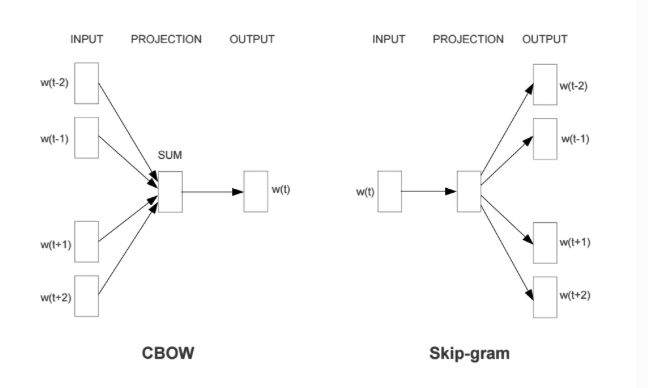

# 1. 概述
## 1.1 词汇表征
文本向量化: 
* 将文本表示成计算机可识别的实数向量， 根据粒度大小不同，可将文本特征表示分为字、词、句子、篇章几个层次
* 一般称为词嵌入(word embedding)方法，词嵌入这个说法很形象，就是把文本中的词嵌入到文本空间中， 用一个向量来表示词

文本向量化方法:
* 离散词向量表示
    * 基于规则、统计
        * 词集模型(set of word)
            * One-Hot encoding
            * 统计各词在句子中是否出现
        * 词袋模型(bag of word)
            * 统计各词在句子中出现的次数
        * Bi-gram、N-gram
        * TF-IDF
            * 统计各词在文档中的 TF-IDF 值(词袋模型 + IDF 值)
        * 共现矩阵
* 分布式词向量表示
    * 基于神经网络的词嵌入
        * word2vec
        * doc2vec
        * str2vec
## 1.2 词向量模型建立词汇表
NLP 相关任务中最常见的第一步是创建一个 词表库 并把每个词顺序编号。
# 2. 离散表示
文本向量化离散表示是一种基于规则和统计的向量化方式，常用的方法包括 词集模型 和 词袋模型， 都是基于词之间保持独立性、没有关联为前提，将所有文本中单词形成一个字典，然后根据字典来统计单词出现频数
* 词集模型:
    * 统计各词在句子中是否出现
    * 例如 One-Hot Representation，只要单个文本中单词出现在字典中，就将其置为 1，不管出现多少次
* 词袋模型:
    * 统计各词在句子中出现的次数
    * 只要单个文本中单词出现在字典中，就将其向量值加 1，出现多少次就加多少次

其基本的特点是忽略了文本信息中的语序信息和语境信息，仅将其反映为若干维度的独立概念， 这种情况有着因为模型本身原因而无法解决的问题，比如主语和宾语的顺序问题， 词袋模型天然无法理解诸如“我为你鼓掌”和“你为我鼓掌”两个语句之间的区别

## 2.1 One-Hot Representation
假设我们有一个包括 10000 个单词的词汇表， 现在需要用 one-hot 方法来对每个单词进行编码。以上面那句 “I want a glass of orange ____.” 为例， 假设 I 在词汇表中排在第 3876 个，那么 I 这个单词的 one-hot 表示就是一个长度为 10000 的向量， 这个向量在第 3876 的位置上为 1 ，其余位置为 0，其余单词同理，每个单词都是茫茫 0 海中的一个 1

可见 one-hot 词汇表征方法最后形成的结果是一种稀疏编码结果，在深度学习应用于 NLP 任务之前， 这种表征方法在传统的 NLP 模型中已经取得了很好的效果。但是这种表征方法有两个缺陷: 一是容易造成维数灾难，10000 个单词的词汇表不算多，但对于百万级、千万级的词汇表简直无法忍受。 第二个则在于这种表征方式不能很好的词汇与词汇之间的相似性，比如上述句子， 如果我们已经学习到了 “I want a glass of orange juice.”，但如果换成了 “I want a glass of apple ____.”， 模型仍然不会猜出目标词是 juice。因为基于 one-hot的表征方法使得算法并不知道 apple 和 orange 之间的相似性， 这主要是因为任意两个向量之间的内积都为零，很难区分两个单词之间的差别和联系。

## 2.2 Bag of Word
* 对于句子、篇章，常用的离散表示方法是词袋模型，词袋模型以 One-Hot 为基础，忽略词表中词的顺序和语法关系， 通过记录词表中的每一个词在该文本中出现的频次来表示该词在文本中的重要程度，解决了 One-Hot 未能考虑词频的问题
* 词袋(Bag Of Word) 模型是最早的以词语为基本单元的文本向量化方法。词袋模型，也称为计数向量表示(Count Vectors). 文档的向量表示可以直接使用单词的向量进行求和得到
## 2.3 Bi-gram N-gram
Bi-gram 将相邻两个词编上索引，N-gram 将相邻 N 个词编上索引
```
基于文档中出现的单词
{ 
   "John likes": 1,
   "likes to": 2,
   "to watch": 3,
   "watch movies": 4,
   "Mary likes": 5,
   "likes too": 6,
   "John also": 7,
   "also likes": 8,
   "watch football": 9,
   "football games": 10,
}
```

## 2.4 TF-IDF
作为一种加权方法， TF-IDF 在词袋模型的基础上对次出现的频次赋予 TF-IDF 权值，对词袋模型进行修正，进而表示该词在文档集合中的重要程度
* 统计各词在文档中的 TF-IDF 值(词袋模型 + IDF 值)
* 词袋模型、Bi-gram、N-gram 都是基于计数得到的，而 TF-IDF 则是基于频率统计得到的
* 在利用 TF-IDF 进行特征提取时，若词 α 在某篇文档中出现频率较高且在其他文档中出现频率较低时， 则认为α可以代表该文档的特征，具有较好的分类能力，那么α作为特征被提取出来

TF-IDF 的分数代表了词语在当前文档和整个语料库中的相对重要性。TF-IDF 分数由两部分组成
* TF(Term Frequency):词语频率  $TF(t)=\frac{词语在当前文档出现的次数}{当前文档中词语的总数}$
    * TF 判断的是该字/词语是否是当前文档的重要词语，但是如果只用词语出现频率来判断其是否重要可能会出现一个问题， 就是有些通用词可能也会出现很多次，如:a、the、at、in 等，当然一般我们会对文本进行预处理时去掉这些所谓的停用词(stopwords)， 但是仍然会有很多通用词无法避免地出现在很多文档中，而其实它们不是那么重要
* IDF(Inverse Document Frequency):逆文档频率  $IDF(t)=log_e(\frac{文档总数}{出现该赐予的文档总数})$
    * IDF 用于判断是否在很多文档中都出现了词词语，即很多文档或所有文档中都出现的就是通用词。 出现该词语的文档越多，IDF 越小，其作用是抑制通用词的重要性
* 将上述求出的 TF 和 IDF 相乘得到的分数 TF-IDF，就是词语在当前文档和整个语料库中的相对重要性
* TF-IDF 与一个词在当前文档中出现次数成正比，与该词在整个语料库中的出现次数成反比

## 2.5 共现矩阵 Co-currence Matrix

## 2.6 Count Vector
#### 假设
语料 C 包含 D 个文档: {d1,d2,...,dD}, N 个不重复词构成的字典\
Count Vector matrix = $M_{D*N}$: 矩阵M的第 i, (i=1,2,...,D)行包含了字典中每个词在文档 di 中的频率
#### 示例
* 语料(D=2):
    * d1: He is a lazy boy. She is also lazy
    * d2: Neeraj is a lazy person
* 字典(N=6):
    * ["He","She","lazy","boy","Neeraj","person"]
#### count vector matrix

| CountVector|He|She|lazy|Neeraj| person |
|---|---|---|---|---|---|
|d1|1|1|2|1|0|0
|d2|0|0|1|0|1|1

# 3. 分布式表示
词汇分布式表示最早由 Hinton 在 1986 年提出，其基本思想是:通过训练将每个词映射成 K 维实数向量(K 一般为模型中的超参数)， 通过词之间的距离(如，consine 相似度、欧氏距离)来判断它们之间的语义相似度

离散表示虽然能够进行词语或者文本的向量表示，进而用模型进行情感分析或者是文本分类之类的任务。 但其不能表示词语间的相似程度或者词语间的类比关系。比如:beautifule 和 pretty 两个词语，它们表达相近的意思，所以希望它们在整个文本的表示空间内挨得很近。

一般认为，词向量、文本向量之间的夹角越小，两个词相似度越高，词向量、文本向量之间夹角的关系用下面的余弦夹角进行表示: $cos=\frac{\vec{A}*\vec{B}}{|\vec{A}|*|\vec{B}|}$

## 3.1 Word Embedding
词嵌入的基本想法就是将词汇表中的每个单词表示为一个普通的向量，这个向量不像 One-Hot 向量那样都是 0 或者 1， 也没有 One-Hot 向量那样长，大概就是很普通的向量，比如长这样:[-0.91, 2, 1.8, -.82, 0.65, …]。 这样的一种词汇表示方式就像是将词嵌入到了一种数学空间里面，所以叫做词嵌入。其中，word2vec 使用的就是这种词嵌入技术的一种。

神经网络进行训练， 训练得到的网络权重形成的向量就是我们最终需要的东西，这种向量也叫词向量，word2vec 就是其中的典型技术。

word2vec 作为现代 NLP 的核心思想和技术之一，有着非常广泛的影响。word2vec 通常有两种语言模型， 一种是根据中间词来预测上下文的 skip-gram 模型，另一种是根据上下文来预测中间词的 CBOW (连续词袋模型)。

* 基于频率的 Word Embedding
    * Count Vector
    * TF-IDF
    * Co-currence Matrix
* 基于预测的 Word Embedding
    * CBOW
    * Skip-Gram

## 3.2 Word Embedding-word2vec
* 给定上下文词，需要我们来预测中间目标词，这种模型叫做连续词袋模型(Continuous Bag-of-Wods Model，CBOW)
* 给定一个词语，我们来根据这个词预测它的上下文，这种模型叫做 skip-gram 模型

CBOW和Skip-gram模型原理示意图


### 3.2.1 NNLM(Neural Network Language Model)
