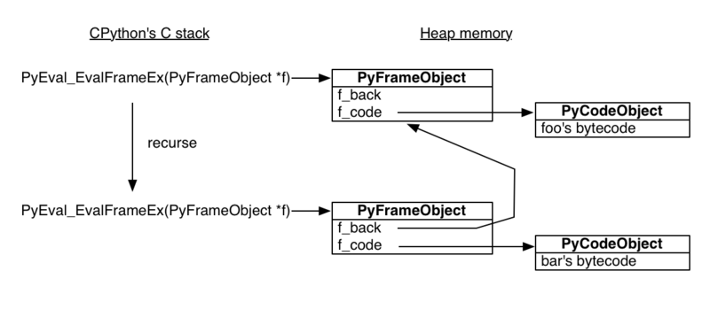
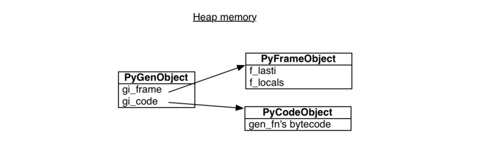

Python 的内存管理是通过私有 heap 完成的, 所有的一切都在 private heap 上</br>
函数通过 PyEval_EvalFrameEx 执行 并且创建一个 栈帧. 因为栈帧都是分配在堆内存上 堆内存的特点是你要你不去释放，就会一直存在内存当中。这就决定了栈帧可以独立于调用者存在

当python解释器看到一个 yield 会给函数一个生成器 标志</br>
在你调用生成器函数时 Python 看到标志 从而生成一个生成器 而不是运行函数

生成器对象主要封装了一个 堆栈帧 和一个对生成器 函数代码 的引用</br>


```python
import tracemalloc
from functools import wraps
import time

def timer(func):
    @wraps(func)
    def wrapper(*args,**kwargs):
        start_at= time.perf_counter()
        res=func(*args,**kwargs)
        duration = time.perf_counter()-start_at
        print(f'[{wrapper.__name__}] took {duration * 1000} ms')
        return res
    return wrapper

def performance_check(func):
    @wraps(func)
    def wrapper(*args,**kwargs):
        tracemalloc.start()
        start_at = time.perf_counter()
        res=func(*args,**kwargs)
        duration=time.perf_counter()-start_at
        current,peak=tracemalloc.get_traced_memory()
        tracemalloc.stop()

        print(f"\nFunction: {func.__name__} ({func.__doc__})"
              f"\nMemory usage: {current /10**6:.6f} MB"
              f"\nPeak memory usage: {peak/10**6:.6f} MB"
              f"\nDuration: {duration:.6f} sec"
              f"\n{'-'*40}")
        return res
    return wrapper
```

timeit — Measure execution time of small code snippets