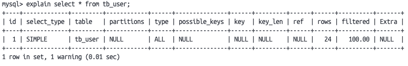
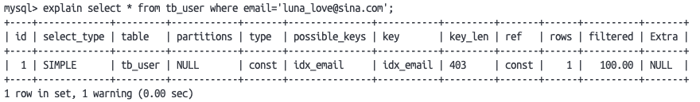

docker run --name some-postgres -e POSTGRES_PASSWORD=mysecretpassword -d postgres
same as mysql, but you can ignore password. When password is ignored, psql -U username will connect to the postgres inside container.
\dt will show all tables
\q will exit the psql

ref :https://hub.docker.com/_/postgres

docker run --name some-mysql -e MYSQL_ROOT_PASSWORD=1234 -d mysql
--name is the container name
-e is the password you assign to the mysql running inside the container 
-d is the image

ref: https://hub.docker.com/_/mysql

SHOW DATABASES;
CREATE DATABASE mine;
USE mine;
SHOW TABLES;


MyISAM:
1. 表级锁定
2. 不支持事务
3. 无外键支持

MySQL:
1. 行级锁
2. 事务支持
3. 外键支持


Index command:
##### 创建索引
-- UNIQUE表示唯一索引 FULLTEXT表示全文索引
-- (index_col_name,... ) 表示可以形成联合索引，一个索引包括多个表内列
CREATE [ UNIQUE | FULLTEXT ] INDEX index_name ON table_name (index_col_name,... ) ;

##### 查看索引
SHOW INDEX FROM table_namne;

##### 删除索引
DROP INDEX index_name ON table_name;


在SQL中为我们提供了SHOW语句来查看当前数据库的INSERT，DELETE，UPDATE，SELECT的访问频率：

##### 显示SQL中各种语句的访问频率
##### 注意_______是七个_
SHOW GLOBAL STATUS LIKE 'Com_______';

##### 慢查询日志
慢查询日志记录了所有执行时间超过指定参数（long_query_time，单位：秒，默认10秒）的所有SQL语句的日志。\
MySQL的慢查询日志默认没有开启，我们可以查看一下系统变量 slow_query_log

##### 开启MYSQL慢日志查询开关
slow_query_log = 1;
SHOW VARIABLES LIKE 'slow_query_log';
SET GLOBAL slow_query_log = 'ON';
##### 设置慢查询日志的时间为2s，即SQL的语句执行时间超过2s就被记录到慢查询日志中
long_query_time = 2;

##### profile详情
```sql
// 查看是否支持profile操作
SELECT @@have_profiling;

// 开启profile操作
SET profiling = 1;

// profile可以存储我们之前的操作时长，帮助我们在SQL优化中了解时间损耗的具体项目并加以改善：

//查看每条SQL语句的耗时情况
SHOW profile;

//查看指定query_id的SQL语句各个阶段的耗时情况（这里的id是SHOW profile的标号id）
SHOW profile for query query_id;

//查看指定query_id的SQL语句CPU的使用情况（这里的id是SHOW profile的标号id）
show profile cpu for query query_id;
```

##### Explain执行计划

EXPLAIN SELECT COLUMN FROM TABLE WHERE CONDITION;


* id: select查询的序列号，表示查询中执行select子句或者是操作表的顺序 (id相同，执行顺序从上到下；id不同，值越大，越先执行)。
* select_type: 表示 SELECT 的类型，常见的取值有 SIMPLE（简单表，即不使用表连接 或者子查询）、PRIMARY（主查询，即外层的查询）、 UNION（UNION 中的第二个或者后面的查询语句）、 SUBQUERY（SELECT/WHERE之后包含了子查询）
* type: 表示连接类型，性能由好到差的连接类型为NULL、system、const、 eq_ref、ref、range、 index、all 。
* possible_key: 显示可能应用在这张表上的索引，一个或多个。
* key: 显示可能应用在这张表上的索引，一个或多个。
* key_len: 表示索引中使用的字节数， 该值为索引字段最大可能长度，并非实际使用长 度，在不损失精确性的前提下， 长度越短越好 。
* rows: MySQL认为必须要执行查询的行数，在innodb引擎的表中，是一个估计值， 可能并不总是准确的。
* filtered: 表示返回结果的行数占需读取行数的百分比， filtered 的值越大越好。

##### 联合索引注意点
1. 最左前缀法则
```sql
# 例如我们在前面建立了一个idx_user_pro_age_status索引包含了pro，age，status三个列

# 当我们从左边往右边逐渐使用时不会产生错误：
explain select * from tb_user where profession = '软件工程' and age = 31 and status= '0';
explain select * from tb_user where profession = '软件工程' and age = 31;
explain select * from tb_user where profession = '软件工程';

# 但当我们中间省略一列，或者缺少最前面的列，后面的索引列将不再被使用
explain select * from tb_user where age = 31 and status = '0';
explain select * from tb_user where status = '0';

```
where后的索引顺序不受约束，最前面的索引可以放在where的任意位置不受影响
2. 范围查询
在联合索引中，不允许出现 (>,<), 范围查询的右侧列索引失效 
```sql
# 我们如果使用 <,> 后面的索引将不再生效
explain select * from tb_user where profession = '软件工程' and age > 30 and status = '0';

# 但我们使用 <=,>= 则不受影响
explain select * from tb_user where profession = '软件工程' and age >= 30 and status = '0';
```

索引失效的常见情况有五种:
1. 不能在索引列上运算
```
# 如果我们采用substring等操作，索引列将失效
explain select * from tb_user where substring(phone,10,2) = '15';
```
2. 字符串类型字段使用时, 不加引号
```
# 这里最后一部分status的0未加引号，数据仍旧可以输出，但不再通过索引查询
explain select * from tb_user where profession = '软件工程' and age = 31 and status= 0;
```
3. 模糊查询
```sql
# 如果头部出现%，索引失效

-- 索引有效
explain select * from tb_user where profession like '软件%';

-- 索引失效
explain select * from tb_user where profession like '%工程';

-- 索引失效
explain select * from tb_user where profession like '%工%';

```
4. or连接条件\
用or分割开的条件， 如果or前的条件中的列有索引，而后面的列中没有索引，那么涉及的索引都不会被用到。
```sql
# 如果phone被设置有索引 但age未设置索引 ，则采用普通查询方法不采用索引
explain select * from tb_user where phone = '17799990017' or age = 23;
```
5. 数据分布影响\
如果MySQL评估使用索引比全表更慢，则不使用索引。
```sql
# 假设我们所查询的数据占用该表的大多数数据，可能不采用索引而直接采用全表查询

-- 假设我们希望查询 phone 不为 NULL的行，但全表大部分都不为NULL，则会直接采用全表查询
SELECT * FROM table WHERE phone is not NULL;
```

##### SQL提示
SQL提示，是优化数据库的一个重要手段，简单来说，就是在SQL语句中加入一些人为的提示来达到优化操作的目的
```
# 因为我们的SQL系统自动判定时可能不会采用最佳的运行方法
-- 比如 我们有 profession索引 和 profession，age，status联合索引
-- 当我们希望查询含有profession，age，status的数据时，系统却自动选择profession索引导致速度降低
-- 因而我们需要手动设置SQL提示来提高整体运行速度

# 推荐使用索引 use index
explain select * from tb_user use index(idx_user_pro) where profession = '软件工程';

# 拒绝使用索引 ignore index
explain select * from tb_user ignore index(idx_user_pro) where profession = '软件工程';

# 强迫使用索引 force index
explain select * from tb_user force index(idx_user_pro) where profession = '软件工程';
```

##### 覆盖索引
希望尽量使用覆盖索引 减少 select * 的操作（指查询使用了索引，并且需要返回的列，在该索引中已经全部能够找到）
```sql
# 当我们可以一次性获得所有数据时就不再需要回表查询操作，可以大大提高查询速度
-- 例如：我们的主键为id，索引有name
-- 则下述我们在查询name时，可以获得id，这样就获得了所有数据，就不再进行回表查询
SELECT * FROM table WHERE name = 'xxx';
-- 但如果包含其他元素，我们就会进行回表查询，导致速度降低
SELECT * FROM table WHERE name = 'xxx' and status = '0';
```

##### 前缀查询
当字段类型为字符串（varchar，text，longtext等）时，有时候需要索引很长的字符串，这会让索引变得很大，查询时，浪费大量的磁盘IO， 影响查询效率。

此时可以只将字符串的一部分前缀，建立索引，这样可以大大节约索引空间，从而提高索引效率。
```sql
# 选择前缀长度来创建前缀索引
create index idx_xxxx on table_name(column(n)) ;
# 我们也需要得知如何取得最合适的前缀长度
# 可以根据索引的选择性来决定，而选择性是指不重复的索引值（基数）和数据表的记录总数的比值，索引选择性越高则查询效率越高
# 唯一索引的选择性是1，这是最好的索引选择性，性能也是最好的。
# 我们可以通过下述代码找到 不同元素 和 全部元素 的比例从而获得最佳前缀长度
select count(distinct email) / count(*) from tb_user ;
select count(distinct substring(email,1,5)) / count(*) from tb_user ;

```

##### 单列索引和联合索引
* 单列索引：即一个索引只包含单个列。
* 联合索引：即一个索引包含了多个列。

### 索引设计原则
我们的索引并非说是无条件的任意设计，我们针对索引的设计上有以下七条规则：

* 针对于数据量较大，且查询比较频繁的表建立索引。
* 针对于常作为查询条件（where）、排序（order by）、分组（group by）操作的字段建立索引。
* 尽量选择区分度高的列作为索引，尽量建立唯一索引，区分度越高，使用索引的效率越高。
* 如果是字符串类型的字段，字段的长度较长，可以针对于字段的特点，建立前缀索引。
* 尽量使用联合索引，减少单列索引，查询时，联合索引很多时候可以覆盖索引，节省存储空间，避免回表，提高查询效率。
* 要控制索引的数量，索引并不是多多益善，索引越多，维护索引结构的代价也就越大，会影响增删改的效率。
* 如果索引列不能存储NULL值，请在创建表时使用NOT NULL约束它。当优化器知道每列是否包含NULL值时，它可以更好地确定哪个索引最有效地用于查询。

#### SQL的大部分优化主要是属于我们手动的优化以及配合索引的优化
##### 插入数据优化
```sql
# 我们在插入数据时，可以一次插入多条数据以进行SQL优化（可以一次插入500~1000条数据）
insert into tb_test values (1,'TOM'),(2,'JERRY')...;

# SQL在每条语句后都进行提交会影响整体性能，我们可以手动提交以减轻电脑负担
start transaction;
insert into tb_test values (1,'TOM'),(2,'JERRY')...;
insert into tb_test values (3,'TaM'),(4,'JyRRY')...;
insert into tb_test values (5,'TeM'),(6,'JiRRY')...;
commit;

# 主键的顺序插入会减轻SQL排序操作直接插入加快速度
主键插入：1，2，3，6，9，12，40，60...

# 大批量插入数据（简单介绍）
# 如果一次性插入超大量数据，insert语句的插入性能就太低了，因而我们采用load方法插入
# 如果想要更详细了解，可以移步其他大佬的文章介绍~
-- 客户端连接服务端时，加上参数 -–local-infile
mysql –-local-infile -u root -p
-- 设置全局参数local_infile为1，开启从本地加载文件导入数据的开关
set global local_infile = 1;
-- 执行load指令将准备好的数据，加载到表结构中
load data local infile '/root/sql1.log' into table tb_user fieldsterminated by ',' lines terminated by '\n' ;
```

##### 主键优化
在InnoDB存储引擎中，表数据都是根据主键顺序组织存放的，这种存储方式的表称为索引组织表。 \
主键设计原则:
* 尽量降低主键的长度
* 插入数据时，尽量选择顺序插入，选择使用AUTO_INCREMENT自增主键
* 尽量不要使用UUID做主键或者是其他自然主键，如身份证号
* 业务操作时，避免对主键的修改

页合并页分裂: https://www.bilibili.com/video/BV1Kr4y1i7ru?p=90&vd_source=338ccc664622651493b6fe1ded5bc801
