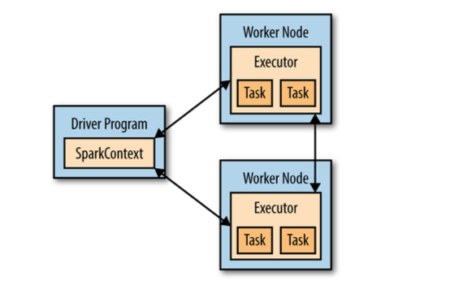

Apache Spark is a cluster computing platform designed to be fast and general-puporse

Python API
https://spark.apache.org/docs/2.2.0/api/python/pyspark.html?highlight=combinebyke#pyspark.RDD.combineByKey


Spark is fast not only it runs computations in memory, but also it is more efficient than MapReduce for complex applications running on disk.

Spark is a "computational engine" that is responsible for scheduling, distributing, and monitoring applications consisting of many computational tasks across many worker machines or a computing cluster.
* Spark Core
    * Containing basic functionality of Spark, including components for task scheduling, memory management, fault recovery, interacting with storage systems, and more.
    Home to the API that defines RDD, providing many APIs for building and manipulating these collections
* Spark SQL
* Spark Streaming 
* MLlib
* GraphX
    Library for manipulating graphs
* Cluster Managers
1. Yarn
2. Standalone
3. Mesos

Storage Layers for Spark (Spark just has support for storage systems implementing the Hadoop APIs, it does not require Hadoop)
Hadoop distributed filesystem (HDFS)
Other sotrage systems supported by the Hadoop APIs
    - local filesystem
    - S3
    - Cassandra
    - Hive
    - HBase

Every Spark application consists of a driver program that launches various parallel operations on a cluster. The driver program contains your application's main function and defines distributed datasets on the cluster, then applies operations to them.
* Driver program access Spark through a SparkContext object, which represents a connection to a computing cluster. In the shell, a SparkContext is automatically created for you as the variable called sc.



* To run these operations, driver programs typically manage a number of nodes called ***executors***. For example, if we were running the count() operation on a cluster, different machines might count lines in different ranges of the file.
    * > lambda x: x+10  <=>  args: expression

Submit your task 
> bin/spark-submit my_script.py

Iniitializing a SparkContext 
```
from pyspark import SparkConf, SparkContext
conf = SparkConf().setMaster("local").setAppName("My App) # A cluster URL, namely lcoal in the example; application name namely My App in the example will identify your application on the cluster manager's UI 
sc = SparkContext(conf = conf)
```