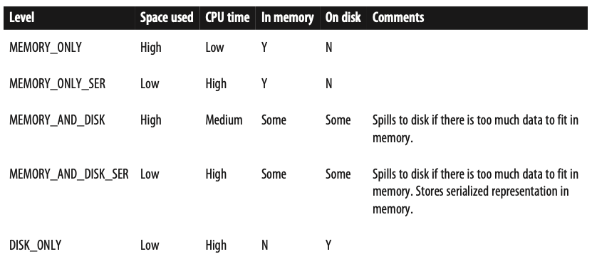

An RDD in Spark is simply in immutable distributed collection of objects. Each RDD is split into multiple partitions, which may be computed on different nodes of the cluster.

Two ways to create RDDs: (RDDs can contain any type of Python, Java or Scala objects, including user-defined classes)
1. load an external dataset
2. distribute a collection of objects (list or set)

RDD offers two types of operation:
* transformations
    * construct a new RDD from a previous one
* Actions
    * compute a result based on an RDD, and either return it to the driver program or save it to an external storage system
* Difference
    * Spark computes RDD only in a lazy fashion. This way Spark can compute just the data needed for its result after it sees the whole chain of transforamtions. <span style="color:red"> When you get confused, look at its return type: transformations return RDDs, whereas actions return some other date type.</span>

RDDs are recomputed each time you run an action on them by default. Reuse RDD is available by using RDD.persist(). We can ask Spark to persist our data in a number of different places (cache() is the same as calling persist() with the default storage level), see below:

```
result = input.map(x => x * x)
result.persist(StorageLevel.DISK_ONLY)
```

### **Creating RDDs**
```
lines = sc.parallelize(['pandas','i like pandas']) 
```
<span style="color:red"> **This is not widely used since it requreis that you have your entire dataset in memeory on one machine.**</span>

### **Transformations**
```
inputRDD = sc.textFile("log.txt")
errorsRDD = inputRDD.filter(lambda: x: "error" in x)
warningsRDD = inputRDD.filter(lambda x: "warning: in x)
badLinesRDD = errorsRDD.union(warningsRDD)
```
sc.textFile(), the data is not loaded until it is necessary.

### **Actions**
```
print("Input had" + badLinesRDD.count() + " concerning lines")
print(" Here are 10 examples:")
for line in badLinesRDD.take(10):
    print(line)
```
Collect() is used to retrieve the entire RDD when the dataset is small. Use case is like parallelize, entire dataset must fit in memory on a single machine to use coolect() on it.
In most cases RDDs cannot just be collect()ed to the driver because they are too large. In these cases, it's common to write data out to a distributed storage system such HDFS or Amazon S3.

### **Passing functions**
1. 
```
word = rdd.filter(lambda s: "error" in s)
```
2. 
```
def containsError(s):
    return "error" in s
word = rdd.filter(containsError)
```
3. 
```
class SearchFunctions(object): 
    def __init__(self, query): 
        self.query = query
    def isMatch(self, s): 
        return self.query in s
    def getMatchesFunctionReference(self, rdd):
        # Problem: references all of "self" in "self.isMatch" 
        return rdd.filter(self.isMatch)
    def getMatchesMemberReference(self, rdd):
        # Problem: references all of "self" in "self.query" 
        return rdd.filter(lambda x: self.query in x)
```
When you pass a function that is the memeber of an object, or contains references to fields in an object, Spark sends the entire object to worked nodes.
```
class WordFunctions(object):
    ...
    def getMatchesNoReference(self, rdd):
        # Safe: extract only the field we need into a local variable
        query = self.query
        return rdd.filter(lambda: x in query in x)
```