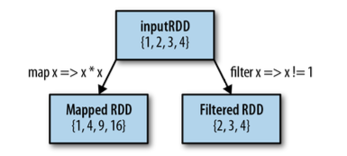
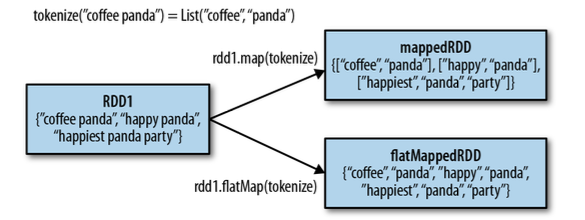
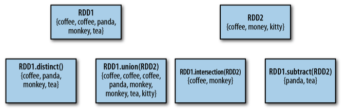
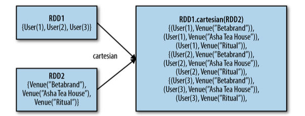

## **Common Transformations and Actions**
### **Transformations**
1. map()
2. filter() 



3. flatMap()



4. distinct()
5. union()
6. intersection()
7. subtract()



8. cartesian()



***Cartesian product***, two sets A x B
>((a1,b1), (a1,b2)... (a1,bn), (a2,b1), (a2,b2)... (a2,bn), (an,b1), (an,b2)...(an,bn))

### **Actions**
RDD containing {1,2,3,4}
1. reduce()  # takes functions taht operates on two elements of the type in RDD and returns a new element of the same type
> rdd.reduce((x,y)=> x+y) 9

2. fold() # similar to reduce(), but takes an additional "zero value" to be used for initial call on each partition. 
> rdd.fold(0)((x,y)=> x+y) 9

> rdd.fold(100)((x,y)=> x+y) 109

3. aggregate() # can return a new RDD type
```
sumCount = nums.aggregate(
    (0,0), 
    (lambda initial, element: (initial[0]+element, initail[1]+1) ),
    (lambda partition_tuple0, partition_tuple1: (
        partition_tuple0[0] + partition_tuple1[0],
        partition_tuple0[1] + partition_tuple1[1] 
        )
        )
)
```
<span style="color:red"> ***It is like fold(), we supply an intial zero value of the type we want to return.***</span>
原始RDD T [1,2,3,4] 新RDD U (9,4)
def aggregate [U] (zeroValue: U) (seqOp: (U, T) => U, combOp: (U, U) => U)
U是新类型 T是每个partition中RDD原始类型
如例子所示,  zeroValue 是一个 tuple (0,0) 
seqOp 作用于每一个partition, 第一个参数是zeroValue 第二个参数是分区的RDD 得出每个分区的新RDD
conbOp 把每个分区的新RDD累加起来得到一个新RDD类型的最终结果


4. collect() # returns the enire RDD's contents, commonly used in unit tests where the eintire contents of the RDD are expected to fit in memeory.

5. take(n) # returns n elements from the RDD and attempts to minimize the number of partitions it accesses, order of emelemnts is not guranteed.

6. top() # if data has defined ordering, top will extract the top elements from an RDD using the defalut ordering 

7. takeSample(withReplacement, num, [seed]) # return num elements at random, seed is difficult to control, can use default value.

8. foreach(func) # 与之对应的是 foreachPartition 两者的关系和map() mapPartition()一样