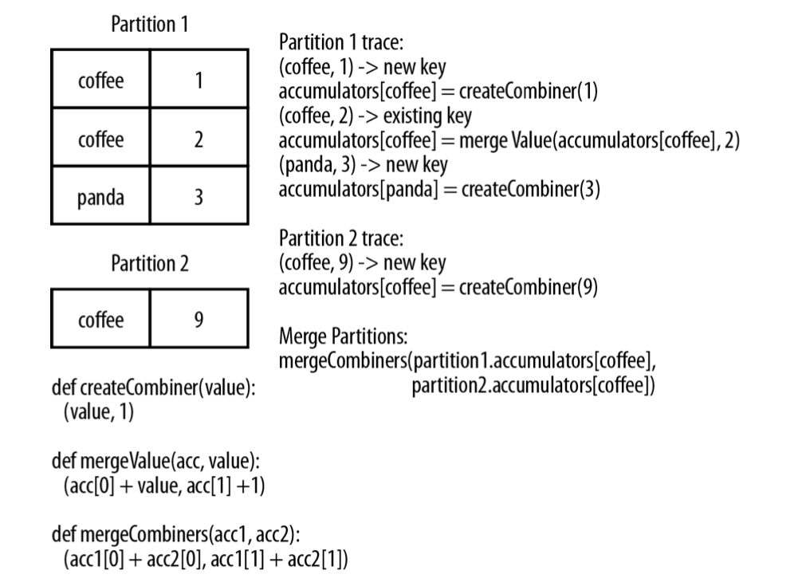
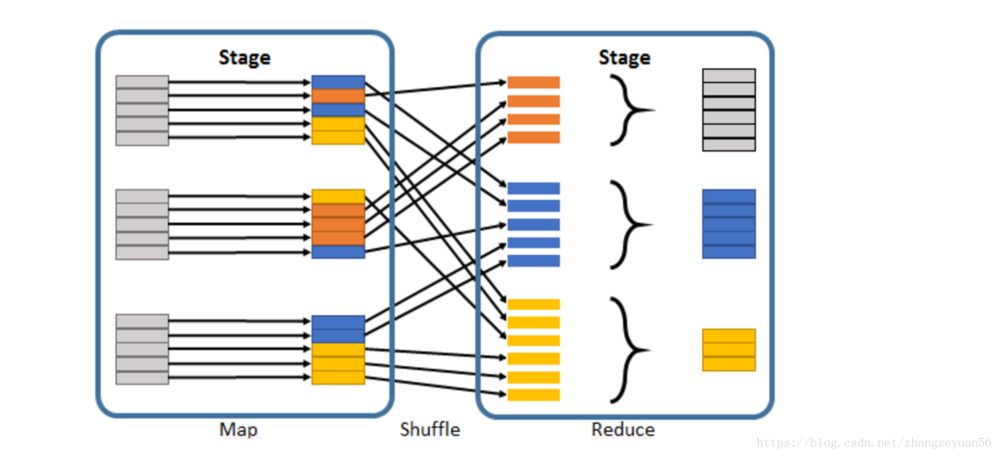

RDDs containing key/value paris are called pair RDDs.

Key/value RDDs are commonly used to perform aggregations, and often we will do some initial ETL to get our data into a key/value format. Key/value Rdds expose new operations like counting up reviews for each product, grouping together data with the same key, and grouping together two different RDDs.
By controlling the partitioning, applications can sometimes greatly reduce communication costs by ensuring that data will be accessed together and will be on the same node. This can provide significatn speedups.

Creating a pair RDD using the first word as the key
> pairs = lines.map(lambda x: (x.split(" ")[0], x))

### ***Transformation on one pair RDD***
*{(1,2), (3,4), (3,6)}*
1. reduceByKey(func)
> rdd.reduceByKey( (x,y) => x+y) # {(1,2), (3,10)}

2. groupByKey()
> rdd.groupByKey() # {(1,[2]), (3, [4,6])}

3. mapValues(func) # apply a function to each value of a pair RDD without changing the key
> rdd.mapValues(x => x+1) # {(1,3), (3,5), (3,7)}

4. flatMapValues(func) # apply a function that returns in iterator to each value of a pair RDD, and for each element returned, produce a key/value entry with the old key. Often used for tokenization.
> rdd.flatMapValues(x => (x to 5)) # {(1,2), (1,3), (1,4), (1,5), (3,4), (3,5)}

5. keys()
> rdd.keys() # {1,3,3}

6. values()
> rdd.values() # {2,4,6}

7. sortByKey()
> rdd.sortByKey() # { (1,2), (3,4), (3,6) }

8. foldByKey(zeroValue)(func) # smiliar to fold function

9. combineByKey( createCombiner, mergeValue, mergeCombiners, partitioner) # combine values with the same key using a different result type. It goes through the elements in a partition, each element either has a key it hasn't seen before or has the same key as a previous element.
* If it's a new element, combineByKey() uses a function we provide, called createCombiner(), to create the initial value for the accumulator on that key. It's important to note that this happens the first time a key is found in each partition, rather than only the first time the key is found in the RDD.
* If it is a value we have seen before while processing that partition, it will instead use the provided function, mergeValue(), with the current value for the accumulator for that key and the new value.
* When we are merging the results from each partition, if two or more partitions have an accumularot for the same key we merge the accumulators using the user-supplied mergeCombiners() function.
```
nums = sc.parallelize([("a", 1), ("b", 1), ("a", 2)])
sumCount = nums.combineByKey((lambda x: (x,1)),
                             (lambda x, y: (x[0] + y, x[1] + 1)),
                             (lambda x, y: (x[0] + y[0], x[1] + y[1]))) 
sumCount.collect()  #  [('b', (1, 1)), ('a', (3, 2))] key does not change, but value is a tuple containing (sum of value, sum of key)

```



### ***Transformation on two pair RDDs***
*rdd = { (1,2), (3,4), (3,6)}  other = { (3,9)}*
1. subtractByKey(RDD) # remove elements with a key present in the other RDD
> rdd.subtractByKey(other) # {(1,2)}

2. join(other) # return an RDD containing all pairs of elements with matching keys in `this` and `other` Each pair of elements will be returned as a (k, (v1,v2)) tuple, where (k,v1) is in `this` and (k,v2) is in `other`
> rdd.join(other) # {(3, (4, 9)), (3, (6, 9))}

3. leftOuterJoin(other) # leftOuterJoin会保留 this 对象的所有key，而用None填充在参数RDD other中缺失的值，因此调用顺序会使结果完全不同。
> rdd.leftOuterJoin(other) # [(1, (2, None)), (3, (4, 9)), (3, (6, 9))]

4. rightOuterJoin(other) # 保留 other 对象的所有key，而用None填充在参数RDD this 中缺失的值，因此调用顺序会使结果完全不同。
> rdd.rightOuterJoin(other) # [(3, (4, 9)), (3, (6, 9))]

5. fullOuterJoin(other) # 
> rdd.fullOuterJoin(other) # [(1, (2, None)), (3, (4, 9)), (3, (6, 9))]

6. cogroup(other) # Group data from both RDDs sharing the same key
> rdd.cogroup(other) # { (1, ([2], [])), (3, ([4,6],[9])) }

### ***Tune the level of parallelism***
RDD分区依赖
窄依赖:
    - 父RDD一个partition只对应一个子RDD的partition (一对一活着多对一) 不会有shuffle的产生
宽依赖:
    - 父RDD的一个partition可以去到子RDD的不同partition当中 (一对多) 会有shuffle的产生

当别人解释啥是shuffle的时候总会提到 reduceByKey 的原因就是如图所示, 从左到有的过程发生了宽依赖的转变, 自然也有了 shuffle 的发生


shuffle https://zhangchenchen.github.io/2018/09/26/deep-in-spark-shuffle/

1. coalesce(numPartitions, shuffle=False) # 口鹅赖斯 合并

2. repartition(numPartitions) # 其内部实现是 调用了 coalesce(numPartitions, True)


### ***Grouping Data***
1. groupByKey() # get back an RDD of type [K, Iterable[V]]
```
rdd = sc.parallelize([("a", 1), ("b", 1), ("a", 1)])
rdd.groupByKey().mapValues(list).collect()
# ('b', [1]), ('a', [1, 1])]
```

2. groupBy(function) # works on unpaired data or data where we want to use different condition besides equality on the current key. It takes a function that it applies to every element in the source RDD and uses the result to determin the key.
```
>>> rdd = sc.parallelize([1, 1, 2, 3, 5, 8])
>>> result = rdd.groupBy(lambda x: x % 2).collect()
>>> sorted([(x, sorted(y)) for (x, y) in result])
[(0, [2, 8]), (1, [1, 1, 3, 5])]

>>>rdd.groupBy(lambda x: x[1]).mapValues(list).collect()
[(1, [('a', 1), ('b', 1), ('a', 1)])]
```

3. cogroup() # cogroup() over two RDDs sharing the same key tupe, K, with respective value types V and W gives us back RDD [(K, (Iterable[V], Iterable[W]))]. If one of the RDDs does not have elements for given key that is present in other RDD, the corresponding ***Iterable*** is simply empty.
```
>>>x = sc.parallelize([("a", 1), ("b", 4),["a",5]])
>>>y = sc.parallelize([("a", 2)])
>>>[(x, tuple(map(list, y))) for x, y in sorted(list(x.cogroup(y).collect()))]
[('a', ([1, 5], [2])), ('b', ([4], []))]
```

### ***Soriting Data***
1. sortByKey(ascending=True, numPartitions=None, keyfunc = lambda x: str(x))
```
>>> tmp = [('a', 1), ('b', 2), ('1', 3), ('d', 4), ('2', 5)]
>>> sc.parallelize(tmp).sortByKey().first()
('1', 3)
>>> sc.parallelize(tmp).sortByKey(True, 1).collect()
[('1', 3), ('2', 5), ('a', 1), ('b', 2), ('d', 4)]
>>> sc.parallelize(tmp).sortByKey(True, 2).collect()
[('1', 3), ('2', 5), ('a', 1), ('b', 2), ('d', 4)]
>>> tmp2 = [('Mary', 1), ('had', 2), ('a', 3), ('little', 4), ('lamb', 5)]
>>> tmp2.extend([('whose', 6), ('fleece', 7), ('was', 8), ('white', 9)])
>>> sc.parallelize(tmp2).sortByKey(True, 3, keyfunc=lambda k: k.lower()).collect()
[('a', 3), ('fleece', 7), ('had', 2), ('lamb', 5),...('white', 9), ('whose', 6)]
```

### ***Actions available on Pair RDDs***
rdd = [(1, 2), (3, 4), (3, 6)]
1. countByKey()
> rdd.countByKey() # defaultdict(<class 'int'>, {1: 1, 3: 2})

2. collectAsMap() # Return the key-value pairs in this RDD to the ***master*** (so data must be small) as a dictionary (so data will be missing).
```
>>>rdd=sc.parallelize([(1,2),(1,4),(3,6),(3,1)])
>>>rdd.collectAsMap()
{1: 4, 3: 1}
```

3. lookup(key) # return all values associated with the provided key
> rdd.lookup(1) # [2]
> rdd.lookup(3) # [4,6]