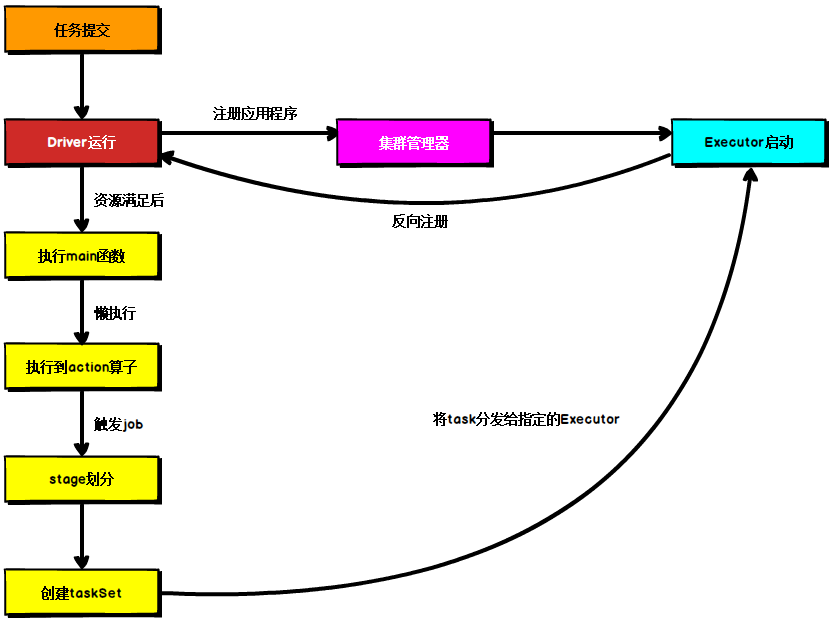

1.  spark 的内置模块
```
spark sql(结构化)   spark streaming(流计算)     spark mlib(机器学习)      spark graphx(图计算)
                        spark core (有一个独立资源调度器)
spark standlone     yarn        essos
```

2. Spark 的特点
快 (基于内存 可迭代计算 一个jar包多个任务: 啥意思呢？就是说 MR 是一次运行一个任务 跑完需要再次提交，Spark 的当前任务的 Reduce 结果 可以作为 下一个任务的 Map 继续使用 ) 易用 通用

3. Spark Core中的核心概念


***Cluster Manager***: An external service for acquiring resources on the cluster (e.g. standalone manager, Mesos, YARN)

The system currently supports several cluster managers:
* Standlone
* Apache Mesos
* Hadoop YARN
* Kubernetes

物理节点 (特指 standalone)
搭建spark集群的时候我们就已经设置好了master节点和worker节点，一个集群有多个master节点和多个worker节点。
这里的 master 和 worker 指的是 standalone 模式下的 资源管理器 和 工作节点
* Master - resource manager 常驻 master 守护进程, 负责管理 worker 节点, 从master节点提交应用
* Worker - node manager 常驻 worker 守护进程, 与 master 节点通信 并管理 executor 进程
PS: 一台机器可以同时作为 master 和 worker 节点

进程
* Driver program - The process running the main() function of the application and creating the SparkContext
driver可以运行在master上，也可以运行worker上（根据部署模式的不同）。driver首先会向集群管理者（standalone、yarn，mesos）申请spark应用所需的资源，也就是executor，然后集群管理者会根据spark应用所设置的参数在各个worker上分配一定数量的executor，每个executor都占用一定数量的cpu和memory。在申请到应用所需的资源以后，driver就开始调度和执行我们编写的应用代码了。driver进程会将我们编写的spark应用代码拆分成多个stage，每个stage执行一部分代码片段，并为每个stage创建一批tasks，然后将这些tasks分配到各个executor中执行

* Executor - A process launched for an application on a worker node, that runs tasks and keeps data in memory or disk storage across them. Each application has its own executors. executor进程宿主在worker节点上，一个worker可以有多个executor。每个executor持有一个线程池，每个线程可以执行一个task，executor执行完task以后将结果返回给driver，每个executor执行的task都属于同一个应用。此外executor还有一个功能就是为应用程序中要求缓存的 RDD 提供内存式存储，RDD 是直接缓存在executor进程内的，因此任务可以在运行时充分利用缓存数据加速运算。


图为Spark通用运行流程，不论Spark以何种模式进行部署，任务提交后，都会先启动Driver进程，随后Driver进程向集群管理器注册应用程序，之后集群管理器根据此任务的配置文件分配Executor并启动，当Driver所需的资源全部满足后，Driver开始执行main函数，Spark查询为懒执行，当执行到action算子时开始反向推算，根据宽依赖进行stage的划分，随后每一个stage对应一个taskset，taskset中有多个task，根据本地化原则，task会被分发到指定的Executor去执行，在任务执行的过程中，Executor也会不断与Driver进行通信，报告任务运行情况。

4. 运行模式
local
standlone
yarn
k8s
主要区别是在于资源调度 resource manager

5. 调教spark任务
/bin/spark-submit \
  --class <main-class> \
  --master <master-url> \
  --deploy-mode <deploy-mode> \
  --conf <key>=<value> \
  ... # other options
  <application-jar> \
  [application-arguments]

6. 移动计算和移动数据
移动数据就是指数据在不同节点来回移动, 因为数据量很大, 所以很消耗资源.
移动计算也叫本地计算, 是指数据存放在节点不在变动, 而是将处理逻辑程序传输到各个数据节点上.
