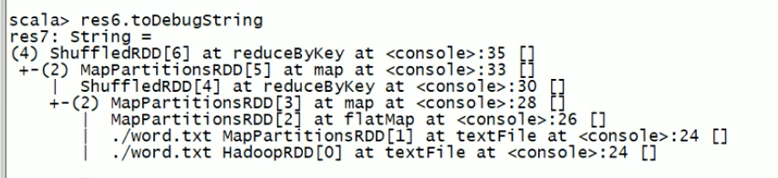

## RDD
A Resilient Distributed Dataset (RDD), the basic abstraction in Spark. Represents an immutable, partitioned collection of elements that can be operated on in parallel. 

5 main properties:
    list of partitions
    function for computing each split
    list of dependencies on other RDDs
    optionally, a partitioner for key-value RDD
    optionally, a list of preferred locations to compute each split (未指定则默认本机,本机房,随机)

RDD的修改是通过转换操作生成一个新的RDD

Resilient
存储的弹性:内存与磁盘的自动切换
容错的弹性:数据丢失可以会懂修复(Executor 计算过程中 内存中的数据丢失了 会自动从头执行 把数据找回来)
计算的弹性:计算出错重试机制 (Driver task整个出错 例如 文件丢失 会把task给其他的机器重试)
分片的弹性:可以在reducebykey中设置分片的参数进行重新分片

Lineage 可用来恢复 data

RDD分区依赖
窄依赖:
    - 父RDD一个partition只对应一个子RDD的partition 不会有shuffle的产生
宽依赖:
    - 父RDD的一个partition可以去到子RDD的不同partition当中 会有shuffle的产生



**|** 表示窄依赖 ***+-*** 发生shuffle 左边括号里的数字表示 ***分区数***

RDD任务切分 分为 Application, Job, Stage and Task
1. Application: Initialize a SparkContext will generate a Application
2. Job: 一个 action 封装成 job
3. Stage: Wide dependency will result in a shuffle and create a new stage
4. 一个分区 一个 task

为什么会有stage？
> 因为 窄依赖 每个task 可以并行无需等待 当发生 宽依赖的时候 下一个 stage 要等前一个stage完全执行完了 才可以继续进行

Job 从后往前根据宽依赖划分 stage 然后从前往后 stage wrap 一个 task

RDD缓存用内存 Checkpoint缓存用磁盘

rdd.persist()
1. lineage不会中断和省略
2. sc管理 # application 退出 则 所有内容丢失 不管是cache还是disk


checkpoint
1. lineage会切断原有的产生新的
2. Spark框架管理
3. 要指定目录
4. 更多时候用在 Spark Streaming
```
sc.setCheckpointDir()
ckrdd=rdd.map()
ckrdd.checkpoint()
ckrdd.collect()
```
collect()会触发两个操作 一个就是collect本身 一个是把数据写入 checkpoint 目录
checkpoint 必须在 action之前调用 否则无效