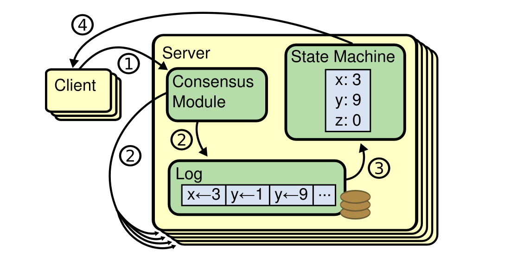

# Distributed System
事务隔离主要是为了 避免由于同时执行事务而导致的竞争状态，而分布式一致性主要关于 在面对延迟和故障时如何协调副本间的状态。
## Consistency
在分布式数据库中，一致性是指系统中所有副本或节点在任何给定时刻都具有相同的数据副本状态。一致性可以分为强一致性和弱一致性。
* strong consistency: 在一个强一致性系统中，任何数据的读操作都会返回最新写入的值，而任何数据的写操作都会立即在所有节点上生效。这确保了在任何时间点，所有节点都具有相同的数据状态。强一致性的特点是非常直观和简单，但由于需要同步所有副本，可能导致一些性能损失。
* weak consistency: 在一个弱一致性系统中，允许在不同节点之间出现一段时间的数据不一致性。数据的写入操作可能需要一些时间才能在所有节点上生效，而数据的读取操作可能会返回旧的值。弱一致性允许系统在可用性和性能方面取得更好的权衡，但可能需要应用程序处理一些额外的逻辑来处理数据不一致性。

### Strong consistency


#### 共识算法
强一致性的本质就是所有节点状态相同, 所以简单直接的方法就是等所有节点都收到更新, 但是太低效. 

由此退一步, 大多数成功即可. 大多数的概念在共识算法中尤为重要. \
法定人数 w=r=n/2+1 \
Paxos吞吐率高, 难实现. Raft容易实现, 效率不如Paxos. Raft的 共识 用了 法定人数即大多数. 投票人数满足大多数时, 共识达成, 操作或者提案`提交`.   `提交`划重点. 

为啥`提交`划重点, 因为 现阶段几乎所有的分布式事务提交都是通过2PC或者2PC的变种提交.

所以让我们看看 2PC, 2PC 是一种分布式事务协议，用于确保在多个节点之间执行事务时，要么全部提交，要么全部回滚。2PC 通常在应用层面使用，它管理事务的准备和提交阶段，以确保多个参与者节点在执行事务时达成一致

#### Raft Paper


Typically use a separate replicated state machine to manage leader election and store configuration information that must survive leader crashes.

Replicated state machines are typically implemented using a replicated log. Each server stores a log containing a series of commands, which its state machine executes in order. 

Raft is an algorithm for managing a replicated log. Raft implements consensus by first electing a distinguished leader, then giving the leader complete responsibility for managing the replicated log. 

If client contacts a follower, follower will redirect request to leader.

Basic consensus algorithm requires only two types of RPCs. RequestVote RPCs are initiated by candidates during elections, and AppendEntries RPCs are initiated by leaders to replicate log entries and to provide a form of heartbeat.
##### leader election
If a follower receives no communication over a period of time called the election timeout, then it assumes there is no viable leader and begins an election to choose a new leader.
To begin an election, a follower increments its current term and transitions to candidate state. It then votes for itself and issues RequestVote RPCs in parallel to each of the other servers in the cluster.\
While waiting for votes, a candidate may receive an AppendEntries RPC from another server claiming to be leader. If the leader’s term (included in its RPC) is at least as large as the candidate’s current term, then the candidate recognizes the leader as legitimate and returns to follower state.
##### log replication
Leader append command to log as an new entry, then issues AppendEntries RPCs in parallel to each of the other servers to replicate the entry. When the entry has been safely replicated (as described below), the leader applies the entry to its state machine and returns the result of that execution to the client. If followers crash or run slowly, or if network packets are lost, the leader retries AppendEntries RPCs indefinitely (even after it has responded to the client) until all followers eventually store all log entries.


A log entry is committed once the leader that created the entry has replicated it on a majority of the servers. Conflicting entries in follower logs will be overwritten with entries from the leader’s log. 

The leader maintains a nextIndex for each follower, which is the index of the next log entry the leader will send to that follower.
If a follower’s log is inconsistent with the leader’s, the AppendEntries consistency check will fail in the next AppendEntries RPC. After a rejection, the leader decrements nextIndex and retries the AppendEntries RPC. Eventually nextIndex will reach a point where the leader and follower logs match. When this happens, AppendEntries will succeed, which removes any conflicting entries in the follower’s log and appends entries from the leader’s log (if any). (To reduce the number of rejected AppendEntries RPC, follower can include the term of the conflicting entry and the first index it stores for that term)

##### safety
Raft uses the voting process to prevent a candidate from winning an election unless its log contains all committed entries. The RequestVote RPC implements this restriction: the RPC includes information about the candidate’s log, and the voter denies its vote if its own log is more up-to-date than that of the candidate.\
Raft determines which of two logs is more up-to-date by comparing the index and term of the last entries in the logs.
##### Committing entries from previous terms
Only log entries from the leader’s current term are committed by counting replicas; once an entry from the current term has been committed in this way, then all prior entries are committed indirectly because of the Log Matching Property.
##### Follower and candidate crashes
If a follower or candidate crashes, then future RequestVote and AppendEntries RPCs sent to it will fail. Raft handles these failures by retrying indefinitely; if the crashed server restarts, then the RPC will complete successfully. If a server crashes after completing an RPC but before responding, then it will receive the same RPC again after it restarts. Raft RPCs are idempotent, so this causes no harm.
##### Timing and availability
```
broadcastTime ≪ electionTimeout ≪ MTBF
```
MTBF is the average time between failures for a single server.\
1. The broadcast time may range from 0.5ms to 20ms, depending on storage technology.
2. The election timeout is likely to be somewhere between 10ms and 500ms. 
3. Typical server MTBFs are several months or more, which easily satisfies the timing requirement.
#### Raft
Raft 将时间划分为任期（term），每个任期由一个选举过程来选出一个 leader。在一个任期内，leader 负责处理客户端的请求，其他节点则作为从节点（follower）来复制 leader 的操作并保持一致。如果 leader 失效，Raft 会通过新的选举过程选出一个新的 leader。

heart beat 来回 几ms～十几ms 较大物理距离 几百到几千公里 一次heart beat 几十ms～几百ms