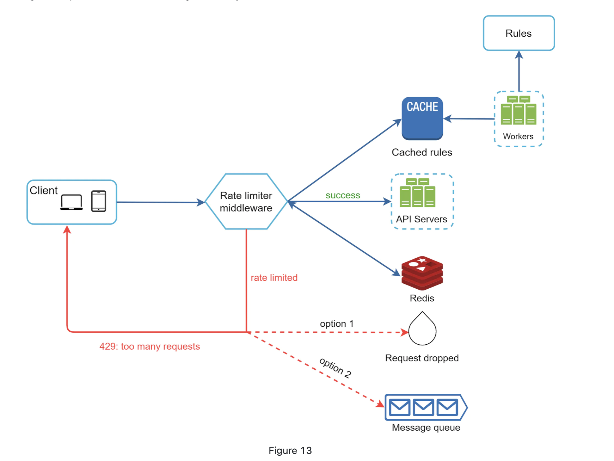

## 壹 Token bucket
easy to implement, memory efficient. only takes two parameters:
1. bucket size
2. refill rate
3. Token bucket allows a burst of traffic for short periods

## 贰 Leaking bucket
implemented with a FIFO queue. 
1. Requests are processed at a fixed rate therefore it is suitable for use cases that a stable outflow rate is needed.

## 叁 Fixed Window Counter
counter in each time window.
1. a burst of traffic at the edges of time windows could cause more requests than allowed quota to go through

## 肆 Sliding Window Log & Sliding Window Counter

## 伍 Distributed Environment Rate Limiter

INCR in Redis is an atomic operation, when client send a INCR to server, Redis server will add it to a transaction, Redis will run the transaction one by one to make sure its atomic.

In Redis Cluster, to avoid race conditions, we can use Redis transactions along with optimistic locking.

Optimistic locking is a technique where you assume that no other process is modifying the data that you are accessing, and you proceed with your updates. However, before you commit your changes, you check if any other process has modified the same data. If there are no conflicts, you commit your changes; otherwise, you retry the operation.

If two changes are committed to the same Redis Cluster at the same time, they will be processed sequentially by the Redis Cluster Raft. When two changes are committed at the same time, they will be assigned different sequence numbers by Raft.

One thing to note, Redis do not support rollback. If the first command succeeds and the second command fails in a transaction, then the effects of the first command are still persisted to the Redis database. You can use Lua script to implement rollback.