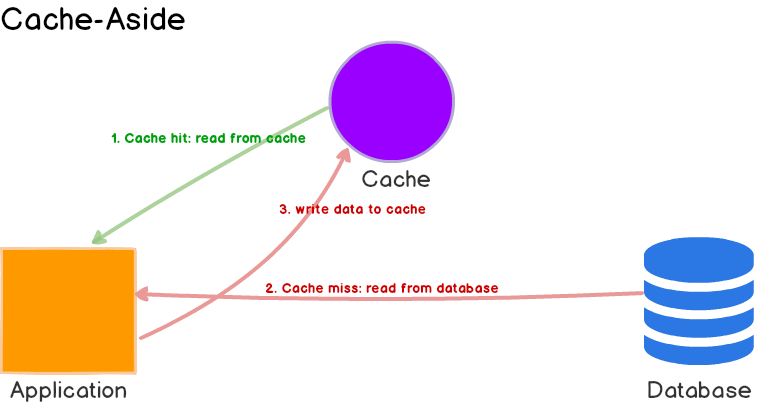

# Cache strategy
## Cache-Aside

Best for read-heavy workloads. Data model in cache can be different than the data model in database.

When cache-aside is used, cache may become inconsistent with database. For example, A write to DB, B read cache, hit cache but data is stale. To avoid this, developers generally use TTL. If data freshness must be guranteed, can invalidate the cache entry, like delete it from cache. Force a cache miss happen.

## Cache in between 
### Read through
Very similar with cache aside, at least tow key differences:
1. Application is responsible for writing data to cache when cache miss happens. In read-through, if cache miss happens, cache will read data from DB and store it in cache
2. data model in read-through cache cannot be different than that of the database.

For read-heavy workload, when data is requested the first time, it always results in cache miss and extra penalty of loading data to cache. Pre-heat the cache by issuing queries is a solution.

read-heavy workload like a news story
### Write-Through
Apllication writes to Cache and cache writes to DB
When paired with read-through cache, it works efficiently but if cache is down, data is lost

### Write-Around
Data is written directly to the database and move it to cache only the data is read. Combine with read-through will provide good performance in situations where data is written once and read less frequently or never. For example, real-time logs or chatroom messages.

### Write-Back
Application writs data to the cache and after some delay, cache writes data(could be multiple write results) back to DB. \
Write back improve the write performance and good for write-heavy workloads. When combined with read-through, it works good for mixed workloads.

### What if cache is down and data lost in cache
Redis cluster. replica of redis server. What if master failed before it copy data to follower?
Guess something similar with MySql
1. redo log
used during crash recovery to correct data written by incomplete transactions
2. undo log
used for rollback
3. bin log
used for master-slave copy
### master slave
主节点\
1、当主节点上进行 insert、update、delete 操作时，会按照时间先后顺序写入到 binlog 中；

2、当从节点连接到主节点时，主节点会创建一个叫做 binlog dump 的线程；

3、一个主节点有多少个从节点，就会创建多少个 binlog dump 线程；

4、当主节点的 binlog 发生变化的时候，也就是进行了更改操作，binlog dump 线程就会通知从节点 (Push模式)，并将相应的 binlog 内容发送给从节点；

从节点
当开启主从同步的时候，从节点会创建两个线程用来完成数据同步的工作。

I/O线程： 此线程连接到主节点，主节点上的 binlog dump 线程会将 binlog 的内容发送给此线程。此线程接收到 binlog 内容后，再将内容写入到本地的 relay log。

SQL线程： 该线程读取 I/O 线程写入的 relay log，并且根据 relay log 的内容对从数据库做对应的操作。

## Cache Penetration
Data cannot be found from either the cache or database that has been requested in huge volume.
1. Bloom filter
2. cache the empty result for short time
3. Hystrix(rate limiter)
4. application level token

## Cache breakdown
hotspot invalid.
1. cache never expire
2. mutex, when data is empty, only 1 request is allowed to pass to pull the date from db and update cache.

## Cache Avalanche 缓存雪崩
at some point in time or within a short period of time, the cache set fails or the cache system fails or there is not data in the cache.
1. redis die? Cluster. restore? RDB(snapshot) AOF(Append only file)
2. Keys exipre at the same time? add a random number to expiration
3. Hystrix
4. application cache

