## Hash
哈希函数是一种将输入数据映射为固定长度输出的算法，它的特性之一就是相同的输入将始终产生相同的输出. hash是单向的

```python

from Crypto.Hash import RIPEMD160,SHA256
def sha256(s):
    h = SHA256.new()
    h.update(s)
    print(h.hexdigest())
def ripemd160(s):
    h = RIPEMD160.new()
    h.update(s)
    print(h.hexdigest())
def hash160(s):
    h=SHA256.new()
    h.update(s)
    hh=h.hexdigest()
    r=RIPEMD160.new()
    r.update(hh.encode())
    print(r.hexdigest())
# or hash256
def dhash(s):
    h = SHA256.new()
    h.update(s)
    hh = h.hexdigest()

    h.update(hh.encode())
    print(h.hexdigest())

a1=dhash(tx1)
a2=dhash(tx2)
a3=dhash(tx3)
a4=dhash(tx4)
```
### Merkle Hash
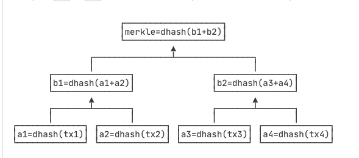
If the tree is not a full binary tree
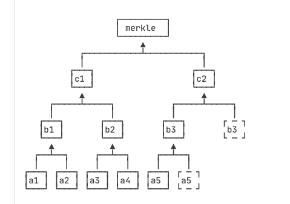
### Block Head
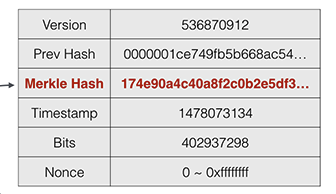
区块本身用Block Hash——也就是区块哈希来标识。但是，一个区块自己的区块哈希并没有记录在区块头部，而是通过计算区块头部的哈希得到的

### Digital signature
常用的数字签名算法有: RSA, DSA & ECDSA. 比特币采用的签名算法是椭圆曲线签名算法ECDSA, 使用的椭圆曲线是一个已经定义好的标准曲线secp256k1:
y^2 = x^3 + 7
比特币采用的ECDSA签名算法需要一个私钥和公钥组成的密钥对: 私钥本质上就是一个1~2^256的随机数, 公钥由私钥根据ECDSA算法推算出来, 通过私钥可以容易推算公钥. \
比特币的私钥是一个随机的非常大的256位整数, 而比特币的公钥匙根据私钥推算出的两个256位整数
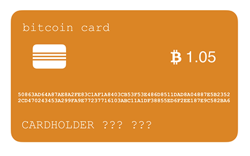
用银行卡做比较 公钥 相当于银行卡卡号 他是两个256位整数\
私钥相当于银行卡密码\
银行卡的卡号由银行指定，银行卡的密码可以由用户随时修改。而比特币"卡"和银行卡的不同点在于：密码（实际上是私钥）由用户先确定下来，然后计算出"卡号"（实际上是公钥），即卡号是由密码通过ECDSA算法推导出来的，不能更换密码，因为更换密码实际上相当于创建了一张新卡片。

比特币私钥的安全性在于如何生成一个安全的256位的随机数。不要试图自己想一个随机数，而是应当使用编程语言提供的安全随机数算法，但绝对不能使用伪随机数。

### P2P钱包
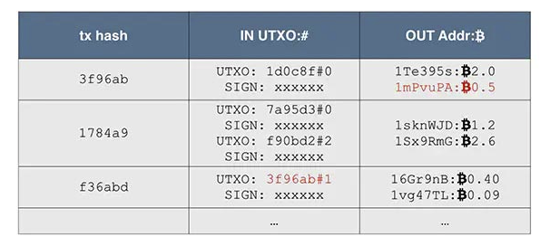
比特币实际的交易记录是由一系列交易构成, 每一个交易都包含一个或多个输入/输出. 未花费的输出被称为UTXO(Unspent Transaction Output)
当我们要简单验证某个交易的时候，例如，对于交易f36abd，它记录的输入是3f96ab，索引号是1（索引号从0开始，0表示第一个输出，1表示第二个输出，以此类推），我们就根据3f96ab找到前面已发生的交易，再根据索引号找到对应的输出是0.5个比特币，所以，这笔交易的输入总计是0.5个比特币，输出分别是0.4个比特币和0.09个比特币，隐含的交易费用是0.01个比特币

### 私钥
```python
    def generate_private_key():
        # Generate a random 256-bit hexadecimal number
        # 32bytes=256bit
        private_key = secrets.token_hex(32)
        return private_key


    # Generate a private key
    private_key = generate_private_key()
    print("Private Key:", private_key)
```
由于每个十六进制字符可以表示4个二进制位（0-15之间的值），两个十六进制字符组合起来可以表示一个字节（8个二进制位）。\
想要记住一个256位的整数是非常困难的，并且，如果记错了其中某些位，这个记错的整数仍然是一个有效的私钥，因此，比特币有一种对私钥进行编码的方式，这种编码方式就是带校验的Base58编码。(相比Base64，Base58不使用数字"0"，字母大写"O"，字母大写"I"，和字母小写"l"，以及"+"和"/"符号。)

对私钥进行Base58编码有两种方式，一种是非压缩的私钥格式，一种是压缩的私钥格式，它们分别对应非压缩的公钥格式和压缩的公钥格式。

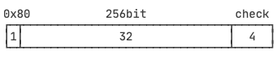
32字节前添加一个0x80字节前缀, 得到33字节的数据, 对其计算4字节的校验码, 附加到最后, 一共得到37字节的数据. 4字节的校验码计算是通过对33位字节的数据进行两次 SHA256 取开头4字节作为校验码.

对37字节的数据进行Base58编码, 得到总是以5开头的字符串编码. 这个字符串就是我们需要非常小心的保存的私钥地址, 又称为钱包导入格式: Wallet Import Format

A 32-byte integer represents a numerical value that occupies 32 bytes of memory. In most programming languages, a byte consists of 8 bits, so a 32-byte integer would occupy 256 bits of memory.

比特币的私钥本质上就是一个256位整数，对私钥进行WIF格式编码可以得到一个带校验的字符串。

使用非压缩格式的WIF是以5开头的-087字符串。

使用压缩格式的WIF是以K或L开头的字符串。

### 公钥
私钥->公钥
1. 选择椭圆曲线参数：
比特币中常用的椭圆曲线是 secp256k1，它有一组特定的参数，包括椭圆曲线的方程、基点等。这些参数是固定的，已经在比特币网络中得到广泛使用。
2. 生成基点（公共参数）：
选择椭圆曲线上的一个基点（通常称为 G），它是一个已知的公共参数。
3. 生成公钥：
    * 将私钥（一个256位整数）表示为一个大整数，记作 k。
    * 使用椭圆曲线上的点乘法运算，计算公钥坐标 P = k * G。
    * 公钥 P 的坐标为 (x, y)，其中 x 和 y 都是256位整数。
4. 公钥的表示：
    * 非压缩格式：将公钥表示为 (x, y) 的形式。x 和 y 都是256位整数。
    * 压缩格式：根据 y 的奇偶性，选择表示方式。如果 y 是奇数，使用前缀 "03" 加上 x 的表示；如果 y 是偶数，使用前缀 "02" 加上 x 的表示。这样得到的压缩格式公钥只包含 x 值，而 y 的奇偶性可以从前缀推断出来。

如何根据非压缩格式公钥的坐标 (x,y) 推导出 压缩格式公钥 x' 的值:
1. 获取 y 的奇偶性：
通过观察 y 的值，可以确定其奇偶性。具体而言，如果 y 是奇数，则用前缀 "03" 标识压缩格式公钥；如果 y 是偶数，则用前缀 "02" 标识压缩格式公钥。
2. 推算 x'：
推算 x' 的步骤基于椭圆曲线的方程和知道 y 值的情况。假设我们使用比特币中常见的 secp256k1 椭圆曲线。
    * 对于 y 的奇数情况（前缀 "03"）：
        * 计算 x 的平方：x^2 = (y^2 - 1) / (d * y^2 + 1)，其中 d 是 secp256k1 曲线的参数。
        * x 的值为正平方根，即 x = √(x^2)。
    * 对于 y 的偶数情况（前缀 "02"）：
        * 计算 x 的平方：x^2 = (y^2 - 1) / (d * y^2 - 1)。
        * x 的值为正平方根，即 x = √(x^2)。

注意，推导出的 x' 是一个正平方根，具体取正或负根需要根据上下文或规范进行确定。在比特币中，一般默认选择正根。

需要强调的是，推导压缩格式公钥的 x' 值是基于特定的椭圆曲线参数和规范。不同的椭圆曲线和标准可能会有稍微不同的推导过程，因此在实际应用中需要根据所使用的曲线和规范进行适当的推导。

### 地址
公钥->地址\
压缩格式为例:\
1+32=33字节的公钥数据进行Hash160得到20字节的Hash.然后添加 0x00前缀, 得到1+20=21字节的前缀, 再计算4字节校验码, 拼在一起, 总计得到 1+20+4=25字节数据

要注意，对非压缩格式的公钥和压缩格式的公钥进行哈希编码得到的地址，都是以1开头的，因此，从地址本身并无法区分出使用的是压缩格式还是非压缩格式的公钥. 以1开头的字符串地址即为比特币收款地址，可以安全地公开给任何人.

对于比特币中的公钥，可以通过不同的地址推导出多个地址。这是由于比特币地址生成过程中涉及到一些变化的因素，包括地址类型、前缀字节、校验和等

生成地址的具体方式和数量取决于具体的实现和需求。不同的地址表示方式和网络类型可能具有不同的用途和兼容性

### 签名
私钥签名 公钥验证\
原理非常简单，有一个数学方程，在图上画了一条曲线，然后你在这条曲线上面随机选取了一个点作为你的原点(point of origin)。接着你产生了一个随机数，作为你的私钥(Private key)，最后你用上面的随机数和原点通过一些复杂的魔法数学方程得到该条曲线上面的第二个点，这是你的公钥(Public key)。

当你想要对一个文件进行签名的时候，你会用这个私钥（随机数）和文件的哈希（一串独一无二的代表该文件的数）组成一个魔法数学方程，这将给出你的签名。签名本身将被分成两部分，称为R和S。为了验证签名的正确性，你只需要公钥（用私钥在曲线上面产生的点）并将公钥和签名的一部分S一起代入另外一个方程，如果这个签名是由私钥正确签名过的数字签名，那么它将给出签名的另外一部分R。简单来说，一个数字签名包含两个数字，R和S，然后你使用一个私钥来产生R和S，如果将公钥和S代入被选定的魔法数学方程给出R的话，这个签名就是有效的。仅仅知道公钥是无法知道私钥或者创建出数字签名。
### 可编程支付原理
比特币的支付实际上并不是直接支付到对方的地址，而是一个脚本，这个脚本的意思是：谁能够提供另外一个脚本，让这两个脚本能顺利执行通过，谁就能花掉这笔钱\
在Bob给Alice支付0.15个BTC的交易中, Bob创建的输出脚本类似:
```bash
OP_DUP OP_HASH160 <Alice Public Key Hash> OP_EQUAL OP_CHECKSIG
```
这个脚本的意思是, 谁能够提供一个签名(签名由私钥生成)和一个公钥, 让这个脚本运行通过, 谁就能花费这笔交易的0.15 BTC. \
解锁脚本如同:
```bash
<Alice Signature> <Alice Public Key>
```
将两个脚本结合起来可以形成如下有效组合脚本:
```bash
<Alice Signature> <Alice Public Key> OP_DUP OP_HASH160
<AlicePublic Key Hash> OP_EQUAL OP_CHECKSIG
```
签名->公钥->公钥+1->加一的公钥hash160和locking script的AlicePublic Key Hash比较
```bash
          DATA 48 (30450221...68fa9b01)
          DATA 21 (03dd8763...14cf740f)
        OP_DUP 76
    OP_HASH160 a9
          DATA 14 (dc5dc65c...fe9f489c)
OP_EQUALVERIFY 88
   OP_CHECKSIG ac
   ```
1. 执行第一行代码 入栈(签名)
2. 第二行入栈 (公钥)
3. 第三行 复制栈顶元素也就是把公钥复制一份(从上到下 公钥, 公钥, 签名)
4. OP_HASH160 计算栈顶数据的 hash160 然后替换栈顶数据
5. 接下来是数据, 直接压入栈
6. OP_EQUALVERIFY  比较栈顶两份数据是否相同, 如果相同, 弹出两者并执行下一步
7. OP_CHECKSIG 用栈顶公钥验证栈底签名


从脚本的角度来解释交易，交易就是：解锁前一个锁定脚本，建一个新的锁定脚本

比特币的交易本质是成功执行解锁脚本和锁定脚本，所以，可以编写各种符合条件的脚本。比如，有人创建了一个交易，它的锁定脚本像这样:
```bash
OP_HASH256
      DATA 6fe28c0ab6f1b372c1a6a246ae63f74f931e8365e15a089c68d6190000000000
  OP_EQUAL
```
它的意思是说，谁能够提供一个数据，它的hash256等于6fe28c0a...，谁就可以花费这笔输出。所以，解锁脚本实际上只需要提供一个正确的数据，就可以花费这笔输出。点这里查看谁花费了该输出

### 多重签名
多重签名就是N-M模式, 只要M人同意签名 就可以用动用某个资金. \
多重签名地址实际上是一个Script Hash. 脚本哈希的基本原理是将一个脚本（通常是包含多个公钥或其他条件的脚本）进行哈希处理，得到一个哈希值，然后将该哈希值作为交易输出脚本的一部分。这个哈希值被称为脚本哈希。

```bash
OP_HASH160 [script hash] OP_EQUAL
```
We call it P2SH, Pay to Script Hash,他的含义是向与该哈希匹配的脚本支付. 与这个hash匹配的脚本被称为赎回脚本Redeem Script. 发出去给人签名. 花费多重签名地址的资金需要的脚本就是M个签名+Redeem Script.

从多重签名的地址本身并无法得知该多重签名使用的公钥，以及M-N的具体数值。必须将Redeem Script公示给每个私钥持有人，才能够验证多重签名地址是否正确（即包含了所有人的公钥，以及正确的M-N数值）。要花费多重签名地址的资金，除了M个私钥签名外，必须要有Redeem Script（可由所有人的公钥构造）。只有签名，没有Redeem Script是不能构造出解锁脚本来花费资金的。因此，保存多重签名地址的钱包必须同时保存Redeem Script

### UTXO
比特币的区块链由一个个区块串联构成，而每个区块又包含一个或多个交易.\
如果我们观察任何一个交易，它总是由若干个输入（Input）和若干个输出（Output）构成，一个Input指向的是前面区块的某个Output，只有Coinbase交易（矿工奖励的铸币交易）没有输入，只有凭空输出。所以，任何交易，总是可以由Input溯源到Coinbase交易
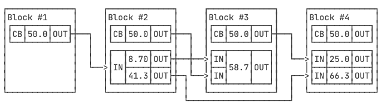
还没有被下一个交易花费的Output被称为 UTXO: Unspent TX Output.即未花费交易输出. 给定一个区块, 计算当前所有的UXTO金额之和, 等同于自创世区块到给定区块的挖矿奖励之和.

因此，比特币的交易模型和我们平时使用的银行账号有所不同，它并没有账户这个说法，只有UTXO。想要确定某个人拥有的比特币，并无法通过某个账户查到，必须知道此人控制的所有UTXO金额之和。

在钱包程序中，钱包管理的是一组私钥，对应的是一组公钥和地址。钱包程序必须从创世区块开始扫描每一笔交易，如果：
1. 遇到某笔交易的某个Output是钱包管理的地址之一，则钱包余额增加；
2. 遇到某笔交易的某个Input是钱包管理的地址之一，则钱包余额减少。

那么，给定一个地址，要查询该地址的余额，难道要从头扫描几百GB的区块链数据？  \
对区块链进行查询之前，首先要扫描整个区块链，重建一个类似关系数据库的地址-余额映射表。这个表的结构如下\
```bash
address	   balance	lastUpdatedAtBlock
address-1	50.0	0
address-2	40.0	3
address-3	50.0	3
address-4	10.0	3
```
这样，扫描完所有区块后，我们就得到了整个区块链所有地址的完整余额记录，查询的时候，并不是从区块链查询，而是从本地数据库查询。大多数钱包程序使用LevelDB来存储这些信息，手机钱包程序则是请求服务器，由服务器查询数据库后返回结果。

### SegWit地址
1. 公钥计算hash160
2. bech32编码等到更长编码
3. 以bc作为识别码进行编码并带校验

beach32实际上由两部分组成: 一部分是bc这样的前缀, 被称为HRP(Human Readable Part)另一部分是特殊的Base32编码, 使用字母表 `qpzry9x8gf2tvdw0s3jn54khce6mua7l`, 中间用1连接\
为什么引入SegWit地址? 按照官方说法, 他有两个用途
1. 解决比特币交易的延展性攻击. 
2. 能"变相的"增加Bitcoin block 的capacity (为啥变相加引号, 因为从数据块实际的大小改变了, 但是block结构体关注的结构被抽离了sig部分, 导致block块可容纳的交易变多)


什么是延展性攻击？回顾一下比特币的区块链如何保证一个交易有效并且不被修改:
1. 每个交易都必须签名才能花费输入(UTXO)
2. 所有交易的hash以Merkle Tree计算并存储到区块头

交易的细节, 假设一个输入一个输出, 它类似:
```bash
tx = ... input#index ... signature ... output-script ...
```
整个交易的哈希可以根据交易本身计算
```bash
tx-hash = dhash(tx)
```
只要签名是有效的, tx本身应该能固定下来, 但是ECDSA签名算法,基于私钥计算的签名实际上是两个整数，记作(r, s)，但由于椭圆曲线的对称性，(r, -s mod N)实际上也是一个有效的签名（N是椭圆曲线的固定参数之一）。换句话说，对某个交易进行签名，总是可以计算出两个有效的签名，并且这两个有效的签名还可以互相计算出来

黑客可以在某一笔交易发出但并未落块的时间内，对签名进行修改，使之仍是一个有效的交易。注意黑客并无法修改任何输入输出的地址和金额，仅能修改签名。但由于签名的修改，使得整个交易的哈希被改变了。如果修改后的交易先被打包，虽然原始交易会被丢弃，且并不影响交易安全，但这个延展性攻击可用于攻击交易所

要解决延展性攻击的问题，有两个办法，
1. 对交易签名进行归一化（Normalize）。因为ECDSA签名后总有两个有效的签名(r, s)和(r, -s mod N)，那只接受数值较小的那个签名，为此比特币引入了一个SCRIPT_VERIFY_LOW_S标志仅接受较小值的签名。
2. 把签名数据移到交易之外，这样交易本身的哈希就不会变化。不含签名的交易计算出的哈希称为wtxid，为此引入了一种新的隔离见证地址。这些地址以"3"或"bc1"开头，用于接收SegWit交易。使用SegWit地址发送交易可以获得更低的交易费用，并且具有更快的确认时间。

### HD钱包
通过某种deterministic algorithm, 可以先确定一个私钥k1, 然后计算出k2,k3,k4...等其他私钥, 就相当于只需要管理一个私钥, 剩下的私钥可以按需计算出来.\
管理一个根私钥, 实时计算出所有"子私钥"的管理方式, 称为 HD(Hierarchical Deterministic) 钱包.
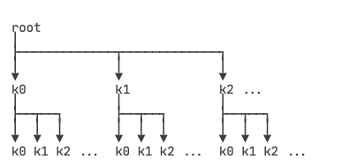
Kn=hdkey(K,n)\
HD层级实际上是无限的，每一层索引从0～23^2，约43亿个子key。这种计算被称为衍生（Derivation）

hdkey(k,n)如何实现? 不是简单的SHA-256, 也不是普通的256位ECDSA私钥, 而是一个扩展的512位私钥,计作xprv, 他通过SHA-512算法配合ECC计算出子扩展私钥, 仍然是512位. 通过扩展私钥可计算出用于签名的私钥以及公钥.\
简单来说，只要给定一个根扩展私钥（随机512位整数），即可计算其任意索引的子扩展私钥。扩展私钥总是能计算出扩展公钥，记作xpub
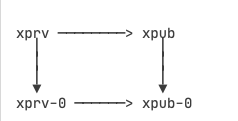
从xprv及其对应的xpub可计算出真正用于签名的私钥和公钥。之所以要设计这种算法，是因为扩展公钥xpub也有一个特点，那就是可以直接计算其子层级的扩展公钥
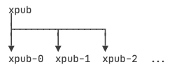
因为xpub只包含公钥，不包含私钥，因此，可以安全地把xpub交给第三方（例如，一个观察钱包），它可以根据xpub计算子层级的所有地址，然后在比特币的链上监控这些地址的余额，但因为没有私钥，所以只能看，不能花。
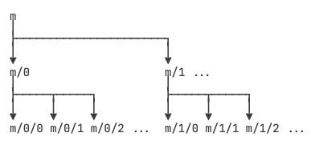
通常把根扩展私钥记作m，子扩展私钥按层级记作m/x/y/z

HD钱包的扩展私钥算法有个潜在的安全性问题，就是如果某个层级的xprv泄露了，可反向推导出上层的xprv，继而推导出整个HD扩展私钥体系。为了避免某个子扩展私钥的泄漏导致上层扩展私钥被反向推导，HD钱包还有一种硬化的衍生计算方式（Hardened Derivation），它通过算法"切断"了母扩展私钥和子扩展私钥的反向推导。HD规范把索引0～231作为普通衍生索引，而索引231～232作为硬化衍生索引，硬化衍生索引通常记作0'、1'、2'……，即索引0'=231，1'=231+1，2'=231+2，以此类推。

因此，m/44'/0表示的子扩展私钥，它的第一层衍生索引44'是硬化衍生，实际索引是231+44=2147483692。从m/44'/0无法反向推导出m/44'。

在只有扩展公钥的情况下，只能计算出普通衍生的子公钥，无法计算出硬化衍生的子扩展公钥，即可计算出的子扩展公钥索引被限制在0～231。因此，观察钱包能使用的索引是0～231。

### 钱包层级: BIP-44
比特币的BIP-44规范定义了一种如何派生私钥的标准，它本身非常简单
```bash
m / purpose' / coin_type' / account' / change / address_index
```
其中 purpose总是44, coin_type在SLIP-44种定义, 例如 0=BTC, 2=LTC, 60=ETH etc.
account 表示用户的某个账户, 由用户自定义索引, address_index则是真正派生的索引为0～2^31的地址。\

1. 外部地址（change=0）：用于接收交易的资金，例如从其他人发送的比特币或其他加密货币。这些地址通常用于收款目的，将资金从外部转移到钱包中。
2. 找零地址（change=1）：用于接收交易中剩余的资金，也称为找零。当您发送一笔交易并支付给对方后，可能会剩下一些未使用的金额。这些未使用的金额会被发送到找零地址，作为交易的一部分。

1. internal transactions: 内部交易是指在区块链网络内部发生的交易，主要涉及合约之间的交互或智能合约的内部操作。这些交易并不直接影响账户的余额或账户间的价值转移。内部交易是在区块链上记录的，但不会被广播到整个网络或写入主要的交易历史记录。它们通常是作为合约执行的一部分发生的事件，用于触发合约中的特定逻辑或操作。
2. external transactions: 外部交易是指在区块链网络中账户之间发生的常规交易，涉及货币的转移或价值的交换。这些交易会直接影响账户的余额，并且会广播到整个网络中进行确认和验证。外部交易是加密货币网络中最常见的交易形式，包括发送加密货币、接收加密货币或在不同账户之间进行价值交换的操作。

### Mnemonic Phrase
Also known as the seed phrase or recovery phrase, is a standardized way of representing a cryptographic wallet's seed. It consists of a sequence of words selected from a predefined wordlist. The most commonly used wordlist is defined by BIP-39 

Mnemonic phrase + passphrase -> HD wallet seeds