### Load(负载)
Load can be described with a few numbers which we call load parameters. The best choice of parameters depends on the architecture of your system: it may be requests per second to a web server, the ratio of reads to writes in a database, the number of simultaneously active users in a chat room, the hit rate on a cache, or something else. Perhaps the average case is what matters for you, or perhaps your bottleneck is dominated by a small number of extreme cases.

### Describing the performance
You can look at it in two ways:
* When you increase a load parameter and keep the system resources (CPU, mem‐ ory, network bandwidth, etc.) unchanged, how is the performance of your system affected?
* When you increase a load parameter, how much do you need to increase the resources if you want to keep performance unchanged?

### P50
If you take your list of response times and sort it from fastest to slowest, then the median is the halfway point. For example, if your median response time is 200 ms, that means half your requests return in less than 200 ms, and half your requests take longer than that.  为了弄清异常值有多糟糕，可以看看更高的百分位点，例如第95、99和99.9百分位点（缩写为p95，p99和p999）。它们意味着95％，99％或99.9％的请求响应时间要比该阈值快，例如：如果第95百分位点响应时间是1.5秒，则意味着100个请求中的95个响应时间快于1.5秒，而100个请求中的5个响应时间超过1.5秒。响应时间的高百分位点（也称为尾部延迟（tail latencies））非常重要，因为它们直接影响用户的服务体验。

### Abstraction 
Making a system simpler does not necessarily mean reducing its functionality; it can also mean removing accidental complexity. Moseley and Marks define complexity as accidental if it is not inherent in the problem that the software solves (as seen by the users) but arises only from the implementation.
One of the best tools we have for removing accidental complexity is abstraction. A good abstraction can hide a great deal of implementation detail behind a clean, simple-to-understand façade. A good abstraction can also be used for a wide range of different applications. Not only is this reuse more efficient than reimplementing a similar thing multiple times, but it also leads to higher-quality software, as quality improvements in the abstracted component benefit all applications that use it.
For example, high-level programming languages are abstractions that hide machine code, CPU registers, and syscalls.

### Declarative vs Imperative
```
function getSharks() { var sharks = [];
for (var i = 0; i < animals.length; i++) { if (animals[i].family === "Sharks") {
sharks.push(animals[i]); }
}
return sharks; }
```
An imperative language tells the computer to perform certain operations in a certain order.<br>
```
SELECT * FROM animals WHERE family = 'Sharks';
```
In a declarative query language, like SQL or relational algebra, you just specify the pattern of the data you want—what conditions the results must meet, and how you want the data to be transformed (e.g., sorted, grouped, and aggregated)—but not how to achieve that goal. It is up to the database system’s query optimizer to decide which indexes and which join methods to use, and in which order to execute various parts of the query.

### Log-Structured Indexes - SSTables and LSM Tree(Log-Structured Merge-Tree)
SSTables = Sorted String Tables
大致意思是 每个segment最先保存在内存中 在写入内存中的时候用平衡树保证有序 segment中的数据是有序的 数据量达到一定程度 压缩 写入硬盘 在内存中有一个index保存有segment的key 和 offset(size of segment is not same)
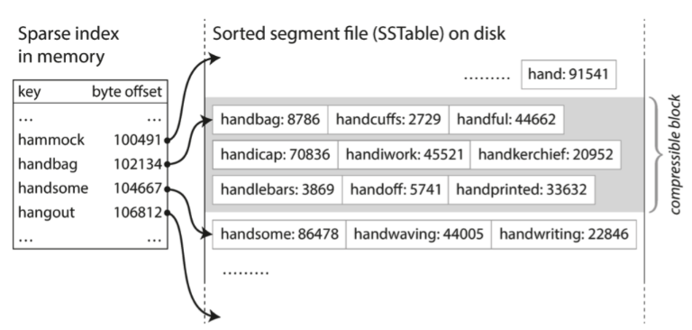
Merging several SSTable segments, retaining only the most recent value for each key.

Storage engines that are based on this principle of merging and compacting sorted files are often called LSM storage engines.

Lucene, an indexing engine for full-text search used by Elasticsearch and Solr, uses a similar method for storing its term dictionary <br>
term dictionary: list of document id

性能优化-bloom filters 布隆过滤器 \
A Bloom filter is a memory-efficient data structure for approximating the contents of a set. It can tell you if a key does not appear in the database, and thus saves many unnecessary disk reads for nonexistent keys \
布隆过滤器（Bloom Filter）本质上是由长度为 m 的位向量或位列表（仅包含 0 或 1 位值的列表）组成，最初所有的值均设置为 0 \
将数据项添加到Bloom filter中, 我们会提供 K 个不同的哈希函数, 并将结果对应位的值置为1. 假设我们有3个hash function. semlinker的输出就是2, 4, 6.
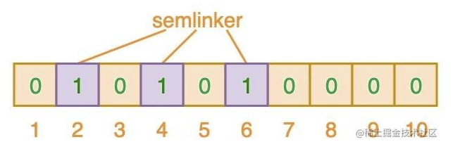\
kakuqo的输出就是3, 4, 7.
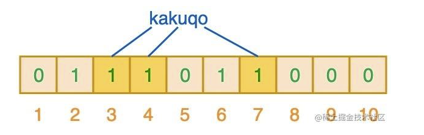\
当我们搜索 fullstack 的时候， 索引值是2, 3, 7. 可以看到相应索引位都是1. 意味着 fullstck可能已经插入到集合中. 此处是肯能, 没有就是没有, 有是有可能. 
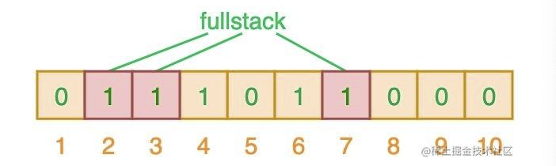

### B-Tree
The log-structured indexes we saw earlier break the database down into variable-size segments, typically several megabytes or more in size, and always write a segment sequentially. By contrast, B-trees break the database down into fixed-size blocks or pages, traditionally 4 KB in size (sometimes bigger), and read or write one page at a time. This design corresponds more closely to the underlying hardware, as disks are also arranged in fixed-size blocks.

The number of references to child pages in one page of the B-tree is called the branching factor
```
| ref | 100 | ref | 200 | ref | 300 | ref | 400 | ref | 500 | ref |
The branching factor is 6
```
In practice, the branching factor depends on the amount of space required to store the page references and the range boundaries, but typically it is several hundred.<br>
If you want to add a new key, you need to find the page whose range encompasses the new key and add it to that page. If there isn’t enough free space in the page to accommodate the new key, it is split into two half-full pages, and the parent page is updated to account for the new subdivision of key ranges
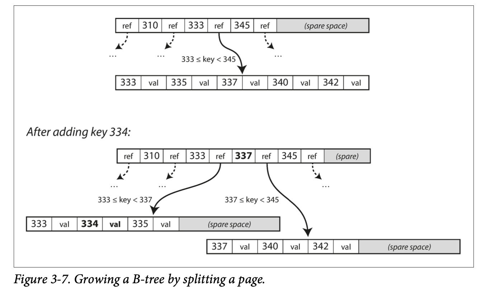
Most databases can fit into a B-tree that is three or four levels deep, so you don’t need to follow many page references to find the page you are looking for. (A four-level tree of 4 KB pages with a branching factor of 500 can store up to 256 TB.)

### B-tree optimizations
#### WAL (write-ahead log)
This is an append-only file to which every B-tree modification must be written before it can be applied to the pages of the tree itself. When the database comes back up after a crash, this log is used to restore the B-tree back to a consistent state<br>


#### latches (lightweight locks)
Protect tree's data structures from concurrent updating on pages

#### Write Amplification
one write to the database resulting in multiple writes to the disk over the course of the database’s lifetime—is known as write amplification.<br>
Write amplification (WA) is an undesirable phenomenon associated with flash memory and solid-state drives (SSDs), where the actual amount of information physically-written to the storage media is a multiple of the logical amount intended to be written.

WA是一个与闪存存储设备相关的概念. 用于描述在写入数据时实际物理写入量比逻辑写入量大. 由于闪存的特性和存储管理算法引起的. 数据写入时, 以block块(闪存进行擦除和编程的最小单位, 通常大小数千字节)为单位. 如果写入的数据小于块的大小, 闪存存储设备将:
1. 读取整个块的内容到缓冲区
2. 在缓冲区中更新要写入的数据
3. 擦除原始块
4. 将缓冲区的内容编程回新的块
即使只有其中小部分数据发生了变化, 上述过程也发生了. 实际物理写入的数据量比逻辑写入量更大. \
存储管理算法优化:
1. 通过将多个连续的写入请求合并成一个写入操作.(数据量小)
2. 通过将多个写入请求缓冲起来，并在合适的时机进行合并和实际写入
3. 一些存储系统可以在写入数据之前进行数据压缩和去重，从而减少物理存储空间的使用。这样可以降低写入的数据量，减少写放大效应(本质是减少需要操作的数据块 来减少擦除和编程次数. 数据量大)

### B tree and LSM tree
通常 LSM 树的写入速度更快，而 B 树的读取速度更快
* 写入:
    * LSM是先写入内存不用访问磁盘, 并且允许批量合并写入到磁盘
    * B树 先写入日志 然后磁盘, 每次写入都需要访问磁盘并更新对应的节点. 频繁的磁盘访问导致较高的写延迟
* 读取:
    * LSM因为数据可能分布在多个磁盘文件, 需要进行合并和压缩才能获取完成结果, 较大的数据量和多层次的索引结构增加了读取的成本
    * 结构紧凑 有效利用磁盘快的局部性
* 更新和删除
    * LSM可以通过插入新的写覆盖旧值, 避免直接修改已存在的数据. 删除可以通过特殊的标记来标记数据为删除状态
    * B书更新和删除需要修改磁盘节点数据, 删除甚至更需要进行节点的合并和重平衡


### Other index tech
The key in an index is the thing that queries search for, but the value can be one of two things: it could be the actual row (document, vertex) in question, or it could be a reference to the row stored elsewhere. In the latter case, the place where rows are stored is known as a heap file.

When updating a value without changing the key, the heap file approach can be quite efficient<br>
In some situations, the extra hop from the index to the heap file is too much of a performance penalty for reads, so it can be desirable to store the indexed row directly within an index. This is known as a clustered index. 例如 MySQL 的 InnoDB 存储引擎中, 表的primary key就是一个聚集索引, 次级索引则引用主键的位置 


#### 多列索引
例子就是数据库 add index on name, phone, city, state. 多列索引允许在查询中使用多个列进行过滤、排序和匹配。通过在多个列上创建索引，可以优化查询性能，减少磁盘访问和数据检索的次数。多列索引的顺序很重要。查询时，索引的列顺序应与查询条件中列的顺序相匹配，以获得最佳的查询性能。如果查询条件中的列顺序与多列索引的列顺序不匹配，可能无法充分利用索引的优势。

#### 多维索引
空间坐标索引

#### DB 例子
假设这里建立一张学生表，其中包含字段id设置主键索引、name设置普通索引、age(无处理)，并向数据库中插入4条数据：（"小赵", 10）（"小王", 11）（"小李", 12）（"小陈", 13）\
每一个索引在 InnoDB 里面对应一棵B+树，那么此时就存着两棵B+树。
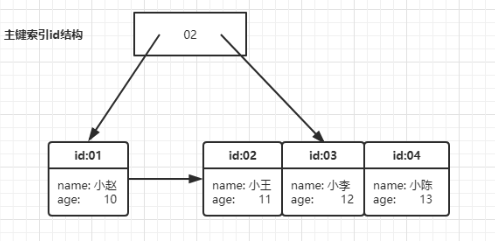
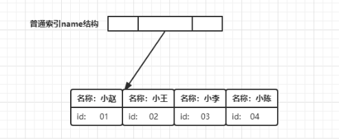\
可以发现区别在与叶子节点中，主键索引存储了整行数据，而非主键索引中存储的值为主键id, 在我们执行如下sql后
```sql
SELECT age FROM student WHERE name = '小李'；
```
其执行流程为:
1. name index树上找到名称为小李的节点 id为03
2. 从id索引树上找到id为 03 的节点 获取所有数据
3. 从数据中获取字段名为 age 的值 返回12

此流程中, 从非主键索引树搜索回到主键索引树搜索的过程称为: `回表`. 如何优化这个过程, 引入正文覆盖索引. 从非主键索引中就能查到的记录，而不需要查询主键索引中的记录，避免了回表的产生减少了树的搜索次数，显著提升性能

#### covering index
add index on (name, state, city, country, zip) 这是一个多列索引, 当你查询 name, state, city 时, 这个多列索引包含了查询所需的所有列, 那么这个索引可以被视为覆盖索引。

http://www.mathcs.emory.edu/~cheung/Courses/554/Syllabus/3-index/R-tree.html
R-tree


https://tech.meituan.com/2014/06/30/mysql-index.html
mysql 文章 就结论简单来说最左匹配 遇到 "<" or ">"就不使用索引了


### OLTP & OLAP
online transaction processing<br>
online analytic processing<br>
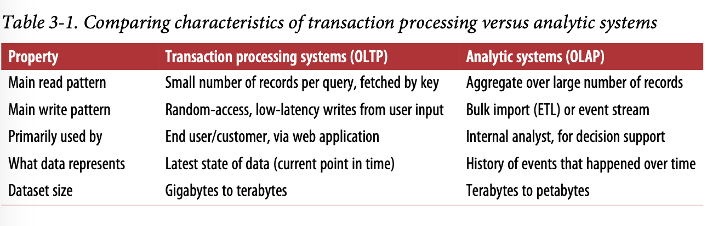
At first, the same databases were used for both transaction processing and analytic queries. SQL turned out to be quite flexible in this regard: it works well for OLTP- type queries as well as OLAP-type queries. Nevertheless, in the late 1980s and early 1990s, there was a trend for companies to stop using their OLTP systems for analytics purposes, and to run the analytics on a separate database instead. This separate database was called a data warehouse.

### Data Warehouse
A data warehouse, by contrast, is a separate database that analysts can query to their hearts’ content, without affecting OLTP operations. The data warehouse contains a read-only copy of the data in all the various OLTP systems in the company. Data is extracted from OLTP databases (using either a periodic data dump or a continuous stream of updates), transformed into an analysis-friendly schema, cleaned up, and then loaded into the data warehouse. This process of getting data into the warehouse is known as Extract–Transform–Load (ETL).

### Schema Analytics
At the center of the schema is a so-called fact table (in this example, it is called fact_sales). Each row of the fact table represents an event that occurred at a particular time (here, each row represents a customer’s purchase of a product). If we were analyzing website traffic rather than retail sales, each row might represent a page view or a click by a user.
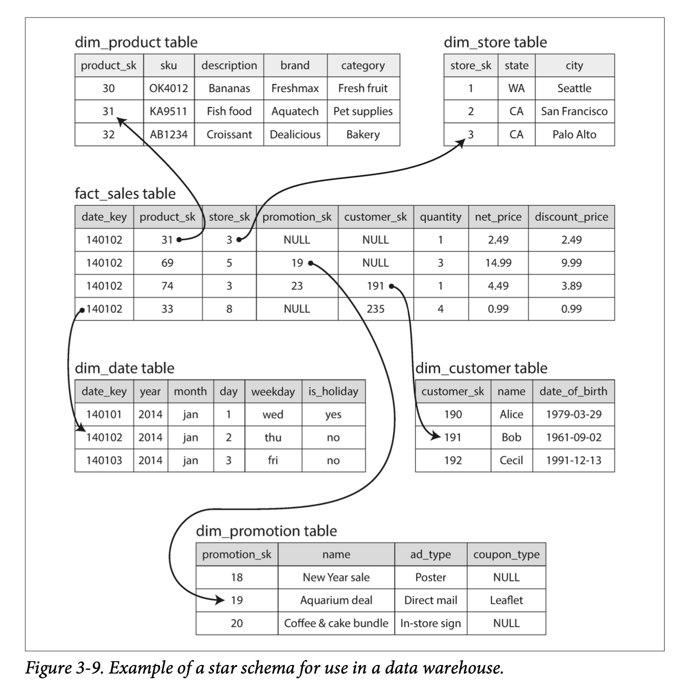
Some of the columns in the fact table are attributes, such as the price at which the product was sold and the cost of buying it from the supplier (allowing the profit mar‐ gin to be calculated). Other columns in the fact table are foreign key references to other tables, called dimension tables. As each row in the fact table represents an event, the dimensions represent the who, what, where, when, how, and why of the event.


The name “star schema” comes from the fact that when the table relationships are visualized, the fact table is in the middle, surrounded by its dimension tables; the connections to these tables are like the rays of a star.

A variation of this template is known as the snowflake schema, where dimensions are further broken down into subdimensions. For example, there could be separate tables for brands and product categories, and each row in the dim_product table could ref‐ erence the brand and category as foreign keys, rather than storing them as strings in the dim_product table. Snowflake schemas are more normalized than star schemas, but star schemas are often preferred because they are simpler for analysts to work with

## Column Storage
* 行DB是B+树索引
* 列DB是位图+压缩索引
### Column storage engine
The idea behind column-oriented storage is simple: don’t store all the values from one row together, but store all the values from each column together instead. If each column is stored in a separate file, a query only needs to read and parse those columns that are used in that query, which can save a lot of work.
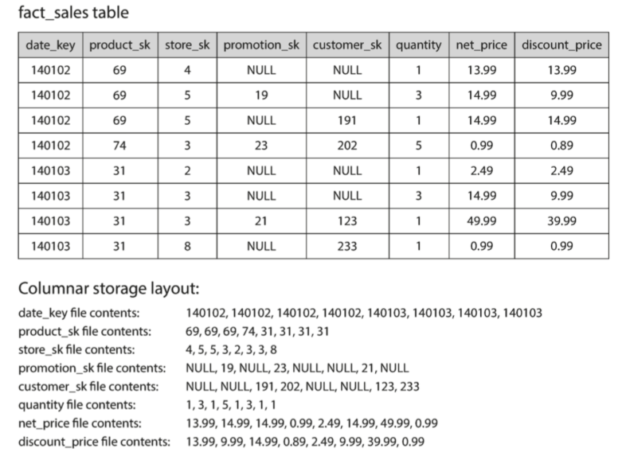
The column-oriented storage layout relies on each column file containing the rows in the same order. Thus, if you need to reassemble an entire row, you can take the 23rd entry from each of the individual column files and put them together to form the 23rd row of the table.

### Column Compression

```
Example of bitmap but it is different from the description above
[0 0 0 0 0 0 0 0 0 0 0 0 0 0 0 0 0 0 0 0 0 0 0 0]
这是24位, 这个时候假如我们要存放2 4 6 8 9 10 17 19 21这些数字到我们的BitMap里，我们只需把对应的位设置为1就可以了
[0 0 0 1 0 1 0 1 0 0 0 0 0 0 1 1 1 0 1 0 1 0 1 0]
```
product_sk的前四位和最后两位是69, 所以 bitmap for product_sk=69 的前四位和最后两位是1 其他是0 \
product_sk的第五位是74, bitmap for product_sk=74 的第五位就是1 其他位是0 \
其他亦一样 


product_sk=69: 0,4,12,2(0 zeros, 4 ones, 12 zeros, 2 ones)\
product_sk=74: (4 zeros, 1 one, rest zeros)

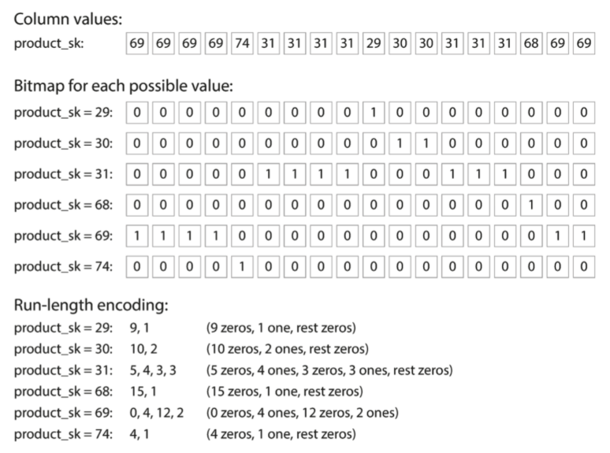
Often, the number of distinct values in a column is small compared to the number of rows (for example, a retailer may have billions of sales transactions, but only 100,000 distinct products). We can now take a column with n distinct values and turn it into n separate bitmaps: one bitmap for each distinct value, with one bit for each row. The bit is 1 if the row has that value, and 0 if not. \
如果 n 非常小（例如，国家 / 地区列可能有大约 200 个不同的值），则这些位图可以将每行存储成一个比特位。但是，如果 n 更大，大部分位图中将会有很多的零（我们说它们是稀疏的）。在这种情况下，位图可以另外再进行游程编码（run-length encoding，一种无损数据压缩技术）\
这些位图索引非常适合数据仓库中常见的各种查询。
```sql
WHERE product_sk IN（30，68，69）// 计算位图的位或操作
WHERE product_sk = 31 AND store_sk = 3 //计算bitmap的位与操作
```
### Sort Order in Column Storage
列 order sort 一般是排列一个列中的属性根据排列好的 order 在进行下一个属性的sort<br>
如果每列各自排各自的那row就乱掉了<br>

按顺序排序的另一个好处是它可以帮助压缩列。如果主要排序列没有太多个不同的值，那么在排序之后，将会得到一个相同的值连续重复多次的序列。一个简单的游程编码（就像我们用于 图 3-11 中的位图一样）可以将该列压缩到几 KB —— 即使表中有数十亿行

既然不同的查询受益于不同的排序顺序，为什么不以几种不同的方式来存储相同的数据呢？反正数据都需要做备份，以防单点故障时丢失数据。因此你可以用不同排序方式来存储冗余数据，以便在处理查询时，调用最适合查询模式的版本。

Having multiple sort orders in a column-oriented store is a bit similar to having multiple secondary indexes in a row-oriented store. But the big difference is that the row-oriented store keeps every row in one place (in the heap file or a clustered index), and secondary indexes just contain pointers to the matching rows. In a column store, there normally aren’t any pointers to data elsewhere, only columns containing values.


### Writing to Column-Oriented Storage
An update-in-place approach, like B-trees use, is not possible with compressed columns. If you wanted to insert a row in the middle of a sorted table, you would most likely have to rewrite all the column files. As rows are identified by their position within a column, the insertion has to update all columns consistently.<br>
Fortunately, we have already seen a good solution earlier in this chapter: LSM-trees.All writes first go to an in-memory store, where they are added to a sorted structure and prepared for writing to disk. 内存中的存储是面向行还是列的并不重要。当已经积累了足够的写入数据时，它们将与硬盘上的列文件合并，并批量写入新文件。


### Aggregation: Data Cubes and Materialized Views
Another aspect of data warehouses that is worth mentioning briefly is materialized aggregates. As discussed earlier, data warehouse queries often involve an aggregate function, such as COUNT, SUM, AVG, MIN, or MAX in SQL. If the same aggregates are used by many different queries, it can be wasteful to crunch through the raw data every time. We can cache the result.

One way of creating such a cache is a materialized view. In a relational data model, it is often defined like a standard (virtual) view: a table-like object whose contents are the results of some query. The difference is that a materialized view is an actual copy of the query results, written to disk, whereas a virtual view is just a shortcut for writ‐ ing queries. When you read from a virtual view, the SQL engine expands it into the view’s underlying query on the fly and then processes the expanded query.

When the underlying data changes, a materialized view needs to be updated, because it is a denormalized copy of the data. The database can do that automatically, but such updates make writes more expensive, which is why materialized views are not often used in OLTP databases. In read-heavy data warehouses they can make more sense (whether or not they actually improve read performance depends on the individual case).

A common special case of a materialized view is known as a data cube or OLAP cube. 
```
For example, there are five dimensions: date, product, store, promotion and customer in fact table. 
Each cell contains the sales for a particular date-product-store-promotion- customer combination.
```

The advantage of a materialized data cube is that certain queries become very fast because they have effectively been precomputed. 

The disadvantage is that a data cube doesn’t have the same flexibility as querying the raw data. 

Most data warehouses try to keep as much raw data as possible, and use aggregates such as data cubes only as a performance boost for certain queries.
