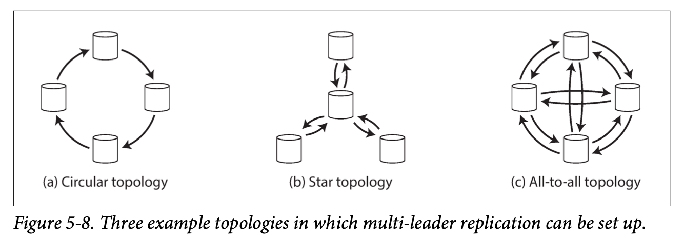
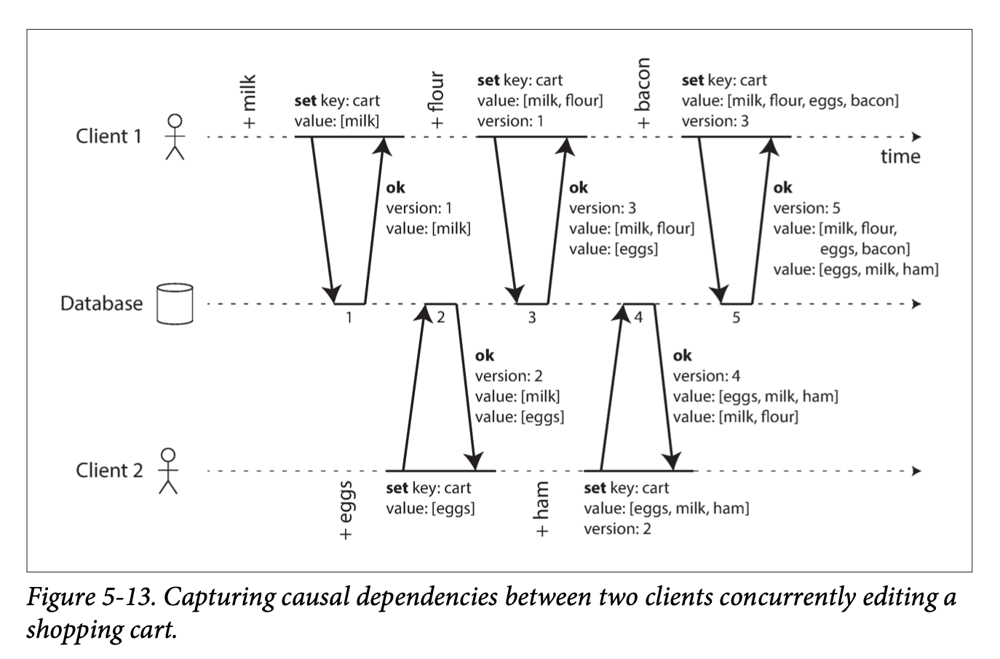

# Distribute Database
There are various reasons why you might want to distribute a database across multi‐ ple machines
1. Scalability 
If your data volume, read load, or write load grows bigger than a single machine can handle, you can potentially spread the load across multiple machines.
2. Fault tolerance/high availability 
If your application needs to continue working even if one machine (or several machines, or the network, or an entire datacenter) goes down, you can use multi‐ ple machines to give you redundancy. When one fails, another one can take over.
3.  Latency 
If you have users around the world, you might want to have servers at various locations worldwide so that each user can be served from a datacenter that is geo‐ graphically close to them. That avoids the users having to wait for network pack‐ ets to travel halfway around the world.

# Shared-Nothing Archiectures
Each machine or virtual machine running the database software is called a node.

All of the difficulty in replication lies in handling changes to replicated data.

We will discuss three popular algorithms for replicating changes between nodes:  
1. single-leader
2. multi-leader
3. leaderless   

replication. Almost all dis‐ tributed databases use one of these three approache.

## Leaders and Followers
synchronous: The leader waits until follower has confirmed that it received the write before reporting success to the user 
asynchronous: The leader sends the message, but doesn’t wait for a response from the follower

The advantage of synchronous replication is that the follower is guaranteed to have an up-to-date copy of the data that is consistent with the leader. If the leader sud‐ denly fails, we can be sure that the data is still available on the follower. The disadvantage is that if the synchronous follower doesn’t respond (because it has crashed, or there is a network fault, or for any other reason), the write cannot be processed. The leader must block all writes and wait until the synchronous replica is available again.

For that reason, it is impractical for all followers to be synchronous: any one node outage would cause the whole system to grind to a halt. In practice, if you enable synchronous replication on a database, it usually means that one of the followers is syn‐ chronous, and the others are asynchronous. If the synchronous follower becomes unavailable or slow, one of the asynchronous followers is made synchronous. This guarantees that you have an up-to-date copy of the data on at least two nodes: the leader and one synchronous follower. This configuration is sometimes also called semi-synchronous.

## Handling Node Outages
### Follower failure: Catch-up recovery
1. Take a consistent snapshot of the leader’s database at some point in time
2. Copy the snapshot to the new follower node.
3. Follower asks for exact position of snapshot in leader's replication log. In MySQL, it is called the binlog coordinates. PostgreSQL calls it the log sequence number.
4. When the follower has processed the backlog of data changes since the snapshot, we say it has caught up. It can now continue to process data changes from the leader as they happen

### Leader failure: Failover
Handling a failure of the leader is trickier: one of the followers needs to be promoted to be the new leader, clients need to be reconfigured to send their writes to the new leader, and the other followers need to start consuming data changes from the new leader. This process is called failover.

1. Determining that the leader has failed. (通常情况 心跳检测)
2. Choosing a new leader. (好多算法比如 raft)
3. Reconfiguring the system to use the new leader.

### Implementation of Replication Logs
1. Statement-based replication 
the leader logs every write request (statement) that it executes and sends that statement log to its followers. there are various ways in which this approach to replication can break down:
* such as NOW() to get the current date and time or RAND() to get a random number, is likely to generate a different value on each replica.
* If statements use an autoincrementing column, or if they depend on the existing data in the database (e.g., UPDATE ... WHERE <some condition>), they must be executed in exactly the same order on each replica, or else they may have a differ‐ ent effect. This can be limiting when there are multiple concurrently executing transactions.
* Statements that have side effects (e.g., triggers, stored procedures, user-defined functions) may result in different side effects occurring on each replica, unless the side effects are absolutely deterministic.

We can have work around with these issues, but there are so many edge cases.  Other replication methods are now generally preferred.

2. WAL (Write ahead log)

Leader sends log to follwers. 
The main disadvantage is that the log describes the data on a very low level: a WAL con‐ tains details of which bytes were changed in which disk blocks. This makes replica‐ tion closely coupled to the storage engine
## Problems with Replication Lag
### read-after-write consistency
1. 少数服务拥有写权限，指定读到 leader
2. 追踪最近更新的时间，一分钟之内的读操作 访问 leader
3. 客户端保存写时间戳，从库保证时间戳前的更新都已经完成。不然从其他从库读取或者等待更新完成。

### Monotonic Reads
Make sure that each user always makes their reads from the same replica. 
The replica can be chosen based on a hash of the user ID, rather than randomly. However, if that replica fails, the user’s queries will need to be rerouted to another replica.

### Consistent Prefix Reads
This guarantee says that if a sequence of writes happens in a certain order, then anyone reading those writes will see them appear in the same order.

# Multi-Leader Replication
In this setup, each leader simultaneously acts as a follower to the other leaders.

## Use Cases for Multi-Leader Replication
### Multi-datacenter operation
between datacenters, each datacenter’s leader replicates its changes to the leaders in other datacenters asynchronously.

### Clients with offline operation
calendar apps on your mobile phone, your laptop, and other devices. You need to be able to see your meetings (make read requests) and enter new meetings (make write requests) at any time, regardless of whether your device currently has an internet connection

多设备的离线模式，每个设备被看作一个 datacenter，本地一个小的数据库 存放calendar app 的信息。 有网络连接的时候就把信息同步到其他设备。 从架构来看是一个 multi-leader 的架构， 每个设备都是一个 datacenter 并且也是唯一的leader

### Collaborative editing  (Online Document Editing)
We don’t usually think of collaborative editing as a database replication problem, but it has a lot in common with the previously mentioned offline editing use case. When one user edits a document, the changes are instantly applied to their local replica (the state of the document in their web browser or client application) and asynchronously replicated to the server and any other users who are editing the same document.

## Handling Write Conflicts
俩人同时修改 wiki 页面 title 一个改 B 一个改 C conflict 发生
### Synchronous versus asynchronous conflict detection
不现实 synchronous decetion会退化到 single leader replication
### Conflict avoidance
用户只到指定的 datacenter。 Different user have differnt home datacenters, but from any one user’s point of view the configuration is essentially single-leader.

However, sometimes you might want to change the designated leader for a record-
perhaps because one datacenter has failed and you need to reroute traffic to another datacenter, or perhaps because a user has moved to a different location and is now closer to a different datacenter. In this situation, conflict avoidance breaks down, and you have to deal with the possibility of concurrent writes on different leaders.

### Converging toward a consistent state
If each replica simply applied writes in the order that it saw the writes, the database would end up in an inconsistent state: the final value would be C at leader 1 and B at leader 2. Thus, the database must resolve the conflict in a convergent way, which means that all replicas must arrive at the same final value when all changes have been replicated.
1. Give each write operation an Unique ID, pick the write with Highest ID as the winner.
2. 为每个副本分配一个唯一的ID，ID编号更高的写入具有更高的优先级
3. 合并 比如(B/C)
4. 用一种可保留所有信息的显式数据结构来记录冲突，并编写解决冲突的应用程序代码

### multi-leader topology

A problem with circular and star topologies is that if just one node fails, it can inter‐ rupt the flow of replication messages between other nodes, causing them to be unable to communicate until the node is fixed.

All-to-all topology has issue as well. Assume client A inserts a row into a table on leader 1, client B updates that row on leader 3. However leader 2 receives update first, then receives insert.

## Leaderless Replication
Amazon used it for its in-house Dynamo system. Riak, Cassandra, and Voldemort are open source datastores with leaderless replication models inspired by Dynamo, so this kind of database is also known as Dynamo-style.

### Writing to the Database When a Node Is Down
client sends write to all replicas in parallel, if client receive major (often more than half) ok responses, we consider write to be successful.

What happens to the node when it comes back online? 

Two mechanisms are often used in Dynamo-style datastores:

1. Read repair 
User gets a version 6 value from replica 1 and version 7 value from replica 2 and replica 3. The client sees that replica 1 has a stale value and writes the newer value back to that replica. This approach works well for values that are frequently read.
2. Anti-entropy process 
Some datastores have a background process that constantly looks for differences in the data between replicas and copies any missing data from one replica to another. Unlike the replication log in leader-based replication, this anti-entropy process does not copy writes in any particular order, and there may be a significant delay before data is copied.

Quorums |ˈkwɔrəm| for reading and  
n total nodes 
w nodes to confirm write success 
r nodes to make sure your query has at least 1 up-to-date value 
Usually w=r=(n+1)/2 (rounded up, and n usually is odd number)

w + r > n, at least one of the r replicas you read from must have seen the most recent successful write

However w + r > is not the universal key:
1. If a sloppy quorum is used, write 可能发生在 n 个节点之外的节点, 这时候的读操作 读不到写入的值
2. If two writes occur concurrently, see line 87
3. If a write happens concurrently with a read, the write may be reflected on only some of the replicas. In this case, it’s undetermined whether the read returns the old or the new value.
4. If a write succeeded on some replicas but failed on others, 写成功不到 w 失败. 但是已经被写入的节点不会回滚。This means that if a write was reported as failed, subsequent reads may or may not return the value from that write
5. If a node carrying a new value fails, and its data is restored from a replica carry‐ ing an old value, the number of replicas storing the new value may fall below w, breaking the quorum condition.

### Sloppy Quorums and Hinted Handoff
In a large cluster (with significantly more than n nodes) it’s likely that the client can connect to some database nodes during the network interruption, just not to the nodes that it needs to assemble a quorum for a particular value. In that case, database designers face a trade-off:
* Is it better to return errors to all requests for which we cannot reach a quorum of w or r nodes?
* Or should we accept writes anyway, and write them to some nodes that are reachable but aren’t among the n nodes on which the value usually lives?

The latter is known as a sloppy quorum: writes and reads still require w and r successful responses, but those may include nodes that are not among the designated n “home” nodes for a value. Once the network interruption is fixed, any writes that one node temporarily accepted on behalf of another node are sent to the appropriate “home” nodes. This is called hinted handoff

Sloppy quorums are particularly useful for increasing write availability: as long as any w nodes are available, the database can accept writes. However, this means that even when w + r > n, you cannot be sure to read the latest value for a key, because the latest value may have been temporarily written to some nodes outside of n.

Sloppy quorums are optional in all common Dynamo implementations.

### Multi-datacenter leaderless replica
Cassandra and Voldemort: the number of replicas n includes nodes in all datacenters, and in the configuration you can specify how many of the n replicas you want to have in each datacenter.

Riak keeps all communication between clients and database nodes local to one data‐ center, so n describes the number of replicas within one datacenter. Cross-datacenter replication between database clusters happens asynchronously in the background, in a style that is similar to multi-leader replication

### Detecting Concurrent Writes
the server can determine whether two operations are concurrent by looking at the version numbers—it does not need to interpret the value itself (so the value could be any data structure). The algorithm works as follows:
* 服务器为每个键保留一个版本号，每次写入键时都增加版本号，并将新版本号与写入的值一起存储。
* 当客户端读取键时，服务器将返回所有未覆盖的值以及最新的版本号。客户端在写入前必须读取。
* 客户端写入键时，必须包含之前读取的版本号，并且必须将之前读取的所有值合并在一起。 （来自写入请求的响应可以像读取一样，返回所有当前值，这使得我们可以像购物车示例那样连接多个写入。）
* 当服务器接收到具有特定版本号的写入时，它可以覆盖该版本号或更低版本的所有值（因为它知道它们已经被合并到新的值中），但是它必须保持所有值更高版本号（因为这些值与传入的写入同时发生）。

