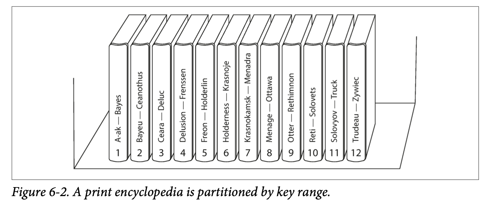
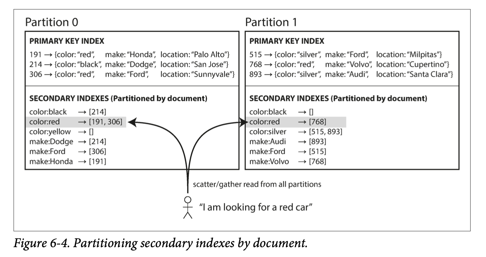
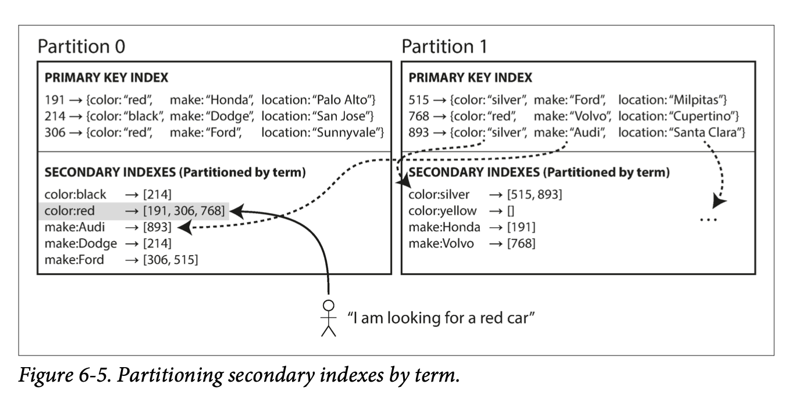
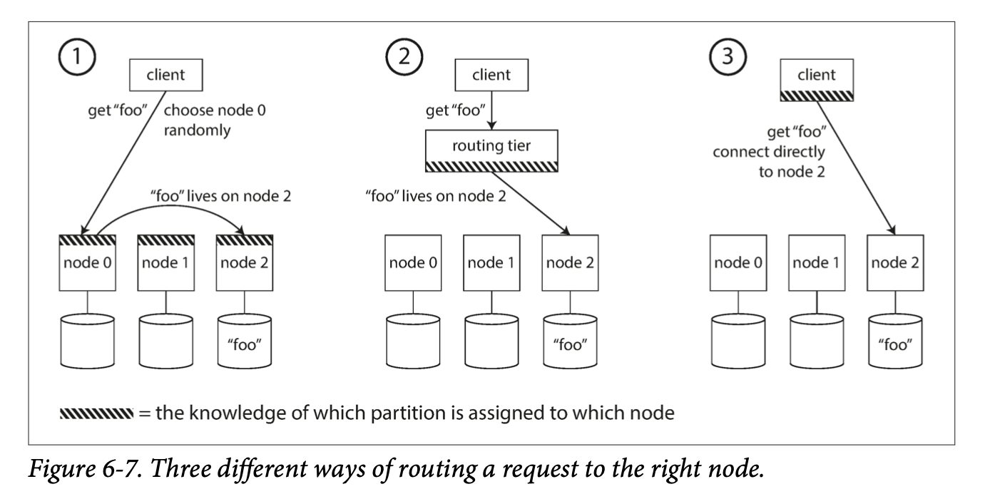
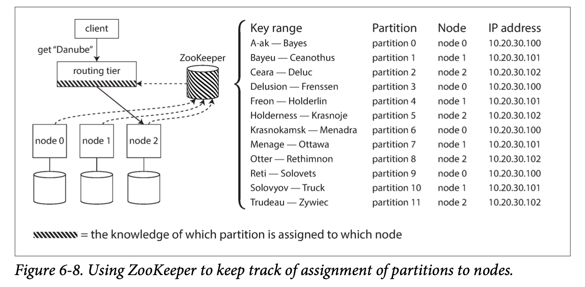

# Partitioning
## Partitioning of Key-Value Data
### Partitioning by Key Range

The partition boundaries might be chosen manually by an administrator, or the database can choose them automatically. This partitioning strategy is used by Bigtable, its open source equivalent HBase, RethinkDB, and MongoDB before version 2.4.

This has the advantage that range scans are easy, and you can treat the key as a concatenated index in order to fetch several related records in one query.  For example, consider an application that stores data from a network of sensors, where the key is the timestamp of the measurement (year-month-day-hour-minute-second). Range scans are very useful in this case, because they let you easily fetch, say, all the readings from a particular month.

However it is easy to get one node overloaded if the key is timestamp, can add a prefix to timestamp. For example, consider an application that stores data from a network of sensors, add sensor name to prefix.

### Partitioning by Hash of Key
Once you have a suitable hash function for keys, you can assign each partition a range of hashes (rather than a range of keys), and every key whose hash falls within a partition’s range will be stored in that partition.

Usually consistent hash function is the option we could use.

Unfortunately however, by using the hash of the key for partitioning we lose a nice property of key-range partitioning: the ability to do efficient range queries.

Cassandra 的策略是 用第一列做 hash key 其余的 key 作复合索引 可以实现范围搜索

### Skewed Workloads and Relieving Hot Spots
Partitioning by hash of key cannot avoid hot spot entirely. In the extreme case where all reads and writes are for the same key. This kind of workload is perhaps unusual, but not unheard of: for example, on a social media site, a celebrity user with millions of followers may cause a storm of activity when they do something.

Today, most data systems are not able to automatically compensate for such a highly skewed workload, so it’s the responsibility of the application to reduce the skew. For example, if one key is known to be very hot, a simple technique is to add a random number to the beginning or end of the key. 

## Partitioning and Secondary Indexes
Secondary indexes 正是 solar 和 elasticsearh 搜索服务器存在的意义
### Partitioning Secondary Indexes by Document

In this indexing approach, each partition is completely separate: each partition main‐ tains its own secondary indexes, covering only the documents in that partition. It doesn’t care what data is stored in other partitions. Whenever you need to write to the database—to add, remove, or update a document—you only need to deal with the partition that contains the document ID that you are writing. A document-partitioned index is also known as a local index.

写方便 读麻烦  
If you want to search for red cars, you need to send the query to all partitions, and combine all the results you get back. This approach to querying a partitioned database is sometimes known as scatter/ gather, and it can make read queries on secondary indexes quite expensive.

Nevertheless, it is widely used: MongoDB, Riak, Cassandra , Elasticsearch , SolrCloud , and VoltDB all use document-partitioned secondary indexes.

### Partitioning Secondary Indexes by Term

Global index, index 也和 data 一样被partition到不同的node 

这种情况下 读快  写麻烦， 因为写入单个文档现在可能会影响索引的多个分区（文档中的每个关键词可能位于不同的分区或者不同的节点上）

## Rebalancing Partitions
The process of moving load from one node in the cluster to another is called rebalancing

hash mod N is a bad idea because every time you add or remove a node, rebanlance is very expensive. For example, say hash(key) = 123456. If you initially have 10 nodes, that key starts out on node 6 (because 123456 mod 10 = 6). When you grow to 11 nodes, the key needs to move to node 3 (123456 mod 11 = 3), and when you grow to 12 nodes, it needs to move to node 0 (123456 mod 12 = 0). 
### Fixed number of partitions
Create many more partitions than there are nodes, and assign several partitions to each node. For example, a database run‐ ning on a cluster of 10 nodes may be split into 1,000 partitions from the outset so that approximately 100 partitions are assigned to each node.

If a node is added to the cluster, the new node can steal a few partitions from every existing node until partitions are fairly distributed once again. If a node is removed from the cluster, the same happens in reverse.

Only entire partitions are moved between nodes. The number of partitions does not change, nor does the assignment of keys to partitions. The only thing that changes is the assignment of partitions to nodes. This change of assignment is not immediate— it takes some time to transfer a large amount of data over the network—so the old assignment of partitions is used for any reads and writes that happen while the trans‐ fer is in progress.

In principle, you can assign more partitions to nodes that are more powerful, you can force those nodes to take a greater share of the load.

### Dynamic partitioning
和 Fixed number of partitions 有点类似，一个分区一个节点，一个节点多个分区，原理是 partition 的大小 达到 最大后者最小 阀值的时候 分区会分裂 或者 合并。所以每个分区的大小和节点数量无关， 而是位于分区阀值之间，每个分区的大小与数据集的大小成正比，与节点数无关。

​需要注意的是，一个空的数据库从一个分区开始，因为没有关于在哪里绘制分区边界的先验信息。数据集开始时很小，直到达到第一个分区的分割点，所有写入操作都必须由单个节点处理，而其他节点则处于空闲状态。为了解决这个问题，HBase和MongoDB允许在一个空的数据库上配置一组初始分区（这被称为预分割（pre-splitting））。在键范围分区的情况中，预分割需要提前知道键是如何进行分配的

### Partitioning proportionally to nodes
Cassandra makes the number of partitions proportional to the number of nodes—in other words, to have a fixed number of par‐ titions per node.

新节点加入集群时候 随机选择固定数量的的分区 分割 拿一半的数据放在新节点。

## Request Routing
When a client wants to make a request, how does it know which node to connect to? As partitions are rebalanced, the assignment of partitions to nodes changes. 

This is an instance of a more general problem called service discovery, which isn’t limited to just databases.

Many distributed data systems rely on a separate coordination service such as Zoo‐ Keeper to keep track of this cluster metadata. Each node registers itself in ZooKeeper, and ZooKeeper maintains the authoritative mapping of partitions to nodes.  routing tier or The partitioning-aware client, can subscribe to this information in ZooKeeper. Whenever a partition changes ownership, or a node is added or removed, ZooKeeper notifies the routing tier so that it can keep its routing information up to date.

LinkedIn’s Espresso uses Helix [31] for cluster management (which in turn relies on ZooKeeper), implementing a routing tier as shown in Figure 6-8. HBase, SolrCloud, and Kafka also use ZooKeeper to track partition assignment. MongoDB has a similar architecture, but it relies on its own config server implemen‐ tation and mongos daemons as the routing tier.

Cassandra and Riak 用的是 Figure 6.7 的方法 1，他们在节点之间使用流言协议（gossip protocol） 来传播群集状态的变化， 任意节点接受请求，该节点会转发到包含所请求的分区的适当节点