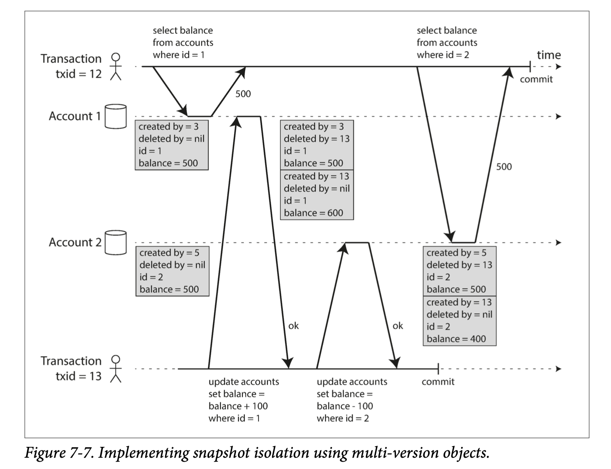
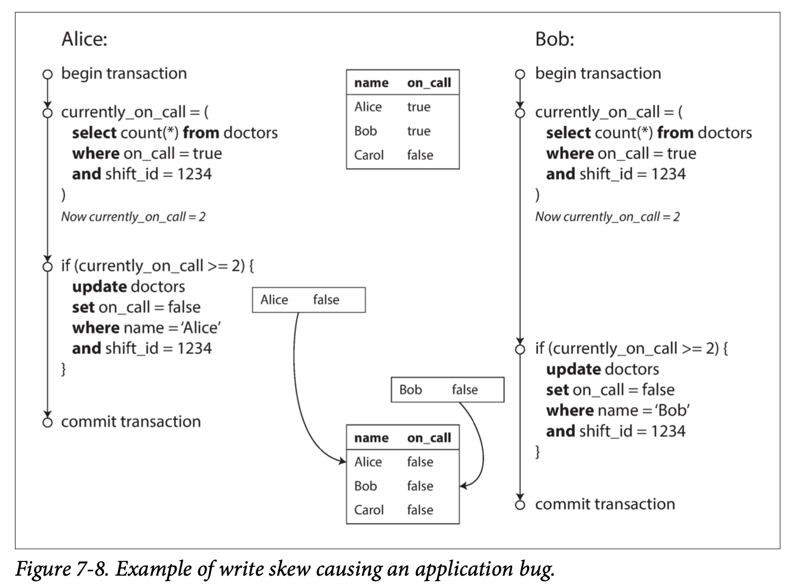
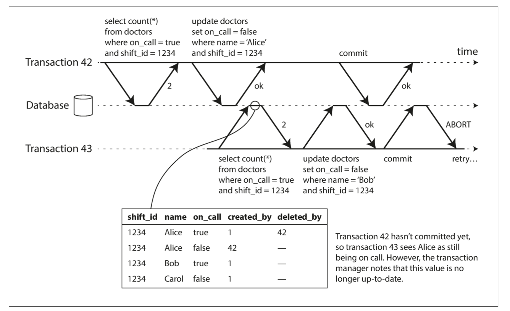
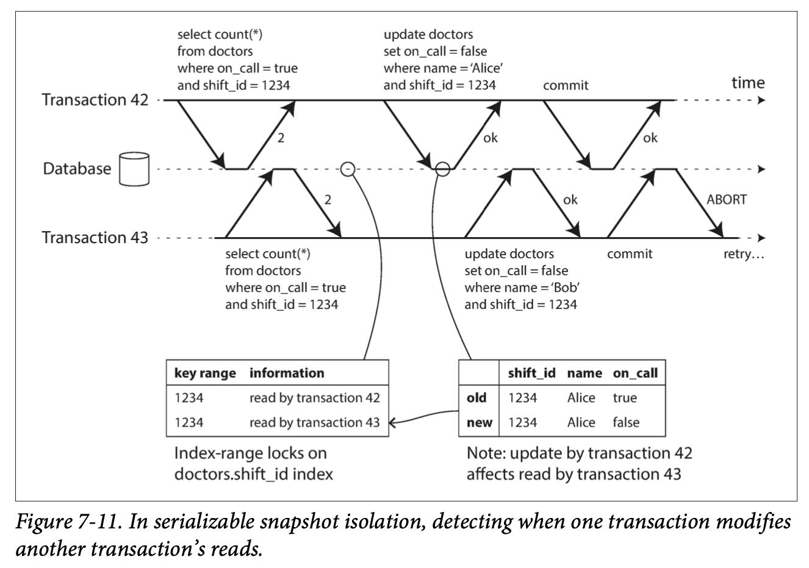

# Transactions
A transaction is a way for an application to group several reads and writes together into a logical unit. 

It has been the mechanism of choice for simplifying below issues.

* The database software or hardware may fail at any time (including in the middle of a write operation).
* The application may crash at any time (including halfway through a series of operations).
* Interruptions in the network can unexpectedly cut off the application from the database, or one database node from another.
* Several clients may write to the database at the same time, overwriting each other’s changes.
* A client may read data that doesn’t make sense because it has only partially been updated.
* Race conditions between clients can cause surprising bugs.

## The Slippery Concept of a Transaction
### Meaning of ACID
A: <br>
The ability to abort a transaction on error and have all writes from that transaction discarded is the defining feature of ACID atomicity. Perhaps abortability would have been a better term than atomicity, but we will stick with atomicity since that’s the usual word.

C:<br>
The idea of ACID consistency is that you have certain statements about your data (invariants) that must always be true—for example, in an accounting system, credits and debits across all accounts must always be balanced

I:<br>
Isolation in the sense of ACID means that concurrently executing transactions are isolated from each other: they cannot step on each other’s toes. 从另一方面来看 可以理解为转化为序列化执行

D: <br>
Durability is the promise that once a transaction has com‐ mitted successfully, any data it has written will not be forgotten, even if there is a hardware fault or the database crashes.

### Multi-object writes (or multi-object transaction)
Modify several objects (rows, documents, records) at once is multi-object writes.

Multi-object writes require some way of determining which read and write operations belong to the same transaction. In relational databases, that is typically done based on the client’s TCP connection to the database server: on any particular connection, everything between a BEGIN TRANSACTION and a COMMIT statement is considered to be part of the same transaction.

### Single-object writes
Atomicity can be implemented using a log for crash recovery, and isolation can be implemented using a lock on each object (allowing only one thread to access an object at any one time).

### Handling errors and aborts
ACID databases are based on this philosophy: if the database is in danger of violating its guarantee of atomicity, isolation, or durability, it would rather aban‐ don the transaction entirely than allow it to remain half-finished.

In particular, datastores with leaderless replication work much more on a “best effort” basis, which could be summarized as “the database will do as much as it can, and if it runs into an error, it won’t undo something it has already done”—so it’s the application’s responsibility to recover from errors.

Errors will inevitably happen, but many software developers prefer to think only about the happy path rather than the intricacies of error handling. For example, pop‐ ular object-relational mapping (ORM) frameworks such as Rails’s ActiveRecord and Django don’t retry aborted transactions—the error usually results in an exception bubbling up the stack, so any user input is thrown away and the user gets an error message. 

## Weak Isolation Levels
In theory, isolation should make your life easier by letting you pretend that no concurrency is happening: serializable isolation means that the database guarantees that transactions have the same effect as if they ran serially (i.e., one at a time, without any concurrency).

In practice, isolation is unfortunately not that simple. Serializable isolation has a per‐ formance cost, and many databases don’t want to pay that price. It’s therefore common for systems to use weaker levels of isolation, which protect against some concurrency issues, but not all. Those levels of isolation are much harder to under‐ stand, and they can lead to subtle bugs, but they are nevertheless used in practice.

Even many popular relational data‐ base systems (which are usually considered “ACID”) use weak isolation.

### Read Committed
The most basic level of transaction isolation is read committed. It makes two guarantees:
1. When reading from the database, you will only see data that has been committed (no dirty reads).
2. When writing to the database, you will only overwrite data that has been com‐ mitted (no dirty writes).

一个事务已经将一些数据写入数据库，但事务还没有提交或中止。另一个事务可以看到未提交的数据吗？如果是的话，那就叫做脏读（dirty reads）

如果两个事务同时尝试更新数据库中的相同对象，会发生什么情况？我们不知道写入的顺序是怎样的，但是我们通常认为后面的写入会覆盖前面的写入。
但是，如果先前的写入是尚未提交事务的一部分，又会发生什么情况，后面的写入会覆盖一个尚未提交的值？这被称作脏写（dirty write）。在读已提交的隔离级别上运行的事务必须防止脏写，通常是延迟第二次写入，直到第一次写入事务提交或中止为止。

最常见的情况是，数据库通过使用行锁（row-level lock） 来防止脏写.

读锁的办法在实践中效果并不好。因为一个长时间运行的写入事务会迫使许多只读事务等到这个慢写入事务完成。这会损失只读事务的响应时间，并且不利于可操作性：因为等待锁，应用某个部分的迟缓可能由于连锁效应，导致其他部分出现问题。
出于这个原因，大多数数据库：对于写入的每个对象，数据库都会记住旧的已提交值，和由当前持有写入锁的事务设置的新值。当事务正在进行时，任何其他读取对象的事务都会拿到旧值。 只有当新值提交后，事务才会切换到读取新值。

### Snapshot Isolation and Repeatable Read
Alice 两个银行账户 各有 500 元，从 账户 1转100到账户2，此时查看账户1看到只有400元，但是有可能会看到账户2只有500元，总数900元，100元不见了。这种情况 nonrepeatable read or read skew。

In Alice’s case, this is not a lasting problem, because she will most likely see consis‐ tent account balances if she reloads the online banking website a few seconds later. However, some situations cannot tolerate such temporary inconsistency:
* Backups<br>
Taking a backup requires making a copy of the entire database, which may take hours on a large database. During the time that the backup process is running, writes will continue to be made to the database. Thus, you could end up with some parts of the backup containing an older version of the data, and other parts containing a newer version. If you need to restore from such a backup, the inconsistencies (such as disappearing money) become permanent.
* Analytic queries and integrity checks<br>
有时，您可能需要运行一个查询，扫描大部分的数据库。这样的查询在分析中很常见，也可能是定期完整性检查（即监视数据损坏）的一部分。如果这些查询在不同时间点观察数据库的不同部分，则可能会返回毫无意义的结果

Snapshot isolation is the most common solution to this problem. The idea is that each transaction reads from a consistent snapshot of the database—that is, the trans‐ action sees all the data that was committed in the database at the start of the transac‐ tion. Even if the data is subsequently changed by another transaction, each transaction sees only the old data from that particular point in time.

Snapshot isolation is a popular feature: it is supported by PostgreSQL, MySQL with the InnoDB storage engine, Oracle, SQL Server, and others.

Implementations of snapshot isolation typically use write locks to prevent dirty writes.
To implement snapshot isolation, databases use a generalization of the mechanism we saw for preventing dirty reads. It maintains several versions of an object side by side, this technique is known as multi- version concurrency control (MVCC).

如果一个数据库只需要提供读已提交的隔离级别，而不提供快照隔离，那么保留一个对象的两个版本就足够了：提交的版本和被覆盖但尚未提交的版本。支持快照隔离的存储引擎通常也使用MVCC来实现读已提交隔离级别。一种典型的方法是读已提交为每个查询使用单独的快照，而快照隔离对整个事务使用相同的快照.

created_by & deleted_by 的值都是 transactionId

An update is internally translated into a delete and a create. 例如，在图7-7中，事务13 从账户2 中扣除100美元，将余额从500美元改为400美元。实际上包含两条账户2 的记录：余额为 $500 的行被标记为被事务13删除，余额为 $400 的行由事务13创建。

### Visibility rules for observing a consistent snapshot
1. At the start of each transaction, the database makes a list of all the other transac‐ tions that are in progress (not yet committed or aborted) at that time. Any writes that those transactions have made are ignored, even if the transactions subse‐ quently commit.
2. Any writes made by aborted transactions are ignored.
3. Any writes made by transactions with a later transaction ID (i.e., which started after the current transaction started) are ignored, regardless of whether those transactions have committed.
4. All other writes are visible to the application’s queries.

这些规则适用于创建和删除对象。在图7-7中，当事务12 从账户2 读取时，它会看到 $500 的余额，因为 $500 余额的删除是由事务13 完成的（根据规则3，事务12 看不到事务13 执行的删除），且400美元记录的创建也是不可见的（按照相同的规则）。

### Indexes and snapshot isolation
Have the index simply point to all versions of an object and require an index query to filter out any object versions that are not visible to the current transaction. When garbage collec‐ tion removes old object versions that are no longer visible to any transaction, the cor‐ responding index entries can also be removed.

Snapshot isolation is a useful isolation level, especially for read-only transactions. However, many databases that implement it call it by different names. In Oracle it is called serializable, and in PostgreSQL and MySQL it is called repeatable read

### Preventing Lost Updates
The lost update problem can occur if an application reads some value from the data‐ base, modifies it, and writes back the modified value (a read-modify-write cycle). If two transactions do this concurrently, one of the modifications can be lost, because the second write does not include the first modification.<br>
This pattern occurs in various different scenarios:
* Incrementing a counter or updating an account balance (requires reading the current value, calculating the new value, and writing back the updated value)
* Making a local change to a complex value, e.g., adding an element to a list within a JSON document (requires parsing the document, making the change, and writ‐ ing back the modified document)
* Two users editing a wiki page at the same time, where each user saves their changes by sending the entire page contents to the server, overwriting whatever is currently in the database

#### Atomic write operations
Many databases provide atomic update operations, which remove the need to imple‐ ment read-modify-write cycles in application code.

For example, the following instruction is concurrency-safe in most relational databases:
```
UPDATE counters SET value = value + 1 WHERE key = 'foo';
```
Atomic operations are usually implemented by taking an exclusive lock on the object when it is read so that no other transaction can read it until the update has been applied. This technique is sometimes known as cursor stability. Another option is to simply force all atomic operations to be executed on a single thread.

Unfortunately, object-relational mapping frameworks make it easy to accidentally write code that performs unsafe read-modify-write cycles instead of using atomic operations provided by the database. That’s not a problem if you know what you are doing, but it is potentially a source of subtle bugs that are difficult to find by testing.


#### Explicit locking
```sql
BEGIN TRANSACTION;
SELECT * FROM figures
WHERE name = 'robot' AND game_id = 222 FOR UPDATE;
-- Check whether move is valid, then update the position
-- of the piece that was returned by the previous 
SELECT. UPDATE figures SET position = 'c4' WHERE id = 1234;
COMMIT;

```
The FOR UPDATE clause indicates that the database should take a lock on all rows
returned by this query.<br>
This works, but to get it right, you need to carefully think about your application logic. It’s easy to forget to add a necessary lock somewhere in the code, and thus introduce a race condition.

#### Automatically detecting lost updates
Atomic operations and locks are ways of preventing lost updates by forcing the read- modify-write cycles to happen sequentially. An alternative is to allow them to execute in parallel and, if the transaction manager detects a lost update, abort the transaction and force it to retry its read-modify-write cycle.

PostgreSQL的可重复读，Oracle的可串行化和SQL Server的快照隔离级别，都会自动检测到丢失更新，并中止惹麻烦的事务。但是，MySQL/InnoDB的可重复读并不会检测丢失更新。 从这个方面来说 MySQL/InnoDB 并不提供 快照隔离。


#### Compare-and-set (CAS)
```sql
-- 根据数据库的实现情况，这可能也可能不安全
UPDATE wiki_pages SET content = '新内容'
  WHERE id = 1234 AND content = '旧内容';
```
如果内容已经更改并且不再与“旧内容”相匹配，则此更新将不起作用，因此您需要检查更新是否生效，必要时重试。但是，如果数据库允许WHERE子句从旧快照中读取，则此语句可能无法防止丢失更新，因为即使发生了另一个并发写入，WHERE条件也可能为真。在依赖数据库的CAS操作前要检查其是否安全。

#### Conflict resolution and replication
A common approach in such replicated databases is to allow concurrent writes to create several conflicting versions of a value (also known as siblings), and to use application code or special data structures to resolve and merge these versions after the fact.

On the other hand, the last write wins (LWW) conflict resolution method is prone to lost updates, unfortunately, LWW is the default in many replicated databases.

### Write Skew and Phantoms(写偏差和幻读)
写偏差:
医生管理系统 至少一人值班
此时他们恰好在同一时间点击按钮下班，在两个事务中，应用首先检查是否有两个或以上的医生正在值班；如果是的话，它就假定一名医生可以安全地休班。由于数据库使用快照隔离，两次检查都返回 2 ，所以两个事务都进入下一个阶段。Alice更新自己的记录休班了，而Bob也做了一样的事情。两个事务都成功提交了，现在没有医生值班了。违反了至少有一名医生在值班的要求


可以将写入偏差视为丢失更新问题的一般化。如果两个事务读取相同的对象，然后更新其中一些对象（不同的事务可能更新不同的对象），则可能发生写入偏差。在多个事务更新同一个对象的特殊情况下，就会发生脏写或丢失更新（取决于时机）。
* 某些数据库允许配置约束，然后由数据库强制执行（例如，唯一性，外键约束或特定值限制）。但是为了指定至少有一名医生必须在线，需要一个涉及多个对象的约束。大多数数据库没有内置对这种约束的支持，但是你可以使用触发器，或者物化视图来实现它们，这取决于不同的数据库
* 如果无法使用可序列化的隔离级别，则此情况下的次优选项可能是显式锁定事务所依赖的行。在例子中，你可以写下如下的代码
```sql
BEGIN TRANSACTION;
SELECT * FROM doctors
WHERE on_call = true
AND shift_id = 1234 FOR UPDATE;

UPDATE doctors
SET on_call = false WHERE name = 'Alice' AND shift_id = 1234;
COMMIT;

As before, FOR UPDATE tells the database to lock all rows returned by this
query
```

更多写偏差例子:
会议室预订系统试图避免重复预订（在快照隔离下不安全）
抢注用户名 (在快照隔离下这是不安全的。幸运的是，唯一约束是一个简单的解决办法 第二个事务在提交时会因为违反用户名唯一约束而被中止)
防止双重开支 (可能会发生两个支出项目同时插入，一起导致余额变为负值，但这两个事务都不会注意到另一个)

Phantoms causing write skew
所有这些例子都遵循类似的模式：

1. 一个SELECT查询找出符合条件的行，并检查是否符合一些要求。（例如：至少有两名医生在值班；不存在对该会议室同一时段的预定；棋盘上的位置没有被其他棋子占据；用户名还没有被抢注；账户里还有足够余额）

2. 按照第一个查询的结果，应用代码决定是否继续。（可能会继续操作，也可能中止并报错）

3. 如果应用决定继续操作，就执行写入（插入、更新或删除），并提交事务。

这个写入的效果改变了步骤2 中的先决条件。换句话说，如果在提交写入后，重复执行一次步骤1 的SELECT查询，将会得到不同的结果。因为写入改变符合搜索条件的行集（现在少了一个医生值班，那时候的会议室现在已经被预订了，棋盘上的这个位置已经被占据了，用户名已经被抢注，账户余额不够了）。

这些步骤可能以不同的顺序发生。例如可以首先进行写入，然后进行SELECT查询，最后根据查询结果决定是放弃还是提交。

在医生值班的例子中，在步骤3中修改的行，是步骤1中返回的行之一，所以我们可以通过锁定步骤1 中的行（SELECT FOR UPDATE）来使事务安全并避免写入偏差。但是其他四个例子是不同的：它们检查是否不存在某些满足条件的行，写入会添加一个匹配相同条件的行。如果步骤1中的查询没有返回任何行，则SELECT FOR UPDATE锁不了任何东西。

这种效应：一个事务中的写入改变另一个事务的搜索查询的结果，被称为幻读

Materializing conflicts<br>
If the problem of phantoms is that there is no object to which we can attach the locks, perhaps we can artificially introduce a lock object into the database?<br>

For example, in the meeting room booking case you could imagine creating a table of time slots and rooms. Each row in this table corresponds to a particular room for a particular time period (say, 15 minutes). You create rows for all possible combina‐ tions of rooms and time periods ahead of time, e.g. for the next six months.

这种方法被称为物化冲突（materializing conflicts），因为它将幻读变为数据库中一组具体行上的锁冲突。不幸的是，弄清楚如何物化冲突可能很难，也很容易出错，而让并发控制机制泄漏到应用数据模型是很丑陋的做法。出于这些原因，如果没有其他办法可以实现，物化冲突应被视为最后的手段。在大多数情况下。可序列化（Serializable） 的隔离级别是更可取的。


## Serializability
可序列化（Serializability）隔离通常被认为是最强的隔离级别。它保证即使事务可以并行执行，最终的结果也是一样的，就好像它们没有任何并发性，连续挨个执行一样。因此数据库保证，如果事务在单独运行时正常运行，则它们在并发运行时继续保持正确 —— 换句话说，数据库可以防止所有可能的竞争条件

Most databases that provide serializability today use one of three techniques:
1. Literally executing transactions in a serial order 
2. Two-phase locking, which for sev‐ eral decades was the only viable option
3. Optimistic concurrency control techniques such as serializable snapshot isolation

如果多线程并发在过去的30年中被认为是获得良好性能的关键所在，那么究竟是什么改变致使单线程执行变为可能呢？
* RAM足够便宜了，许多场景现在都可以将完整的活跃数据集保存在内存中。（Memcache, Redit etc）。当事务需要访问的所有数据都在内存中时，事务处理的执行速度要比等待数据从磁盘加载时快得多。
* 数据库设计人员意识到OLTP事务通常很短，而且只进行少量的读写操作（参阅“事务处理或分析？”）。相比之下，长时间运行的分析查询通常是只读的，因此它们可以在串行执行循环之外的一致快照（使用快照隔离）上运行。

### Actual Serial Execution
在Web上，一个事务不会跨越多个请求。一个新的HTTP请求开始一个新的事务。在这种交互式的事务方式中，应用程序和数据库之间的网络通信耗费了大量的时间。如果不允许在数据库中进行并发处理，且一次只处理一个事务，则吞吐量将会非常糟糕，因为数据库大部分的时间都花费在等待应用程序发出当前事务的下一个查询。在这种数据库中，为了获得合理的性能，需要同时处理多个事务。<br>
出于这个原因，具有单线程串行事务处理的系统不允许交互式的多语句事务。取而代之，应用程序必须提前将整个事务代码作为存储过程(stored procedures)提交给数据库。

Modern implementations of stored proce‐ dures have abandoned PL/SQL and use existing general-purpose programming lan‐ guages instead: VoltDB uses Java or Groovy, Datomic uses Java or Clojure, and Redis uses Lua.

With stored procedures and in-memory data, executing all transactions on a single thread becomes feasible. As they don’t need to wait for I/O and they avoid the over‐ head of other concurrency control mechanisms, they can achieve quite good throughput on a single thread.

顺序执行所有事务使并发控制简单多了，但数据库的事务吞吐量被限制为单机单核的速度。只读事务可以使用快照隔离在其它地方执行，但对于写入吞吐量较高的应用，单线程事务处理器可能成为一个严重的瓶颈。

如果你可以找到一种对数据集进行分区的方法，以便每个事务只需要在单个分区中读写数据，那么每个分区就可以拥有自己独立运行的事务处理线程。在这种情况下可以为每个分区指派一个独立的CPU核，事务吞吐量就可以与CPU核数保持线性扩展

但是，对于需要访问多个分区的任何事务，数据库必须在触及的所有分区之间协调事务。存储过程需要跨越所有分区锁定执行，以确保整个系统的可串行性。由于跨分区事务具有额外的协调开销，所以它们比单分区事务慢得多。 VoltDB报告的吞吐量大约是每秒1000个跨分区写入，比单分区吞吐量低几个数量级，并且不能通过增加更多的机器来增加

事务是否可以是划分至单个分区很大程度上取决于应用数据的结构。简单的键值数据通常可以非常容易地进行分区，但是具有多个二级索引的数据可能需要大量的跨分区协调

## Two-Phase Locking (2PL)
For around 30 years, there was only one widely used algorithm for serializability in databases: two-phase locking (2PL)

We saw previously that locks are often used to prevent dirty writes. if two transactions concurrently try to write to the same object, the lock ensures that the second writer must wait until the first one has finished its transaction (aborted or committed) before it may continue. Two-phase locking is similar, but makes the lock requirements much stronger. 

Several transactions are allowed to concurrently read the same object as long as nobody is writing to it. But as soon as anyone wants to write (modify or delete) an object, exclusive access is required:
* 如果事务A读取了一个对象，并且事务B想要写入该对象，那么B必须等到A提交或中止才能继续。 （这确保B不能在A底下意外地改变对象。）
* 如果事务A写入了一个对象，并且事务B想要读取该对象，则B必须等到A提交或中止才能继续。 （像图7-1那样读取旧版本的对象在2PL下是不可接受的。）

2PL, writer block other writers and readers, reader block other writers.

In snapshot isolation, writer do not block reader and reader do not block writer.

### Implementation of 2PL
The blocking of readers and writers is implemented by a having a lock on each object in the database. The lock can either be in shared mode or in exclusive mode:
* If a transaction wants to read an object, it must first acquire the lock in shared mode. Several transactions are allowed to hold the lock in shared mode simulta‐ neously, but if another transaction already has an exclusive lock on the object, these transactions must wait.
* If a transaction wants to write to an object, it must first acquire the lock in exclu‐ sive mode. No other transaction may hold the lock at the same time (either in shared or in exclusive mode), so if there is any existing lock on the object, the transaction must wait.
* If a transaction first reads and then writes an object, it may upgrade its shared lock to an exclusive lock. The upgrade works the same as getting an exclusive lock directly.
* After a transaction has acquired the lock, it must continue to hold the lock until the end of the transaction (commit or abort). This is where the name “two- phase” comes from: the first phase (while the transaction is executing) is when the locks are acquired, and the second phase (at the end of the transaction) is when all the locks are released.

The database automatically detects deadlocks between transactions and aborts one of them so that the others can make progress. The aborted transaction needs to be retried by the application.

### Performance of 2PL
transaction throughput and response times of queries are significantly worse under two-phase locking than under weak isolation. This is partly due to the overhead of acquiring and releasing all those locks, but more importantly due to reduced concurrency.By design, if two concurrent transactions try to do anything that may in any way result in a race condition, one has to wait for the other to complete. For this reason, databases running 2PL can have quite unstable latencies, and they can be very slow at high percentiles. Deadlock could be additional problem.

### Predicate locks(谓词锁)
phantoms— one transaction changing the results of another transaction’s search query. A database with serializable isolation must prevent phantoms.
```sql
SELECT * FROM bookings
WHERE room_id = 123 AND
      end_time > '2018-01-01 12:00' AND 
      start_time < '2018-01-01 13:00';
```
A predicate lock restricts access as follows:
* If transaction A wants to read objects matching some condition, like in that SELECT query, it must acquire a shared-mode predicate lock on the conditions of the query. If another transaction B currently has an exclusive lock on any object matching those conditions, A must wait until B releases its lock before it is allowed to make its query.
* If transaction A wants to insert, update, or delete any object, it must first check whether either the old or the new value matches any existing predicate lock. If there is a matching predicate lock held by transaction B, then A must wait until B has committed or aborted before it can continue.

### Index-range locks
predicate locks do not perform well: if there are many locks by active transactions, checking for matching locks becomes time-consuming. For that reason, most databases with 2PL actually implement index-range locking (also known as next- key locking), which is a simplified approximation of predicate locking

It’s safe to simplify a predicate by making it match a greater set of objects. For exam‐ ple, if you have a predicate lock for bookings of room 123 between noon and 1 p.m., you can approximate it by locking bookings for room 123 at any time, or you can approximate it by locking all rooms (not just room 123) between noon and 1 p.m.

In the room bookings database you would probably have an index on the room_id column, and/or indexes on start_time and end_time.

* Say your index is on room_id, and the database uses this index to find existing bookings for room 123. Now the database can simply attach a shared lock to this index entry, indicating that a transaction has searched for bookings of room 123.
* Alternatively, if the database uses a time-based index to find existing bookings, it can attach a shared lock to a range of values in that index, indicating that a trans‐ action has searched for bookings that overlap with the time period of noon to 1 p.m. on January 1, 2018.

Either way, an approximation of the search condition is attached to one of the indexes. Now, if another transaction wants to insert, update, or delete a booking for the same room and/or an overlapping time period, it will have to update the same part of the index. In the process of doing so, it will encounter the shared lock, and it will be forced to wait until the lock is released.

If there is no suitable index where a range lock can be attached, the database can fall back to a shared lock on the entire table. This will not be good for performance, since it will stop all other transactions writing to the table, but it’s a safe fallback position.

## Serializable Snapshot Isolation (SSI)
Two-phase locking is a so-called pessimistic concurrency control mechanism: it is based on the principle that if anything might possibly go wrong (as indicated by a lock held by another transaction), it’s better to wait until the situation is safe again before doing anything. It is like mutual exclusion, which is used to protect data struc‐ tures in multi-threaded programming.

Serial execution is, in a sense, pessimistic to the extreme: it is essentially equivalent to each transaction having an exclusive lock on the entire database (or one partition of the database) for the duration of the transaction. We compensate for the pessimism by making each transaction very fast to execute, so it only needs to hold the “lock” for a short time.

Serializable snapshot isolation is an optimistic concurrency control technique. instead of blocking if something poten‐ tially dangerous happens, transactions continue anyway, in the hope that everything will turn out all right. When a transaction wants to commit, the database checks whether anything bad happened (i.e., whether isolation was violated); if so, the transaction is aborted and has to be retried. Only transactions that executed serializably are allowed to commit.

Optimistic concurrency control performs badly if there is high con‐ tention (many transactions trying to access the same objects), as this leads to a high proportion of transactions needing to abort. If the system is already close to its maxi‐ mum throughput, the additional transaction load from retried transactions can make performance worse.

If there is enough spare capacity, and if contention between transactions is not too high, optimistic concurrency control techniques tend to perform better than pessimistic ones. Contention can be reduced with commutative atomic operations: for example, if several transactions concurrently want to increment a counter, it doesn’t matter in which order the increments are applied (as long as the counter isn’t read in the same transaction), so the concurrent increments can all be applied without conflicting.

The transaction is taking an action based on a premise (a fact that was true at the beginning of the transaction, e.g., “There are currently two doctors on call”). Later, when the transaction wants to commit, the original data may have changed—the premise may no longer be true. The database must detect situations in which a transaction may have acted on an outdated premise and abort the transaction in that case. How does the database know if a query result might have changed? There are two cases to consider:
* Detecting reads of a stale MVCC object version (uncommitted write occurred before the read)
* Detecting writes that affect prior reads (the write occurs after the read)


transaction 42开始 read，开始 update (还未提交)，transaction 43开始 read，42 update 提交，43的 premise 已经不成立，abort


当事务写入数据库时，它必须在索引中查找最近曾读取受影响数据的其他事务。这个过程类似于在受影响的键范围上获取写锁，但锁并不会阻塞事务指导其他读事务完成，而是像警戒线一样只是简单通知其他事务：你们读过的数据可能不是最新的啦。只是通知，什么也不发生。如图中42会通知43， 43 也会通知42。<br>
事务42首先提交并成功，尽管事务43 的写影响了42 ，但因为事务43 尚未提交，所以写入尚未生效。然而当事务43 想要提交时，来自事务42 的冲突写入已经被提交，所以事务43 必须中止。

与两阶段锁定相比，可序列化快照隔离的最大优点是一个事务不需要阻塞等待另一个事务所持有的锁。就像在快照隔离下一样，写不会阻塞读，反之亦然。这种设计原则使得查询延迟更可预测，变量更少。特别是，只读查询可以运行在一致的快照上，而不需要任何锁定，这对于读取繁重的工作负载非常有吸引力。

与串行执行相比，可序列化快照隔离并不局限于单个CPU核的吞吐量：FoundationDB将检测到的序列化冲突分布在多台机器上，允许扩展到很高的吞吐量。即使数据可能跨多台机器进行分区，事务也可以在保证可序列化隔离等级的同时读写多个分区中的数据


## 事务的棘手概念
事务所提供的安全保证 通常由众所周知的首字母缩略词 ACID 来描述 不符合 ACID 标准的系统有时被称为 BASE 
* Basically Available
* Soft State
* Eventual consistency


1. 原子性: 能够在错误时中止事务，丢弃该事务进行的所有写入变更的能力
2. 一致性: 对数据的一组特定约束必须始终成立，即 不变式（invariants）例如会计账户整体上必须 借贷相抵
3. 隔离性: 同时执行的事务是相互隔离的：它们不能相互冒犯。传统的数据库教科书将隔离性形式化为 可串行化（Serializability）
4. 持久性: 是一个承诺，即一旦事务成功完成，即使发生硬件故障或数据库崩溃，写入的任何数据也不会丢失

### 单对象和多对象操作

Multiple Object Operations - 数据库中一次性对多个对象（通常是数据库表的多行或多个记录）进行操作的过程

用户1 写入新邮件到 DB, 计数器未更新, 用户2 看到了新邮件 但是计数器还是0 此时 违反了隔离性 - 一个事务读取另一个事务的未被执行的写入(脏读)

没有原子性，错误处理就要复杂得多，缺乏隔离性，就会导致并发问题

#### 处理错误和中止
ACID 数据库基于这样的哲学：如果数据库有违反其原子性，隔离性或持久性的危险，则宁愿完全放弃事务，而不是留下半成品。然而并不是所有的系统都遵循这个哲学。特别是具有 无主复制 的数据存储，主要是在 “尽力而为” 的基础上进行工作。可以概括为 “数据库将做尽可能多的事，运行遇到错误时，它不会撤消它已经完成的事情” —— 所以，从错误中恢复是应用程序的责任。

重试一个中止的事务时简单而有效的错误处理机制 但是不完美
* 实际成功了但是因为网络故障没收到确认 重试会导致事务被执行两次
* 如果错误是因为负载过大 重试会让问题变得更糟
* 临时性错误可重试 永久性错误(如 违反约束)之后重试无意义
* 如果事务在数据库之外有副作用 即使事务被终止副作用也会继续存在
* 如果客户端进程在重试中失效任何试图写入DB的数据都将丢失

## 弱隔离级别
如果两个事务不触及相同的数据，它们可以安全地 并行（parallel） 运行。可串行的（serializable） 隔离等级意味着数据库保证事务的效果如同串行运行（即一次一个，没有任何并发）。

实际上不幸的是：隔离并没有那么简单。可串行的隔离 会有性能损失，许多数据库不愿意支付这个代价。因此，系统通常使用较弱的隔离级别来防止一部分，而不是全部的并发问题。

弱事务隔离级别导致的并发性错误不仅仅是一个理论问题。它们造成了很多的资金损失，耗费了财务审计人员的调查，并导致客户数据被破坏。关于这类问题的一个流行的评论是 “如果你正在处理财务数据，请使用 ACID 数据库！”

以下我们将看几个在实践中使用的弱（非串行的，即 nonserializable）隔离级别，并详细讨论哪种竞争条件可能发生也可能不发生，以便你可以决定什么级别适合你的应用程序。

### Read Committed
最基本的事务隔离级别 提供了两个保证
* 读数据时只能看到已经提交的数据 (没有 脏读: 一个事务还未提交或中止, 另一个事务看到了数据, no dirty reads)
* 写数据时只会覆盖已经提交的诗句 (没有 脏写: 一个事务先前的写入时尚未提交事务的一部分, 后面的写入覆盖了第一个事务尚未提交的值, no dirty writes)

脏写的实际例子:\
Alice 和 Bob 两个人同时试图购买同一辆车。购买汽车需要两次数据库写入：网站上的商品列表需要更新，以反映买家的购买，销售发票需要发送给买家。脏写会导致发票应该给 Bob 但是 在事务未被提交的时候 被Alice覆盖了 导致发票邮寄给 Alice

有一个场景 读已提交 不能防止:
```
A get counter              A set counter
            B get counter              B set counter
```
counter 开始等于 42 应该最后等于44 然而现在等于43

如何实现读已提交
* 脏写: row level lock
* 脏读: 对于写入的每个对象，数据库都会记住旧的已提交值，和由当前持有写入锁的事务设置的新值。当事务正在进行时，任何其他读取对象的事务都会拿到旧值。 只有当新值提交后，事务才会切换到读取新值

### 快照隔离
读已提交的隔离级别仍然会有很多地方产生并发错误\
Alice 在银行有 1k 的储蓄, 分为两个账户, 每个 500, 现在从一个账户转100到另一个账户 如果在事务处理的过程中查看了账户余额 他很可能在一个账户中看到500 另一个账户中看到400

这种异常被称为 nonrepeatable read 或者 read skew, 快照隔离(snapshot isolation) 是这个问题的最常见的解决方案 - 每个事务都从数据库的 一致快照（consistent snapshot） 中读取。即事务可以看到事务开始时在数据库中提交的所有数据。即使这些数据随后被另一个事务更改，每个事务也只能看到该特定时间点的旧数据。

#### 快照隔离实现
* row level lock实现防脏写
* 数据库保留一个对象的几个不同的提交版本 - 因为它同时维护着单个对象的多个版本，所以这种技术被称为 多版本并发控制（MVCC, multi-version concurrency control）
读已提交和快照隔离的防脏读区别就是 DB维护单个对象的 两个版本还是多个版本

PostgreSQL如何实现基于MVCC的快照隔离?\
* 当一个事务开始时，它被赋予一个唯一的，永远增长 8 的事务 ID（txid）。每当事务向数据库写入任何内容时，它所写入的数据都会被标记上写入者的事务 ID。
* 表中的每一行都有一个 created_by 字段，其中包含将该行插入到表中的的事务 ID
* 每行都有一个 deleted_by 字段，最初是空的。如果某个事务删除了一行，那么该行实际上并未从数据库中删除，而是通过将 deleted_by 字段设置为请求删除的事务的 ID 来标记为删除。在稍后的时间，当确定没有事务可以再访问已删除的数据时，数据库中的垃圾收集过程会将所有带有删除标记的行移除，并释放其空间
* UPDATE 操作在内部翻译为 DELETE 和 INSERT

读取的时候哪些是不可见的？？？\
当一个事务从数据库中读取时，事务 ID 用于决定它可以看见哪些对象，看不见哪些对象
1. 在每次事务开始时，数据库列出当时所有其他（尚未提交或尚未中止）的事务清单，即使之后提交了，这些事务已执行的任何写入也都会被忽略。
2. 被中止事务所执行的任何写入都将被忽略。
3. 由具有较晚事务 ID（即，在当前事务开始之后开始的）的事务所做的任何写入都被忽略，而不管这些事务是否已经提交。
4. 所有其他写入，对应用都是可见的。

总结来说满足以下两个条件: 
* 读事务开始时，创建该对象的事务已经提交
* 对象未被标记为删除，或如果被标记为删除，请求删除的事务在读事务开始时尚未提交
#### 索引和快照隔离
索引如何在多版本数据库中工作？
* 使索引简单地指向对象的所有版本，并且需要索引查询来过滤掉当前事务不可见的任何对象版本
* 仅追加 / 写时拷贝（append-only/copy-on-write） 的变体，它们在更新时不覆盖树的页面，而为每个修改页面创建一份副本。从父页面直到树根都会级联更新，以指向它们子页面的新版本。任何不受写入影响的页面都不需要被复制，并且保持不变。使用仅追加的 B 树，每个写入事务（或一批事务）都会创建一棵新的 B 树，当创建时，从该特定树根生长的树就是数据库的一个一致性快照。没必要根据事务 ID 过滤掉对象，因为后续写入不能修改现有的 B 树；它们只能创建新的树根。但这种方法也需要一个负责压缩和垃圾收集的后台进程。
### 防止丢失更新
丢失更新（lost update）以两个并发计数器增量为例。\
读取 - 修改 - 写入序列 很可能会发生丢失更新的问题。如果两个事务同时执行，则其中一个的修改可能会丢失，因为第二个写入的内容并没有包括第一个事务的修改。

* 增加计数器或更新账户余额（需要读取当前值，计算新值并写回更新后的值）
* 将本地修改写入一个复杂值中：例如，将元素添加到 JSON 文档中的一个列表（需要解析文档，进行更改并写回修改的文档）
* 两个用户同时编辑 wiki 页面，每个用户通过将整个页面内容发送到服务器来保存其更改，覆写数据库中当前的任何内容。

实际上出现这种情况的根本原因就是 读取修改和写入不是一步。又由于这是一个普遍问题, 已经有了各种解决方案。

#### 原子写
许多数据库提供了原子更新操作，从而消除了在应用程序代码中执行读取 - 修改 - 写入序列的需要。如果你的代码可以用这些操作来表达，那这通常是最好的解决方案
```sql
// 以下指令在大多数关系中是并发安全的
UPDATE counters SET value = value + 1 WHERE key = 'foo';
```
原子操作通常通过在读取对象时，获取其上的排它锁来实现。以便更新完成之前没有其他事务可以读取它。这种技术有时被称为 游标稳定性（cursor stability）。另一个选择是简单地强制所有的原子操作在单一线程上执行。

#### 显式锁定
让应用程序显式地锁定将要更新的对象
```sql
BEGIN TRANSACTION;
SELECT * FROM figures
  WHERE name = 'robot' AND game_id = 222
FOR UPDATE;

-- 检查玩家的操作是否有效，然后更新先前 SELECT 返回棋子的位置。
UPDATE figures SET position = 'c4' WHERE id = 1234;
COMMIT;
```
FOR UPDATE 子句告诉数据库应该对该查询返回的所有行加锁。忘记在代码某处加锁很容易引入竞争条件。

#### 自动检测丢失的更新
除了强制原子操作和加锁, 另一种方法是允许它们并行执行，如果事务管理器检测到丢失更新，则中止事务并强制它们重试其 读取 - 修改 - 写入序列。

#### CAS compare and set
```sql
-- 根据数据库的实现情况，这可能安全也可能不安全
UPDATE wiki_pages SET content = '新内容'
  WHERE id = 1234 AND content = '旧内容';
```
此操作的目的是为了避免丢失更新：只有当前值从上次读取时一直未改变，才允许更新发生。此操作也有问题:
1. 如果内容已经更改并且不再与 “旧内容” 相匹配，则此更新将不起作用，因此你需要检查更新是否生效，必要时重试
2. 如果数据库允许 WHERE 子句从旧快照中读取，则此语句可能无法防止丢失更新，因为即使发生了另一个并发写入，WHERE 条件也可能为真。在依赖数据库的 CAS 操作前要检查其是否安全。

#### 冲突解决和复制
1. 允许并发写入创建多个冲突版本的值（也称为兄弟），并使用应用代码或特殊数据结构在事实发生之后解决和合并这些版本
2. 最后写入胜利（LWW）的冲突解决方法很容易丢失更新，如 “最后写入胜利（丢弃并发写入）” 中所述。不幸的是，LWW 是许多复制数据库中的默认方案。

### 写入偏差与幻读
Alice 和 Bob 是两位值班医生。两人都感到不适，所以他们都决定请假。不幸的是，他们恰好在同一时间点击按钮下班。在两个事务中，应用首先检查是否有两个或以上的医生正在值班；如果是的话，它就假定一名医生可以安全地休班。由于数据库使用快照隔离，两次检查都返回 2 ，所以两个事务都进入下一个阶段。Alice 更新自己的记录休班了，而 Bob 也做了一样的事情。两个事务都成功提交了，现在没有医生值班了。违反了至少有一名医生在值班的要求。

这种异常称为 写入偏差。它既不是 脏写，也不是 丢失更新，因为这两个事务正在更新两个不同的对象（Alice 和 Bob 各自的待命记录）。在这里发生的冲突并不是那么明显，但是这显然是一个竞争条件：如果两个事务一个接一个地运行，那么第二个医生就不能歇班了。异常行为只有在事务并发进行时才有可能发生。

实际上 写入偏差是一般化的丢失更新, 丢失更新是特殊化的写入偏差. 如果两个事务读取相同的对象:
* 修改同一个对象 丢失更新 或 脏写
* 修改不同对象 写入偏差

对于写入偏差, 我们的选择更受限制:
* 由于涉及多个对象，单对象的原子操作不起作用。
* 自动防止写入偏差需要真正的可串行化隔离
* 某些数据库允许配置约束，然后由数据库强制执行（例如，唯一性，外键约束或特定值限制）。但是为了指定至少有一名医生必须在线，需要一个涉及多个对象的约束。大多数数据库没有内置对这种约束的支持，但是你可以使用触发器，或者物化视图来实现它们，这取决于不同的数据库
* 如果无法使用可串行化的隔离级别，则此情况下的次优选项可能是显式锁定事务所依赖的行
```sql
BEGIN TRANSACTION;
SELECT * FROM doctors
  WHERE on_call = TRUE
  AND shift_id = 1234 FOR UPDATE;

UPDATE doctors
  SET on_call = FALSE
  WHERE name = 'Alice'
  AND shift_id = 1234;
  
COMMIT;
```
更多写入偏差例子:
* 会议室预定(快照隔离不安全) 需要可串行化
* 多人游戏 取决于你正在执行的规则类型 也许可以使用唯一约束 比如捡装备
* 抢注用户名 和捡装备一样 唯一约束是一个简单的解决办法 第二个事务在提交时会因为违反用户名唯一约束而被中止
* 防止双重开支 在写入偏差场景下，可能会发生两个支出项目同时插入，一起导致余额变为负值，但这两个事务都不会注意到另一个。

以上例子遵循类似的模式:
1. 一个 SELECT 查询找出符合条件的行，并检查是否符合一些要求
2. 按照第一个查询的结果，应用代码决定是否继续。（可能会继续操作，也可能中止并报错）
3. 如果应用决定继续操作，就执行写入（插入、更新或删除），并提交事务。

这个写入的效果改变了步骤 2 中的先决条件。换句话说，如果在提交写入后，重复执行一次步骤 1 的 SELECT 查询，将会得到不同的结果。对于值班医生可以用 `SELECT FOR UPDATE`锁定. \
它们检查是否 不存在 某些满足条件的行，写入会 添加 一个匹配相同条件的行。但是其他例子第一步不返回任何行, 没法锁任何东西。

一个事务中的写入改变另一个事务的搜索查询的结果，被称为 幻读。会导致棘手的写入偏差。
* 不可重复读：在同一个事务中，由于其他事务的并发更新（UPDATE）操作，前后两次读取同一行数据时，数据发生了变化
* 幻读：在同一个事务中，由于其他事务的并发插入（INSERT）或删除（DELETE）操作，前后两次读取同一范围内的数据时，结果集发生了变化

#### 物化冲突
如果幻读的问题是没有对象可以加锁，也许可以人为地在数据库中引入一个锁对象？

例如，在会议室预订的场景中，可以想象创建一个关于时间槽和房间的表。此表中的每一行对应于特定时间段（例如 15 分钟）的特定房间。可以提前插入房间和时间的所有可能组合行（例如接下来的六个月）

这种方法被称为 物化冲突（materializing conflicts），因为它将幻读变为数据库中一组具体行上的锁冲突。

不幸的是，弄清楚如何物化冲突可能很难，也很容易出错，并且让并发控制机制泄漏到应用数据模型是很丑陋的做法。出于这些原因，如果没有其他办法可以实现，物化冲突应被视为最后的手段。在大多数情况下。可串行化（Serializable） 的隔离级别是更可取的。

由于可串行化提供了更高的隔离性，因此在高并发情况下可能会导致性能下降。相比之下，物化冲突虽然在并发性方面更具有优势，但却可能导致更多的冲突和竞争，从而引发更多的回滚和重试操作，影响整体的处理效率。

## 可串行化
目前大多数提供可串行化的数据库都使用了三种技术之一:
* 字面意义上地串行顺序执行事务
* 两阶段锁定（2PL, two-phase locking），几十年来唯一可行的选择
* 乐观并发控制技术，例如 可串行化快照隔离（serializable snapshot isolation）

现在将主要在单节点数据库的背景下讨论这些技术；在 第九章 中，我们将研究如何将它们推广到涉及分布式系统中多个节点的事务。
### 真正的串行执行
在单个线程上按顺序一次只执行一个事务。这样做就完全绕开了检测 / 防止事务间冲突的问题，由此产生的隔离，正是可串行化的定义。

#### 在存储过程中封装事务
例如，预订机票是一个多阶段的过程（搜索路线，票价和可用座位，决定行程，在每段行程的航班上订座，输入乘客信息，付款）。

人类做出决定和回应的速度非常缓慢。如果数据库事务需要等待来自用户的输入，则数据库需要支持潜在的大量并发事务，其中大部分是空闲的。大多数数据库不能高效完成这项工作，因此几乎所有的 OLTP 应用程序都避免在事务中等待交互式的用户输入，以此来保持事务的简短。

出于这个原因，具有单线程串行事务处理的系统不允许交互式的多语句事务。取而代之，应用程序必须提前将整个事务代码作为存储过程提交给数据库。事务所需的所有数据都在内存中，则存储过程可以非常快地执行，而不用等待任何网络或磁盘 I/O。

存储过程与内存存储，使得在单个线程上执行所有事务变得可行。由于不需要等待 I/O，且避免了并发控制机制的开销，它们可以在单个线程上实现相当好的吞吐量。

VoltDB 还使用存储过程进行复制：但不是将事务的写入结果从一个节点复制到另一个节点，而是在每个节点上执行相同的存储过程。因此 VoltDB 要求存储过程是 确定性的（在不同的节点上运行时，它们必须产生相同的结果）。举个例子，如果事务需要使用当前的日期和时间，则必须通过特殊的确定性 API 来实现

#### 分区
顺序执行所有事务使并发控制简单多了，但数据库的事务吞吐量被限制为单机单核的速度。只读事务可以使用快照隔离在其它地方执行，但对于写入吞吐量较高的应用，单线程事务处理器可能成为一个严重的瓶颈。

为了伸缩至多个 CPU 核心和多个节点，可以对数据进行分区。如果你可以找到一种对数据集进行分区的方法，以便每个事务只需要在单个分区中读写数据，那么每个分区就可以拥有自己独立运行的事务处理线程。在这种情况下可以为每个分区指派一个独立的 CPU 核，事务吞吐量就可以与 CPU 核数保持线性伸缩。

但是，对于需要访问多个分区的任何事务，数据库必须在触及的所有分区之间协调事务。存储过程需要跨越所有分区锁定执行，以确保整个系统的可串行性。

由于跨分区事务具有额外的协调开销，所以它们比单分区事务慢得多。 VoltDB 报告的吞吐量大约是每秒 1000 个跨分区写入，比单分区吞吐量低几个数量级，并且不能通过增加更多的机器来增加吞吐量

#### 串行小结
* 每个事务都必须小而快，只要有一个缓慢的事务，就会拖慢所有事务处理。
* 仅限于活跃数据集可以放入内存的情况。很少访问的数据可能会被移动到磁盘，但如果需要在单线程执行的事务中访问这些磁盘中的数据，系统就会变得非常慢 。
* 写入吞吐量必须低到能在单个 CPU 核上处理，如若不然，事务需要能划分至单个分区，且不需要跨分区协调。
* 跨分区事务是可能的，但是它们能被使用的程度有很大的限制。

### 两阶段锁 (P1 获取锁 P2 释放锁)
大约 30 年来，在数据库中只有一种广泛使用的串行化算法：两阶段锁定（2PL，two-phase locking）
```
2PL 不是 2PC
```
2PL比锁的要求更强得多. 只要没有写入就允许多个事务同时读取同一个对象。但对象只要有写入（修改或删除），就需要 独占访问（exclusive access） 权限: 
* 如果事务 A 读取了一个对象，并且事务 B 想要写入该对象，那么 B 必须等到 A 提交或中止才能继续（这确保 B 不能在 A 底下意外地改变对象）
* 如果事务 A 写入了一个对象，并且事务 B 想要读取该对象，则 B 必须等到 A 提交或中止才能继续（像 图 7-1 那样读取旧版本的对象在 2PL 下是不可接受的）。

在 2PL 中，写入不仅会阻塞其他写入，也会阻塞读，反之亦然。快照隔离使得 读不阻塞写，写也不阻塞读（请参阅 “实现快照隔离”），这是 2PL 和快照隔离之间的关键区别。另一方面，因为 2PL 提供了可串行化的性质，它可以防止早先讨论的所有竞争条件，包括丢失更新和写入偏差。

#### 实现2PL
读与写的阻塞是通过为数据库中每个对象添加锁来实现的。锁可以处于 共享模式（shared mode） 或 独占模式（exclusive mode）。锁使用如下：
* 若事务要读取对象，则须先以共享模式获取锁。允许多个事务同时持有共享锁。但如果另一个事务已经在对象上持有排它锁，则这些事务必须等待。
* 若事务要写入一个对象，它必须首先以独占模式获取该锁。没有其他事务可以同时持有锁（无论是共享模式还是独占模式），所以如果对象上存在任何锁，该事务必须等待
* 如果事务先读取再写入对象，则它可能会将其共享锁升级为独占锁。升级锁的工作与直接获得独占锁相同。
* 事务获得锁之后，必须继续持有锁直到事务结束（提交或中止）。这就是 “两阶段” 这个名字的来源：第一阶段（当事务正在执行时）获取锁，第二阶段（在事务结束时）释放所有的锁

由于使用了这么多的锁，因此很可能会发生：事务 A 等待事务 B 释放它的锁，事务 B 等待事务 A 释放它的锁，这种情况叫做 死锁（Deadlock）。数据库会自动检测事务之间的死锁，并中止其中一个，以便另一个继续执行。被中止的事务需要由应用程序重试。

#### 2PL性能 
两阶段锁定的巨大缺点，以及 70 年代以来没有被所有人使用的原因，是其性能问题。两阶段锁定下的事务吞吐量与查询响应时间要比弱隔离级别下要差得多。

如果有多个事务想要访问同一个对象，那么可能会形成一个队列，所以事务可能需要等待几个其他事务才能完成。

因此，运行 2PL 的数据库可能具有相当不稳定的延迟，如果在工作负载中存在争用，那么可能高百分位点处的响应会非常的慢。可能只需要一个缓慢的事务，或者一个访问大量数据并获取许多锁的事务，就能把系统的其他部分拖慢，甚至迫使系统停机。当需要稳健的操作时，这种不稳定性是有问题的

基于锁实现的读已提交隔离级别可能发生死锁，但在基于 2PL 实现的可串行化隔离级别中，它们会出现的频繁的多（取决于事务的访问模式）。这可能是一个额外的性能问题：当事务由于死锁而被中止并被重试时，它需要从头重做它的工作。如果死锁很频繁，这可能意味着巨大的浪费。

#### 谓词锁
可串行化隔离级别的数据库必须防止 幻读(phantoms)。

谓词锁（predicate lock）。它类似于前面描述的共享 / 排它锁，但不属于特定的对象（例如，表中的一行），它属于所有符合某些搜索条件的对象。谓词锁限制访问：
* 如果事务 A 想要读取匹配某些条件的对象，就像在这个 SELECT 查询中那样，它必须获取查询条件上的 共享谓词锁（shared-mode predicate lock）。如果另一个事务 B 持有任何满足这一查询条件对象的排它锁，那么 A 必须等到 B 释放它的锁之后才允许进行查询。
* 如果事务 A 想要插入，更新或删除任何对象，则必须首先检查旧值或新值是否与任何现有的谓词锁匹配。如果事务 B 持有匹配的谓词锁，那么 A 必须等到 B 已经提交或中止后才能继续。

这里的关键思想是，谓词锁甚至适用于数据库中尚不存在，但将来可能会添加的对象（幻象）。如果两阶段锁定包含谓词锁，则数据库将阻止所有形式的写入偏差和其他竞争条件，因此其隔离实现了可串行化。

#### 索引范围锁
不幸的是谓词锁性能不佳：如果活跃事务持有很多锁，检查匹配的锁会非常耗时。 因此，大多数使用 2PL 的数据库实际上实现了索引范围锁（index-range locking，也称为 next-key locking），这是一个简化的近似版谓词锁

在房间预订数据库中，你可能会在 room_id 列上有一个索引，并且 / 或者在 start_time 和 end_time 上有索引
* 你的索引位于 room_id 上，并且数据库使用此索引查找 123 号房间的现有预订。现在数据库可以简单地将共享锁附加到这个索引项上，指示事务已搜索 123 号房间用于预订。
* 基于时间的索引来查找现有预订，那么它可以将共享锁附加到该索引中的一系列值，指示事务已经将 12:00~13:00 时间段标记为用于预定。

无论哪种方式，搜索条件的近似值都附加到其中一个索引上。现在，如果另一个事务想要插入、更新或删除同一个房间和 / 或重叠时间段的预订，则它将不得不更新索引的相同部分。在这样做的过程中，它会遇到共享锁，它将被迫等到锁被释放。

这种方法能够有效防止幻读和写入偏差。索引范围锁并不像谓词锁那样精确（它们可能会锁定更大范围的对象，而不是维持可串行化所必需的范围），但是由于它们的开销较低，所以是一个很好的折衷。

如果没有可以挂载范围锁的索引，数据库可以退化到使用整个表上的共享锁。这对性能不利，因为它会阻止所有其他事务写入表格，但这是一个安全的回退位置。

### 可串行化快照隔离
串行化的隔离级别和高性能是从根本上相互矛盾的吗？也许不是：一个称为 可串行化快照隔离（SSI, serializable snapshot isolation） 的算法是非常有前途的。它提供了完整的可串行化隔离级别，但与快照隔离相比只有很小的性能损失。 SSI 是相当新的：它在 2008 年首次被描述

2PL 是一种所谓的 悲观并发控制机制 (pessimistic) 如果有事情可能出错（如另一个事务所持有的锁所表示的），最好等到情况安全后再做任何事情。这就像互斥，用于保护多线程编程中的数据结构。

串行化快照隔离 是一种 乐观（optimistic） 的并发控制技术。如果存在潜在的危险也不阻止事务，而是继续执行事务。当一个事务想要提交时，数据库检查是否有什么不好的事情发生（即隔离是否被违反）；如果是的话，事务将被中止，并且必须重试。只有可串行化的事务才被允许提交。

乐观并发控制是一个古老的想法：
* 存在很多 争用（contention，即很多事务试图访问相同的对象），则表现不佳，因为这会导致很大一部分事务需要中止。如果系统已经接近最大吞吐量，来自重试事务的额外负载可能会使性能变差
* 如果有足够的空闲容量，并且事务之间的争用不是太高，乐观的并发控制技术往往比悲观的性能要好。可交换的原子操作可以减少争用：例如，如果多个事务同时要增加一个计数器，那么应用增量的顺序（只要计数器不在同一个事务中读取）就无关紧要了，所以并发增量可以全部应用且不会有冲突。

在快照隔离的基础上，SSI 添加了一种算法来检测写入之间的串行化冲突，并确定要中止哪些事务。

#### 基于过时前提的决策
快照隔离的写入偏差都遵循一个模式：
1. 事务从数据库读取数据
2. 根据看到的结果采取一些操作(写入数据)

但是，在快照隔离的情况下，原始查询的结果在事务提交时可能不再是最新的，因为数据可能在同一时间被修改。此时有两种情况需要考虑：
* 检测对旧 MVCC 对象版本的读取（读之前 有写入 但是没提交）
* 检测影响先前读取的写入（读之后 有写入）

##### 检测旧MVCC读取
当一个事务从 MVCC 数据库中的一致快照读时，它将忽略取快照时尚未提交的任何其他事务所做的写入。
```
42 select count     update oncall=false where                                       commit
43                                      select count   update oncall=false  where           commit(abort)
```
事务 43 认为 Alice 的 on_call = true ，因为事务 42（修改 Alice 的待命状态）未被提交。然而，在事务 43 想要提交时，事务 42 已经提交。这意味着在读一致性快照时被忽略的写入已经生效，事务 43 的前提不再为真。

数据库需要跟踪一个事务由于 MVCC 可见性规则而忽略另一个事务的写入。当事务想要提交时，数据库检查是否有任何被忽略的写入现在已经被提交。如果是这样，事务必须中止。为什么不立即中止事务 43 ？ 因为 43 可能是只读事务，或者 事务42 在 事务43 提交的时候中止或仍然未被提交。通过避免不必要的中止，SSI 保留了快照隔离从一致快照中长时间读取的能力

长时间读取的能力是指在数据库事务执行期间，该事务能够持续读取来自同一个一致快照的数据，即使其他并发事务在该事务执行过程中也在修改数据库。这个特性是在 SSI（Serializable Snapshot Isolation）隔离级别下实现的

##### 检测影响之前读取的写入
这里使用类似 索引范围锁 的技术，除了 SSI 锁不会阻塞其他事务。
事务 42 和 43 都在班次 1234 查找值班医生。如果在 shift_id 上有索引，则数据库可以使用索引项 1234 来记录事务 42 和 43 读取这个数据的事实。（如果没有索引，这个信息可以在表级别进行跟踪）。这个信息只需要保留一段时间：在一个事务完成（提交或中止），并且所有的并发事务完成之后，数据库就可以忘记它读取的数据了。

当事务写入数据库时，它必须在索引中查找最近曾读取受影响数据的其他事务。这个过程类似于在受影响的键范围上获取写锁，但锁并不会阻塞事务直到其他读事务完成，而是像警戒线一样只是简单通知其他事务：你们读过的数据可能不是最新的啦。

事务 43 通知事务 42 其先前读已过时，反之亦然。事务 42 首先提交并成功，尽管事务 43 的写影响了 42 ，但因为事务 43 尚未提交，所以写入尚未生效。然而当事务 43 想要提交时，来自事务 42 的冲突写入已经被提交，所以事务 43 必须中止。

##### 可串行化快照隔离性能
与两阶段锁定相比，可串行化快照隔离的最大优点是一个事务不需要阻塞等待另一个事务所持有的锁。就像在快照隔离下一样，写不会阻塞读，反之亦然。这种设计原则使得查询延迟更可预测，波动更少。特别是，只读查询可以运行在一致快照上，而不需要任何锁定，这对于读取繁重的工作负载非常有吸引力。

与串行执行相比，可串行化快照隔离并不局限于单个 CPU 核的吞吐量：FoundationDB 将串行化冲突的检测分布在多台机器上，允许扩展到很高的吞吐量。即使数据可能跨多台机器进行分区，事务也可以在保证可串行化隔离等级的同时读写多个分区中的数据

中止率显著影响 SSI 的整体表现。例如，长时间读取和写入数据的事务很可能会发生冲突并中止，因此 SSI 要求同时读写的事务尽量短（只读的长事务可能没问题）。对于慢事务，SSI 可能比两阶段锁定或串行执行更不敏感。