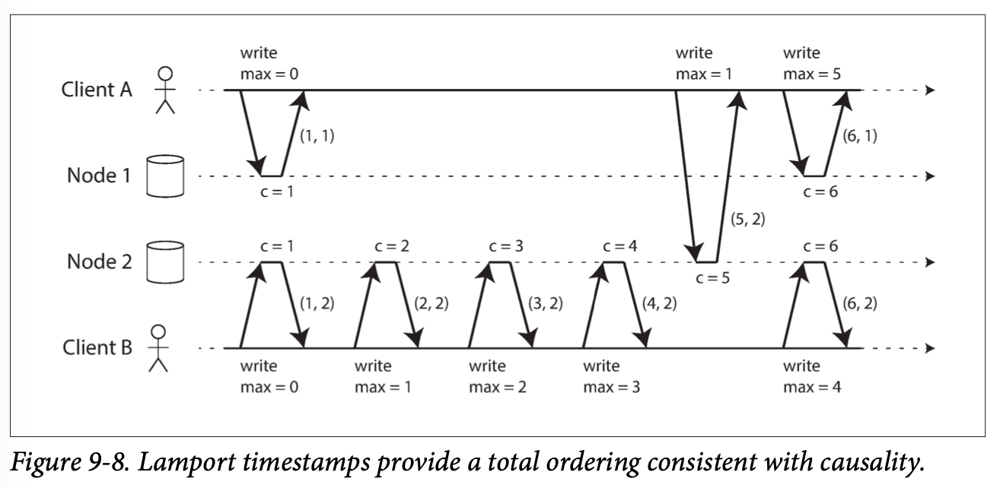
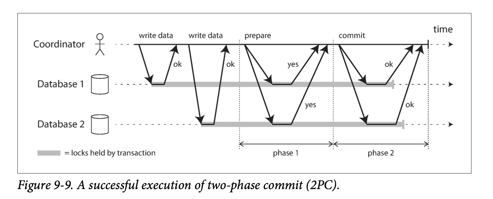
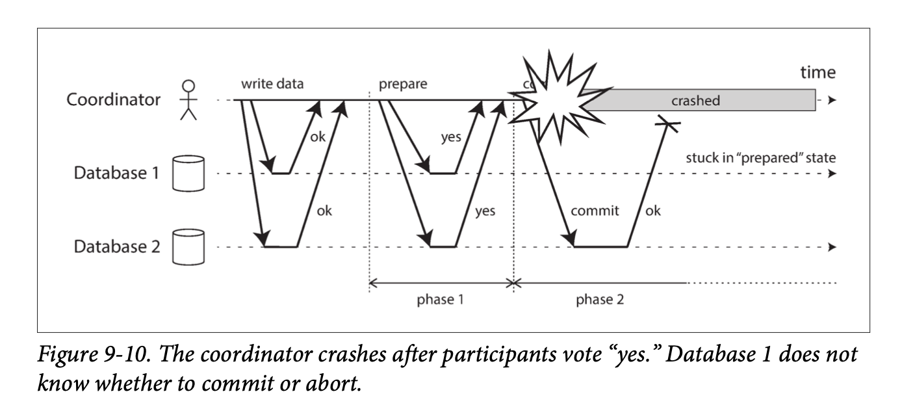

一致性和共识算法就是为了解决容错性问题
# Linearizability
Database could give the illusion that there is only one replica, then every client would have the same view of the data, and you wouldn’t have to worry about replication lag. In other words, linearizability is a recency guarantee. 
## CAP
A better way of phras‐ ing CAP would be either Consistent or Available when Partitioned

Although linearizability is a useful guarantee, surprisingly few systems are actually linearizable in practice. 
The same is true of many distributed databases that choose not to provide lineariza‐ ble guarantees: they do so primarily to increase performance, not so much for fault tolerance.
Linearizability is slow—and this is true all the time, not only during a network fault. 
The reason for dropping linearizability is performance, not fault tolerance.

## Ordering and Causality (顺序和因果关系)
It turns out that there are deep connections between ordering, linearizability, and consensus. 

Causality imposes an ordering on events: cause comes before effect; a message is sent before that message is received; the question comes before the answer.

如果一个系统服从因果关系所规定的顺序，我们说它是**因果一致（causally consistent）**的。例如，快照隔离提供了因果一致性：当你从数据库中读取到一些数据时，你一定还能够看到其因果前驱（假设在此期间这些数据还没有被删除）。

### The causal order is not a total order
**全序（total order)** 允许任意两个元素进行比较，所以如果有两个元素，你总是可以说出哪个更大，哪个更小。例如，自然数集是全序的：给定两个自然数，比如说5和13，那么你可以告诉我，13大于5

**数学集合是偏序（partially order)** 在某些情况下，可以说一个集合大于另一个（如果一个集合包含另一个集合的所有元素 {a,b,c} {a,b}），但在其他情况下它们是无法比较的({a,b} {b,c})

### Linearizability
在线性一致的系统中，操作是全序的：如果系统表现的就好像只有一个数据副本，并且所有操作都是原子性的，这意味着对任何两个操作，我们总是能判定哪个操作先发生。
### Causality
We said that two operations are concurrent if neither happened before the other. Put another way, two events are ordered if they are causally related (one happened before the other), but they are incomparable if they are concurrent. This means that causality defines a partial order, not a total order: some operations are ordered with respect to each other, but some are incomparable.

因此，根据这个定义，在线性一致的数据存储中是不存在并发操作的：必须有且仅有一条时间线，所有的操作都在这条时间线上，构成一个全序关系。可能有几个请求在等待处理，但是数据存储确保了每个请求都是在唯一时间线上的某个时间点自动处理的，不存在任何并发。

并发意味着时间线会分岔然后合并 —— 在这种情况下，不同分支上的操作是无法比较的（即并发操作）

线性一致性确保因果性的事实使线性一致系统变得简单易懂，更有吸引力。然而，正如“线性一致性的代价”中所讨论的，使系统线性一致可能会损害其性能和可用性，尤其是在系统具有严重的网络延迟的情况下（例如，如果系统在地理上散布）

In fact, causal consistency is the strongest possible consistency model that does not slow down due to network delays, and remains available in the face of network failures 

### Capturing causal dependencies
Version vectors 

## Sequence Number Ordering
### Lamport timestamps
Each node has a unique identifier, and each node keeps a counter of the number of operations it has processed.  
The Lamport timestamp is then simply a pair of (counter, node ID). 
If you have two timestamps, the one with a greater counter value is the greater timestamp; if the counter values are the same, the one with the greater node ID is the greater timestamp. 
How does counter work? 

A receives a counter value of 5 from node 2, and then sends that maximum of 5 to node 1. At that time, node 1’s counter was only 1, but it was immediately moved forward to 5, so the next operation had an incre‐ mented counter value of 6.

### Timestamp ordering is not sufficient
This approach works for determining the winner after the fact: once you have collec‐ ted all the username creation operations in the system, you can compare their time‐ stamps. However, it is not sufficient when a node has just received a request from a user to create a username, and needs to decide right now whether the request should succeed or fail. At that moment, the node does not know whether another node is concurrently in the process of creating an account with the same username, and what timestamp that other node may assign to the operation. If one of the other nodes has failed or cannot be reached due to a network problem, this system would grind to a halt. This is not the kind of fault-tolerant system that we need.

## Total Order Broadcast
In order to implement something like a uniqueness constraint for user‐ names, it’s not sufficient to have a total ordering of operations—you also need to know when that order is finalized

Total order broadcast is usually described as a protocol for exchanging messages between nodes. Informally, it requires that two safety properties always be satisfied:
* Reliable delivery -  No messages are lost: if a message is delivered to one node, it is delivered to all nodes.
* Totally ordered delivery -  Messages are delivered to every node in the same order.

Consensus services such as ZooKeeper and etcd actually implement total order broadcast.

Total order broadcast is asynchronous: messages are guaranteed to be delivered relia‐ bly in a fixed order, but there is no guarantee about when a message will be delivered. 
By contrast, linearizability is a recency guarantee: a read is guaranteed to see the latest value written.

## Distributed Transactions and Consensus
### Fischer, Lynch, and Paterson—which 
FLP result proves that there is no algorithm that is always able to reach consensus if there is a risk that a node may crash. While the precondition is not using any clocks or timeouts. 
If the algorithm is allowed to use timeouts, or some other way of identifying suspected crashed nodes (even if the suspicion is sometimes wrong), then consensus becomes solvable

### 2PC (2-Phase Commit)
The purpose of transaction atomicity is to provide simple semantics in the case where something goes wrong in the middle of making several writes. The outcome of a transaction is either a successful commit, in which case all of the transaction’s writes are made durable, or an abort, in which case all of the transaction’s writes are rolled back.

2PC uses a new component that does not normally appear in single-node transactions: a coordinator (also known as transaction manager). The coordinator is often implemented as a library within the same application process that is requesting the transaction (e.g., embedded in a Java EE container), but it can also be a separate process or service. Examples of such coordinators include Narayana, JOTM, BTM, or MSDTC.

正常情况下，2PC事务以应用在多个数据库节点上读写数据开始。我们称这些数据库节点为参与者（participants）。当应用准备提交时，协调者开始阶段 1 ：它发送一个**准备（prepare）**请求到每个节点，询问它们是否能够提交。然后协调者会跟踪参与者的响应：
* 如果所有参与者都回答“是”，表示它们已经准备好提交，那么协调者在阶段 2 发出**提交（commit）**请求，然后提交真正发生。
* 如果任意一个参与者回复了“否”，则协调者在阶段2 中向所有节点发送**中止（abort）**请求。

1. 当应用想要启动一个分布式事务时，它向协调者请求一个事务ID。此事务ID是全局唯一的。
2. 应用在每个参与者上启动单节点事务，并在单节点事务上捎带上这个全局事务ID。所有的读写都是在这些单节点事务中各自完成的。如果在这个阶段出现任何问题（例如，节点崩溃或请求超时），则协调者或任何参与者都可以中止。
3. 当应用准备提交时，协调者向所有参与者发送一个准备请求，并打上全局事务ID的标记。如果任意一个请求失败或超时，则协调者向所有参与者发送针对该事务ID的中止请求。
4. 参与者收到准备请求时，需要确保在任意情况下都的确可以提交事务。这包括将所有事务数据写入磁盘（出现故障，电源故障，或硬盘空间不足都不能是稍后拒绝提交的理由）以及检查是否存在任何冲突或违反约束。通过向协调者回答“是”，节点承诺，只要请求，这个事务一定可以不出差错地提交。换句话说，参与者放弃了中止事务的权利，但没有实际提交。
5. 当协调者收到所有准备请求的答复时，会就提交或中止事务作出明确的决定（只有在所有参与者投赞成票的情况下才会提交）。协调者必须把这个决定写到磁盘上的事务日志中，如果它随后就崩溃，恢复后也能知道自己所做的决定。这被称为提交点（<b>commit point</b>）。
6. 一旦协调者的决定落盘，提交或放弃请求会发送给所有参与者。如果这个请求失败或超时，协调者必须永远保持重试，直到成功为止。没有回头路：如果已经做出决定，不管需要多少次重试它都必须被执行。如果参与者在此期间崩溃，事务将在其恢复后提交——由于参与者投了赞成，因此恢复后它不能拒绝提交。

如果协调者在发送准备请求之前失败，参与者可以安全地中止事务。但是，一旦参与者收到了准备请求并投了“是”，就不能再单方面放弃 —— 必须等待协调者回答事务是否已经提交或中止。如果此时协调者崩溃或网络出现故障，参与者什么也做不了只能等待。参与者的这种事务状态称为**存疑（in doubt）的或不确定（uncertain）**的。

在这个特定的例子中，协调者实际上决定提交，数据库2 收到提交请求。但是，协调者在将提交请求发送到数据库1 之前发生崩溃，因此数据库1 不知道是否提交或中止。即使超时在这里也没有帮助：如果数据库1 在超时后单方面中止，它将最终与执行提交的数据库2 不一致。同样，单方面提交也是不安全的，因为另一个参与者可能已经中止了。

没有协调者的消息，参与者无法知道是提交还是放弃。原则上参与者可以相互沟通，找出每个参与者是如何投票的，并达成一致，但这不是2PC协议的一部分。

​可以完成2PC的唯一方法是等待协调者恢复。这就是为什么协调者必须在向参与者发送提交或中止请求之前，将其提交或中止决定写入磁盘上的事务日志：协调者恢复后，通过读取其事务日志来确定所有存疑事务的状态。任何在协调者日志中没有提交记录的事务都会中止。因此，2PC的提交点归结为协调者上的常规单节点原子提交。

### 3PL
Two-phase commit is called a blocking atomic commit protocol due to the fact that 2PC can become stuck waiting for the coordinator to recover. 
通常，非阻塞原子提交需要一个完美的故障检测器（perfect failure detector）—— 即一个可靠的机制来判断一个节点是否已经崩溃。在具有无限延迟的网络中，超时并不是一种可靠的故障检测机制，因为即使没有节点崩溃，请求也可能由于网络问题而超时。出于这个原因，2PC仍然被使用，尽管大家都清楚可能存在协调者故障的问题。

Much of the performance cost inherent in two-phase commit is due to the additional disk forcing (fsync) that is required for crash recovery , and the additional network round-trips.

Database-internal transactions do not have to be compatible with any other system, so they can use any protocol and apply optimizations specific to that particular tech‐ nology. For that reason, database-internal distributed transactions can often work quite well. On the other hand, transactions spanning heterogeneous technologies are a lot more challenging.

### XA Transactions
X/Open XA (short for eXtended Architecture) is a standard for implementing two- phase commit across heterogeneous technologies.

XA is supported by many traditional relational databases (including PostgreSQL, MySQL, DB2, SQL Server, and Oracle) and mes‐ sage brokers (including ActiveMQ, HornetQ, MSMQ, and IBM MQ).

XA is not a network protocol— it is merely a C API for interfacing with a transaction coordinator. 

协调者通常只是一个库，被加载到 发起事务的应用的 同一个进程中 (这个进程是在 application 运行的机器上 并且和应用的进程是一个, 而不是单独的服务）。它在事务中个跟踪所有的参与者，并在要求它们准备之后收集参与者的响应（通过驱动回调），并使用本地磁盘上的日志记录每次事务的决定（提交/中止）。 
If the application process crashes, or the machine on which the application is running dies, the coordinator goes with it. 

如果应用进程崩溃，或者运行应用的机器报销了，协调者也随之往生极乐。然后任何带有准备了但未提交事务的参与者都会在疑虑中卡死。由于协调程序的日志位于应用服务器的本地磁盘上，因此必须重启该服务器，且协调程序库必须读取日志以恢复每个事务的提交/中止结果。只有这样，协调者才能使用数据库驱动的XA回调来要求参与者提交或中止。数据库服务器不能直接联系协调者，因为所有通信都必须通过客户端库。
### Holding locks while in doubt
Why do we care so much about a transaction being stuck in doubt?  
数据库事务通常获取待修改的行上的 排他锁。在事务提交或中止之前，数据库不能释放这些锁（如图9-9中的阴影区域所示）。因此，在使用两阶段提交时，事务必须在整个存疑期间持有这些锁。如果协调者已经崩溃，需要20分钟才能重启，那么这些锁将会被持有20分钟。如果协调者的日志由于某种原因彻底丢失，这些锁将被永久持有 —— 或至少在管理员手动解决该情况之前。
### Recovering from coordinator failure
In theory, if the coordinator crashes and is restarted, it should cleanly recover its state from the log and resolve any in-doubt transactions. However, in practice, orphaned in-doubt transactions do occur —that is, transactions for which the coordinator cannot decide the outcome for whatever reason (e.g., because the transaction log has been lost or corrupted due to a software bug). These transactions cannot be resolved automatically, so they sit forever in the database, holding locks and blocking other transactions.

The only way out is for an administrator to manually decide whether to commit or roll back the transactions. 管理员必须检查每个存疑事务的参与者，确定是否有任何参与者已经提交或中止，然后将相同的结果应用于其他参与者。解决这个问题潜在地需要大量的人力，并且可能发生在严重的生产中断期间

Many XA implementations have an emergency escape hatch called heuristic decisions: allowing a participant to unilaterally decide to abort or commit an in-doubt transac‐ tion without a definitive decision from the coordinator 

## Fault-Tolerant Consensus
The consensus problem is normally formalized as follows: one or more nodes may propose values, and the consensus algorithm decides on one of those values. 

A consensus algorithm must satisfy the following properties:
* Uniform agreement
    * No two nodes decide differently.
* Integrity
    * No node decides twice.
* Validity
    * If a node decides value v, then v was proposed by some node.
* Termination
    * Every node that does not crash eventually decides some value.

The uniform agreement and integrity properties define the core idea of consensus: everyone decides on the same outcome, and once you have decided, you cannot change your mind.  
The validity property exists mostly to rule out trivial solutions: like null value is from algorithm instead of a node.

Termination is a liveness property, whereas the other three are safety properties

### Consensus algorithms 
The best-known fault-tolerant consensus algorithms are Viewstamped Replication (VSR), Paxos,
Raft, and Zab.

共识协议定义了一个时代编号（epoch number）（在Paxos中称为投票编号（ballot number），视图戳复制中的视图编号（view number），以及Raft中的任期号码（term number）），并确保在每个时代中，领导者都是唯一的。

Before a leader is allowed to decide anything, it must first check that there isn’t some other leader with a higher epoch number which might take a conflicting decision. Thus, we have two rounds of voting: once to choose a leader, and a second time to vote on a leader’s proposal. 
There must be an overlap of quorums between two votes: if a vote on a proposal succeeds, at least one of the nodes that voted for it must have also participated in the most recent leader election

### Limitations of consensus
* 节点在做出决定之前对提议进行投票的过程是一种同步复制，在这种配置中发生故障切换时，一些已经提交的数据可能会丢失 
* 共识系统总是需要严格多数来运转。这意味着你至少需要三个节点才能容忍单节点故障（其余两个构成多数），或者至少有五个节点来容忍两个节点发生故障（其余三个构成多数）
* 在网络延迟高度变化的环境中，频繁的领导者选举会导致糟糕的性能表现

有时共识算法对网络问题特别敏感。例如Raft已被证明存在让人不悦的极端情况【106】：如果整个网络工作正常，但只有一条特定的网络连接一直不可靠，Raft可能会进入领导频繁二人转的局面，或者当前领导者不断被迫辞职以致系统实质上毫无进展。其他一致性算法也存在类似的问题，而设计能健壮应对不可靠网络的算法仍然是一个开放的研究问题。

## 一致性保证
最终一致性的一个更好的名字可能是 收敛（convergence）。分布式一致性主要关于 在面对延迟和故障时如何协调副本间的状态。接下来会看到3大内容：
* 线性一致性
* ordering guarantees
* 分布式事务与共识

## Linearizability
如果数据库可以提供只有一个副本的假象（即，只有一个数据副本），那么事情就简单太多了。那么每个客户端都会有相同的数据视图，且不必担心复制滞后了。基本的想法是让一个系统看起来好像只有一个数据副本，而且所有的操作都是原子性的。有了这个保证，即使实际中可能有多个副本，应用也不需要担心它们。

线性一致性是一个 新鲜度保证（recency guarantee）。

线性一致性要求满足以下两个条件:
* 原子性（Atomicity）：每个操作的执行必须是原子的，即要么操作完全成功，要么没有执行，没有部分执行的情况。这确保了操作的一致性，不会出现数据损坏或丢失的情况。
* 顺序一致性（Sequential Consistency）：所有的操作必须按照其提交的顺序在系统中生效，并且所有节点都能看到相同的操作执行顺序。换句话说，所有节点对于每个操作的执行结果都是一致的。
### 实现线性一致的系统
于线性一致性本质上意味着 “表现得好像只有一个数据副本，而且所有的操作都是原子的”，所以最简单的答案就是，真的只用一个数据副本。但是这种方法无法容错：如果持有该副本的节点失效，数据将会丢失，或者至少无法访问，直到节点重新启动