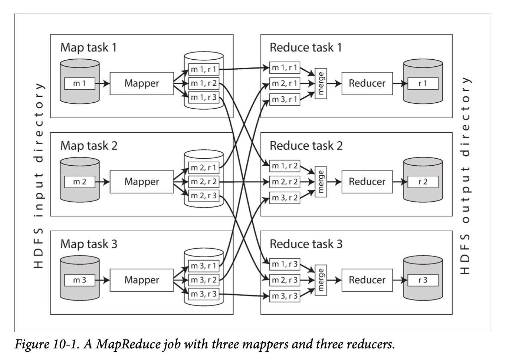
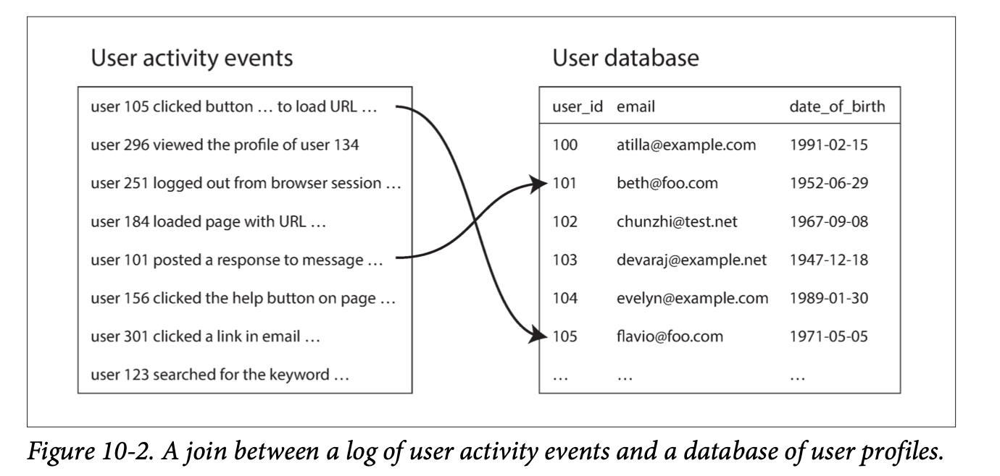
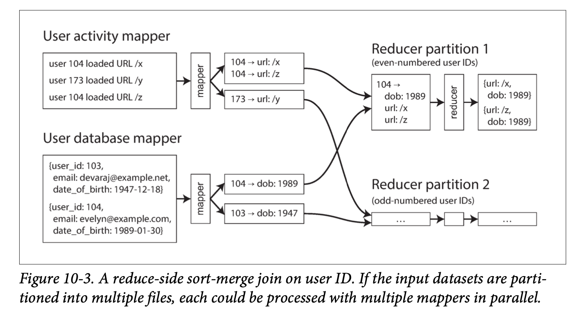

On a high level, systems that store and process data can be grouped into two broad categories:
* Systems of record
    * A system of record, also known as source of truth, holds the authoritative version of your data. When new data comes in, e.g., as user input, it is first written here. Each fact is represented exactly once (the representation is typically normalized). If there is any discrepancy between another system and the system of record, then the value in the system of record is (by definition) the correct one.
* Derived data systems
    * Data in a derived system is the result of taking some existing data from another system and transforming or processing it in some way. If you lose derived data, you can recreate it from the original source. A classic example is a cache: data can be served from the cache if present, but if the cache doesn’t contain what you need, you can fall back to the underlying database. Denormalized values, indexes, and materialized views also fall into this category. In recommendation systems, predictive summary data is often derived from usage logs.

Three different types of systems:
* Services (online systems)
    * A service waits for a request or instruction from a client to arrive. When one is received, the service tries to handle it as quickly as possible and sends a response back. Response time is usually the primary measure of performance of a service, and availability is often very important (if the client can’t reach the service, the user will probably get an error message).
* Batch processing systems (offline systems)
    * A batch processing system takes a large amount of input data, runs a job to pro‐ cess it, and produces some output data. Jobs often take a while (from a few minutes to several days), so there normally isn’t a user waiting for the job to fin‐ ish. Instead, batch jobs are often scheduled to run periodically (for example, once a day). The primary performance measure of a batch job is usually throughput (the time it takes to crunch through an input dataset of a certain size).
* Stream processing systems (near-real-time systems)
    * Stream processing is somewhere between online and offline/batch processing (so it is sometimes called near-real-time or nearline processing). Like a batch pro‐ cessing system, a stream processor consumes inputs and produces outputs (rather than responding to requests). However, a stream job operates on events shortly after they happen, whereas a batch job operates on a fixed set of input data. This difference allows stream processing systems to have lower latency than the equivalent batch systems. 


## UNIX log analysis and MapReduce
### UNIX
```log
216.58.210.78 - - [27/Feb/2015:17:55:11 +0000] "GET /css/typography.css HTTP/1.1" 200 3377 "http://martin.kleppmann.com/" "Mozilla/5.0 (Macintosh; Intel Mac OS X 10_9_5) AppleWebKit/537.36 (KHTML, like Gecko) Chrome/40.0.2214.115 Safari/537.36"

below is the format:
$remote_addr - $remote_user [$time_local] "$request" $status $body_bytes_sent "$http_referer" "$http_user_agent"
```
Why there are two "-" in the log? The user was not authenticated, so $remote_user is set to a hyphen[ˈhaɪfən] (-)

```
cat /var/log/nginx/access.log | awk '{print $7}' | #1 
sort | #2 (Alphabetically sort the list of requested URLs)
uniq -c | #3 （The uniq command filters out repeated lines in its input by checking whether two adjacent lines are the same. The -c option tells it to also output a counter 一般都与sort并用)
sort -r -n | #4 (-n Sort fields numerically by arithmetic value, -r reverse)
head -n 5 #5 (first 5 lines)
```
The biggest limitation of Unix tools is that they run only on a single machine—and that’s where tools like Hadoop come in.
### MapReduce
MapReduce is a bit like Unix tools, but distributed across potentially thousands of machines. Like Unix tools, it is a fairly blunt, brute-force, but surprisingly effective tool. A single MapReduce job is comparable to a single Unix process: it takes one or more inputs and produces one or more outputs.


### HDFS
HDFS consists of a daemon process running on each machine, exposing a network service that allows other nodes to access files stored on that machine (assuming that every general-purpose machine in a datacenter has some disks attached to it). A cen‐ tral server called the NameNode keeps track of which file blocks are stored on which machine. Thus, HDFS conceptually creates one big filesystem that can use the space on the disks of all machines running the daemon.

## The pattern of data processing in MapReduce
1. Read a set of input files, and break it up into records. 
2. Call the mapper function to extract a key and value from each input record. (The mapper function is awk '{print $7}': it extracts the URL ($7) as the key, and leaves the value empty.)
3. Sort all of the key-value pairs by key. In the log example, this is done by the first sort command.
4. Call the reducer function to iterate over the sorted key-value pairs. If there are multiple occurrences of the same key, the sorting has made them adjacent in the list, so it is easy to combine those values without having to keep a lot of state in memory. In the preceding example, the reducer is implemented by the command uniq -c, which counts the number of adjacent records with the same key.

这四个步骤可以作为一个MapReduce作业执行。步骤2（Map）和4（Reduce）是你编写自定义数据处理代码的地方。步骤1（将文件分解成记录）由输入格式解析器处理。步骤3中的排序步骤隐含在MapReduce中 —— 你不必编写它，因为Mapper的输出始终在送往Reducer之前进行排序。

The main difference from pipelines of Unix commands is that MapReduce can paral‐ lelize a computation across many machines, without you having to write code to explicitly handle the parallelism. It is possible to use standard Unix tools as mappers and reducers in a distributed computation, but more commonly they are implemented as functions in a con‐ ventional programming language.

the input to a job is typically a directory in HDFS, and each file or file block within the input directory is considered to be a sepa‐ rate partition that can be processed by a separate map task (marked by m 1, m 2, and m 3 in Figure 10-1)

每个输入文件的大小通常是数百兆字节。 MapReduce调度器（图中未显示）试图在其中一台存储输入文件副本的机器上运行每个Mapper，只要该机器有足够的备用RAM和CPU资源来运行Mapper任务. <br>
This principle is known as putting the com‐ putation near the data. It saves copying the input file over the network, reducing network load and increasing locality.

在大多数情况下，应该在Mapper任务中运行的应用代码在将要运行它的机器上还不存在，所以MapReduce框架首先将代码（例如Java程序中的JAR文件）复制到适当的机器。然后启动Map任务并开始读取输入文件，一次将一条记录传入Mapper回调函数。Mapper的输出由键值对组成。

计算的Reduce端也被分区。虽然Map任务的数量由输入文件块的数量决定，但Reducer的任务的数量是由作业作者配置的（它可以不同于Map任务的数量）。为了确保具有相同键的所有键值对最终落在相同的Reducer处，框架使用键的散列值来确定哪个Reduce任务应该接收到特定的键值对

The Hadoop Map‐ Reduce framework does not have any particular support for workflows, so this chain‐ ing is done implicitly by directory name: the first job must be configured to write its output to a designated directory in HDFS, and the second job must be configured to read that same directory name as its input. From the MapReduce framework’s point of view, they are two independent jobs.

键值对必须进行排序，但数据集可能太大，无法在单台机器上使用常规排序算法进行排序。作为替代，排序分阶段进行。Each of these partitions is written to a sorted file on the mapper’s local disk, using a technique similar to what we discussed in “SSTables(sorted string tables) and LSM- Trees”. Whenever a mapper finishes reading its input file and writing its sorted output files, the MapReduce scheduler notifies the reducers that they can start fetching the output files from that mapper. The reducers connect to each of the mappers and download the files of sorted key-value pairs for their partition. The process of partitioning by reducer, sorting, and copying data partitions from mappers to reducers is known as the shuffle.
## Reduce-Side Joins
### Example: analysis of user activity events

分析任务可能需要将用户活动与用户简档相关联：例如，如果档案包含用户的年龄或出生日期，系统就可以确定哪些页面更受哪些年龄段的用户欢迎。然而活动事件仅包含用户ID，而没有包含完整的用户档案信息。在每个活动事件中嵌入这些档案信息很可能会非常浪费。因此，活动事件需要与用户档案数据库相连接。<br>
怎么相连? <br>
获取用户数据库的副本（例如，使用ETL进程从数据库备份中提取数据，参阅“数据仓库”），并将它和用户行为日志放入同一个分布式文件系统中。然后你可以将用户数据库存储在HDFS中的一组文件中，而用户活动记录存储在另一组文件中，并能用MapReduce将所有相关记录集中到同一个地方进行高效处理。
### Sort-merge joins

Recall that the purpose of the mapper is to extract a key and value from each input record. In the case of Figure 10-2, this key would be the user ID: one set of mappers would go over the activity events (extracting the user ID as the key and the activity event as the value), while another set of mappers would go over the user database (extracting the user ID as the key and the user’s date of birth as the value). 

When the MapReduce framework partitions the mapper output by key and then sorts the key-value pairs, the effect is that all the activity events and the user record with the same user ID become adjacent to each other in the reducer input. The Map‐ Reduce job can even arrange the records to be sorted such that the reducer always sees the record from the user database first, followed by the activity events in time‐ stamp order—this technique is known as a secondary sort 

The pattern of “bringing all records with the same key to the same place” breaks down if there is a very large amount of data related to a single key. Collecting all activity related to a celebrity (e.g., replies to something they posted) in a single reducer can lead to significant skew (also known as hot spots)—that is, one reducer that must process significantly more records than the others.

Pig中的倾斜连接（skewed join）方法首先运行一个抽样作业来确定哪些键是热键，连接实际执行时，Mapper会将热键的关联记录随机。发送到几个Reducer之一。对于另外一侧的连接输入，与热键相关的记录需要被复制到所有处理该键的Reducer上。这种技术将处理热键的工作分散到多个Reducer上，这样可以使其更好地并行化，代价是需要将连接另一侧的输入记录复制到多个Reducer上。

## Map-Side Joins
The join algorithms described in the last section perform the actual join logic in the reducers, and are hence known as reduce-side joins.

The reduce-side approach has the advantage that you do not need to make any assumptions about the input data: whatever its properties and structure, the mappers can prepare the data to be ready for joining. However, the downside is that all that sorting, copying to reducers, and merging of reducer inputs can be quite expensive. Depending on the available memory buffers, data may be written to disk several times as it passes through the stages of MapReduce.

On the other hand, if you can make certain assumptions about your input data, it is possible to make joins faster by using a so-called map-side join. This approach uses a cut-down MapReduce job in which there are no reducers and no sorting. Instead, each mapper simply reads one input file block from the distributed filesystem and writes one output file to the filesystem—that is all.

### Broadcast hash joins
最简单场景是大数据集与小数据集连接的情况。要点在于小数据集需要足够小，以便可以将其全部加载到每个Mapper的内存中。例如图10-2，用户数据库(足够小可以放到内存中) 和 活动事件数据库(大数据集)。在这种情况下，当Mapper启动时，它可以首先将 `用户数据库` 从分布式文件系统读取到内存中的散列中。完成此操作后，Map程序可以扫描用户活动事件，并简单地在散列表中查找每个事件的用户ID。参与连接的较大输入的每个文件块各有一个Mapper，每个Mapper都会将较小输入整个加载到内存中。除了将连接较小输入加载到内存散列表中，另一种方法是将较小输入存储在本地磁盘上的只读索引中。索引中经常使用的部分将保留在操作系统的页面缓存中，因而这种方法可以提供与内存散列表几乎一样快的随机查找性能，但实际上并不需要数据集能放入内存中。

### Difference between Map-side and Reduce-side
When the output of a MapReduce join is consumed by downstream jobs, the choice of map-side or reduce-side join affects the structure of the output.Reduce端连接的输出是按照连接键进行分区和排序的，而Map端连接的输出则按照与较大输入相同的方式进行分区和排序（因为无论是使用分区连接还是广播连接，连接较大输入端的每个文件块都会启动一个Map任务）。

如前所述，Map端连接也对输入数据集的大小，有序性和分区方式做出了更多假设。在优化连接策略时，了解分布式文件系统中数据集的物理布局变得非常重要：仅仅知道编码格式和数据存储目录的名称是不够的；你还必须知道数据是按哪些键做的分区和排序，以及分区的数量。在Hadoop生态系统中，这种关于数据集分区的元数据通常在HCatalog和Hive Metastore中维护

## The Output of Batch Workflows
### Building search indexes
Google’s original use of MapReduce was to build indexes for its search engine, which was implemented as a workflow of 5 to 10 MapReduce jobs. Although Google later moved away from using MapReduce for this purpose, Hadoop MapReduce remains a good way of building indexes for Lucene/Solr.

Full-text search index such as Lucene works: it is a file (the term dictionary) in which you can efficiently look up a particular keyword and find the list of all the document IDs con‐ taining that keyword.

If you need to perform a full-text search over a fixed set of documents, then a batch process is a very effective way of building the indexes: the mappers partition the set of documents as needed, each reducer builds the index for its partition, and the index files are written to the distributed filesystem.

## Comparing Hadoop to Distributed Databases
正如我们所看到的，Hadoop有点像Unix的分布式版本，其中HDFS是文件系统，而MapReduce是Unix进程的怪异实现（总是在Map阶段和Reduce阶段运行sort工具）。我们了解了如何在这些原语的基础上实现各种连接和分组操作。

当MapReduce论文发表时，它从某种意义上来说 —— 并不新鲜。我们在前几节中讨论的所有处理和并行连接算法已经在十多年前所谓的**大规模并行处理（MPP， massively parallel processing）**数据库中实现了。比如Gamma database machine，Teradata和Tandem NonStop SQL就是这方面的先驱。

​最大的区别是，MPP数据库专注于在一组机器上并行执行分析SQL查询，而MapReduce和分布式文件系统的组合则更像是一个可以运行任意程序的通用操作系统。

## Materialization of Intermediate State
你知道一个作业的输出只能用作另一个作业的输入，这些作业由同一个团队维护。在这种情况下，分布式文件系统上的文件只是简单的中间状态（intermediate state）：一种将数据从一个作业传递到下一个作业的方式。在一个用于构建推荐系统的，由50或100个MapReduce作业组成的复杂工作流中，存在着很多这样的中间状态. The process of writing out this intermediate state to files is called materialization.

MapReduce’s approach of fully materializing intermediate state has downsides compared to Unix pipes:
* A MapReduce job can only start when all tasks in the preceding jobs (that gener‐ ate its inputs) have completed, whereas processes connected by a Unix pipe are started at the same time, with output being consumed as soon as it is produced. Skew or varying load on different machines means that a job often has a few straggler tasks that take much longer to complete than the others. Having to wait until all of the preceding job’s tasks have completed slows down the execution of the workflow as a whole.
* Mappers are often redundant: they just read back the same file that was just writ‐ ten by a reducer, and prepare it for the next stage of partitioning and sorting. In many cases, the mapper code could be part of the previous reducer: if the reducer output was partitioned and sorted in the same way as mapper output, then reducers could be chained together directly, without interleaving with mapper stages.
* Storing intermediate state in a distributed filesystem means those files are repli‐ cated across several nodes, which is often overkill for such temporary data.

了解决MapReduce的这些问题，几种用于分布式批处理的新执行引擎被开发出来，其中最著名的是Spark，Tez 和Flink。它们的设计方式有很多区别，但有一个共同点：把整个工作流作为单个作业来处理，而不是把它分解为独立的子作业。Since they explicitly model the flow of data through several processing stages, these systems are known as dataflow engines. Like MapReduce, they work by repeatedly calling a user-defined function to process one record at a time on a single thread. They parallelize work by partitioning inputs, and they copy the output of one func‐ tion over the network to become the input to another function.
Unlike in MapReduce, these functions need not take the strict roles of alternating map and reduce, but instead can be assembled in more flexible ways. These functions are `operators`(算子)

### Fault tolerance
An advantage of fully materializing intermediate state to a distributed filesystem is that it is durable, which makes fault tolerance fairly easy in MapReduce: if a task fails, it can just be restarted on another machine and read the same input again from the filesystem. 
Spark，Flink和Tez避免将中间状态写入HDFS，因此它们采取了不同的方法来容错：如果一台机器发生故障，并且该机器上的中间状态丢失，则它会从其他仍然可用的数据重新计算（在可行的情况下是先前的中间状态，要么就只能是原始输入数据，通常在HDFS上）

To enable this recomputation, the framework must keep track of how a given piece of data was computed - which input partitions it used, and which operators were applied to it. Spark uses the resilient distributed dataset (RDD) abstraction for track‐ ing the ancestry of data, while Flink checkpoints operator state, allowing it to resume running an operator that ran into a fault during its execution.

When recomputing data, it is important to know whether the computation is deter‐ ministic: that is, given the same input data, do the operators always produce the same output? This question matters if some of the lost data has already been sent to down‐ stream operators. If the operator is restarted and the recomputed data is not the same as the original lost data, it becomes very hard for downstream operators to resolve the contradictions between the old and new data. The solution in the case of nondeter‐ ministic operators is normally to kill the downstream operators as well, and run them again on the new data.

In order to avoid such cascading faults, it is better to make operators deterministic. 但需要注意的是，非确定性行为很容易悄悄溜进来：例如，许多编程语言在迭代哈希表的元素时不能对顺序作出保证，许多概率和统计算法显式依赖于使用随机数，以及用到系统时钟或外部数据源，这些都是都不确定性的行为。为了能可靠地从故障中恢复，需要消除这种不确定性因素，例如使用固定的种子生成伪随机数。通过重算数据来从故障中恢复并不总是正确的答案：如果中间状态数据要比源数据小得多，或者如果计算量非常大，那么将中间数据物化为文件可能要比重新计算廉价的多。

## Graphs and Iterative Processing
* 社交网络的分析 （常用算法：Community Detection）    
* 万维网WWW （常用算法：PageRank）    
* 计算生物学 （如:研究分子活动路径，蛋白质之间作用等）    
* 工程 （如：集成电路的设计）    
* 科学计算 （如：图划分，图着色，图匹配）    
* 安全领域 （如：安全事件分析）

Many graph algorithms are expressed by traversing one edge at a time, joining one vertex with an adjacent vertex in order to propagate some information, and repeating until some condition is met—for example, until there are no more edges to follow, or until some metric converges. We saw an example in Figure 2-6, which made a list of all the locations in North America contained in a database by repeatedly following edges indicating which location is within which other location (this kind of algorithm is called a transitive closure).

It is possible to store a graph in a distributed filesystem (in files containing lists of vertices and edges):
1. An external scheduler runs a batch process to calculate one step of the algorithm.
2. When the batch process completes, the scheduler checks whether it has finished (based on the completion condition—e.g., there are no more edges to follow, or the change compared to the last iteration is below some threshold).
3. If it has not yet finished, the scheduler goes back to step 1 and runs another round of the batch process.

This approach works, but implementing it with MapReduce is often very inefficient, because MapReduce does not account for the iterative nature of the algorithm: it will always read the entire input dataset and produce a completely new output dataset, even if only a small part of the graph has changed compared to the last iteration.
### The Pregel processing model
As an optimization for batch processing graphs, the bulk synchronous parallel (BSP) model of computation has become popular. Among others, it is implemented by Apache Giraph, Spark’s GraphX API, and Flink’s Gelly API.

Recall that in MapReduce, mappers conceptually “send a message” to a particular call of the reducer because the framework collects together all the mapper outputs with the same key. A similar idea is behind Pregel: one vertex can “send a message” to another vertex, and typically those messages are sent along the edges in a graph.

In each iteration, a function is called for each vertex, passing it all the messages that were sent to it—much like a call to the reducer. The difference from MapReduce is that in the Pregel model, a vertex remembers its state in memory from one iteration to the next, so the function only needs to process new incoming messages. If no mes‐ sages are being sent in some part of the graph, no work needs to be done.

### Fault tolerance
This fault tolerance is achieved by periodically checkpointing the state of all vertices at the end of an iteration—i.e., writing their full state to durable storage. If a node fails and its in-memory state is lost, the simplest solution is to roll back the entire graph computation to the last checkpoint and restart the computation. If the algo‐ rithm is deterministic and messages are logged, it is also possible to selectively recover only the partition that was lost (like we previously discussed for dataflow engines)

## Summary
### Partitioning
In MapReduce, mappers are partitioned according to input file blocks. The out‐ put of mappers is repartitioned, sorted, and merged into a configurable number of reducer partitions. The purpose of this process is to bring all the related data— e.g., all the records with the same key—together in the same place.<br>
Post-MapReduce dataflow engines try to avoid sorting unless it is required, but they otherwise take a broadly similar approach to partitioning.

### Fault tolerance
MapReduce frequently writes to disk, which makes it easy to recover from an individual failed task without restarting the entire job but slows down execution in the failure-free case. Dataflow engines perform less materialization of inter‐ mediate state and keep more in memory, which means that they need to recom‐ pute more data if a node fails. Deterministic operators reduce the amount of data that needs to be recomputed.

### Sort-merge joins
Each of the inputs being joined goes through a mapper that extracts the join key(连接键). By partitioning, sorting, and merging, all the records with the same key end up going to the same call of the reducer. This function can then output the joined records.

### Broadcast hash joins
One of the two join inputs is small, so it is not partitioned and it can be entirely loaded into a hash table. Thus, you can start a mapper for each partition of the large join input, load the hash table for the small input into each mapper, and then scan over the large input one record at a time, querying the hash table for each record.

### Partitioned hash joins
If the two join inputs are partitioned in the same way (using the same key, same hash function, and same number of partitions), then the hash table approach can be used independently for each partition.