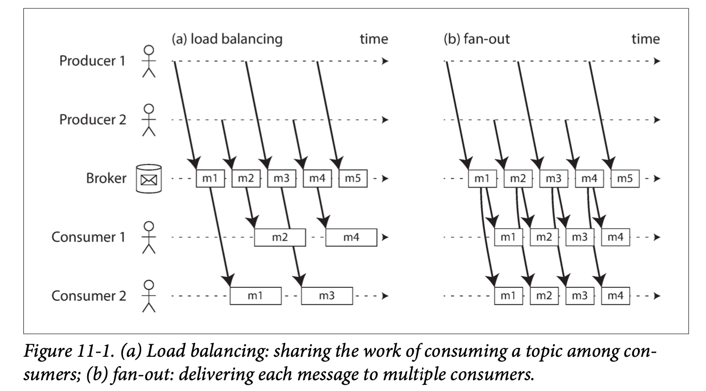
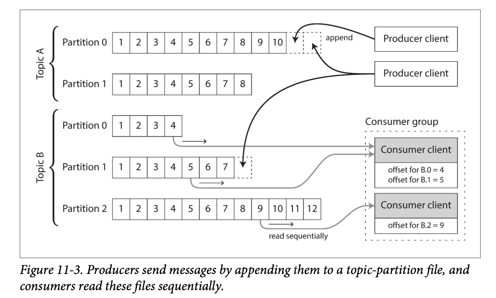

For batch processing, he input is bounded—i.e., of a known and finite size—so the batch process knows when it has finished reading its input.

In general, a stream is a sequence of data elements made available over time.(一般来说，“流”是指随着时间的推移逐渐可用的数据。)
## Messaging Systems
Within this publish/subscribe model, different systems take a wide range of approaches, and there is no one right answer for all purposes. To differentiate the systems, it is particularly helpful to ask the following two questions:
1. 如果生产者发送消息的速度比消费者能够处理的速度快会发生什么？一般来说，有三种选择：系统可以丢掉消息，将消息放入缓冲队列，或使用背压（backpressure）（也称为**流量控制（flow control）；**即阻塞生产者，以免其发送更多的消息）。例如Unix管道和TCP使用背压：它们有一个固定大小的小缓冲区，如果填满，发送者会被阻塞，直到接收者从缓冲区中取出数据（参见“网络拥塞和排队”）。

如果消息被缓存在队列中，那么理解队列增长会发生什么是很重要的。当队列装不进内存时系统会崩溃吗？还是将消息写入磁盘？如果是这样，磁盘访问又会如何影响消息传递系统的性能
2. 如果节点崩溃或暂时脱机，会发生什么情况？ —— 是否会有消息丢失？与数据库一样，持久性可能需要写入磁盘和/或复制的某种组合（参阅“复制和持久性”），这是有代价的。如果你能接受有时消息会丢失，则可能在同一硬件上获得更高的吞吐量和更低的延迟。

### Direct messaging from producers to consumers
* UDP组播广泛应用于金融行业，例如股票市场，其中低时延非常重要。虽然UDP本身是不可靠的，但应用层的协议可以恢复丢失的数据包（生产者必须记住它发送的数据包，以便能按需重新发送数据包）。
* 无代理的消息库，如ZeroMQ和nanomsg采取类似的方法，通过TCP或IP多播实现发布/订阅消息传递。
* StatsD 和Brubeck使用不可靠的UDP消息传递来收集网络中所有机器的指标并对其进行监控。 （在StatsD协议中，只有接收到所有消息，才认为计数器指标是正确的；使用UDP将使得指标处在一种最佳近似状态。另请参阅“TCP与UDP”
* 如果消费者在网络上公开了服务，生产者可以直接发送HTTP或RPC请求（参阅“通过服务进行数据流：REST和RPC”）将消息推送给使用者。这就是webhooks背后的想法，一种服务的回调URL被注册到另一个服务中，并且每当事件发生时都会向该URL发出请求。

尽管这些直接消息传递系统在设计它们的环境中运行良好，但是它们通常要求应用代码意识到消息丢失的可能性。它们的容错程度极为有限：即使协议检测到并重传在网络中丢失的数据包，它们通常也只是假设生产者和消费者始终在线。

​如果消费者处于脱机状态，则可能会丢失其不可达时发送的消息。一些协议允许生产者重试失败的消息传递，但当生产者崩溃时，它可能会丢失消息缓冲区及其本应发送的消息，这种方法可能就没用了。
### Message brokers
A widely used alternative is to send messages via a message broker (also known as a message queue), which is essentially a kind of `database` that is optimized for handling message streams

It runs as a server, with producers and consumers connecting to it as clients. Producers write messages to the broker, and consumers receive them by reading them from the broker.

A consequence of queueing is also that consumers are generally asynchronous: when a producer sends a message, it normally only waits for the broker to confirm that it has buffered the message and does not wait for the message to be processed by con‐ sumers. The delivery to consumers will happen at some undetermined future point in time—often within a fraction of a second, but sometimes significantly later if there is a queue backlog(积压).

### Message brokers compared to databases
* Databases usually keep data until it is explicitly deleted, whereas most message brokers automatically delete a message when it has been successfully delivered to its consumers.
* Since they quickly delete messages, most message brokers assume that their working set is fairly small—i.e., the queues are short. If the broker needs to buffer a lot of messages because the consumers are slow (perhaps spilling messages to disk if they no longer fit in memory), each individual message takes longer to process, and the overall throughput may degrade 
* Databases often support secondary indexes and various ways of searching for data, while message brokers often support some way of subscribing to a subset of topics matching some pattern. The mechanisms are different, but both are essen‐ tially ways for a client to select the portion of the data that it wants to know about.
* When querying a database, the result is typically based on a point-in-time snap‐ shot of the data; if another client subsequently writes something to the database that changes the query result, the first client does not find out that its prior result is now outdated (unless it repeats the query, or polls for changes). By contrast, message brokers do not support arbitrary queries, but they do notify clients when data changes (i.e., when new messages become available).

This is the traditional view of message brokers, which is encapsulated in standards like JMS/AMQP and implemented in software like RabbitMQ(AMQP), ActiveMQ(JMS), HornetQ(JMS), Qpid, TIBCO Enterprise Message Service, IBM MQ, Azure Ser‐ vice Bus, and Google Cloud Pub/Sub

### Multiple consumers

Load balancing: 一堆 consumer share 一个 topic 一起处理 topic 下的消息 
Fan-out: 每条消息都被传递给所有消费者 
​两种模式可以组合使用：例如，两个独立的消费者组可以每组各订阅一个主题，每一组都共同收到所有消息，但在每一组内部，每条消息仅由单个节点处理。

### Acknowledgments and redelivery
Consumers may crash at any time, message brokers use acknowledgments: a client must explicitly tell the broker when it has finished processing a message so that the broker can remove it from the queue otherwise broker will deliver the message again to another consumer.

当与负载均衡相结合时，这种重传行为对消息的顺序产生影响.

消费者通常按照生产者发送的顺序处理消息。然而消费者2在处理消息m3时崩溃，与此同时消费者1正在处理消息m4。未确认的消息m3随后被重新发送给消费者1，结果消费者1按照m4，m3，m5的顺序处理消息。因此m3和m4的交付顺序与以生产者1的发送顺序不同。即使消息代理试图保留消息的顺序（如JMS和AMQP标准所要求的），负载均衡与重传的组合也不可避免地导致消息被重新排序。为避免此问题，你可以让每个消费者使用单独的队列（即不使用负载均衡功能）

### Using logs for message storage
A producer sends a message by appending it to the end of the log, and a consumer receives messages by reading the log sequentially. If a consumer reaches the end of the log, it waits for a notification that a new message has been appended. The Unix tool tail -f, which watches a file for data being appended, essentially works like this.

In order to scale to higher throughput than a single disk can offer, the log can be partitioned. Different partitions can then be hosted on dif‐ ferent machines, making each partition a separate log that can be read and written independently from other partitions.

Within each partition, the broker assigns a monotonically increasing sequence num‐ ber, or offset, to every message. Such a sequence number makes sense because a partition is append-only, so the messages within a partition are totally ordered. There is no ordering guarantee across different partitions.

Apache Kafka, Amazon Kinesis Streams, and Twitter’s DistributedLog are log-based message brokers that work like this. Even though these message brokers write all messages to disk, they are able to achieve throughput of millions of messages per second by partitioning across multiple machines, and fault tolerance by replicating messages.

### Logs compared to traditional messaging
Load balancing in logs based messaging:
* The number of nodes sharing the work of consuming a topic can be at most the number of log partitions in that topic, because messages within the same parti‐ tion are delivered to the same node
* If a single message is slow to process, it holds up the processing of subsequent messages in that partition 

Thus, in situations where messages may be expensive to process and you want to par‐ allelize processing on a message-by-message basis, and where message ordering is not so important, the JMS/AMQP style of message broker is preferable. `Traditional messaging`

On the other hand, in situations with high message throughput, where each message is fast to pro‐ cess and where message ordering is important, the log-based approach works very well. `Log based messaging`

### Disk space usage
If you only ever append to the log, you will eventually run out of disk space. To reclaim disk space, the log is actually divided into segments, and from time to time old segments are deleted or moved to archive storage. (We’ll discuss a more sophisti‐ cated way of freeing disk space later.)

This means that if a slow consumer cannot keep up with the rate of messages, and it falls so far behind that its consumer offset points to a deleted segment, it will miss some of the messages. Effectively, the log implements a bounded-size buffer that dis‐ cards old messages when it gets full, also known as a circular buffer or ring buffer. However, since that buffer is on disk, it can be quite large.

At the time of writing, a typical large hard drive has a capacity of 6 TB and a sequential write throughput of 150 MB/s. If you are writing messages at the fastest possible rate, it takes about 11 hours to fill the drive. 

### When consumers cannot keep up with producers
Three choices of what to do if a consumer cannot keep up with the rate at which producers are send‐ ing messages: `dropping messages`, `buffering`, or `applying backpressure`. The log-based approach is a form of buffering with a large but fixed-size buffer (limited by the available disk space)

即使消费者真的落后太多开始丢失消息，也只有那个消费者受到影响；它不会中断其他消费者的服务。这是一个巨大的运维优势：你可以实验性地消费生产日志，以进行开发，测试或调试，而不必担心会中断生产服务。当消费者关闭或崩溃时，会停止消耗资源，唯一剩下的只有消费者偏移量。

​这种行为也与传统的信息代理形成了鲜明对比，在那种情况下，你需要小心地删除那些消费者已经关闭的队列—— 否则那些队列就会累积不必要的消息，从其他仍活跃的消费者那里占走内存。

### Keep System in Sync
正如我们在本书中所看到的，没有一个系统能够满足所有的数据存储，查询和处理需求。在实践中，大多数重要应用都需要组合使用几种不同的技术来满足所有的需求. 
If periodic full database dumps are too slow, an alternative that is sometimes used is dual writes, in which the application code explicitly writes to each of the systems when data changes: for example, first writing to the database, then updating the search index, then invalidating the cache entries (or even performing those writes concurrently)

However, dual writes have some serious problems, one of which is a race condition illustrated. 
两个客户端同时想要更新一个项目X：客户端1想要将值设置为A，客户端2想要将其设置为B。两个客户端首先将新值写入数据库，然后将其写入到搜索索引。因为运气不好，这些请求的时序是交错的：数据库首先看到来自客户端1的写入将值设置为A，然后来自客户端2的写入将值设置为B，因此数据库中的最终值为B。搜索索引首先看到来自客户端2的写入，然后是客户端1的写入，所以搜索索引中的最终值是A。即使没发生错误，这两个系统现在也永久地不一致了。

## Change Data Capture

It is the process of observing all data changes written to a database and extracting them in a form in which they can be replicated to other systems. 
For example, you can capture the changes in a database and continually apply the same changes to a search index. If the log of changes is applied in the same order, you can expect the data in the search index to match the data in the database. The search index and any other derived data systems are just consumers of the change stream, as illustrated in Figure 11-5.

## State, Streams, and Immutability
Transaction logs record all the changes made to the database. High-speed appends are the only way to change the log. From this perspective, the contents of the database hold a caching of the latest record values in the logs. The truth is the log. The database is a cache of a subset of the log. That cached subset happens to be the latest value of each record and index value from the log. 
Log compaction is one way of bridg‐ ing the distinction between log and database state: it retains only the latest version of each record, and discards overwritten versions.

变指的是数据库状态的变化 
不变指的是log不可改变 只可追加-append-only log of immutable events

### Deriving several views from the same event log
此外，通过从不变的事件日志中分离出可变的状态，你可以针对不同的读取方式，从相同的事件日志中衍生出几种不同的表现形式。效果就像一个流的多个消费者一样（图11-5）：例如，分析型数据库Druid使用这种方式直接从Kafka摄取数据，Pistachio是一个分布式的键值存储，使用Kafka作为提交日志，Kafka Connect能将来自Kafka的数据导出到各种不同的数据库与索引。这对于许多其他存储和索引系统（如搜索服务器）来说是很有意义的，当系统要从分布式日志中获取输入时亦然（参阅“保持系统同步”）。

### Limitations of immutability
永远保持所有变更的不变历史，在多大程度上是可行的？答案取决于数据集的流失率。一些工作负载主要是添加数据，很少更新或删除；它们很容易保持不变。其他工作负载在相对较小的数据集上有较高的更新/删除率；在这些情况下，不可变的历史可能增至难以接受的巨大，碎片化可能成为一个问题，压缩与垃圾收集的表现对于运维的稳健性变得至关重要。

除了性能方面的原因外，也可能有出于管理方面的原因需要删除数据的情况，尽管这些数据都是不可变的。例如，隐私条例可能要求在用户关闭帐户后删除他们的个人信息，数据保护立法可能要求删除错误的信息，或者可能需要阻止敏感信息的意外泄露。

​在这种情况下，仅仅在日志中添加另一个事件来指明先前的数据应该被视为删除是不够的 —— 你实际上是想改写历史，并假装数据从一开始就没有写入。例如，Datomic管这个特性叫切除（excision），而Fossil版本控制系统有一个类似的概念叫避免（shunning）。
删除更多的是“使取回数据更困难”，而不是“使取回数据不可能”。无论如何，有时你必须得尝试。

## Processing Streaming 
到目前为止，本章中我们已经讨论了流的来源（用户活动事件，温度传感器etc和写入数据库），我们讨论了流如何传输（直接通过消息传送{直接通过TCP或者其他协议直接从生产者发到消费者}，通过消息代理{RabbitMQ}，通过事件日志{Kafka}）。

剩下的就是讨论一下你可以用流做什么 —— 也就是说，你可以处理它。一般来说，有三种选项：
1. 你可以将事件中的数据写入数据库，缓存，搜索索引或类似的存储系统，然后能被其他客户端查询
2. 你能以某种方式将事件推送给用户，例如发送报警邮件或推送通知，或将事件流式传输到可实时显示的仪表板上。在这种情况下，人是流的最终消费者
3. 你可以处理一个或多个输入流，并产生一个或多个输出流。流可能会经过由几个这样的处理阶段组成的流水线，最后再输出（选项1或2）

Processing streams to produce other, derived streams. A piece of code that processes streams like this is known as an operator or a job. It is closely related to the Unix processes and MapReduce jobs we discussed in Chapter 10, and the pattern of dataflow is similar: a stream processor consumes input streams in a read-only fashion and writes its output to a different location in an append-only fashion.

The one crucial difference to batch jobs is that a stream never ends. This difference has many implications: sorting does not make sense with an unbounded dataset, and so sort-merge joins cannot be used. 容错机制也必须改变：因为对于已经运行数年的流作业，重启后从头开始跑可能并不是一个可行的选项。

## Uses of Stream Processing
* Complex event processing  
 CEP系统通常使用高层次的声明式查询语言，比如SQL，或者图形用户界面，来描述应该检测到的事件模式。这些查询被提交给处理引擎，该引擎消费输入流，并在内部维护一个执行所需匹配的状态机。当发现匹配时，引擎发出一个复合事件（complex event）（因此得名），并附有检测到的事件模式详情
* Stream analytics 
The boundary between CEP and stream analytics is blurry, but as a general rule, analytics tends to be less interested in finding specific event sequences and is more oriented toward aggregations and statistical metrics over a large number of events: for example Measuring the rate of some type of event (how often it occurs per time interval)
* Maintaining materialized views (一个觉得不算是应用的应用) 
A stream of changes to a data‐ base can be used to keep derived data systems, such as caches, search indexes, and data warehouses, up to date with a source database
* Search on streams 
与CEP相似 搜索单个事件
* Message passing and RPC 
There is some crossover area between RPC-like systems and stream pro‐ cessing

## Reasoning About Time(时间推理)
To adjust for incorrect device clocks, one approach is to log three timestamps:
1. The time at which the event occurred, according to the device clock
2. The time at which the event was sent to the server, according to the device clock
3. The time at which the event was received by the server, according to the server clock
3-2得到 设备时间和服务器时间的 偏移(assuming the network delay is negligible compared to the required timestamp accuracy) 把偏移加在1上面就可估算真正的事件发生时间

## Types of windows
Once you know how the timestamp of an event should be determined, the next step is to decide how windows over time periods should be defined.

滚动窗口（Tumbling Window） 
A tumbling window has a fixed length, and every event belongs to exactly one window. For example, if you have a 1-minute tumbling window, all the events with timestamps between 10:03:00 and 10:03:59 are grouped into one window, events between 10:04:00 and 10:04:59 into the next window, and so on. 

跳动窗口（Hopping Window） 
A hopping window also has a fixed length, but allows windows to overlap in order to provide some smoothing. For example, a 5-minute window with a hop size of 1 minute would contain the events between 10:03:00 and 10:07:59, then the next window would cover events between 10:04:00 and 10:08:59, and so on.该窗口常用于计算一段时间消息的聚合值。You can implement this hopping window by first calculating 1-minute tumbling windows, and then aggregating over several adjacent windows.

滑动窗口（Sliding Window） 
A sliding window contains all the events that occur within some interval of each other. For example, a 5-minute sliding window would cover events at 10:03:39 and 10:08:12, because they are less than 5 minutes apart (note that tumbling and hopping 5-minute windows would not have put these two events in the same window, as they use fixed boundaries).

会话窗口（Session window） 
Unlike the other window types, a session window has no fixed duration. Instead, it is defined by grouping together all events for the same user that occur closely together in time, and the window ends when the user has been inactive for some time (for example, if there have been no events for 30 minutes)

## Joins in Stream
### Stream-stream join (window join)
一个时间段内 发生的事件 (比如 query和click search result 事件)`(广告系统中需要类似的分析)`赋予相同的id(Due to variable network delays, the click event may even arrive before the search event. You can choose a suitable window for the join—for example) 如果点击与搜索之间的时间间隔在一小时内，你可能会选择连接两者.

### Stream-table join (stream enrichment)
一个stream输入 一个数据库输入 (比如 Figure10-2, a set of user activity events and a data‐ base of user profiles)输入是包含用户ID的活动事件流，而输出是用户ID已经被扩展为用户档案信息的活动事件流。This process is sometimes known as enriching the activity events with informa‐ tion from the database. 
The local copy of the database might be an in-memory hash table if it is small enough, or an index on the local disk.

流扩展和批处理的不同在于 批处理是某个时间点的数据状态(可以理解为静态的) 流处理器是长时间运行的，且数据库的内容可能随时间而改变，所以流处理器数据库的本地副本需要保持更新 
This issue can be solved by change data capture: the stream processor can subscribe to a changelog of the user profile database as well as the stream of activity events. When a profile is created or modified, the stream processor updates its local copy. Thus, we obtain a join between two streams: the activity events and the profile updates.

### Table-table join (materialized view maintenance)
Consider the Twitter timeline example, when a user wants to view their home timeline, it is too expen‐ sive to iterate over all the people the user is following, find their recent tweets, and merge them. 
We can have a timeline cache: 一种每个用户的“收件箱”，在发送推文的时候写入这些信息，因而读取时间线时只需要简单地查询即可. Materializing and maintaining this cache requires the following event processing:
* When user u sends a new tweet, it is added to the timeline of every user who is following u.
* When a user deletes a tweet, it is removed from all users’ timelines.
* When user u1 starts following user u2 , recent tweets by u2 are added to u1’s timeline.
* When user u1 unfollows user u2 , tweets by u2 are removed from u1’s timeline.

Now we need a stream for tweets(sending and deleting) and a stream for follow(following and unfollowing) relationship. The stream process needs to maintain a database containing the set of followers for each user so that it knows which timelines need to be updated when a new tweet arrives.

### Time-dependence of joins
如果不同流中的事件发生在近似的时间范围内，则应该按照什么样的顺序进行处理？在流表连接的例子中，如果用户更新了它们的档案，哪些活动事件与旧档案连接（在档案更新前处理），哪些又与新档案连接（在档案更新之后处理）？换句话说：你需要对一些状态做连接，如果状态会随着时间推移而变化，那应当使用什么时间点来连接呢?

这种时序依赖可能出现在很多地方。例如销售东西需要对发票应用适当的税率，这取决于所处的国家/州，产品类型，销售日期（因为税率会随时变化）。当连接销售额与税率表时，你可能期望的是使用销售时的税率参与连接。如果你正在重新处理历史数据，销售时的税率可能和现在的税率有所不同。

在数据仓库中，这个问题被称为缓慢变化的维度（slowly changing dimension, SCD），通常通过对特定版本的记录使用唯一的标识符来解决：例如，每当税率改变时都会获得一个新的标识符，而发票在销售时会带有税率的标识符。这种变化使连接变为确定性的，但也会导致日志压缩无法进行：表中所有的记录版本都需要保留。

## Fault Tolerance
Although restarting tasks means that records may in fact be processed multiple times, the visible effect in the output is as if they had only been processed once. This principle is known as exactly-once semantics, although effectively-once would be a more descriptive term.
### Microbatching and checkpointing
One solution is to break the stream into small blocks, and treat each block like a min‐ iature batch process. This approach is called microbatching, and it is used in Spark Streaming. The batch size is typically around one second, which is the result of a performance compromise: smaller batches incur greater scheduling and coordination overhead, while larger batches mean a longer delay before results of the stream pro‐ cessor become visible.

A variant approach, used in Apache Flink, is to periodically generate rolling check‐ points of state and write them to durable storage. If a stream operator crashes, it can restart from its most recent checkpoint and discard any output gener‐ ated between the last checkpoint and the crash. The checkpoints are triggered by bar‐ riers in the message stream, similar to the boundaries between microbatches, but without forcing a particular window size.

在流处理框架的范围内，微批次与存档点方法提供了与批处理一样的恰好一次语义。但是，只要输出离开流处理器（例如，写入数据库，向外部消息代理发送消息，或发送电子邮件），框架就无法抛弃失败批次的输出了。在这种情况下，重启失败任务会导致外部副作用发生两次，只有微批次或存档点不足以阻止这一问题。

### Atomic commit revisited
In order to give the appearance of exactly-once processing in the presence of faults, we need to ensure that all outputs and side effects of processing an event take effect if and only if the processing is successful. Those effects include any messages sent to downstream operators or external messaging systems (including email or push notifi‐ cations), any database writes, any changes to operator state, and any acknowledg‐ ment of input messages (including moving the consumer offset forward in a log- based message broker).

### Idempotence
Our goal is to discard the partial output of any failed tasks so that they can be safely retried without taking effect twice. We can rely on idempotence. An idempotent operation is one that you can perform multiple times, and it has the same effect as if you performed it only once. 例如，将键值存储中的某个键设置为某个特定值是幂等的（再次写入该值，只是用同样的值替代），而递增一个计数器不是幂等的（再次执行递增意味着该值递增两次）。

Even if an operation is not naturally idempotent, it can often be made idempotent with a bit of extra metadata. For example, when consuming messages from Kafka, every message has a persistent, monotonically increasing offset. When writing a value to an external database, you can include the offset of the message that triggered the last write with the value. Thus, you can tell whether an update has already been applied, and avoid performing the same update again.

The state handling in Storm’s Trident is based on a similar idea. Relying on idempotence implies several assumptions: restarting a failed task must replay the same messages in the same order (a log-based message broker does this), the process‐ ing must be deterministic, and no other node may concurrently update the same value.

When failing over from one processing node to another, fencing may be required to prevent interference from a node that is thought to be dead but is actually alive. Despite all those caveats, idempotent opera‐ tions can be an effective way of achieving exactly-once semantics with only a small overhead.

## Summary

### AMQP/JMS-style message broker
代理将单条消息分配给消费者，消费者在成功处理单条消息后确认消息。消息被确认后从代理中删除。这种方法适合作为一种异步形式的RPC（另请参阅“消息传递数据流”），例如在任务队列中，消息处理的确切顺序并不重要，而且消息在处理完之后，不需要回头重新读取旧消息

### Log-based message broker
The broker assigns all messages in a partition to the same consumer node, and always delivers messages in the same order. Parallelism is achieved through par‐ titioning, and consumers track their progress by checkpointing the offset of the last message they have processed. The broker retains messages on disk, so it is possible to jump back and reread old messages if necessary.

### Stream-stream joins & Stream-table joins & Table-table joins