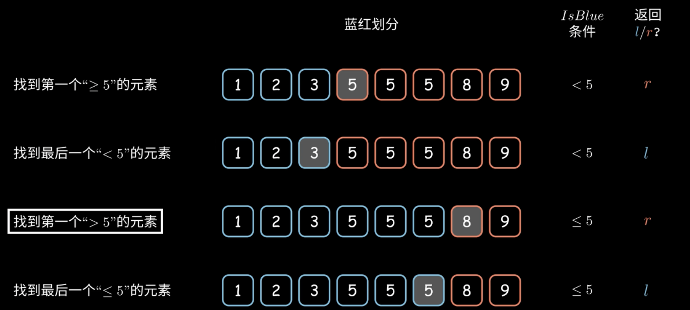

快慢指针 
1. 删除有序数组重复项
```python
def removeDuplicates(nums: List[int]) -> int:
    if len(nums) == 0:
        return 0
    slow = 0 
    fast = 1
    while fast < len(nums):
        if nums[fast] != nums[slow]:
            slow += 1
            nums[slow] = nums[fast]
        fast += 1
    return slow + 1
```
2. 删除有序链表中的重复元素
```python
def deleteDuplicates(head: ListNode) -> ListNode:
    if not head:
        return None
    slow, fast = head, head 
    while fast:
        if fast.val != slow.val: 
            slow.next = fast
            slow = slow.next 
        fast = fast.next
    slow.next = None 
    return head 
```
3. 移除元素
```python
# 给一个nums数组 和 一个val 原地移除 等于 val 的元素 并返回移除后数组的新长度
def remove_element(nums: List[int], val: int) -> int:
    fast, slow = 0, 0
    while fast < len(nums):
        if nums[fast] != val:
            nums[slow] = nums[fast]
            slow += 1
        fast += 1
    return slow
```

左右指针
4. 二分查找
```python
l,r=-1,n
while l+1!=r:
    m=(l+r)/2
    if condition:
        l=m
    else:
        r=m
return 
```


5. 有序数组两数之和
```python
def twoSum(nums: List[int], target: int) -> List[int]:

    left, right = 0, len(nums) - 1
    while left < right:
        sum = nums[left] + nums[right]
        if sum == target:
            return [left + 1, right + 1]
        elif sum < target:
            left += 1 
        else:
            right -= 1 
    return [-1, -1]
```

6. 反转数组
```python
def reverseString(s: List[str]) -> None:
    left = 0
    right = len(s) - 1
    while left < right:
        # 交换 s[left] 和 s[right]
        temp = s[left]
        s[left] = s[right]
        s[right] = temp
        left += 1
        right -= 1
```

7. 回文串
```python
def isPalindrome(s: str) -> bool:
    left, right = 0, len(s) - 1
    while left < right:
        if s[left] != s[right]:
            return False
        left += 1
        right -= 1
    return True
```

最长回文串
```python
def longestPalindrome(s: str) -> str:
    res = ""
    for i in range(len(s)):
        s1 = palindrome(s, i, i)
        s2 = palindrome(s, i, i + 1)
        res = res if len(res) > len(s1) else s1
        res = res if len(res) > len(s2) else s2
    return res

def palindrome(s, l, r):
    while (l >= 0 and r < len(s) and s[l] == s[r]):
        l -= 1
        r += 1
    return s[l+1:r]
```