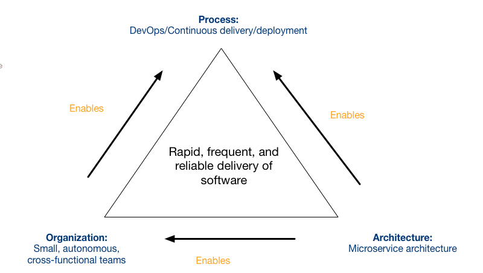

### 微服务anti-pattern
并不是用了微服务就能解决所有development problems

The microservice architecture is simply an architectural style that has good deployability and testability. It’s a loosely coupled architecture that enables high velocity, autonomous teams and DevOps style development.

First, you need understand the underlying root causes for your software delivery issues. Is it your development and deployment process? Your organization? Or perhaps your monolith has outgrown its architecture. Second, you need to understand the problems that the microservice architecture addresses. Hopefully, the two sets of problems intersect. Finally, you need to understand the prerequisites, such as automated testing, that you need to have in place in order to be successful with microservices.

其各文章主旨在强调微服务可以解决什么问题 而诸如以下问题和微服务无关 要自己解决 
Inefficient processes and practices - waterfall process, manual testing, manual deployment
Silo’d organization - e.g. development hands off code to QA for testing.
Poor software quality - the application is a big ball of mud, the code is anything but clean, etc.

另一个问题就是要注意组织结构 
Despite intending to use microservices to accelerate development, the organization retains the same process and structure that were used when developing monolithic applications. 
In order to fully benefit from the microservice architecture, you must, as described by the success triangle, change your organization’s process and structure.

