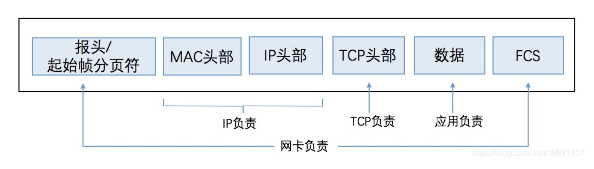
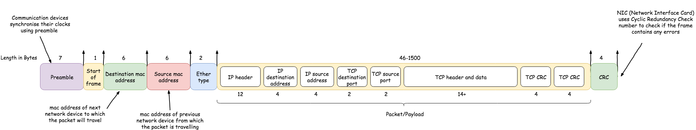
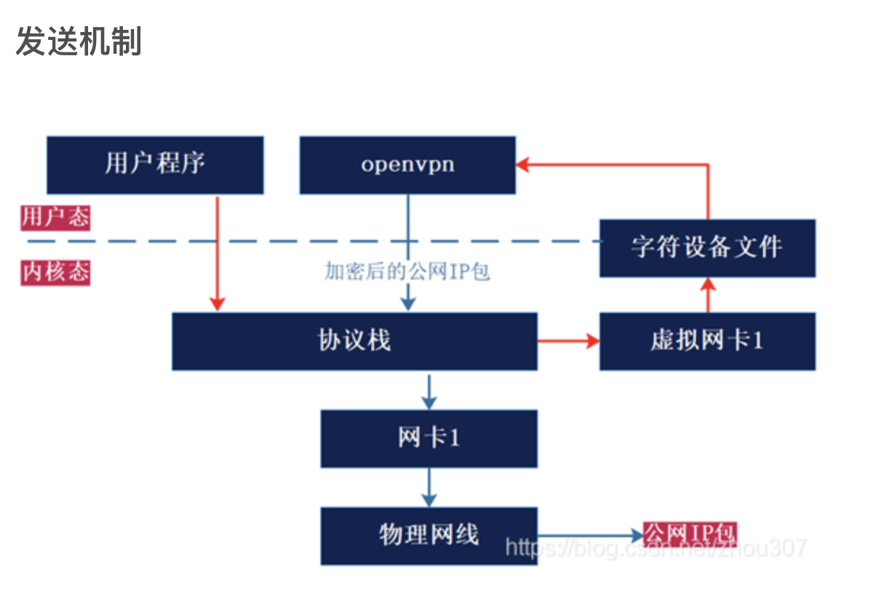
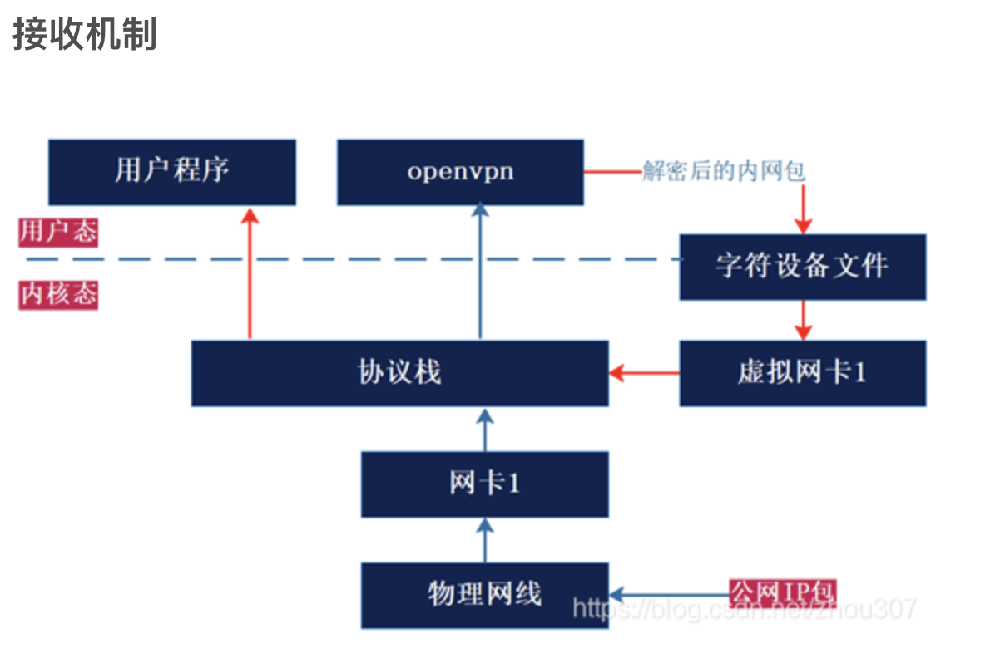

https://blog.csdn.net/JMW1407/article/details/108636657
```
User                ----------------------------------------------
        Apllication |        Application(Socket library)         |    
                    ----------------------------------------------
Space
--------------------------------------------------------------------------
                ----------------------------------------------
                |    ---------               ------------    |
                |    |  TCP  |               |    UDP   |    |
Kernel      OS  |    ---------               ------------    |
                |    ------------------------------------    |
                |    |               IP                 |    |
                |    ------------------------------------    |
                ----------------------------------------------
        ------------------------------------------------------------------
                    ----------------------------
Space     Driver    |   Network Adapter Driver |
                    ----------------------------
---------------------------------------------------------------------------

Hardware
```

## 网卡-Network Adapter NIC(network interface controller)
接收到的数据是 光信号or电信号 然后将其还原成数字信息<br>
数字信息结构:


1. FCS(Frame Check Sequence)  校验数据, 判断是否在传输过程中有信号失真导致数据错误 (CRC)
2. 检查MAC头部中的接收方MAC地址. 若包不是发给自己则丢弃, 若是则将数字信息 保存到网卡内部缓存区
以上操作无须 CPU 参与, CPU也不知道数据包到达

## Network Adapter Driver
CPU控制和使用网卡的程序<br>
A driver provides a software interface to hardware devices, enabling operating systems and other computer programs to access hardware functions without needing to know precise details about the hardware being used.<br>
网卡处理完数字信号后, 需要CPU参与接收结下的数据. 此时 网卡通过中断(interrupt)将数据包达到的事件通知到 CPU. CPU 暂停手头工作, 开始用网卡驱动干活
1. 从网卡缓冲区读取接收到的数据
2. 根据 MAC 头的以太类型字段判断协议种类 并调用处理该协议的软件(即协议栈)
   
(A signal is an event that is triggered by the CPU or the software that runs on the CPU. In contrast, an interrupt is an event that is triggered by external components other than the CPU that alerts the CPU to perform a certain action. The main difference between signal and interrupt is explicit from these definitions.)

通常我们接触的 Ether Type 是 IP protocol, 因此回调用 TCP/IP protocol stack 来处理
1. 网卡驱动提取 帧(frame) 的全部内容, 去掉以太网的帧头, 向上传递 IP 层
2. IP 层去掉 IP 头的内容 交给TCP 层
3. 根据 TCP 定义的格式继续解包, read() 从 socket buffer 读取数据然后传递给应用层
   
相比于物理网卡负责内核网络协议栈和外界网络之间的数据传输，虚拟网卡的两端则是内核网络协议栈和用户空间，它负责在内核网络协议栈和用户空间的程序之间传递数据

### vNIC
很多人会误解这样的用户空间程序，认为它们可以对数据进行封装。比如认为OpenVPN可以在数据包的基础上再封装一层隧道IP首部，但这种理解是错的。<br>
User Space的程序是无法对数据包做任何封装和解封操作的。所有的封装和解封都只能由 Kernel Space 的 protocol stack 完成。所有 OpenVPN怎么工作?<br>
http://www.freeoa.net/osuport/netmanage/tun-tap-study-note_3411.html

假设:<br>
`eth0-ip:10.32.0.11 tun0-ip: 192.168.3.11 程序A: 一般程序. 程序B: VPN程序.`<br>
数据包的流程:<br> 发
1. 程序 A 通过 socket A 发送了一个数据包, 假设数据包的目的 IP 是 192.168.3.11
2. 数据包来到 Kernel Sapce protocol stack, 根据IP 地址匹配本地路由规则, 将包发送给 tun0 
3. tun0收到数据包后发现另一端杯进程 B 打开了 于是将数据包 丢给了进程 B
4. 进程 B 收到数据包之后, 做一些相关的处理, 构造一个新的数据包, 将原有的数据包嵌入在新的包中, 然后通过 socket B发送出去. 这时 新数据包的 source address 变成了 eth0 的地址 destination IP 变成了一个其他的地址 比如10.33.0.1
5. socket B 将数据包丢给 protocl stack, 内核根据本地路由 将包交给 eth0
6. eth0 通过物理网络把包发出去
7. 10.33.0.1 收到数据包后, 打开, 读取里面的原始数据, 并转发给本地的192.168.3.1, 然后等收到 192.168.3.1的应答后, 在构造新的应答包, 并将原始应答包 封装在里面, 再由原路径返回给 程序 B. B取出原始应答包返回给程序 A




### 路由表

 OpenVPN服务器一般需要配置一个虚拟IP地址池和一个自用的静态虚拟IP地址（静态地址和地址池必须在同一个子网中），然后为每一个成功建立SSL连接的客户端动态分配一个虚拟IP地址池中未分配的地址。这样，物理网络中的客户端和OpenVPN服务器就连接成一个虚拟网络上的星型结构局域网，OpenVPN服务器成为每个客户端在虚拟网络上的网关。OpenVPN服务器同时提供对客户端虚拟网卡的路由管理。当客户端对OpenVPN服务器后端的应用服务器的任何访问时，数据包都会经过路由流经虚拟网卡，OpenVPN程序在虚拟网卡上截获数据IP报文，然后使用SSL协议将这些IP报文封装起来，再经过物理网卡发送出去。OpenVPN的服务器和客户端在虚拟网卡之上建立起一个虚拟的局域网络，这个虚拟的局域网对系统的用户来说是透明的。<br><br>
netstat -rn
```
Internet:
Destination        Gateway            Flags        Netif Expire
default            192.168.0.1        UGScg          en0       
default            link#16            UCSIg         ppp0       
3.218.111.154      192.168.0.1        UGHS           en0       
10                 ppp0               USc           ppp0       
127                127.0.0.1          UCS            lo0       
127.0.0.1          127.0.0.1          UH             lo0       
169.254            link#6             UCS            en0      !
192.0.2.1          10.200.254.10      UH            ppp0       
192.168.0          link#6             UCS            en0      !
192.168.0.1/32     link#6             UCS            en0      !
192.168.0.1        48:4e:fc:b7:be:8   UHLWIir        en0   1185
192.168.0.130/32   link#6             UCS            en0      !
192.168.0.176      a0:af:bd:b8:64:b0  UHLWI          en0    283
224.0.0/4          link#6             UmCS           en0      !
224.0.0/4          link#16            UmCSI         ppp0       
224.0.0.251        1:0:5e:0:0:fb      UHmLWI         en0       
239.255.255.250    1:0:5e:7f:ff:fa    UHmLWI         en0       
239.255.255.250    link#16            UHmW3I        ppp0     10
255.255.255.255/32 link#6             UCS            en0      !
255.255.255.255/32 link#16            UCSI          ppp0     
```
Gateway: 下一跳服务器. 48:4e:fc:b7:be:8 is MAC address not IPv6<br>
Run `netstat -ni`
```
Name       Mtu   Network       Address            Ipkts Ierrs    Opkts Oerrs  Coll
......
ppp0  1280  <Link#16>                         1379     0     1688     0     0
ppp0  1280  10            10.200.254.10       1379     -     1688     -     -
```
* A MAC address is a 48-bit identifier specific to the hardware written in MM:MM:MM:SS:SS:SS The first three bytes (MM:MM:MM) identifies (assigned to) the hardware manufacturer and the second three bytes (SS:SS:SS) is assigned to the device by the manufacturer.

* An IPV6 address is a 106-bit hexadecimal identifier written as 8 hexidecimal numbers separated by colons: Example: 2001:0000:3238:DFE1:0063:0000:0000:FEFB
Netif(network interface): 1 to 1 map to NIC(网卡)
Flags(man netstat get below table): 
```
ppp0: flags=8051<UP,POINTOPOINT,RUNNING,MULTICAST> mtu 1280 
        inet 10.200.254.10 --> 192.0.2.1 netmask 0xff000000 
```
```
     1       RTF_PROTO1       Protocol specific routing flag #1
     2       RTF_PROTO2       Protocol specific routing flag #2
     3       RTF_PROTO3       Protocol specific routing flag #3
     B       RTF_BLACKHOLE    Just discard packets (during updates)
     b       RTF_BROADCAST    The route represents a broadcast address
     C       RTF_CLONING      Generate new routes on use
     c       RTF_PRCLONING    Protocol-specified generate new routes on use
     D       RTF_DYNAMIC      Created dynamically (by redirect)
     G       RTF_GATEWAY      Destination requires forwarding by intermediary
     H       RTF_HOST         Host entry (net otherwise)
     I       RTF_IFSCOPE      Route is associated with an interface scope
     i       RTF_IFREF        Route is holding a reference to the interface
     L       RTF_LLINFO       Valid protocol to link address translation
     M       RTF_MODIFIED     Modified dynamically (by redirect)
     m       RTF_MULTICAST    The route represents a multicast address
     R       RTF_REJECT       Host or net unreachable
     r       RTF_ROUTER       Host is a default router
     S       RTF_STATIC       Manually added
     U       RTF_UP           Route usable
     W       RTF_WASCLONED    Route was generated as a result of cloning
     X       RTF_XRESOLVE     External daemon translates proto to link address
     Y       RTF_PROXY        Proxying; cloned routes will not be scoped
     g       RTF_GLOBAL       Route to a destination of the global internet (policy hint)
 ```


 request -> DNS -> target IP -> routes -> IP protocol wrap -> vNIC -> OpenVPN operates on request target IP becomes VPN server -> IP protocl wrap -> NIC -> Internet 