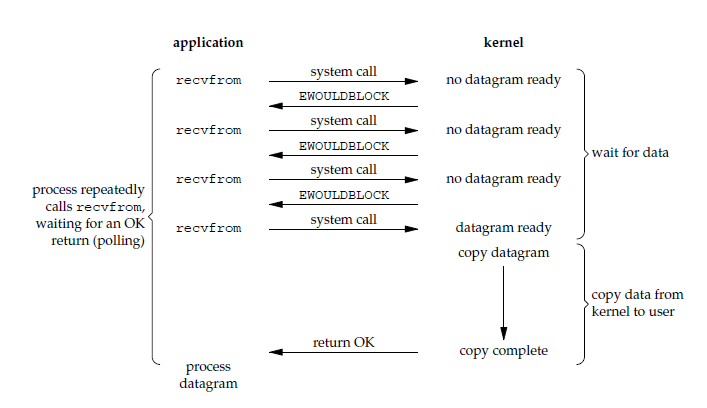

# 进程
在Linux 系统中，计算机显示器通常被称为控制台终端(Console）。它仿真了类型为Linux的一种终端(TERM=Linux），并且有一些设备特殊文件与之相关联：tty0、tty1、tty2 等。当你在控制台上登录时，使用的是tty1。使用Alt+[F1—F6]组合键时，我们就可以切换到tty2、tty3等上面去。tty1–tty6等称为虚拟终端，而tty0则是当前所使用虚拟终端的一个别名，系统所产生的信息会发送到该终端上（这时也叫控制台终端）。因此不管当前正在使用哪个虚拟终端，系统信息都会发送到控制台终端上。/dev/console即控制台，是与操作系统交互的设备，系统将一些信息直接输出到控制台上。只有在单用户模式下，才允许用户登录控制台。
## Process
Linux下有3个特殊的进程，idle进程(PID = 0), init进程(PID = 1)和kthreadd(PID = 2)


1. idle进程由系统自动创建, 运行在内核态
* idle进程其pid=0，其前身是系统创建的第一个进程，也是唯一一个没有通过fork或者kernel_thread产生的进程。完成加载系统后，演变为进程调度、交换


2. init进程由idle通过kernel_thread创建，在内核空间完成初始化后, 加载init程序, 并最终用户空间
* 由0进程创建，完成系统的初始化. 是系统中所有其它用户进程的祖先进程
Linux中的所有进程都是有init进程创建并运行的。首先Linux内核启动，然后在用户空间中启动init进程，再启动其他系统进程。在系统启动完成完成后，init将变为守护进程监视系统其他进程。


3. kthreadd进程由idle通过kernel_thread创建，并始终运行在内核空间, 负责所有内核线程的调度和管理
* 它的任务就是管理和调度其他内核线程kernel_thread, 会循环执行一个kthread的函数，该函数的作用就是运行kthread_create_list全局链表中维护的kthread, 当我们调用kernel_thread创建的内核线程会被加入到此链表中，因此所有的内核线程都是直接或者间接的以kthreadd为父进程
我们下面就详解分析0号进程的前世(init_task)今生(idle)


<br>
<br>
<br>
PCB: a data structure used by computer operating systems to store all the information about a process. It is also known as a process descriptor. When a process is created (initialized or installed), the operating system creates a corresponding process control block.

* Process identification data: is the process ID (which is in the path <span><b>/proc/process-id/...</b></span>), the command line (cmd), and possibly other attributes depending on your definition of 'identification'.

* Process state data: includes scheduling data (sched, stat and schedstat), what the process is currently waiting on (wchan), its environment (environ) etc.

* Process control data: could be said to be its credentials (uid_map) and resource limits (limits).

A process is the instance of a computer program that is being executed by one or many threads(资源分配基本单位)
Thread (独立调度[scheduling]基本单位)

进程通信
1. pipe(父进程创建管道 父子交流或者子子交流)
2. FIFO
3. 消息队列
4. 共享存储
5. socket

# IO
一个IO操作 分为 等待数据 和 从内核像进程复制
5 IO models
1. Blocking I/O
    * 只有当前应用进程被阻塞，直到数据从内核缓冲区复制到应用进程缓冲区中才返回。其它应用进程还可以执行，所以不消耗 CPU 时间，这种模型的 CPU 利用率会比较高
    
2. Non-blocking I/O 
    * 应用进程执行系统调用之后，内核返回一个错误码。应用进程可以继续执行，但是需要不断的执行系统调用来获知 I/O 是否完成，这种方式称为轮询（polling，由于 CPU 要处理更多的系统调用，因此这种模型的 CPU 利用率比较低）
    
3. I/O multiplexing (select and poll)
    * 使用 select 或者 poll 等待数据，并且可以等待多个套接字中的任何一个变为可读。这一过程会被阻塞，当某一个套接字可读时返回，之后再使用 recvfrom 把数据从内核复制到进程中。它可以让单个进程具有处理多个 I/O 事件的能力。又被称为 Event Driven I/O，即事件驱动 I/O。
    
4. Signal Driven I/O(SIGIO)
    * 应用进程使用 sigaction 系统调用，内核立即返回，应用进程可以继续执行，也就是说等待数据阶段应用进程是非阻塞的。内核在数据到达时向应用进程发送 SIGIO 信号，应用进程收到之后在信号处理程序中调用 recvfrom 将数据从内核复制到应用进程中。相比于非阻塞式 I/O 的轮询方式，信号驱动 I/O 的 CPU 利用率更高。
    
5. Asynchronous I/O
    * 应用进程执行 aio_read 系统调用会立即返回，应用进程可以继续执行，不会被阻塞，内核会在所有操作完成之后向应用进程发送信号。异步 I/O 与信号驱动 I/O 的区别在于，异步 I/O 的信号是通知应用进程 I/O 完成，而信号驱动 I/O 的信号是通知应用进程可以开始 I/O。
    

## Select, Poll & Epoll
```C
int select(int n, fd_set *readfds, fd_set *writefds, fd_set *exceptfds, struct timeval *timeout);

int poll(struct pollfd *fds, unsigned int nfds, int timeout);
struct pollfd {
               int   fd;         /* file descriptor */
               short events;     /* requested events */
               short revents;    /* returned events */
           };
```
1. select
select 的 timeout 参数精度为微秒，而 poll 和 epoll 为毫秒，因此 select 更加适用于实时性要求比较高的场景，比如核反应堆的控制。
select 可移植性更好，几乎被所有主流平台所支持。
2. poll 
没有最大描述符数量的限制，如果平台支持并且对实时性要求不高，应该使用 poll 而不是 select。
3. epoll
只需要运行在 Linux 平台上，有大量的描述符需要同时轮询，并且这些连接最好是长连接。

https://github.com/CyC2018/CS-Notes/blob/master/notes/Socket.md